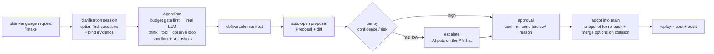

# WorkHub

> **A business-version GitHub, AI-native. AI is the default labor force; humans just approve and catch the exceptions.**

[简体中文](./README.md) ｜ English

[](LICENSE) · Status: code-complete, CI green, pilot-ready (the only thing left is a real team running it for a week)

---

## What it is

Every collaboration tool today — Feishu, Notion, Jira, and even this project's predecessor "Requirement Master" — assumes the same thing: humans do the work, and AI is at most a drafting-and-Q&A assistant.

**WorkHub flips that assumption: in a team's daily work, the vast majority of things are done by AI by default.** AI is no longer a suggester — it's the first executor, producing documents, analyses, plans, and code directly. Humans step back into two higher-value roles:

- **Approver** — look at what AI proposes, and nod or send it back;
- **Exception handler** — take over the work AI escalates because it can't, shouldn't, or got it wrong.

This reversal is bounded by one hard safety line: **no AI change ever silently touches production data.** Every change must be explainable, rollback-able (it keeps a snapshot), and can only reach the single source of truth (`main`) through one path: **propose → approve → merge**. We measure how well it does this with one north-star metric — Autonomy Rate, the share of work items AI completes and merges end-to-end without anyone stepping in — while watching guardrails like rollback rate, reject rate, and escalation precision. **A higher autonomy rate is never worth trading away trust.**

> **Origin.** The predecessor product already had a "deliver → owner approves/rejects" flow — which is, in essence, a GitHub-style review. The team had already built the spine of a "business-version GitHub" without naming it, and without putting AI in the driver's seat. What WorkHub does is name that spine, let AI drive by default, and add the three moats that were missing: how multi-person approvals get routed, how business objects get merged, and how org-level permissions and cost get governed.

## Why it's different

**vs GitHub.** WorkHub borrows GitHub's collaboration kernel — everyone edits on their own copy, submits changes as proposals, and merges into a single source of truth after review — but moves it off source code and onto business objects: requirements, documents, plans, structured records. More importantly, here AI is the default "committer," and git jargon is **completely hidden** from users: the branch / commit / merge / conflict that GitHub puts everywhere, WorkHub never shows.

**vs generic AI agents.** WorkHub isn't a chat assistant, nor a lone autonomous agent. It puts "AI as the default labor force" inside a multi-person team and constrains it with one constitution: never silently change production. The same agent wears two hats — a worker most of the time, a project manager when blocked — with explicit escalation triggers, plus doom-loop detection and budget guardrails. When it can't continue, it hands off a structured "what I did, what I didn't, what I'd do next" rather than silently stopping mid-way.

**vs SaaS.** A few things WorkHub deliberately does not do: no generic IM, no real-time collaborative editing (no character-level OT/CRDT — it isn't competing with Feishu or Notion on editing), and no vector retrieval (it sticks with the traceable old way: grep + forced citation). v1 is LAN-first with the hooks for cloud already in place, and it ships under a noncommercial license.

## Five core principles

**1. One agent, two hats.** By default it wears the "worker hat" and gets the work done directly. The moment it's blocked, it switches to the "project-manager hat" and organizes people instead — staffing, decomposing, scheduling, chasing progress, then re-reviewing. When it switches hats is decided by confidence and risk; and the moment it switches hats is exactly the moment of escalation. Three things trigger escalation: the work fails review, the user rejects it (a rejection must carry a reason, which is fed back so the AI fixes it on the same copy instead of stalling), or the user has explicitly said AI may not touch this (a switch you can set per task, per project, or per person). In WorkHub, escalation is a designed, normal state transition — not a failure.

**2. No git jargon, ever.** Internally it really is a business-version GitHub, but it runs two strictly separated vocabularies, and users never see the technical one:

| What the user sees | What it actually is |
|---|---|
| working copy | branch |
| proposal | pull request |
| confirm / send back | approve / request changes |
| adopt into the official version | merge to `main` |
| collision | merge conflict |

Everyone — including every AI worker — has their own working copy; changes are submitted as a "proposal," the owner "confirms" or "sends it back," and once approved it's "adopted" into the official version. When two changes collide, the system doesn't throw the word "conflict" at you — it says "your change collided with someone else's; AI drafted a few merge options, pick one." Confidence never shows a number either, only one of three plain phrases: *I'm fairly sure / worth a glance / I'm not sure, you decide.*

**3. Single source of truth, no silent production writes.** Whether the actor is AI or human, every change goes through the same path — propose → approve → merge — into one `main`. Any write to production data must satisfy three conditions: a clear reason, a saved snapshot (rollback-able), and approval. High-confidence, low-risk changes may auto-merge by policy, but they still leave a trace and stay reversible; mid-confidence changes are **forced** to a human for a spot-check.

**4. Staffing on a layered identity.** When something escalates, the AI project manager recommends "one owner + a few collaborators," each with a plain-language "why this person." That draws on each person's skill self-description plus a collaboration graph: who's good at what, who has worked with whom, hit rate, current load. When information is thin, it won't decide for you — it degrades to an "explanatory recommendation": AI lays out the reasoning, the human decides.

**5. Two entry points — desktop pet and Web — over one daemon.** There are two ways in: a conversational, action-capable desktop pet (Cuu), and a Web app. Both are thin clients of the same headless agent daemon. The agent can operate nearly every function through natural language, so even someone who doesn't know the tool can "just say a sentence and have it done."

## The core loop



The real code behind it: [`apps/api/src/workers/agent-runner.ts`](apps/api/src/workers/agent-runner.ts) (claim/lease queue + agent loop), [`packages/agent/src/loop/loop.ts`](packages/agent/src/loop/loop.ts) (think→tool→observe with doom-loop and budget control), [`apps/api/src/services/proposals.ts`](apps/api/src/services/proposals.ts) (propose, review, merge, collision-merge).

## Features

> Legend: ✅ shipped (route + service implemented) · 🟡 partial (the body is built, but one half isn't wired to real data yet, or it's default-off) · 🗺️ planned

**Work intake & the AI core loop**
- ✅ Create a work item from one sentence; clarification sessions (option-first questions + bind project evidence)
- ✅ Start / abort an AgentRun (ownership checked, no cross-tenant runs); a real think→tool→observe agent loop
- ✅ Sandboxed file & skill tools; live execution trace, replay, and a structured handoff when the budget runs out
- ✅ Crash recovery (expired leases auto-requeue); confidence scoring with auto-escalation on low confidence

**Propose / Review / Approve / Merge**
- ✅ Open a proposal from a deliverable manifest (structured diff + checks)
- ✅ Review: approve, or send back (the reason is fed into the next run as correction context)
- ✅ Adopt into the official version with a rollback snapshot
- ✅ **Three-column approval workbench**: list + SLA on the left; before/after diff, compliance checks, AI explanation, and conflicts in the middle; decision, remember-this-rule, the approval timeline, and a comment thread on the right. On a collision you get a three-way view, AI merge options, and overrides at field / item / text-hunk granularity.

**Collaboration & content**
- ✅ Project file drive (upload, versions, soft-delete and restore), comment-to-draft, draft-to-proposal
- ✅ Download / preview / restore accepted deliverables
- ✅ Meeting insight to draft / dismiss / to proposal
- ✅ Knowledge & evidence search (grep + forced citation, rendered as evidence cards); bind evidence to a task
- ✅ Notification inbox (bucketed into needs-decision / FYI / done, with source grounding), calendar view, and **real-time push** (authorization-scoped multiplexed SSE streams)

**AI-native & governance**
- ✅ **AI worklog** — how many items it handled today, the autonomy rate, how many were accepted, estimated hours saved (visible to every logged-in user, no cost detail)
- ✅ Cost governance: budget policies per scope (admin), pre/in-run budget decisions and cutoffs, a cost dashboard (admins see the org ledger, users see only their own)
- ✅ **User memory** — the reason you write when you send something back is captured as a "correction memory" and injected into future AI runs; self-deletable
- ✅ Permission matrix (fail-closed; anything unmatched defaults to "ask"), approval requests, a human-reserved-action guard (hit one and it escalates), per-work-item snapshot + audit trail, file-level revert from a local client, and a project-health dashboard
- ✅ Lightweight nickname identity + local-client device tokens, admin claim, locale preference, one-call project bootstrap with workdir hydration
- 🟡 **Team-level skill self-iteration** — a filesystem ∪ database merged skill view is already injected into runs; but the idle-time distillation worker is default-off and has never actually run in production (and its idle gate isn't wired yet)
- 🟡 **Decision-inbox home** — "your own in-flight AI runs" and "today's AI worklog" are live, real data; the decision-queue cards are scaffolded too, but **production doesn't yet feed approvals and to-dos into that queue's data source**

**Desktop pet (Cuu / Live2D)**
- ✅ Native Tauri desktop app (main window + a transparent always-on-top pet window + tray + `workhub://` deep links); pet controls (mode, scale, opacity, click-through, hide-on-hover, drag)
- ✅ A Live2D cat (black "hijiki" / white "tororo") whose motions track the AI lifecycle state; a Rust SSE worker bridges backend events into pet cards and OS notifications
- 🟡 Visual finishing: the concept art is an orange cat, the current assets are black/white cats (the gap is on record); real-device long-form motion capture is still to come (see #27 below)

## Architecture

A **TS-first monorepo** (pnpm workspaces): a headless agent daemon + OpenAPI/SSE + PostgreSQL + a Tauri desktop client / Web thin client — LAN-first, cloud-ready.

| Layer | Tech | Notes |
|---|---|---|
| Runtime | Node ≥22 · pnpm 11 · TypeScript 5.7 ESM · tsx | Tests run on tsx, so the real type gate is `pnpm -r typecheck` (tsc) |
| API | Hono + `@hono/node-server` | The headless agent daemon, default port `8787`, `GET /api/health` |
| Database | PostgreSQL + Drizzle ORM | ~50 tables, migrations 0000–0019, `db:generate/check/migrate` |
| Queue / broker | Redis (falls back to memory / pg_listen) | Production forbids a memory broker with multiple workers |
| Web client | Vanilla-TS SSR shell + React 18 mutation islands | Routes driven by Page VMs + app-level SSE; React only for islands like the proposal editor; planned port `5173` |
| Desktop client | Tauri (Rust) pet + WebView + Live2D Cubism | `client-tauri/src-tauri` (window, SSE worker, tray, deep link, notify); planned port `1420` |
| LLM | DeepSeek (over the Anthropic-compatible `/v1/messages`) | A ProviderRegistry routes by task class; a MeasuredLlmClient meters usage and cost |
| Tooling / sandbox | Allowlisted command sandbox + filesystem skills | Blocks absolute/relative command paths, dependency installs, and remote exec; uses realpath to stop symlink escapes; file IO is confined to the run workdir |

**Three apps**: [`apps/api`](apps/api) (the Hono daemon + agent-runner worker), [`apps/web`](apps/web) (the browser thin client + deterministic smoke QA), [`apps/desktop-webview`](apps/desktop-webview) (the pet WebView, paired with the `client-tauri` Rust crate).

**Fourteen packages** (selected): `@workhub/contracts` (Zod contracts, depended on by nearly everything), `@workhub/agent` (the AI engine: provider, loop, manifest, evaluation), `@workhub/tools` (tools, sandbox, skills), `@workhub/cost` (budget decisions + ledger), `@workhub/permissions` (the fail-closed permission matrix), `@workhub/db` (Drizzle schema, migrations, repositories), `@workhub/audit` (snapshots + audit), `@workhub/cuu` (the pet's brain), `@workhub/ui` (headless UI + zh/en i18n), plus `@workhub/web-runtime`, `@workhub/api-client`, `@workhub/config`, `@workhub/events`.

**Engineering highlights**: app-level SSE with Last-Event-ID resume; a provider registry with usage metering; a sandbox command allowlist + skills; a fail-closed permission matrix; a zh/en i18n gold-path; budget guardrails (a real DeepSeek run cost ~¥0.142); deterministic web smoke (no-overflow gates, real-path navigation, zh/en parity, in CI); run durability (lease + heartbeat + requeue of expired claims); merge safety (write storage before the transaction, merge options on collision, stale-base guard, idempotent).

## Status

**The code is pilot-ready and has cleared every automated gate.** The core "AI does the work, humans approve" loop has been **validated end-to-end with a real LLM**: across 6 real DeepSeek runs, T1–T4 scored full marks on human review, T5 correctly escalated on insufficient information instead of fabricating, and B1 hit the budget guardrail — at a real cost of **¥0.142346 / 30103 tokens**. The S1 sequence R5.9–R5.12 (registration flow, real-LLM validation, single-image + compose deploy package with a CI real-deployment smoke, permission-matrix audit) has all shipped; R6 "compounding AI labor" has **all eight phases shipped and CI-green**; a multi-agent deep review surfaced **87 real issues, of which 84 are fixed (3 architectural items deferred), CI-green**; of the 70-step browser live-route smoke, 66 steps are gated in CI and run in ~64s.

**The one remaining gap is a real pilot week.** The north star is "a real team uses the core loop to do real work for a full week." Until real humans actually run `request → work item → propose / approve / merge / replay`, that central thesis hasn't been validated by real usage — so far only QA, a second user, dry runs, and real-key runs have proven the pipeline itself works. The system is in a ready-to-invite-and-observe state, and the queue is clean (0 open proposals / 0 active runs / 0 pending approvals).

> The full build history, spec tree, and roadmap live in **[`docs/workhub/`](docs/workhub/README.md)** (157 docs covering architecture, the AI engine, collaboration, business modules, clients, the roadmap, cost governance, and visual QA).

## Roadmap

| Direction | Why | Status |
|---|---|---|
| **A real pilot week** (S1 Day 3 → Pilot Week) | The last mile of the north star: real people doing real tasks for a week, validating the "AI as default labor force" thesis | 🗺️ planned |
| **Wire the decision inbox to a real data source** | The home decision-queue is scaffolded, but production doesn't feed approvals/to-dos into it; wiring it makes the inbox whole (see [`full-project-review`](docs/workhub/06-roadmap/full-project-review-2026-06-14.md), H12) | 🟡 to be wired |
| **Business-object merge semantics + AI conflict mediation** (OQ-4, the moat) | Only the lowest-risk layer ships today (ledger + sha optimistic blocking + diff3 + AI merge options); the full three-way merge experience is left for real conflict data to drive | 📊 data-driven |
| **Calibrating confidence & risk thresholds** (OQ-2/3) | Today's weights are v0 defaults from just 6 real runs — too small a sample to judge escalation precision; they need retuning on real pilot data, minting a new policy version | 📊 data-driven |
| **Team-skill idle self-iteration in production** | The subsystem is fully built but default-off, and its idle gate isn't wired; compounding labor only pays off once it actually runs | 🟡 default-off |
| **Multi-tenant / multiple workspaces** | Today it's single-deployment, single-workspace; `workspace_id` is already threaded through (zero schema change to extend later), but cloud deploy, tenant isolation, and billing are P5 and out of scope for now | ⏸️ deferred (P5) |
| **Desktop pet real-device, full-scenario capture (#27)** | The black/white cat assets and 5-emotion / 3-bubble convergence have shipped; but scripted frame captures don't replace real-device long recording, and the concept-art orange cat isn't matched yet | ⏸️ off the critical path |
| **P-COLLAB finishing**: the "reconcile against the latest, then adopt" (rebase) flow + a base-snapshot baseline (M2) | The no-lost-update safety core is already CI-green; but a stale base today just errors out — the graceful recovery experience is still missing | 🟡 in progress |
| **Approval-workbench enhancements**: delegate-target picker / expected-benefit source / requester & department model | The delegate backend is ready but lacks a member-list endpoint; expected-benefit and department have no honest data source yet, so they're left blank rather than fabricated | 🗺️ / ⏸️ |

## Local development

```bash
corepack enable
pnpm install
pnpm verify   # typecheck + test + lint (includes the r2-release-gate docs gate)
pnpm dev
```

- The API daemon defaults to port `8787` (`GET /api/health`); Web is `5173`; the Tauri webview is `1420`.
- Default config lives in [`packages/config`](packages/config); copy [`.env.example`](.env.example) to `.env` and fill in your local secrets.
- Start PostgreSQL / Redis with `docker compose up -d postgres redis`; Drizzle migrations are `pnpm db:generate` / `pnpm db:check` / `pnpm db:migrate`.
- Full-stack pilot deploy: `docker compose --env-file .env.pilot -f docker-compose.pilot.yml up -d --build`.
- The production sandbox and agent execution require Linux; database acceptance is run on a local build against local PG + Redis.

## Docs

- 📐 **Spec-tree index**: [`docs/workhub/`](docs/workhub/README.md)
- 📋 **PRD (master)**: [`docs/prd/2026-06-04-workhub-prd.md`](docs/prd/2026-06-04-workhub-prd.md)
- 🧭 **Vision & principles**: [`docs/workhub/00-overview/vision-and-principles.md`](docs/workhub/00-overview/vision-and-principles.md); **de-jargon glossary**: [`docs/workhub/00-overview/glossary-dejargon.md`](docs/workhub/00-overview/glossary-dejargon.md)
- 💡 **Origin (brainstorm)**: [`docs/brainstorms/2026-06-04-workhub-ai-native-platform-brainstorm.md`](docs/brainstorms/2026-06-04-workhub-ai-native-platform-brainstorm.md)

## License & commercial use ⚖️

This project is released under the **[PolyForm Noncommercial License 1.0.0](LICENSE)**: source-public, **noncommercial use only** (not OSI open source).

> Required Notice: Copyright 2026 mycyg (https://github.com/mycyg/WorkHub)

- ✅ **Allowed**: personal study, research, experimentation, hobby projects, and use by nonprofit / educational / charitable / government bodies.
- ⛔ **Not allowed**: any **commercial** use or **real enterprise-production** use.
- 📩 **Commercial / enterprise licensing requires written permission from the copyright holder.** For a commercial license, contact [@mycyg](https://github.com/mycyg) via GitHub.
