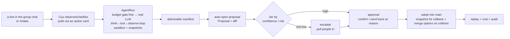

# WorkHub

> **A project group chat with an AI project manager, Cuu: she watches the discussion, pulls the
> work out of it, and hands it to the right person — once it's done, a human approves it.**

[简体中文](./README.md) ｜ English

[](LICENSE)
[](https://github.com/mycyg/WorkHub/actions/workflows/verify.yml)

---

## What WorkHub is

Open a project and what you see is a **group chat**: people talk in it, and so does Cuu — not a
bot that only answers when @-mentioned, but one that quietly follows the discussion and decides
for itself whether there's a piece of work worth doing in it. When the conversation goes quiet for
a short while, she distills it into an **action card**, tagged with who should do it; once someone
picks it up, she either does the work herself or, where she's stuck, pulls people into the
conversation to sort it out together. Finished work never lands directly in the source of truth —
it becomes a **proposal** first, and only gets adopted once the owner reviews and approves it.

This division of labor — AI moves first, a human keeps the final say — isn't just how chat works;
it's the same design running through the whole product, from the data layer up to the UI. Every
document, every work record, every change you see is governed by the same rule: **no AI change
ever silently touches production data.** It must carry a clear reason, leave a snapshot (one-click
rollback), and reach the source of truth through exactly one path — **propose → approve → merge**.

| What you see | What it actually is |
|---|---|
| working copy | branch |
| proposal | pull request |
| confirm / send back | approve / request changes |
| adopt into the official version | merge to `main` |
| a collision | merge conflict |

Aristotle imagined, in his *Politics*, that if the loom could weave and the plectrum play the lyre
on their own, master-craftsmen would need no assistants and masters no slaves — he wrote it knowing
it was fantasy. Twenty-three hundred years later, WorkHub is a serious attempt to let it land: **hand
the repetitive execution to AI, and let people go back to being the ones who judge.**

## Feature highlights

Every item below is a real, clickable feature — not a roadmap entry:

- **Full-featured project chat**: edit / delete (tombstoned, auditable) / quote-reply / emoji
  reactions / pin / aggregated read receipts / presence, plus a live "Cuu is pulling the discussion
  together" indicator.
- **Global search**: one search box across chat messages, drive files, work items, and meeting
  notes, with grouped results that jump straight to the source — built on PostgreSQL `pg_trgm`, no
  extra search engine to deploy.
- **Visible, governable memory**: what Cuu knows about you ("about me") and what the team's skills
  have accumulated are both browsable in Settings, with provenance, edit, and delete — not a black
  box.
- **AI feedback loop**: thumbs up/down on any of Cuu's replies, proposals, or deliverables; negative
  feedback genuinely feeds the nightly skill-distillation counter-example pool.
- **Risk monitoring**: a project-manager-eyed routine sweep — stalled work items, approaching
  deadlines with no movement, cost spikes — rolled into a daily digest posted to chat and
  notifications, not a stream of one-off pings.
- **GitHub integration**: bind a project to a repo and commit/PR/issue activity becomes an objective
  signal Cuu can reason about project progress from, instead of relying only on people
  self-reporting.

## Quick self-host: three steps

**Prerequisites**: a reachable machine (Linux/macOS), Docker 24+ (with the `docker compose`
plugin), and a clone of this repo.

**Step 1 · Configure**

```bash
cp .env.pilot.example .env.pilot
# Two required changes:
#   COOKIE_SECRET=$(openssl rand -hex 32)
#   ADMIN_CLAIM_SECRET=<a passphrase for the admin>
$EDITOR .env.pilot
```

**Step 2 · Start the stack (builds and migrates the database automatically)**

```bash
docker compose --env-file .env.pilot -f docker-compose.pilot.yml up -d --build
# Ready once the workhub container is healthy:
docker compose --env-file .env.pilot -f docker-compose.pilot.yml ps
```

**Step 3 · Log in**

Open `http://<this machine's IP>:8787/` in a browser. You'll land on the identify screen: pick a
nickname to join; the first user should check "I'm the admin" and enter the `ADMIN_CLAIM_SECRET`
from step 1 to claim the admin role.

**No LLM key? It still runs.** With `LLM_API_KEY` left empty, chat, work items, approvals, drive,
and dashboards all work normally — Cuu just won't observe the discussion or reply on her own, and
a banner at the top of the composer says "AI not configured." That banner is advisory, not a
gate — if you message Cuu directly anyway, you'll get a clear failure back ("Cuu didn't connect,
try again") rather than a hang or a silent no-op. Fill in a key and restart the container to light
up the AI features.

Full deployment details (backup/restore, the single-instance assumption, troubleshooting, security
posture) live in [`DEPLOY.md`](DEPLOY.md). For local development without building a Docker image,
see "Local development" below.

## Download the desktop client

Once the server is up, give everyone a desktop client too — the always-on spotlight box, the Cuu
desktop pet, system notifications, a tray icon, and the full project workbench all live there. The
web client (open `http://<server IP>:8787/` in a browser) doesn't lack any feature — it just
doesn't have these always-on native pieces.

Download the installer for your OS from [Releases](https://github.com/mycyg/WorkHub/releases):

| OS | File |
|---|---|
| macOS (Apple silicon, M1 and later) | `WorkHub_<version>_darwin_aarch64.dmg` |
| macOS (Intel) | `WorkHub_<version>_darwin_x64.dmg` |
| Windows 10/11 x64 | `WorkHub_<version>_windows_x64-setup.exe` (or `.msi`) |
| Linux x64 | `WorkHub_<version>_linux_amd64.deb` or `.AppImage` |

**First launch**: the installers aren't Apple-notarized or Windows-code-signed yet, so the OS will
block them once —

- macOS: find WorkHub.app in Finder, **Control-click → Open**, then click "Open" again in the
  dialog; or run `xattr -dr com.apple.quarantine /Applications/WorkHub.app` in a terminal.
- Windows: when SmartScreen says "Windows protected your PC," click "More info" → "Run anyway."
- Linux: `sudo dpkg -i WorkHub_<version>_amd64.deb`; for the AppImage, `chmod +x` it first.

**Pointing the client at your server**: the client defaults to `http://127.0.0.1:8787`. If the
server runs on a different machine, open the connection-failure card the client shows, click
"Open settings," enter the server address, and "Save and retry." For the remote address to
actually connect, the server's `CORS_ALLOW_ORIGINS` must also allow the desktop client's origin —
see "Give the client your server's address" in [`DEPLOY.md`](DEPLOY.md).

Building the client yourself: `pnpm build:desktop` builds for whatever platform you're on
(equivalent to building the desktop frontend then `cargo tauri build`; the output is
unsigned/ad-hoc). `pnpm build:desktop-macos` is the macOS-specific variant with an extra
code-signature structural verification gate. The full three-platform cross-build/sign/package
pipeline lives in [`.github/workflows/desktop-release.yml`](.github/workflows/desktop-release.yml).

## The core loop

From a single request to a trustworthy deliverable, the line runs like this:



Every link in that line is real code, not a diagram: [`agent-runner.ts`](apps/api/src/workers/agent-runner.ts)
claims and leases runs off a queue and drives the agent loop; [`loop.ts`](packages/agent/src/loop/loop.ts)
does the think→tool→observe with doom-loop detection and budget control; [`proposals.ts`](apps/api/src/services/proposals.ts)
handles propose, review, merge, and collision-merge.

## Local development

```bash
corepack enable
pnpm install

cp .env.example .env                   # fill in your LLM key, DB connection, local secrets
docker compose up -d postgres redis    # start local PG + Redis (dependencies only, not the app)
pnpm db:migrate                        # run Drizzle migrations

pnpm dev                               # bring up the API on :8787
pnpm --filter @workhub/web dev         # start Web on :5173 in a separate terminal
```

`pnpm verify` (typecheck + test + lint, including the migration replay-safety audit and the docs
consistency gate) is the same command CI runs. For the contribution workflow, test conventions,
migration discipline, and UI copy conventions, see [`CONTRIBUTING.md`](CONTRIBUTING.md).

## Architecture: one headless core, several thin clients

```
apps/
  api/               headless agent daemon — Hono + OpenAPI + SSE, all business logic and the AI engine live here, backed by PostgreSQL. The single source of truth; every client talks only to it.
  web/               React + Vite thin client — browser-reachable project management: a chat mirror, drive, approvals, dashboards, settings.
  desktop-webview/   Tauri webview UI — the full project workbench (group chat, Cuu, action cards, the task-plan/legion panel, drive, the spotlight launcher).

client-tauri/
  src-tauri/         the Rust shell around desktop-webview — native window, tray, notifications, deep links, desktop-pet rendering.

packages/
  agent/             the agent loop itself: think → tool → observe, provider routing (DeepSeek/Anthropic-compatible), budget control, doom-loop detection, sandboxed tools.
  contracts/         zod schemas shared by the API, web, and desktop — request/response shapes, Page VM types, the OpenAPI source of truth.
  db/                Drizzle schema, migrations, and repositories — the only code allowed to touch SQL.
  config/            environment variable parsing and validated runtime Settings (packages/config/src/env.ts).
  events/            SSE event envelopes and the pub/sub event bus both clients consume.
  permissions/       RBAC, approval routing, delegation.
  audit/             audit log + file-snapshot/revert — every AI-authored change is one-click reversible.
  cost/              budget and cost-governance primitives shared by the API and both UIs.
  cuu/               Cuu's shared persona/state logic (idle scheduler, card rendering, i18n).
  ui/                shared "gold path" server-rendered UI components used by both web and desktop-webview.
  web-runtime/       shared client runtime (SSE subscription, action dispatch, dirty-state tracking) used by both apps/web and apps/desktop-webview.
  api-client/        a typed HTTP client generated against packages/contracts.
  tools/             agent tool implementations — sandboxed file ops, run_command, skill loading — plus the migration replay-safety auditor.
```

## Docs

- Spec-tree index: [`docs/workhub/`](docs/workhub/README.md)
- PRD (master): [`docs/prd/2026-06-04-workhub-prd.md`](docs/prd/2026-06-04-workhub-prd.md)
- Vision & principles: [`docs/workhub/00-overview/vision-and-principles.md`](docs/workhub/00-overview/vision-and-principles.md);
  de-jargon glossary: [`docs/workhub/00-overview/glossary-dejargon.md`](docs/workhub/00-overview/glossary-dejargon.md)
- Deployment guide: [`DEPLOY.md`](DEPLOY.md); contributing guide: [`CONTRIBUTING.md`](CONTRIBUTING.md);
  security policy: [`SECURITY.md`](SECURITY.md)

## License & commercial use

This project is released under the **[PolyForm Noncommercial License 1.0.0](LICENSE)**:
source-public, **noncommercial use only** (not OSI open source).

> Required Notice: Copyright 2026 mycyg (https://github.com/mycyg/WorkHub)

- **Allowed**: personal study, research, experimentation, hobby projects, and use by nonprofit /
  educational / charitable / government bodies.
- **Not allowed**: any **commercial** use or **real enterprise-production** use.
- **Commercial / enterprise licensing requires written permission from the copyright holder.** For
  a commercial license, contact [@mycyg](https://github.com/mycyg) via GitHub.

---

> Give repetition to the machines, and judgment back to people.
