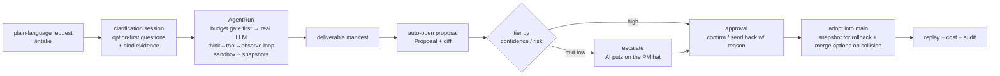

# WorkHub

> **A business-version GitHub, AI-native. Let AI be the default labor force, and give people back the one thing worth their time — judgment.**

[简体中文](./README.md) ｜ English

[](LICENSE) · Status: code-complete · CI green · pilot-ready

---

> *"If every tool could perform its own work when ordered, or by seeing what to do in advance… if the shuttle would weave and the plectrum touch the lyre without a hand to guide them, master-craftsmen would have no need of assistants, nor masters of slaves."*
>
> — Aristotle, *Politics*, Book I (c. 350 BCE)

Twenty-three centuries ago, Aristotle wrote down what reads almost like science fiction. He knew, of course, that it was a fantasy: in his age there were no tools that did their own work, so the weight of *labor* had to rest on the shoulders of other people. The sentence became an open prophecy — and it waited twenty-three hundred years.

Only now have tools that take an instruction and carry the work through, start to finish, actually appeared. **What WorkHub sets out to do is make that ancient prophecy land, in one concrete way: hand the heavy lifting to AI, and turn people back from *the ones who do the work* into *the ones who judge it*.**

## Origin & ambition

Nearly every collaboration tool — Feishu, Notion, Jira, and this project's own predecessor "Requirement Master" — rests on the same assumption: humans do the work, and AI is at most a drafting-and-Q&A assistant. The assumption is so self-evident that almost no one asks the obvious question: **what if you flipped it?**

What if the vast majority of a team's daily work were handed to AI by default? What if AI were no longer the one *suggesting*, but the one who *acts first*? What if people no longer had to type out every document and every draft themselves, but could step back — nodding when it's time to nod, taking over when it's time to take over? What kind of work would that be?

That is WorkHub's ambition: **not to bolt an AI plugin onto the old way of working, but to invert the deepest assumption of all — who does the work.** People are freed from repetition to do the part machines can't —

> *The Master said: "An accomplished person is not a utensil."*
>
> — Confucius, *Analects* 2.12

Confucius warned against living as a mere instrument, a tool. Hand the instrumental labor back to actual instruments, and people regain the room to do what is *not* tool-work: to judge, to take responsibility, to empathize, to decide. This is not about replacing anyone. It is a restoration of roles: **let machines do what machines are good at, so people can again do what people are good at.**

The larger the ambition, the more it needs one inviolable line to hold it. WorkHub's line is a single sentence: **no AI change ever silently touches production data.** Every change must carry a clear reason, leave a snapshot (one-click rollback), and reach the single source of truth through one path only — **propose → approve → merge**. We measure how well it works with one north-star metric, the Autonomy Rate — the share of work items AI completes and merges end to end with no one stepping in — while keeping a hard eye on rollback rate, reject rate, and escalation precision. **A higher autonomy rate is never, ever bought with trust.**

## An order you don't see

The highest form of automation is the kind you barely feel is there.

> *The best rulers are those whose existence the people merely know of.*
>
> — Laozi, *Tao Te Ching*, ch. 17

The best governance is the kind people know exists but never feel pressing on them. That is the "invisible order" WorkHub is after: you voice a need, and the work quietly takes shape behind the scenes; only at the moment that genuinely needs your call does it come knocking. Most of the time, you never need to know how the gears turn.

And so that *invisible* never means *untrustworthy*, the core of WorkHub is, in fact, a **business-version GitHub**: everyone (every AI worker included) edits on their own copy, submits changes as proposals, and only after the owner reviews and approves does anything merge into the one trusted version. This battle-tested discipline of collaboration is carried, intact, onto business objects — requirements, documents, plans, structured records — rather than source code.

But users never have to see the machine's insides.

> *"We shape our tools, and thereafter our tools shape us."*
>
> — Marshall McLuhan

Precisely because tools shape us back, WorkHub keeps all git jargon outside the door. It speaks two languages, inward and outward:

| What you see | What it actually is |
|---|---|
| working copy | branch |
| proposal | pull request |
| confirm / send back | approve / request changes |
| adopt into the official version | merge to `main` |
| a collision | merge conflict |

When two changes collide, the system never throws the word "conflict" at you — it says: "your change collided with someone else's; AI drafted a few merge options, pick one." And AI never shows its confidence as a number, only one of three plain phrases: **I'm fairly sure / worth a glance / I'm not sure, you decide.**

## One agent, two hats

The AI inside WorkHub wears two hats.

Most of the time it wears the *worker* hat: it just gets the work done. The moment it's blocked, it switches to the *project-manager* hat: instead of forcing through, it organizes people — staffing, decomposing, scheduling, chasing progress, then re-reviewing. When it switches is decided by confidence and risk; and **the moment it switches hats is exactly the moment of escalation.** Three things trigger it: the work fails review, the user rejects it (and a rejection must carry a reason — that reason is fed back so the AI keeps fixing it *on the same copy* instead of stalling), or the user has explicitly ruled this off-limits to AI (a switch you can set per task, per project, per person).

When it truly can't continue, it doesn't die silently mid-way — it hands off a structured "what I did, what I didn't, what I'd do next." **In WorkHub, escalation is a designed, dignified exit — not a failure.**

When something escalates to a human, the AI project manager even recommends "one owner + a few collaborators," each with a plain-language "why this person" — drawn from each person's skill self-description and a collaboration graph: who's good at what, who has worked with whom, hit rate, current load. When the information is thin, it won't decide for you; it lays out the reasoning and leaves the call to you.

## The core loop

From a single request to a trustworthy deliverable, the line runs like this:



Every link in that line is real code, not a diagram: [`agent-runner.ts`](apps/api/src/workers/agent-runner.ts) claims and leases runs off a queue and drives the agent loop; [`loop.ts`](packages/agent/src/loop/loop.ts) does the think→tool→observe with doom-loop detection and budget control; [`proposals.ts`](apps/api/src/services/proposals.ts) handles propose, review, merge, and collision-merge.

## What makes it real — not a slide deck, but something that runs

Ambition is cheap to talk; code doesn't lie. As of today:

- **The core loop has been validated end to end with a real LLM.** Across 6 real DeepSeek runs, T1–T4 scored full marks on human review, T5 **correctly chose to escalate rather than fabricate** when information was insufficient, and B1 hit the budget guardrail dead-on — all with real money on the line, at a cost of **¥0.142346 / 30103 tokens**. That AI does the work is *proven*, not *claimed*.
- **From request to deliverable, the whole pipeline is alive:** option-first clarification → a real agent loop (provider routing → sandboxed tools → snapshot → deliverable manifest → auto-opened proposal) → confidence scoring with auto-escalation → SLA-aware approval routing → a ledgered, collision-guarded merge → replay, audit, restore.
- **All eight phases of "compounding AI labor" have shipped and are CI-green:** the decision-inbox home, the AI worklog, user memory, team-skill self-iteration, pet emotions, the three-column approval diff workbench — each step making AI's output accumulate, get reused, and compound on itself.
- **Quality was beaten in, not assumed.** A multi-agent deep review surfaced 87 real issues (3 Critical + 14 High + 27 Medium + 43 Low); 84 are fixed and CI-green, with only 3 architectural items consciously deferred; of the 70-step browser live-route smoke, 66 steps are gated in CI and run in ~64s. 158 spec documents are on record.

Honesty is its own kind of strength, so here is what has **not** yet arrived: the home decision-queue is scaffolded but production doesn't feed approvals and to-dos into it yet; team-skill idle self-iteration is built but default-off and has never actually run; the pet is still a black/white cat, with the concept-art orange one not yet matched. **The one real gap — and the heaviest — is that no real team has yet used this loop to do a full week of real work.** That is the last mile of the north star; the system is already on the starting line (queue clean: 0 open proposals / 0 active runs / 0 pending approvals), waiting only for real people to step in.

> *"The future is already here — it's just not evenly distributed."*
>
> — William Gibson

## Deploy & get started

WorkHub is a **TS-first monorepo** (pnpm workspaces): a headless agent daemon with OpenAPI/SSE, PostgreSQL, and Redis, fronted by a Web thin client and a Tauri desktop app. LAN-first, with the hooks for cloud already in place.

**Prerequisites**

- Node ≥ 22, pnpm 11 (`corepack enable` is enough)
- An LLM API key (defaults to DeepSeek's Anthropic-compatible endpoint)
- Docker Desktop, if you want the one-command full stack
- A database: local PostgreSQL 16 + Redis (started either way below)

**Option 1 · Local development**

```bash
corepack enable
pnpm install

cp .env.example .env                   # fill in your LLM key, DB connection, local secrets
docker compose up -d postgres redis    # start local PG + Redis
pnpm db:migrate                        # run Drizzle migrations (0000–0019)

pnpm dev                               # bring up API / Web together
```

**Option 2 · One-command full stack (Pilot, recommended for a trial run)**

```bash
# api + static web + postgres + redis, built and migrated automatically
docker compose --env-file .env.pilot -f docker-compose.pilot.yml up -d --build
```

**Ports & health checks**

| Service | Port | Probe |
|---|---|---|
| API daemon | `8787` | `GET /api/health` |
| Web | `5173` | — |
| Tauri webview | `1420` | — |

**Verify & operate**

- `pnpm verify`: typecheck + test + lint in one pass (includes the docs-consistency gate).
- Migrations: `pnpm db:generate` / `pnpm db:check` / `pnpm db:migrate`.
- Config is centralized in [`packages/config`](packages/config); all secrets are injected from `.env`, and in production the app **fails closed** (refuses to start) on a weak cookie secret, wildcard CORS, a memory broker with multiple workers, and the like.
- Backup / restore scripts ship with the deploy package, with daily evidence kept during Pilot Week.
- Note: the production sandbox and agent execution require Linux; database acceptance is run on a local build against local PG + Redis.

## Still on the road

| Direction | Why | Status |
|---|---|---|
| **A real pilot week** | The last mile of the north star: real people, real tasks, a full week, validating the "AI as default labor force" thesis | 🗺️ planned |
| **Wire the decision inbox to real data** | The home decision-queue now feeds from the user's pending approvals (same source as the approval center, user-routed, graceful degradation on lookup failure) | ✅ wired |
| **Business-object merge semantics + AI conflict mediation** (the moat) | Only the lowest-risk layer ships today (ledger + optimistic blocking + diff3 + AI merge options); the full three-way merge experience is left for real conflict data | 📊 data-driven |
| **Confidence / risk threshold calibration** | Today's weights are v0 defaults from just 6 real runs — too small a sample; they need retuning on real data and a new policy version | 📊 data-driven |
| **Team-skill idle self-iteration in production** | The subsystem is built but default-off; compounding labor only pays off once it actually runs | 🟡 default-off |
| **Multi-tenant / multiple workspaces** | Single-deployment, single-workspace today; `workspace_id` is threaded through, but cloud deploy / isolation / billing are P5 | ⏸️ deferred |
| **Desktop pet real-device full-scenario capture (#27)** | Black/white cat and 5-emotion / 3-bubble convergence shipped; real-device long recording and the orange cat are still to match | ⏸️ off the critical path |
| **P-COLLAB M2 finishing**: base-snapshot baseline + "reconcile against the latest, then adopt" | The no-lost-update core is CI-green; stale-base now recovers through the reconcile flow instead of only aborting | ✅ M2 landed |

## Docs

- 📐 **Spec-tree index**: [`docs/workhub/`](docs/workhub/README.md)
- 📋 **PRD (master)**: [`docs/prd/2026-06-04-workhub-prd.md`](docs/prd/2026-06-04-workhub-prd.md)
- 🧭 **Vision & principles**: [`docs/workhub/00-overview/vision-and-principles.md`](docs/workhub/00-overview/vision-and-principles.md); **de-jargon glossary**: [`docs/workhub/00-overview/glossary-dejargon.md`](docs/workhub/00-overview/glossary-dejargon.md)
- 💡 **Origin (brainstorm)**: [`docs/brainstorms/2026-06-04-workhub-ai-native-platform-brainstorm.md`](docs/brainstorms/2026-06-04-workhub-ai-native-platform-brainstorm.md)

## License & commercial use ⚖️

This project is released under the **[PolyForm Noncommercial License 1.0.0](LICENSE)**: source-public, **noncommercial use only** (not OSI open source).

> Required Notice: Copyright 2026 mycyg (https://github.com/mycyg/WorkHub)

- ✅ **Allowed**: personal study, research, experimentation, hobby projects, and use by nonprofit / educational / charitable / government bodies.
- ⛔ **Not allowed**: any **commercial** use or **real enterprise-production** use.
- 📩 **Commercial / enterprise licensing requires written permission from the copyright holder.** For a commercial license, contact [@mycyg](https://github.com/mycyg) via GitHub.

---

> Give repetition to the machines, and judgment back to people.
> A prophecy from twenty-three centuries ago — we mean to give it an honest try.
