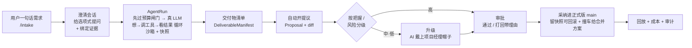

# WorkHub

> **业务版 GitHub × AI-native 工作中台。让 AI 当默认劳动力,把人还给最值得做的事——判断。**

简体中文 ｜ [English](./README.en.md)

[](LICENSE) · 状态:代码完成 · CI 全绿 · 具备试运行条件

---

> *"假如每一件工具都能听从吩咐、自动完成自己的工作……那么工头就不再需要帮手,主人也不再需要奴隶。"*
>
> —— 亚里士多德,《政治学》(约公元前 350 年)

两千三百多年前,亚里士多德写下这句近乎科幻的设想。他当然清楚那只是空想:在他的时代,会自己干活的工具并不存在,于是"劳动"这两个字,只能压在另一群人的肩上。这句话因此成了一则悬而未决的预言,一等就是两千三百年。

直到今天,会听吩咐、能把活儿从头干到尾的"工具",才第一次真的出现。**WorkHub 想做的,就是让这则古老预言落地的一种方式:把繁重的执行交给 AI,把人从"干活的人",还原成"做判断的人"。**

## 缘起与野心

几乎所有协作工具——飞书、Notion、Jira,也包括本项目的前身「需求管理大师」——都默认同一件事:活儿主要靠人干,AI 顶多算个会起草、能问答的助手。这个假设如此理所当然,以至于很少有人追问:**如果反过来呢?**

如果团队日常里的绝大多数事,默认都交给 AI 去做;如果 AI 不再是"提建议的",而是"第一个动手的";如果人不必再亲手敲下每一份文档、每一版方案,而是退后一步,只在该点头时点头、该接手时接手——那会是一种什么样的工作?

这就是 WorkHub 的野心:**不是给旧的工作方式装上 AI 插件,而是把"谁来干活"这个最底层的假设掉个头。** 人因此被从重复劳动里解放出来,去做机器替不了的那部分——

> *子曰:"君子不器。"*
>
> —— 《论语·为政》

孔子说,君子不该把自己活成一件器具、一个工具。把工具性的劳动交还给真正的工具,人才有余裕去做判断、负责、共情、拍板这些"不器"的事。这不是要取代谁,而是一次位置的归还:**让机器做机器擅长的,让人重新做人擅长的。**

野心越大,越需要一条不可逾越的底线兜住它。WorkHub 的底线只有一句:**AI 的任何改动,都不会悄悄写进生产数据。** 每一处改动都必须讲得清理由、留得下快照(可一键回滚),并且只能走「提议 → 审批 → 合并」这一条路,汇入唯一的可信版本。我们用一个北极星指标衡量它走得好不好:自主率——全程没人插手、AI 自己跑完并成功合并的任务占比;同时死死盯住回滚率、打回率、升级准不准这几个护栏。**自主率再高,也绝不拿信任去换。**

## 一种看不见的秩序

好的自动化,最高境界是让人几乎感觉不到它的存在。

> *太上,不知有之。*
>
> —— 老子,《道德经》第十七章

最好的治理,是百姓只知道有这么回事,却感觉不到它在管自己。WorkHub 追求的正是这种"看不见的秩序":你提一句需求,事情就在背后悄然成形;只有真正需要你拍板的那一刻,它才来敲门。绝大多数时候,你不需要知道齿轮是怎么转的。

而为了让"看不见"不等于"不可信",WorkHub 在内核里其实是一套**业务版 GitHub**:人人(连同每个 AI 工人)都在自己的副本上改,改动以提议的形式提交,负责人评审通过后,才合并进唯一可信的正式版。这套久经考验的协作纪律,被原封不动地搬到了业务对象上——需求、文档、方案、结构化记录——而不再是源代码。

但用户永远不必看见这套机器的内脏。

> *"我们塑造了工具,此后,工具反过来塑造我们。"*
>
> —— 马歇尔·麦克卢汉

正因为工具会反过来塑造人,WorkHub 坚持把所有 git 黑话挡在门外。它对内对外说两套话:

| 你看到的 | 内部其实是 |
|---|---|
| 工作副本 | 分支 branch |
| 提议 | Pull Request |
| 确认 / 打回 | 评审 approve / request changes |
| 采纳进正式版 | 合并到 main |
| 撞车了 | merge conflict |

两份改动撞了,系统不会甩给你"冲突"二字,而是说:"你和别人的改动撞上了,AI 拟了几个合并方案,挑一个。" AI 有几分把握,也从不露数字,只用三句大白话:**我比较有把握 / 建议你扫一眼 / 我拿不准,你来定。**

## AI 的一人两顶帽子

WorkHub 里的 AI,戴着两顶帽子。

平时戴"工人帽":直接把活干出来。一旦受阻,就换上"项目经理帽":不硬扛,转而去组织人——派活、拆任务、排期、催进度、再复审。什么时候换帽子,由把握度和风险高低决定;而**换帽子的那一刻,正是升级的那一刻**。三种情况会触发升级:活儿不合格(没过评审)、用户不满意(打回——而且打回必须给理由,这条理由会回灌给 AI,让它在原来的副本上接着改,而不是卡死)、以及用户明确规定这件事不许 AI 碰(可按任务、项目、个人三级设开关)。

撑不下去时,它不会无声无息地断在半路,而是交出一份"做了什么、没做什么、建议下一步怎么走"的交接。**在 WorkHub 里,升级是设计好的体面退场,不是失败。**

事情升级到人这边时,AI 项目经理还会推荐"一个负责人 + 若干协作者",并附上一句大白话的"为什么是 TA"——依据是每个人的技能自述,和一张协作图谱:谁擅长什么、和谁合作过、命中率多高、当前手头多忙。信息不足时,它不替你拍板,只把理由摆出来,把决定权留给你。

## 核心闭环

一句需求进来,到一份可信的交付物落地,中间是这样一条线:



这条线的每一环都是真代码,不是示意图:[`agent-runner.ts`](apps/api/src/workers/agent-runner.ts) 认领并租约式地跑队列、驱动 agent 循环;[`loop.ts`](packages/agent/src/loop/loop.ts) 做"想→调工具→看结果",带死循环检测与预算控制;[`proposals.ts`](apps/api/src/services/proposals.ts) 管提议、评审、合并与撞车合并。

## 牛逼之处:它不是 PPT,是跑得起来的东西

野心容易吹,代码不会撒谎。截至目前:

- **核心闭环已用真大模型端到端验证过。** 6 次真实 DeepSeek 运行里,T1–T4 人评质量满分、T5 在信息不足时**正确选择了升级而非编造**、B1 准确命中预算护栏——全程真金白银,花费 **¥0.142346 / 30103 tokens**。AI 会干活,这件事是被证明的,不是被声称的。
- **从需求到交付,整条管线是活的:** 选项式澄清 → 真实 agent 循环(provider 路由 → 沙箱工具 → 快照 → 交付物清单 → 自动开提议)→ 把握度评分与自动升级 → 带 SLA 的审批路由 → 留账本、防撞车的合并 → 回放、审计、恢复。
- **「复利劳动力」八个阶段全部上线、CI 全绿:** 决策收件箱首页、AI 战绩、用户记忆、团队技能自迭代、桌宠情绪、三栏审批 diff 工作台……一步步让 AI 的产出可以累积、复用、自我增益。
- **质量是被拷打出来的。** 一轮多 agent 深度评审挖出 87 个真问题(3 个致命 + 14 个高危 + 27 个中等 + 43 个低),已修 84 个、CI 全绿,只留 3 个架构项明确暂缓;70 步浏览器实路由冒烟里 66 步进了 CI,约 64 秒跑完。158 篇规格文档落盘在案。

诚实也是一种牛逼。所以这些还**没有**抵达终点,我们照样写出来:首页的决策队列骨架已就位,但生产还没把审批和待办喂进去;团队技能的闲时自迭代建好了却默认关闭、从没真跑过;桌宠还是黑白猫,概念图里的橙猫尚未对齐。**真正的缺口只有一个,也是最重的一个——还没有一支真实的团队,用这套闭环,踏踏实实干满一周活。** 这是北极星的最后一公里,系统已经站在起跑线上(队列清零:0 待处理提议 / 0 进行中运行 / 0 待审批),只等真人入场。

> *"未来已来,只是分布不均。"*
>
> —— 威廉·吉布森

## 部署与上手

WorkHub 是一套 **TS-first 的 monorepo**(pnpm workspaces):一个无头 agent 守护进程,配 OpenAPI/SSE、PostgreSQL、Redis,前端是 Web 瘦客户端与 Tauri 桌面端。局域网优先,同时为上云留好了接口。

**前置条件**

- Node ≥ 22、pnpm 11(`corepack enable` 即可)
- 一个大模型 API key(默认走 DeepSeek 的 Anthropic 兼容端点)
- 如需一键全栈:Docker Desktop
- 数据库:本地 PostgreSQL 16 + Redis(下面任选一种方式起)

**方式一 · 本地开发**

```bash
corepack enable
pnpm install

cp .env.example .env          # 填入大模型 key、数据库连接等本地密钥
docker compose up -d postgres redis   # 起本地 PG + Redis
pnpm db:migrate               # 跑 Drizzle 迁移(0000–0019)

pnpm dev                      # 同时拉起 API / Web
```

**方式二 · 一键全栈(Pilot,推荐用于试运行)**

```bash
# 起 api + web 静态 + postgres + redis 全栈,自动构建、自动迁移
docker compose --env-file .env.pilot -f docker-compose.pilot.yml up -d --build
```

**端口与健康检查**

| 服务 | 端口 | 探活 |
|---|---|---|
| API 守护进程 | `8787` | `GET /api/health` |
| Web | `5173` | — |
| Tauri webview | `1420` | — |

**验证与运维**

- `pnpm verify`:typecheck + test + lint 一把过(内含文档一致性门)。
- 数据库迁移:`pnpm db:generate` / `pnpm db:check` / `pnpm db:migrate`。
- 默认配置集中在 [`packages/config`](packages/config);所有密钥从 `.env` 注入,生产环境会对弱 cookie 密钥、通配 CORS、内存 broker 配多 worker 等情况 **fail-closed**(直接拒绝启动)。
- 备份 / 恢复脚本随部署包提供,Pilot Week 期间每日留证。
- 注意:生产沙箱与 Agent 执行需要 Linux;数据库验收优先在本地构建、本地 PG + Redis 上复跑。

## 仍在路上

| 方向 | 为什么 | 状态 |
|---|---|---|
| **真实试运行周** | 北极星的最后一公里:真人用真任务跑满一周,验证"AI 当默认劳动力"的论点 | 🗺️ 规划中 |
| **决策收件箱接上真实数据源** | 首页决策队列已接上"用户待决策的审批"真实数据源（与审批中心同源、按用户路由,取数失败优雅降级） | ✅ 已接线 |
| **业务对象合并语义 + AI 调解冲突**(护城河) | 现仅最低风险层(账本 + 乐观熔断 + diff3 + AI 合并方案);完整三方合并体验留给真实冲突数据驱动 | 📊 数据驱动 |
| **把握度 / 风险阈值校准** | 现用 6 次真跑得出的 v0 权重,样本太小;须真实数据重调并发新策略版本 | 📊 数据驱动 |
| **团队技能闲时自迭代上生产** | 子系统已建好但默认关闭;复利劳动力得让它真跑起来才兑现 | 🟡 默认关闭 |
| **多租户 / 多 workspace** | 现单部署单 workspace;`workspace_id` 已埋线,但云部署/隔离/计费属 P5 | ⏸️ 暂缓 |
| **桌宠真机全场景长录(#27)** | 黑白猫与 5 情绪 / 3 气泡已上;真机长录与橙猫对齐待补 | ⏸️ 非关键路径 |
| **P-COLLAB M2 收尾**:base-snapshot 基线 +「对一下底稿再采纳」 | 防丢更新核心已 CI 绿;stale base 已从报错中止升级为可恢复的对底稿流程 | ✅ M2 已落 |

## 文档

- 📐 **规格树索引**:[`docs/workhub/`](docs/workhub/README.md)
- 📋 **PRD(总纲)**:[`docs/prd/2026-06-04-workhub-prd.md`](docs/prd/2026-06-04-workhub-prd.md)
- 🧭 **愿景与原则**:[`docs/workhub/00-overview/vision-and-principles.md`](docs/workhub/00-overview/vision-and-principles.md);**去黑话词表**:[`docs/workhub/00-overview/glossary-dejargon.md`](docs/workhub/00-overview/glossary-dejargon.md)
- 💡 **缘起(头脑风暴)**:[`docs/brainstorms/2026-06-04-workhub-ai-native-platform-brainstorm.md`](docs/brainstorms/2026-06-04-workhub-ai-native-platform-brainstorm.md)

## 许可证与商业授权 ⚖️

本项目以 **[PolyForm Noncommercial License 1.0.0](LICENSE)** 发布:**源码公开,仅限非商业用途**(非 OSI 开源)。

> Required Notice: Copyright 2026 mycyg (https://github.com/mycyg/WorkHub)

- ✅ **允许**:个人学习、研究、实验、爱好项目,以及非营利 / 教育 / 公益 / 政府机构使用。
- ⛔ **禁止**:任何**商业化**或**真实企业生产场景**的使用。
- 📩 **商业 / 企业授权须经版权所有者书面许可。** 需要商用授权,请通过 GitHub 联系 [@mycyg](https://github.com/mycyg)。

---

> 把重复交给机器,把判断留给人。
> 两千三百年前的预言,我们想认真试一次。
