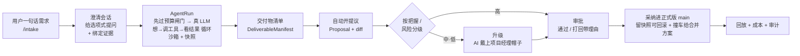

# WorkHub

> **业务版 GitHub × AI-native 工作中台。让 AI 当默认劳动力,人只管审批和兜底。**

简体中文 ｜ [English](./README.en.md)

[](LICENSE) · 状态:代码完成、CI 全绿、具备试运行条件(只差真实团队上手跑通一周)

---

## 这是什么

今天的协作工具——飞书、Notion、Jira,也包括本项目的前身「需求管理大师」——都默认一件事:活儿主要靠人干,AI 顶多是个起草和问答的助手。

WorkHub 把这个假设反过来:**团队日常里的绝大多数事,默认交给 AI 来做。** AI 不再只是"提建议",而是第一执行人,直接产出文档、分析、方案和代码。人则退到两个更值钱的位置上:

- **审批者**——看 AI 交上来的提议,点头,或者打回;
- **兜底者**——接住 AI 自己搞不定、不该碰、或者做砸了而升级上来的事。

这套反转有一条不可逾越的安全底线:**AI 的任何改动都不会悄悄写进生产数据。** 每一处改动都必须能讲清楚理由、能一键回滚(留有快照),并且只能走「提议 → 审批 → 合并」这一条路,汇入唯一的可信版本(main)。我们用一个北极星指标衡量它做得好不好:自主率,也就是全程没人插手、AI 自己跑完并成功合并的任务占比;同时盯紧回滚率、打回率、升级准不准这几个护栏。**自主率再高,也不能拿信任去换。**

> **缘起**:前身产品本就有"交付 → 负责人通过/打回"的流程,这其实就是一次 GitHub 式的评审。团队早把"业务版 GitHub"的骨架搭好了,只是没给它起这个名字,也没让 AI 坐进驾驶座。WorkHub 要做的,就是给这副骨架正名、让 AI 默认开车,再补上三块原本缺失的护城河:多人审批怎么路由、业务对象怎么合并、组织级的权限和成本怎么管。

## 为什么不一样

**对比 GitHub。** WorkHub 借用了 GitHub 协作的内核——各自在副本上改、以提议的形式提交、评审通过后合并到唯一可信版本——但把它从源代码搬到了业务对象上:需求、文档、方案、结构化记录。更关键的是,这里 AI 是默认的"提交者",而且对用户**完全隐藏 git 黑话**:GitHub 满屏的 branch、commit、merge、conflict,WorkHub 一个都不让用户看见。

**对比通用 AI Agent。** WorkHub 不是聊天助手,也不是单打独斗的自治 agent,而是把"AI 当默认劳动力"放进一个多人团队里,并用"不悄悄改生产数据"这条宪法约束住它。同一个 agent 戴着两顶帽子:平时是工人,受阻时变项目经理;升级有明确的触发条件,还配了死循环检测和预算护栏——撑不下去时它会交出一份"做了什么、没做什么、建议下一步怎么走"的交接,而不是悄无声息断在半路。

**对比 SaaS。** 有几件事 WorkHub 刻意不做:不做通用 IM,不做实时协同文档(没有字符级的 OT/CRDT,不和飞书、Notion 拼编辑体验),也不做向量检索(坚持 grep + 强制引用这套可追溯的老办法)。v1 优先局域网部署,同时为上云留好了接口,并以非商业许可证发布。

## 五个核心理念

**一、AI 一人两顶帽子。** 默认戴"工人帽",直接把活干出来;一旦受阻,就换上"项目经理帽",转去组织人——派活、拆任务、排期、催进度、再复审。什么时候换帽子,由置信度和风险高低决定;而换帽子的那一刻,正是升级的那一刻。三种情况会触发升级:活儿不合格(没过评审)、用户不满意(打回——打回必须给理由,这条理由会回灌给 AI,让它在原来的副本上改,而不是卡死)、以及用户明确规定这件事不许 AI 碰(可按任务、项目、个人三级设开关)。在 WorkHub 里,升级是设计好的正常流转,不是失败。

**二、协作全程不说 git 黑话。** 系统内部就是一套业务版 GitHub,但它对内对外用两套词、严格分层,用户永远见不到技术术语:

| 用户看到的 | 内部其实是 |
|---|---|
| 工作副本 | 分支 branch |
| 提议 | Pull Request |
| 确认 / 打回 | 评审 approve / request changes |
| 采纳进正式版 | 合并到 main |
| 撞车了 | merge conflict |

每个人——连同每个 AI 工人——都有自己的工作副本;改动以"提议"提交,负责人"确认"或"打回",通过后"采纳"进正式版。两份改动撞了,系统不会甩出"冲突"二字,而是说"你和别人的改动撞上了,AI 给了几个合并方案,挑一个"。置信度也从不露数字,只用三句大白话:我比较有把握 / 建议你扫一眼 / 我拿不准,你来定。

**三、唯一可信源,绝不悄悄改生产态。** 不管是 AI 还是人,所有改动都统一走「提议 → 审批 → 合并」,汇进唯一的 main。任何对生产数据的写入都要满足三条:讲得清理由、留得下快照(可回滚)、过得了审批。高把握、低风险的可以按策略自动合并,但一样留痕、一样可退;中等把握的会被**强制**送到人那里抽查一眼。

**四、派活靠分层身份。** 事情升级时,AI 项目经理会基于身份信息推荐"一个负责人 + 若干协作者",并附上一句大白话的"为什么是 TA"。身份信息来自每个人的技能自述,以及一张协作图谱:谁擅长什么、和谁合作过、命中率多高、当前手头多忙。信息不足时它不会替你拍板,而是降级成"解释型推荐"——AI 把理由摆出来,人来定。

**五、桌宠和 Web 两个入口,背后同一个守护进程。** 入口有两个:一只会对话、能动手的桌面宠物(Cuu),和一个 Web 应用。两者都只是同一个无头 agent 守护进程的瘦客户端。agent 几乎能用自然语言操作所有功能,让完全不懂工具的人也能"说一句话就把事办了"。

## 核心闭环



对应的真实代码:[`apps/api/src/workers/agent-runner.ts`](apps/api/src/workers/agent-runner.ts)(认领/租约队列 + agent 循环)、[`packages/agent/src/loop/loop.ts`](packages/agent/src/loop/loop.ts)(想→调工具→看结果,带死循环与预算控制)、[`apps/api/src/services/proposals.ts`](apps/api/src/services/proposals.ts)(提议、评审、合并、撞车合并)。

## 功能

> 图例:✅ 已上线(有路由 + 服务实现) · 🟡 部分完成(主体已建,某一半还没接上真实数据,或默认关闭) · 🗺️ 规划中

**工作受理 & AI 核心闭环**
- ✅ 一句话建任务、澄清会话(给选项式提问 + 绑定项目证据)
- ✅ 启动 / 中止 AgentRun(校验归属,防越权);真实的"想→调工具→看结果"agent 循环
- ✅ 沙箱里的文件与技能工具;实时查看执行轨迹、可回放、预算耗尽时给结构化交接
- ✅ 崩溃恢复(租约过期自动重排);给运行结果打把握分,低把握自动升级

**提议 / 评审 / 审批 / 合并**
- ✅ 从交付物清单开提议(结构化 diff + 检查项)
- ✅ 评审:通过,或打回(理由回灌进下一次运行,作为纠偏上下文)
- ✅ 采纳进正式版,并留下可回滚的快照
- ✅ **审批中心三栏工作台**:左边是列表和 SLA,中间是改动前后对比、合规检查、AI 解释和冲突,右边是决策、记住规则、审批流程时间线和评论区;撞车时给出三方视图、AI 合并方案,以及字段、条目、文本块三种粒度的覆盖

**协作 & 内容**
- ✅ 项目文件库(上传、版本、软删除与恢复)、评论转草稿、草稿转提议
- ✅ 已采纳交付物的下载、预览、恢复
- ✅ 会议洞察转草稿 / 忽略 / 转提议
- ✅ 知识与证据检索(grep + 强制引用,结果以证据卡呈现)、把证据绑定到任务
- ✅ 通知收件箱(按"待决策 / 知会一下 / 已完成"分桶,并标注来源)、日历视图、**实时推送**(按资源授权的多路 SSE 流)

**AI-native & 治理**
- ✅ **AI 战绩**:今天干了几件、自主率多少、采纳了几件、估算省了多少时间(所有登录用户可见,不含成本明细)
- ✅ 成本治理:按范围设预算策略(管理员)、运行前后做预算决策与熔断、成本看板(管理员看全局账本,普通用户只看自己)
- ✅ **用户记忆**:你打回时写的理由会自动沉淀为"纠偏记忆",注入以后的 AI 运行,可自助删除
- ✅ 权限矩阵(默认 fail-closed,没匹配上的策略一律走"问一下")、审批请求、人类保留动作守卫(撞上就升级)、按任务的快照与审计链、本地客户端的文件级回退、项目健康看板
- ✅ 轻量昵称身份 + 本地客户端设备令牌、管理员认领、语言偏好、项目一键初始化并注水工作目录
- 🟡 **团队级技能自迭代**:文件系统 ∪ 数据库的合并技能视图已注入运行;但闲时蒸馏的 worker 默认关闭、生产里从没真跑过(且空闲判断尚未接线)
- 🟡 **决策收件箱首页**:"你自己进行中的 AI 任务"和"今日 AI 战绩"是实时真数据;决策队列的卡片骨架也已就位,但**生产环境还没把审批和待办接进这个队列的数据源**

**桌面宠物(Cuu / Live2D)**
- ✅ Tauri 原生桌面端(主窗 + 透明置顶的桌宠窗 + 托盘 + `workhub://` 深链)、桌宠控制(模式、缩放、透明度、点击穿透、悬停隐藏、拖拽)
- ✅ Live2D 猫(黑猫 hijiki / 白猫 tororo)的动作跟随 AI 生命周期状态;Rust 的 SSE worker 把后端事件桥接成桌宠卡片和系统通知
- 🟡 视觉收尾:概念图里是橙猫,当前资产是黑白猫(差异已记录在案);真机长场景动作录制待补(见下方 #27)

## 实现

**TS-first 的 monorepo**(pnpm workspaces):无头 agent 守护进程 + OpenAPI/SSE + PostgreSQL + Tauri 桌面端 / Web 瘦客户端,局域网优先、为上云就绪。

| 层 | 技术 | 说明 |
|---|---|---|
| 运行时 | Node ≥22 · pnpm 11 · TypeScript 5.7 ESM · tsx | 测试跑在 tsx 上,真正的类型门是 `pnpm -r typecheck`(tsc) |
| API | Hono + `@hono/node-server` | 无头 agent 守护进程,默认端口 `8787`,`GET /api/health` |
| 数据库 | PostgreSQL + Drizzle ORM | 约 50 张表,迁移 0000–0019,`db:generate/check/migrate` |
| 队列 / 广播 | Redis(可降级到 memory / pg_listen) | 生产环境禁止 memory broker 配多 worker |
| Web 端 | 原生 TS SSR 外壳 + React 18 局部交互岛 | 路由由 Page VM 加应用级 SSE 驱动,只有提议编辑器这类局部用 React;规划端口 `5173` |
| 桌面端 | Tauri(Rust)桌宠 + WebView + Live2D Cubism | `client-tauri/src-tauri`(窗口、SSE worker、托盘、深链、通知);规划端口 `1420` |
| 大模型 | DeepSeek(走 Anthropic 兼容的 `/v1/messages`) | ProviderRegistry 按任务类别路由,MeasuredLlmClient 计量用量和成本 |
| 工具 / 沙箱 | 命令白名单沙箱 + 文件技能 | 禁绝对/相对命令路径、禁装依赖与远程执行、用 realpath 防符号链接逃逸;文件读写限定在运行目录内 |

**三个应用**:[`apps/api`](apps/api)(Hono 守护进程 + agent-runner worker)、[`apps/web`](apps/web)(浏览器瘦客户端 + 确定性 smoke QA)、[`apps/desktop-webview`](apps/desktop-webview)(桌宠 WebView,搭配 `client-tauri` 这个 Rust crate)。

**十四个包**(节选):`@workhub/contracts`(Zod 契约,几乎人人依赖)、`@workhub/agent`(AI 引擎:provider、循环、清单、评估)、`@workhub/tools`(工具、沙箱、技能)、`@workhub/cost`(预算决策 + 账本)、`@workhub/permissions`(fail-closed 权限矩阵)、`@workhub/db`(Drizzle schema、迁移、仓库)、`@workhub/audit`(快照 + 审计)、`@workhub/cuu`(桌宠大脑)、`@workhub/ui`(无头 UI + 中英 i18n),以及 `@workhub/web-runtime`、`@workhub/api-client`、`@workhub/config`、`@workhub/events`。

**工程亮点**:应用级 SSE 带 Last-Event-ID 断点续传;provider 注册表 + 用量计量;沙箱命令白名单 + 技能;权限矩阵 fail-closed;中英 i18n gold-path;预算护栏(实测真跑 DeepSeek 花了约 ¥0.142);确定性 web smoke(无溢出门、真路径导航、中英文案对齐,已进 CI);运行持久化(租约 + 心跳 + 过期重排);合并安全(先写存储再开事务、撞车给合并方案、防 stale base、幂等)。

## 现状

**代码层面已具备试运行条件,且通过了全部自动化门。** 核心的"AI 干活、人审批"闭环已用**真大模型端到端验证**过:6 次真实 DeepSeek 运行里,T1–T4 人评质量满分、T5 在信息不足时正确升级而没有编造、B1 命中了预算护栏,真实花费 **¥0.142346 / 30103 tokens**。S1 序列 R5.9–R5.12(注册流、真大模型验证、单镜像 + compose 部署包 + CI 真部署冒烟、权限矩阵审计)已全部落地;R6「复利劳动力」**八个阶段全部上线、CI 全绿**;一轮多 agent 深度评审挖出的 **87 个真问题,已修 84 个(3 个架构项暂缓),CI 全绿**;70 步浏览器实路由冒烟里 66 步进了 CI,约 64 秒跑完。

**唯一的缺口,是真实试运行周。** 北极星是"真实团队用核心闭环真干一周活"。在真人真正跑通 `提需求 → 任务 → 提议 / 审批 / 合并 / 回放` 之前,这个中心论点还没被真实使用验证过——目前只被 QA、第二用户、空跑和真 key 跑这几种方式证明了管线本身可用。系统已经处于"可邀请、可观察"的状态,队列也清零了(0 个待处理提议 / 0 个进行中运行 / 0 个待审批)。

> 完整的施工史、规格树和路线图都在 **[`docs/workhub/`](docs/workhub/README.md)**(157 篇,涵盖架构、AI 引擎、协作、业务模块、客户端、路线图、成本治理、视觉 QA)。

## 未来待开发

| 方向 | 为什么要做 | 状态 |
|---|---|---|
| **真实试运行周**(S1 Day3 → Pilot Week) | 北极星的最后一公里:真人用真任务跑一周,验证"AI 当默认劳动力"这个论点 | 🗺️ 规划中 |
| **决策收件箱接上真实数据源** | 首页决策队列骨架已搭好,但生产还没把审批和待办接进去;接上了才是完整的收件箱(见 [`full-project-review`](docs/workhub/06-roadmap/full-project-review-2026-06-14.md) H12) | 🟡 待接线 |
| **业务对象的合并语义 + AI 调解冲突**(OQ-4,护城河) | 现在只有最低风险那一层(账本 + sha 乐观熔断 + diff3 + AI 合并方案);完整的三方合并体验留给真实冲突数据来驱动设计 | 📊 数据驱动 |
| **把握度与风险阈值的校准**(OQ-2/3) | 现在用的是 6 次真跑得出的 v0 默认权重,样本太小,难以判定升级到底准不准;得用真实试运行数据重调,并发新的策略版本 | 📊 数据驱动 |
| **团队技能闲时自迭代上生产** | 子系统都建好了,但默认关闭、空闲判断也还没接线;复利劳动力得让它真跑起来才算兑现 | 🟡 默认关闭 |
| **多租户 / 多 workspace** | 现在是单部署单 workspace;`workspace_id` 已经埋好线,以后扩展零 schema 改动,但云部署、租户隔离、计费都属于 P5,暂不在范围内 | ⏸️ 暂缓(P5) |
| **桌宠真机全场景动作长录(#27)** | 黑白猫资产和 5 情绪 / 3 气泡已经上了;但脚本注入的截帧替代不了真机长录,而且概念图里的橙猫也还没对齐 | ⏸️ 非关键路径 |
| **P-COLLAB 收尾**:rebase「对一下底稿再采纳」体验 + base-snapshot 基线(M2) | 防丢更新的安全核心已经 CI 绿;但 stale base 现在只是报错中止,优雅恢复的体验还缺 | 🟡 进行中 |
| **审批工作台增强**:转交目标选择器 / 预期收益来源 / 发起人与部门模型 | 转交后端已就绪,但还缺成员列表接口;预期收益和部门暂时没有数据来源,刻意留白、不去编造 | 🗺️ / ⏸️ |

## 本地开发

```bash
corepack enable
pnpm install
pnpm verify   # typecheck + test + lint(含 r2-release-gate 文档门)
pnpm dev
```

- API 守护进程默认端口 `8787`(`GET /api/health`);Web 是 `5173`;Tauri webview 是 `1420`。
- 默认配置见 [`packages/config`](packages/config);把 [`.env.example`](.env.example) 复制成 `.env`,填上本地密钥。
- PostgreSQL / Redis 用 `docker compose up -d postgres redis` 起;Drizzle 迁移命令是 `pnpm db:generate` / `pnpm db:check` / `pnpm db:migrate`。
- Pilot 全栈部署:`docker compose --env-file .env.pilot -f docker-compose.pilot.yml up -d --build`。
- 生产沙箱和 Agent 执行需要 Linux;数据库验收优先在本地构建、本地 PG + Redis 上复跑。

## 文档

- 📐 **规格树索引**:[`docs/workhub/`](docs/workhub/README.md)
- 📋 **PRD(总纲)**:[`docs/prd/2026-06-04-workhub-prd.md`](docs/prd/2026-06-04-workhub-prd.md)
- 🧭 **愿景与原则**:[`docs/workhub/00-overview/vision-and-principles.md`](docs/workhub/00-overview/vision-and-principles.md);**去黑话词表**:[`docs/workhub/00-overview/glossary-dejargon.md`](docs/workhub/00-overview/glossary-dejargon.md)
- 💡 **缘起(头脑风暴)**:[`docs/brainstorms/2026-06-04-workhub-ai-native-platform-brainstorm.md`](docs/brainstorms/2026-06-04-workhub-ai-native-platform-brainstorm.md)

## 许可证与商业授权 ⚖️

本项目以 **[PolyForm Noncommercial License 1.0.0](LICENSE)** 发布:**源码公开,仅限非商业用途**(非 OSI 开源)。

> Required Notice: Copyright 2026 mycyg (https://github.com/mycyg/WorkHub)

- ✅ **允许**:个人学习、研究、实验、爱好项目,以及非营利 / 教育 / 公益 / 政府机构使用。
- ⛔ **禁止**:任何**商业化**或**真实企业生产场景**的使用。
- 📩 **商业 / 企业授权须经版权所有者书面许可。** 需要商用授权,请通过 GitHub 联系 [@mycyg](https://github.com/mycyg)。
