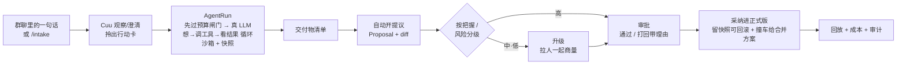

# WorkHub

> **一个项目群聊,配一位 AI 项目经理 Cuu:她观察讨论、把活儿拎出来、派给合适的人;活干完了,人来审批。**

简体中文 ｜ [English](./README.en.md)

[](LICENSE)
[](https://github.com/mycyg/WorkHub/actions/workflows/verify.yml)

---

## WorkHub 是什么

打开一个项目,你看到的是一个**群聊**:人在里面讨论,Cuu 也在——不是一个被 @ 才答话的机器人,而是安静地跟着讨论,自己判断"这段话里有没有一件该干的活"。聊天停下来一小段时间,她会把讨论提炼成一张**行动卡**,标好该谁去干;认领之后,她要么直接把活干出来,要么在卡不住的地方把人拉进来一起商量。干完的东西不会直接改到正式版本里——它先变成一份**提议**,负责人看过、确认了,才会被采纳。

这套"AI 先动手、人来把关"的分工,不止在聊天里,而是这个产品从内核到界面的统一设计:你看到的每一份文档、每一条工作记录、每一次改动,背后都是同一条纪律——**AI 的任何改动都不会悄悄写进生产数据**,必须讲得清理由、留得下快照(可一键回滚),并且只走「提议 → 审批 → 合并」这一条路。

| 你看到的 | 内部其实是 |
|---|---|
| 工作副本 | 分支(branch) |
| 提议 | Pull Request |
| 确认 / 打回 | 评审 approve / request changes |
| 采纳进正式版 | 合并到 main |
| 撞车了 | merge conflict |

亚里士多德在《政治学》里设想过:如果织布机能自己织布、拨片能自己弹琴,工头就不再需要帮手,主人也不再需要奴隶——他写下这句话的时候知道那只是空想,两千三百年后,WorkHub 想认真试一次让它落地:**把重复的执行交给 AI,把人还原成负责判断、拍板的人。**

## 功能亮点

以下每一项都是可以点开跑起来的真实功能,不是路线图:

- **完整的项目群聊**:编辑 / 删除(留痕墓碑)/ 引用回复 / emoji 表态 / 置顶 / 已读聚合 / 在线状态,外加 Cuu 「正在整理讨论」的实时指示灯。
- **全局搜索**:一个搜索框跨会话消息、网盘文件、工单、会议纪要检索,结果分组直达——基于 PostgreSQL `pg_trgm`,不需要额外部署搜索引擎。
- **记忆可见可治理**:Cuu 对你的了解(「关于我」)与团队技能沉淀,都能在设置页里看到出处、编辑、删除——不是黑箱。
- **AI 反馈闭环**:对 Cuu 的每条回复/提议/产出打「有用 / 没用」,差评会真实进入夜间技能蒸馏的反例池。
- **风险预警巡检**:项目经理视角的例行巡检——工单停滞、临期未动工、成本异常放量,汇总成一条日报推进群聊与通知,不逐条骚扰。
- **GitHub 集成**:项目绑定仓库后,commit / PR / issue 动态成为 Cuu 感知项目进度的客观事实来源,而不只是靠人自己汇报。

## 快速自托管:三步走

**前置条件**:一台可访问的机器(Linux/macOS)、Docker 24+(含 `docker compose` 插件)、克隆下来的这份代码。

**第一步 · 配置**

```bash
cp .env.pilot.example .env.pilot
# 必改两项:
#   COOKIE_SECRET=$(openssl rand -hex 32)
#   ADMIN_CLAIM_SECRET=<给管理员的口令>
$EDITOR .env.pilot
```

**第二步 · 起栈(自动构建 + 自动迁移数据库)**

```bash
docker compose --env-file .env.pilot -f docker-compose.pilot.yml up -d --build
# 看到 workhub 容器 healthy 即就绪:
docker compose --env-file .env.pilot -f docker-compose.pilot.yml ps
```

**第三步 · 登录**

浏览器打开 `http://<这台机器的IP>:8787/`,进入注册屏:填昵称即可加入;第一个用户勾选"我是管理员"并填入上一步设置的 `ADMIN_CLAIM_SECRET` 来认领管理员身份。

**没有大模型 key 也能跑**:`LLM_API_KEY` 留空时,群聊、工单、审批、网盘、看板这些照常可用,Cuu 不会主动观察讨论或抢答——顶部会出现一条"AI 服务未配置"的横幅提醒。这条横幅是提示性的,不拦你发送;如果这时你仍然直接找 Cuu 说话,会收到一条明确的失败提示("这一轮 Cuu 没接上,请再试一次"),而不是卡死或没反应。填上 key 后重启容器即可点亮 AI 能力。

完整的部署细节(备份恢复、单实例假设、故障排查、安全口径)见 [`DEPLOY.md`](DEPLOY.md)。本地开发(不经 Docker 打包镜像)见下方「本地开发」。

## 下载桌面客户端

服务器起好之后,再给每个人装一个桌面客户端——常驻的聚焦盒、桌宠 Cuu、系统通知、托盘,以及完整的项目工作台,都在客户端里。Web 端(浏览器直接开 `http://<服务器IP>:8787/`)功能不缺,只是没有这些常驻的原生能力。

到 [Releases](https://github.com/mycyg/WorkHub/releases) 下载对应系统的安装包:

| 系统 | 文件 |
|---|---|
| macOS(Apple 芯片,M1 及以后) | `WorkHub_<版本>_darwin_aarch64.dmg` |
| macOS(Intel) | `WorkHub_<版本>_darwin_x64.dmg` |
| Windows 10/11 x64 | `WorkHub_<版本>_windows_x64-setup.exe`(或 `.msi`) |
| Linux x64 | `WorkHub_<版本>_linux_amd64.deb` 或 `.AppImage` |

**首次打开**:安装包目前未经 Apple 公证 / Windows 代码签名,所以系统会先拦一道——

- macOS:在"访达"里找到 WorkHub.app,**按住 Control 点按 → 打开**,弹窗里再点一次"打开";或终端执行 `xattr -dr com.apple.quarantine /Applications/WorkHub.app`。
- Windows:SmartScreen 提示"已保护你的电脑"时,点"更多信息" → "仍要运行"。
- Linux:`sudo dpkg -i WorkHub_<版本>_linux_amd64.deb`;AppImage 先 `chmod +x` 再运行。

**告诉客户端服务器在哪**:客户端默认连本机 `http://127.0.0.1:8787`。服务器在别的机器上时,在客户端弹出的连接失败卡片里点"打开设置",填服务器地址后"保存并重试"。远端地址要能连通,服务器的 `CORS_ALLOW_ORIGINS` 也必须放行桌面端的来源——详见 [`DEPLOY.md`](DEPLOY.md) 的「把服务器地址给客户端」。

自己从源码构建客户端:本机平台一把梭用 `pnpm build:desktop`(等价于先建桌面前端再 `cargo tauri build`,产物未签名/ad-hoc);macOS 专用、额外带一层签名结构验证门禁的是 `pnpm build:desktop-macos`。三平台的完整交叉构建/签名/打包流程见 [`.github/workflows/desktop-release.yml`](.github/workflows/desktop-release.yml)。

## 核心闭环

一句需求进来,到一份可信的交付物落地,中间是这样一条线:



这条线的每一环都是真代码,不是示意图:[`agent-runner.ts`](apps/api/src/workers/agent-runner.ts) 认领并租约式地跑队列、驱动 agent 循环;[`loop.ts`](packages/agent/src/loop/loop.ts) 做"想→调工具→看结果",带死循环检测与预算控制;[`proposals.ts`](apps/api/src/services/proposals.ts) 管提议、评审、合并与撞车合并。

## 本地开发

```bash
corepack enable
pnpm install

cp .env.example .env          # 填入大模型 key、数据库连接等本地密钥
docker compose up -d postgres redis   # 起本地 PG + Redis(仅依赖,不含应用本身)
pnpm db:migrate                # 跑 Drizzle 迁移

pnpm dev                       # 拉起 API(8787)
pnpm --filter @workhub/web dev # 另开终端起 Web(5173)
```

`pnpm verify`(typecheck + test + lint,含迁移重放安全审计与文档一致性门)是 CI 跑的同一条命令。贡献流程、测试跑法、迁移纪律、文案约定见 [`CONTRIBUTING.md`](CONTRIBUTING.md)。

## 架构:一个 headless 核心 + 多个瘦客户端

```
apps/
  api/               无头 agent 守护进程 —— Hono + OpenAPI + SSE,全部业务逻辑与 AI 引擎所在,PostgreSQL 支撑。唯一真相源,所有客户端都只跟它对话。
  web/               React + Vite 瘦客户端 —— 浏览器可达的项目管理面:会话镜像、网盘、审批、看板、设置。
  desktop-webview/   Tauri webview 界面 —— 完整的项目工作台(群聊主区、Cuu、行动卡、军团任务面板、网盘、聚焦盒)。

client-tauri/
  src-tauri/         包裹 desktop-webview 的 Rust 外壳 —— 原生窗口、托盘、通知、深链、桌宠渲染。

packages/
  agent/             agent 循环本体:想→调工具→看结果,provider 路由(DeepSeek/Anthropic 兼容协议)、预算控制、死循环检测、沙箱工具。
  contracts/         API/Web/桌面共用的 zod 契约 —— 请求响应形状、Page VM 类型、OpenAPI 的唯一真相源。
  db/                Drizzle schema、迁移文件与仓库层 —— 唯一允许碰 SQL 的代码。
  config/            环境变量解析与校验过的运行时 Settings(packages/config/src/env.ts)。
  events/            SSE 事件信封与两端共用的事件总线。
  permissions/       RBAC、审批路由、委派。
  audit/             审计日志 + 文件快照/回滚 —— AI 写的每一处改动都可一键撤销。
  cost/              预算与成本治理,API 与两端 UI 共用。
  cuu/               Cuu 的共享人格/状态逻辑(闲时调度器、卡片渲染、i18n)。
  ui/                web 与桌面共用的「gold path」服务端渲染组件库。
  web-runtime/       两端共用的客户端运行时(SSE 订阅、动作派发、脏态跟踪)。
  api-client/        对着 contracts 生成的带类型 HTTP 客户端。
  tools/             agent 工具实现 —— 沙箱文件操作、run_command、技能加载 —— 以及迁移重放安全审计器。
  plugin-host/       第三方插件的子进程宿主 —— 兼容 DeepSeek Harness 的工具类插件,dsh 依赖全部关在这个包里。
```

## 插件

WorkHub 兼容 [DeepSeek Harness](https://github.com/deepseek-ai/deepseek-harness) 的**工具类**插件:一个插件给 Cuu 添几件工具,Cuu 在执行里调它们。

**先把兼容面说清楚,免得你装了一半才发现**:

| 这类插件 | 能不能装 |
|---|---|
| 工具类(`ctx.tools.register`) | 能。这是唯一被支持的一类。 |
| 界面/主题类(`package.json` 里有 `dsh.client`) | **不能**,而且以后也不会能。这类插件跑在浏览器里的第二个 Cordis 上下文 + React;WorkHub 的界面不是这套技术,装进来只会得到一个什么都不发生的空壳,所以安装前直接拒绝并说明原因。 |
| 带 `prepare` / `postinstall` 等安装期脚本的包 | **不装**。这些脚本在装包时就跑,在任何沙箱之外。 |
| 模型 provider / 定时任务 / 面板类 | 还不行,排在后面的阶段。 |

安装源只认**这台服务器上的一个目录**:npm 包名、git 地址、tarball 都会在安装时执行包自己的脚本,所以不开。

**怎么装**:桌面客户端 → 设置 → 插件 → 「从本机目录安装」,填目录的绝对路径。管理员才看得到这一区;网页端的设置页只显示一份只读清单。安装时服务端先读那个目录的 `package.json` 做体检(**不执行插件任何代码**),再登记,再让插件宿主真的试加载一次——装不上不会让你猜,原因会写在列表里。开发时也可以用环境变量 `WORKHUB_PLUGIN_PATHS`(逗号分隔的本地路径)直接挂上,那些路径和清单里的会合并去重。

**插件跑在哪**:一个独立的子进程,不是 API 进程。它没有数据库连接、没有 Redis、没有大模型密钥——环境变量按白名单组装。插件贡献的每件工具都当作有外部副作用对待,于是照样走 WorkHub 既有的还原点、人工保留动作拦截与审批;每次调用都落审计。但这是**隔离容器,不是沙箱**:子进程仍以启动 API 的那个系统用户身份运行,能读写这台机器上它能碰的文件、能出网。装谁的插件,自己判断。

**写一个自己的**:照 [`packages/plugin-host/qa/fixtures/dsh-plugin-echo/`](packages/plugin-host/qa/fixtures/dsh-plugin-echo/) 抄。一个目录、一个 `package.json`、一个入口文件就够了:

```jsonc
// package.json —— 声明入口与 peer;别加 prepare/postinstall,加了装不进来
{
  "name": "dsh-plugin-echo",
  "version": "0.1.0",
  "type": "module",
  "main": "lib/index.js",
  "dsh": { "bundle": { "patch": "./cordis.patch.yml" } },
  "peerDependencies": {
    "@deepseek-ai/cordis": "^4.0.1",
    "@deepseek-ai/dsh-tools": "^0.1.0-rc.6",
    "@deepseek-ai/schemastery": "^3.18.1"
  }
}
```

```js
// lib/index.js —— 命名导出 apply(ctx),在里面注册工具
import { defineTool } from "@deepseek-ai/dsh-tools";

export const name = "echo";
export const inject = ["tools"];

export function apply(ctx) {
  ctx.tools.register(defineTool({
    name: "echo",
    description: "把一句话原样回显。",
    parameters: {
      text: { type: "string", required: true, description: "要回显的内容。" }
    },
    output: {
      schema: { type: "object", additionalProperties: false, properties: { text: { type: "string" } } },
      render: (_args, value) => [{ type: "text", text: value.text }]
    },
    execute: async (args) => ({ text: String(args.text) })
  }));
}
```

`pnpm qa:plugin-smoke` 会拿这个夹具跑一遍完整链路:装载 → Cuu 在一次执行里调到它 → 结果进执行轨迹 → 调用落审计。

**一句实话**:dsh 的 `0.1.x` 还在破坏性地改。已发布的第三方插件常常是对着另一个版本发的,装上去会在加载期报错——安装页会把「它要哪个版本」和「我们捆的是哪个版本」两个数一起摆给你看,但我们对上游没有影响力。

## 文档

- 规格树索引:[`docs/workhub/`](docs/workhub/README.md)
- PRD(总纲):[`docs/prd/2026-06-04-workhub-prd.md`](docs/prd/2026-06-04-workhub-prd.md)
- 愿景与原则:[`docs/workhub/00-overview/vision-and-principles.md`](docs/workhub/00-overview/vision-and-principles.md);去黑话词表:[`docs/workhub/00-overview/glossary-dejargon.md`](docs/workhub/00-overview/glossary-dejargon.md)
- 部署指南:[`DEPLOY.md`](DEPLOY.md);贡献指南:[`CONTRIBUTING.md`](CONTRIBUTING.md);安全策略:[`SECURITY.md`](SECURITY.md)

## 许可证与商业授权

本项目以 **[PolyForm Noncommercial License 1.0.0](LICENSE)** 发布:**源码公开,仅限非商业用途**(不是 OSI 定义下的开源许可证)。

> Required Notice: Copyright 2026 mycyg (https://github.com/mycyg/WorkHub)

- **允许**:个人学习、研究、实验、爱好项目,以及非营利 / 教育 / 公益 / 政府机构使用。
- **不允许**:任何**商业化**或**真实企业生产场景**的使用。
- **商业 / 企业授权须经版权所有者书面许可。** 需要商用授权,请通过 GitHub 联系 [@mycyg](https://github.com/mycyg)。

---

> 把重复交给机器,把判断留给人。
