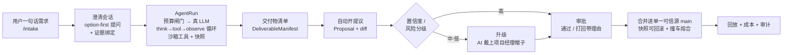

# WorkHub

> **业务版 GitHub × AI-native 工作中台。AI 是默认劳动力,人是审批者与异常处理者。**
>
> *Business-version GitHub × AI-native work hub — AI is the default labor force, humans are approvers and exception handlers.*

[](LICENSE) · 状态:**code-complete · CI 全绿 · pilot-ready**(等待真实团队跑通试运行周)

---

## 这是什么 · Vision

今天所有协作工具——飞书、Notion、Jira,乃至本项目的前身「需求管理大师」——都默认**人是干活的主力,AI 最多是个起草 / 问答助手**。

**WorkHub 把这个前提反过来:团队日常里绝大多数「事」由 AI 默认完成。** AI 不是"建议者"而是"第一执行人",直接产出文档、分析、方案、代码;人则退到两个高价值角色:

- 🟢 **审批者** —— 对 AI 的提议点头 / 打回;
- 🔧 **异常处理者** —— 接手 AI 升级上来的、做不了 / 做不好 / 不该做的事。

这套"角色反转"被一条安全红线兜住:**任何 AI 改动都不静默触碰生产可信源**——每一处改动都必须**可解释、可回滚(快照)、且只经「提议 → 审批 → 合并」汇入唯一可信源(main)**。北极星指标是**自主率**(无人逐步干预即完成并合并的 WorkItem 占比),且永远和护城河指标(合并后回滚率、打回率、升级精准度)一起看——**绝不用牺牲信任来换自主率**。

> **缘起**:前身产品早已有"交付 → 负责人通过/打回"的闭环,本质就是一次 GitHub PR review——团队在没命名的情况下,已经搭好了"业务版 GitHub"的脊柱,只是没让 AI 坐进驾驶座。WorkHub = 给这条脊柱命名 + 让 AI 默认开车 + 补上三道护城河(多人审批路由、业务对象合并语义、组织级治理与成本)。

## 为什么不一样 · Why it's different

| 对比 | WorkHub 的不同 |
|---|---|
| **vs GitHub** | 把 GitHub 的协作内核(分支隔离 / PR 提议 / 评审门 / 合并到单一可信源)搬到**业务对象**(需求 / 文档 / 方案 / 结构化记录)上,而非源代码;让 **AI 默认当"提交者"**,并对用户**100% 隐藏 git 黑话**(GitHub 暴露 branch/commit/merge/conflict,WorkHub 一个都不露)。 |
| **vs 通用 AI Agent** | 不是聊天助手,也不是单体自治 agent,而是**多人团队里 AI 当默认劳动力的角色反转**,被"不静默改生产态"的宪法约束;同一个 agent **一人两顶帽子**(工人 → 受阻时变项目经理),有明确升级触发条件 + doom-loop / 预算护栏(产出结构化交接而非静默截断)。 |
| **vs SaaS** | 刻意**不做**通用 IM / 实时协同文档(无字符级 OT/CRDT,不和飞书 Notion 拼编辑),也**不做**向量检索(坚持 grep + 强制引用);v1 是 **LAN-first + 云就绪**,以非商业许可证发布。 |

## 五个核心理念 · Core principles

1. **AI 一人两顶帽子** —— 默认"工人帽"直接产出交付物;受阻时切"项目经理帽"组织人推进(派活 / 拆解 / 排期 / 催办 / 复审)。**切换条件 = 升级条件**,由置信度/风险分级决定。三个升级触发:不合格(评审未过)/ 用户打回(打回必带理由,回灌让 AI 在同一工作副本里自我纠偏)/ 用户明确不让 AI 干(WorkItem/项目/用户三级开关)。升级是"一等公民"状态转移,不是失败。
2. **去黑话的协作模型** —— 内部就是业务版 GitHub,但两套词汇严格分层,用户永不见 git 术语:人人(含每个 AI 工人)都有自己的**工作副本**(=分支),改动以**提议**(=PR)提交 → 负责人**确认/打回**(=评审) → **采纳/汇入正式版**(=合并)。撞车说成"和别人的改动撞了——AI 给了方案,选一个";置信度只用三句大白话表达(我比较有把握 / 建议你扫一眼 / 我拿不准请你定),从不露数字。
3. **单一可信源 + 不静默改生产态** —— 无论 AI 还是人,一切改动统一经「提议 → 审批 → 合并」汇入唯一 main;任何对生产态的副作用都**可解释 + 可快照回滚 + 经审批**。中等置信度被**强制**路由给人抽查。
4. **智能派活 + 分层身份** —— 升级时 AI 项目经理基于身份层(技能自述 + 协作图谱:谁擅长什么、和谁合作过、命中率、当前负载)推荐"负责人 + N 协作者",并给出大白话的"为什么是 TA";冷启动降级为"解释型推荐"(AI 解释、人来定)。
5. **桌宠 + Web 双入口,同一 headless daemon** —— 入口层是会对话、能动手的桌面宠物(Cuu)+ Web 应用,两者都是同一个无头 agent 守护进程的**瘦客户端**;agent 几乎能用自然语言操作所有功能,让小白"说一句话就办成"。

## 核心闭环 · The core loop



真实代码路径:[`apps/api/src/workers/agent-runner.ts`](apps/api/src/workers/agent-runner.ts)(claim/lease 队列 + agent 循环)、[`packages/agent/src/loop/loop.ts`](packages/agent/src/loop/loop.ts)(think→tool→observe + doom-loop/预算控制信号)、[`apps/api/src/services/proposals.ts`](apps/api/src/services/proposals.ts)(提议/评审/合并 + 撞车熔合)。

## 功能 · Features

> 图例:✅ 已上线(有路由 + 服务实现) · 🟡 部分(核心已建,某半边尚未接生产数据 / 默认关闭) · 🗺️ 规划中

#### 工作受理 & AI 核心闭环
- ✅ 一句话建 WorkItem、澄清会话(option-first 提问 + 项目证据绑定)
- ✅ 启动 / 中止 AgentRun(归属校验防越权);真 think→tool→observe agent 循环
- ✅ 沙箱化文件 + 技能工具;实时 trace、可回放、结构化交接(预算耗尽时输出"已做/未做/下一步")
- ✅ 崩溃恢复(租约过期自动重排);置信度评分 + 低置信自动升级

#### 提议 / 评审 / 审批 / 合并
- ✅ 从交付物清单开提议(结构化 diff + 检查项)
- ✅ 评审:通过 / 打回(理由回灌进下一次 AI 运行作为纠偏上下文)
- ✅ 合并进正式版 + 快照回滚点
- ✅ **审批中心三栏 diff 工作台**:左(列表 + SLA)/ 中(before→after 对比 + 合规检查 + AI 解释 + 冲突)/ 右(决策 + 记住规则 + 流程时间线 + 评论流);撞车时给三方视图 + AI 熔合候选 + 字段/条目/文本块级覆盖

#### 协作 & 内容
- ✅ 项目 Drive(上传 / 版本 / 软删恢复)、评论转草稿、草稿转提议
- ✅ 已采纳交付物 下载 / 预览 / 恢复
- ✅ 会议洞察转草稿 / 忽略 / 转提议
- ✅ 知识/证据检索(grep + 强制引用,结果渲染为证据气泡)、证据绑定到任务
- ✅ 通知收件箱(需决策 / 知会 / 已完成 分桶 + 来源 grounding)、日历视图、**实时 SSE 推送**(按资源授权的多路流)

#### AI-native & 治理
- ✅ **AI 战绩**(今日跑了几件 / 自主率 / 采纳数 / 估算省时,所有登录用户可见,不含成本明细)
- ✅ 成本治理:按 scope 预算策略(管理员)、运行前/中预算决策与熔断、成本看板(管理员看全局账本,用户只看自己)
- ✅ **用户级 memory**:打回理由自动沉淀为纠偏记忆,注入未来 AI 运行的 prompt,可自助删
- ✅ 权限矩阵(fail-closed,无匹配策略=ask)、审批 ask、人类保留动作守卫(撞到即升级)、按 WorkItem 的快照+审计链 + 本地客户端文件级回退、项目健康看板
- ✅ 轻量昵称身份 + 本地客户端设备令牌、管理员 claim、locale 偏好、项目一键 bootstrap + workdir 注水
- 🟡 **团队级 skill 自迭代**:FS∪DB 合并技能视图已注入运行;闲时蒸馏 worker 默认关闭、生产从未真跑过(且 idle 闸门尚未接线)
- 🟡 **决策收件箱首页**:"你自己进行中的 AI 任务"+"今日 AI 战绩"为实时真数据;决策队列卡片骨架已就位,但**生产环境尚未把审批/待办接进队列数据源**

#### 桌面宠物(Cuu / Live2D)
- ✅ Tauri 原生桌面端(主窗 + 透明置顶桌宠窗 + 托盘 + `workhub://` 深链)、桌宠控制(模式/缩放/透明度/点击穿透/悬停隐藏/拖拽)
- ✅ Live2D 猫(hijiki 黑 / tororo 白)动作跟随 AI 生命周期状态;Rust SSE worker 把后端事件桥接为 Cuu 卡片 + 系统通知
- 🟡 视觉收尾:概念图是橙猫、当前资产是黑白猫(外观差异已记录);真机长场景动作录制待补(见下方 #27)

## 实现 · Architecture

**TS-first monorepo**(pnpm workspaces),无头 agent daemon + OpenAPI/SSE + PostgreSQL + Tauri 桌面端 / Web 瘦客户端(LAN-first,云就绪)。

| 层 | 技术 | 说明 |
|---|---|---|
| 运行时 | Node ≥22 · pnpm 11 · TypeScript 5.7 ESM · tsx | 测试跑在 tsx 上,真正的类型门是 `pnpm -r typecheck`(tsc) |
| API | Hono on `@hono/node-server` | 无头 agent daemon,默认端口 `8787`,`GET /api/health` |
| 数据库 | PostgreSQL + Drizzle ORM | ~50 张表,迁移 0000–0019,`db:generate/check/migrate` |
| 队列/广播 | Redis(可降级 memory / pg_listen) | 生产禁止 memory broker + 多 worker |
| Web 端 | 原生 TS SSR 外壳 + React 18 mutation islands | 瘦路由由 Page VM + app 级 SSE 驱动,仅提议编辑器等用 React 岛;规划端口 `5173` |
| 桌面端 | Tauri(Rust)桌宠 + WebView + Live2D Cubism | `client-tauri/src-tauri`(pet_window / sse_worker / tray / deep_link / notify);规划端口 `1420` |
| LLM | DeepSeek(走 Anthropic 兼容 `/v1/messages`) | ProviderRegistry 按 TaskClass 路由,MeasuredLlmClient 计量用量/成本 |
| 工具/沙箱 | 命令白名单沙箱 + 文件技能 | 禁绝对/相对命令路径、禁装依赖与远程执行、realpath 防符号链接逃逸;文件 IO 限定在运行 workdir |

**应用**:[`apps/api`](apps/api)(Hono daemon + agent-runner worker)· [`apps/web`](apps/web)(浏览器瘦客户端 + 确定性 smoke QA)· [`apps/desktop-webview`](apps/desktop-webview)(桌宠 WebView,配 `client-tauri` Rust crate)

**14 个包**(节选):`@workhub/contracts`(Zod 契约,几乎人人依赖)· `@workhub/agent`(AI 引擎:provider/循环/清单/评估)· `@workhub/tools`(工具+沙箱+技能)· `@workhub/cost`(预算决策+账本)· `@workhub/permissions`(fail-closed 权限矩阵)· `@workhub/db`(Drizzle schema/迁移/仓库)· `@workhub/audit`(快照+审计)· `@workhub/cuu`(桌宠大脑)· `@workhub/ui`(无头 UI + zh/en i18n)· `@workhub/web-runtime` · `@workhub/api-client` · `@workhub/config` · `@workhub/events`

**工程亮点**:app 级 SSE 带 Last-Event-ID 续传 · provider 注册表 + 用量计量 · 沙箱命令白名单 + 技能 · 权限矩阵 fail-closed · i18n gold-path · 预算护栏(实测真 DeepSeek 花费 ~¥0.142) · 确定性 web smoke(无溢出门 / 真路径导航 / locale 对齐,CI 化) · 运行持久化(租约+心跳+过期重排) · 合并安全(先写存储再开 DB 事务、撞车给熔合候选、防 stale base、幂等)。

## 现状 · Status

**代码层面 pilot-ready,已过全部自动化门。** 核心"AI 干活、人审批"闭环已用**真 LLM 端到端验证**(6 次真 DeepSeek AgentRun:T1–T4 人评质量 4/4、T5 信息不足正确升级未编造、B1 命中预算护栏,真实成本 **¥0.142346 / 30103 tokens**);S1 序列 R5.9–R5.12(注册流 / 真 LLM 验证 / 单镜像+compose 部署包+CI pilot-stack-smoke 真部署门 / 权限矩阵审计)全部落地;R6「复利劳动力」**八阶段全部上线、CI 全绿**;全项目多 agent 深度 review 出的 **87 个真问题,84 个已修(3 架构项缓办),CI 全绿**;66/70 步浏览器实路由 smoke ~64s 进 CI。

**唯一缺口 = 真实试运行周(G1)**:北极星是"真实团队用核心闭环真干一周活",在真人真正跑通 `/intake → WorkItem → 提议/审批/合并/回放` 之前,中心论点尚未被真实使用验证——只被 QA / 第二用户 / dry & real-key 跑证明了管线可用。系统已 ready-to-invite-and-observe(队列已清零:0 opened proposal / 0 active run / 0 pending approval)。

> 完整施工史、规格树、路线图见 **[`docs/workhub/`](docs/workhub/README.md)**(157 篇:架构 / AI 引擎 / 协作 / 业务模块 / 客户端 / 路线图 / 成本治理 / 视觉 QA)。

## 未来待开发 · Roadmap

| 方向 | 为什么 | 状态 |
|---|---|---|
| **真实试运行周**(S1 Day3 → Pilot Week) | 北极星的最后一公里:真人真活跑一周,验证"AI 默认劳动力"论点 | 🗺️ 规划中 |
| **决策收件箱接生产数据源** | 首页决策队列骨架已建但生产未接审批/待办;接上才是完整收件箱(见 [`full-project-review`](docs/workhub/06-roadmap/full-project-review-2026-06-14.md) H12) | 🟡 待接线 |
| **OQ-4 业务对象合并语义 + AI 冲突调解**(护城河) | 现仅最低风险层(账本 + sha 乐观熔断 + diff3 + LLM 熔合候选);完整三方合并 UX 留给真实冲突数据驱动 | 📊 数据驱动 |
| **OQ-2/3 置信度 + 风险阈值校准** | 当前是 6 次真跑的 v0 默认权重,样本太小难定升级精准度;须真实 Pilot 数据重调并新出 policy_version | 📊 数据驱动 |
| **团队 skill 闲时自迭代上生产** | 子系统全建好但默认关闭、idle 闸门未接线;复利劳动力要它真跑起来才兑现 | 🟡 默认关闭 |
| **多租户 / 多 workspace** | 现单部署单 workspace;`workspace_id` 已埋线、零 schema 改动可扩,但云部署/租户隔离/计费属 P5 范围外 | ⏸️ 暂缓(P5) |
| **桌宠真机全场景动作长录(#27)** | 黑白猫资产 + 5 情绪/3 气泡已上;但脚本注入截帧不替代真机长录,且概念图橙猫待对齐 | ⏸️ 非 pilot 关键路径 |
| **P-COLLAB 剩余**:rebase「对一下底稿再采纳」UX + base-snapshot 基线(M2) | 防丢更新安全核心已 CI 绿;但 stale base 现在只是报错中止,优雅恢复 UX 尚缺 | 🟡 半成品 |
| **W2 审批增强**:转交目标选择器 / 预期收益来源 / 发起人-部门模型 | 转交后端就绪但缺成员列表端点;预期收益与部门数据模型暂无,刻意留白不编造 | 🗺️/⏸️ |

## 本地开发 · Local dev

```bash
corepack enable
pnpm install
pnpm verify   # typecheck + test + lint(含 r2-release-gate 文档门)
pnpm dev
```

- API daemon 默认端口 `8787`(`GET /api/health`);Web `5173`;Tauri webview `1420`。
- 默认配置见 [`packages/config`](packages/config);复制 [`.env.example`](.env.example) 到 `.env` 填本地密钥。
- PostgreSQL/Redis:`docker compose up -d postgres redis`;Drizzle 迁移 `pnpm db:generate` / `pnpm db:check` / `pnpm db:migrate`。
- Pilot 全栈部署:`docker compose --env-file .env.pilot -f docker-compose.pilot.yml up -d --build`。
- 生产沙箱与 Agent 执行要求 Linux;数据库验收优先本地构建 / 本地 PG+Redis 复跑。

## 文档 · Docs

- 📐 **规格树索引**:[`docs/workhub/`](docs/workhub/README.md)
- 📋 **PRD(总纲)**:[`docs/prd/2026-06-04-workhub-prd.md`](docs/prd/2026-06-04-workhub-prd.md)
- 🧭 **愿景与原则**:[`docs/workhub/00-overview/vision-and-principles.md`](docs/workhub/00-overview/vision-and-principles.md) · **去黑话词表**:[`docs/workhub/00-overview/glossary-dejargon.md`](docs/workhub/00-overview/glossary-dejargon.md)
- 💡 **缘起(头脑风暴)**:[`docs/brainstorms/2026-06-04-workhub-ai-native-platform-brainstorm.md`](docs/brainstorms/2026-06-04-workhub-ai-native-platform-brainstorm.md)

## 许可证与商业授权 · License ⚖️

本项目以 **[PolyForm Noncommercial License 1.0.0](LICENSE)** 发布 —— **源码公开,仅限非商业用途**(非 OSI 开源)。

> Required Notice: Copyright 2026 mycyg (https://github.com/mycyg/WorkHub)

- ✅ **允许**:个人学习、研究、实验、爱好项目,以及非营利 / 教育 / 公益 / 政府机构使用。
- ⛔ **禁止**:任何**商业化**或**真实企业生产场景**的使用。
- 📩 **商业 / 企业授权须经版权所有者书面许可。** 需要商用授权请通过 GitHub 联系 [@mycyg](https://github.com/mycyg)。
