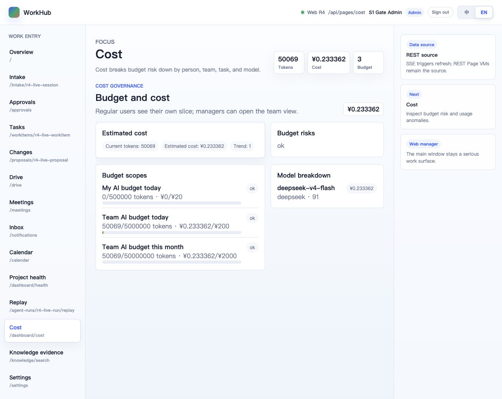
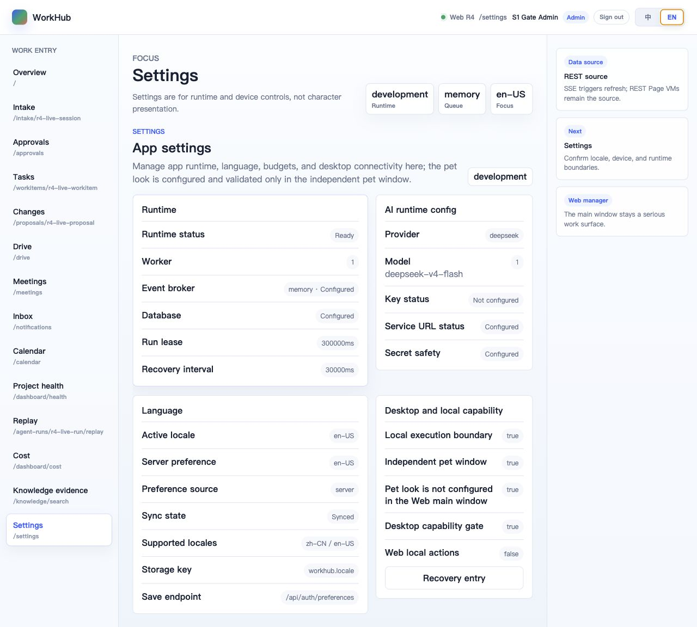
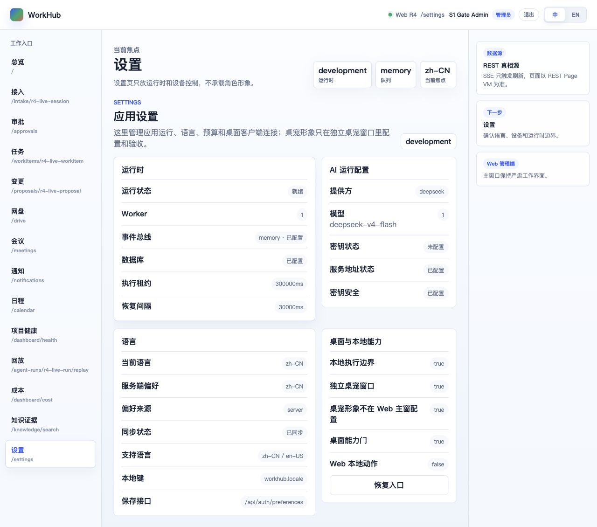

# S1 Pilot Launch Gate Report（2026-06-13）

## 1. 结论

**NO-GO：系统代码与本机等价运行门通过，但真实 Pilot Launch Gate 仍被部署环境阻断。**

阻断点不是业务代码：当前 macOS 本机没有 Docker / Colima / OrbStack / Podman；远端 Linux 测试机 `192.168.5.53` 的 SSH 在 banner / KEX 前即关闭连接，`22`、`2222`、`22022`、`2022` 均无法进入密码阶段。因此本轮无法完成 G1 Docker compose 全栈、G4 真实备份/恢复、G6 compose 现场 operator loop。

已完成的本机等价门证明：Web/API 单源可构建启动、R5.10 dry/real 关键链路可复现、管理员注册与关键页面可访问、中英双语关键截图无 Cuu 主窗泄漏，且发现并修复 1 个 Cost 页面英文标签漏翻译 bug。

## 2. Gate 结果

| Gate | 结果 | 证据 |
|---|---|---|
| G1 deploy stack | **BLOCKED** | 本机无 Docker 运行时；远端 SSH 在 KEX 前断开，无法执行 `docker compose --env-file .env.pilot -f docker-compose.pilot.yml up -d --build`。 |
| G2 dry smoke | **PASS（本机等价）** | `pnpm qa:r5-10-dry` 通过；run `6d88a4f8-c603-4190-b726-363fcf250a9b`，work item `e3878fe9-c078-43eb-904f-91308fd108b5`，proposal `611e1993-4611-4bd0-b375-8ca5983a14f3`，accepted change `4bf8fd4e-8ceb-45a7-ab3c-03eaebe6a857`，accepted download SHA `c5f6a61...`。 |
| G3 real smoke | **PASS（本机等价，task limit 1）** | `R5_10_REAL_TASK_LIMIT=1 pnpm qa:r5-10-real` 通过；run `afbac902-389a-4022-ac89-8d431742fb87`，状态 succeeded，operator quality `4`，真实成本 `0.021664 CNY`。 |
| G4 backup | **BLOCKED（脚本静态通过）** | `bash -n scripts/ops/backup-pg.sh` 通过；真实备份依赖 compose 内 postgres，因 G1 阻断未执行。脚本默认备份目录已改为仓库外 `../workhub-backups`。 |
| G5 secret hygiene | **PASS** | `.env.pilot` 未创建/未入库；截图与报告不含 provider key、cookie、DB password。提交前 refined secret scan 无输出；broad DB URL 扫描仅命中模板默认值和测试字符串。 |
| G6 operator loop | **PARTIAL** | 本机单源 API+Web 跑通 health、root HTML、JS asset、管理员注册、`/approvals`、`/dashboard/cost`、`/settings` 与中英切换；compose 现场完整 loop 因 G1 阻断未执行。 |

## 3. 本机等价验证记录

### 3.1 基线验证

- `pnpm verify`：通过。
- `pnpm --filter @workhub/web build`：通过；Vite 仅提示 chunk size 大于 500KB。
- `pnpm db:migrate`：通过；本机 sandbox 对 `tsx` IPC 有 `EPERM`，已在批准的外部执行环境复跑。
- 单源 API+Web：`WEB_DIST_DIR=apps/web/dist PORT=18787 API_HOST=127.0.0.1 ... pnpm --filter @workhub/api start` 成功，日志包含 `web_static_attached` 与 `server_started host=127.0.0.1 port=18787`。
- `/api/health`：返回 `ok=true`。
- `/`：返回 Web HTML，`#root` 与 title 存在。
- JS asset：HTTP 200，`content-type: text/javascript`。

### 3.2 Browser / UI 审查

截图证据：

- 
- 
- 
- 
- 

审查结论：

- Home 默认是安静的 attention empty state，不是重型看板；主窗无 Cuu 本体。
- Settings 中英双语均无明显文本溢出；Web 明确只展示桌面/Cuu 边界，不承载模型预览或桌宠操作。
- Cost 英文页原先泄漏中文默认标签“团队 AI 预算”；本轮修复为 `Team AI budget this month` 并补测试。
- 截图未暴露 provider key、cookie、base URL 或 DB password。

## 4. 修复项

### 4.1 Cost Page VM 英文标签漏翻译

问题：英文 locale 下，团队月预算的默认 `scopeLabel` 仍显示中文“团队 AI 预算”。

修复：

- `apps/api/src/pages/i18n.ts` 新增 `cost.scope.teamMonth`。
- `apps/api/src/pages/cost.ts` 按 `scope.kind === "team" && period === "month"` 翻译默认月预算标签。
- `apps/api/src/pages-i18n.test.ts` 新增回归测试，确保默认团队月标签翻译为 `Team AI budget this month`，自定义团队名仍保持原文。

验证：

- `pnpm --filter @workhub/api test`：140 tests passed。
- `pnpm --filter @workhub/api typecheck`：通过。
- Browser 复查 Cost 页面：英文 DOM 不再包含“团队 AI 预算”。

### 4.2 Pilot 操作口径收紧

问题：部署文档未显式使用 `--env-file .env.pilot`，compose 变量插值可能不读取 `.env.pilot` 中的 `POSTGRES_PASSWORD` / `WORKHUB_PORT`；备份默认写 `./backups`，容易把备份产物落进仓库工作区。

修复：

- `DEPLOY.md` 与 S1 runbook 统一使用 `docker compose --env-file .env.pilot -f docker-compose.pilot.yml ...`。
- `scripts/ops/backup-pg.sh` 默认写 `../workhub-backups`，可用 `WORKHUB_BACKUP_DIR` 覆盖。
- `.gitignore` 补充 `backups/` 防误提交。

## 5. PRD / 概念图对齐

| 维度 | 本轮判断 |
|---|---|
| PRD 核心闭环 | 本机等价 dry/real smoke 证明“提需求 → AI 干 → 升级/预算 → 审批 → 合并 → 回放/下载”仍可复现。 |
| AI 默认劳动力 | T1 task-limit real smoke 证明 provider、tool schema、ledger、置信度链路可用；完整 6-run 结论沿用 R5.10-real。 |
| 人是审批者 | Approvals 页面可访问；本轮未在 compose 现场跑完整审批 loop，仍是 NO-GO 原因之一。 |
| 中英双语 | Home / Approvals / Cost / Settings 关键截图覆盖英文，Settings 覆盖中文；修复 Cost 月预算英文漏翻译。 |
| Cuu 边界 | Web 主窗截图无 Cuu 本体；Settings 只说明 pet 配置在独立桌面窗口。 |
| 操作安全 | `.env.pilot` 不入库，备份默认迁出仓库，restore dry check 需独立 compose project。 |

## 6. Pilot Week 前硬门

Pilot Week 不能仅凭本机等价门启动，必须先补齐：

1. 本机安装并启动 Docker Desktop / Colima / OrbStack，或修复远端 Linux SSH + Docker 访问。
2. 在真实部署环境创建 `.env.pilot`，使用 `docker compose --env-file .env.pilot -f docker-compose.pilot.yml up -d --build` 起栈。
3. 在容器/部署现场复跑 `pnpm qa:r5-10-dry` 与 `R5_10_REAL_TASK_LIMIT=1 pnpm qa:r5-10-real`。
4. 执行 `bash scripts/ops/backup-pg.sh /private/tmp/workhub-backups` 或生产等价目录，并用 `-p workhub_restore` 独立 project 做 restore dry check。
5. 重新跑 secret/log/screenshot 扫描，确认 `.env.pilot`、provider key、cookie、DB password 未入库、未入报告、未进截图。
6. 主持人按 runbook 在 compose 栈完成管理员注册、建项目、真实任务、审批、合并、回放、成本查看。

## 7. 提交前复扫

- `pnpm --filter @workhub/api test`：140 tests passed。
- `pnpm --filter @workhub/api typecheck`：通过。
- `bash -n scripts/ops/backup-pg.sh`：通过。
- `git diff --check`：通过。
- refined secret scan：无输出。
- `git diff --name-only -- reference references`：无输出。
- `find docs/workhub -name '*.md' | wc -l`：137。

## 8. Go / No-Go

**当前：NO-GO。**

下一步不是开新功能，而是修复部署运行时：先拿到可执行 Docker compose 的本机或远端环境，再把 G1/G4/G6 跑成真证据。等 Launch Gate 全绿后，才能把 S1 Pilot Week runbook 从“turnkey 脚本”推进到“正在执行”。
