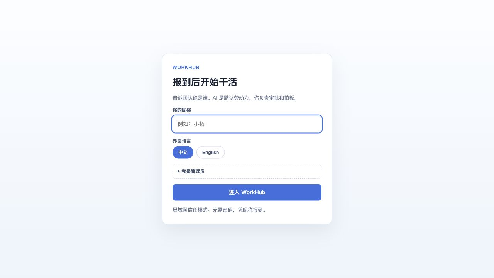
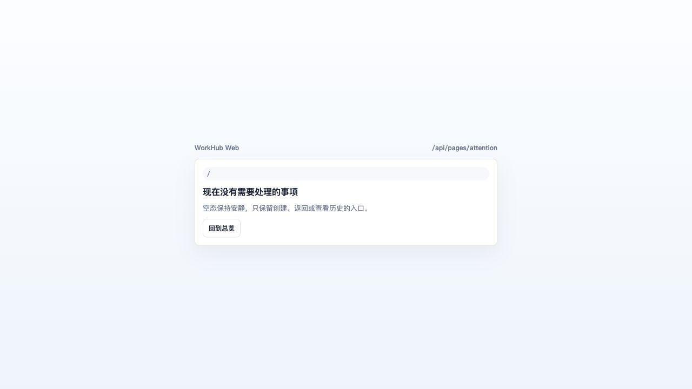
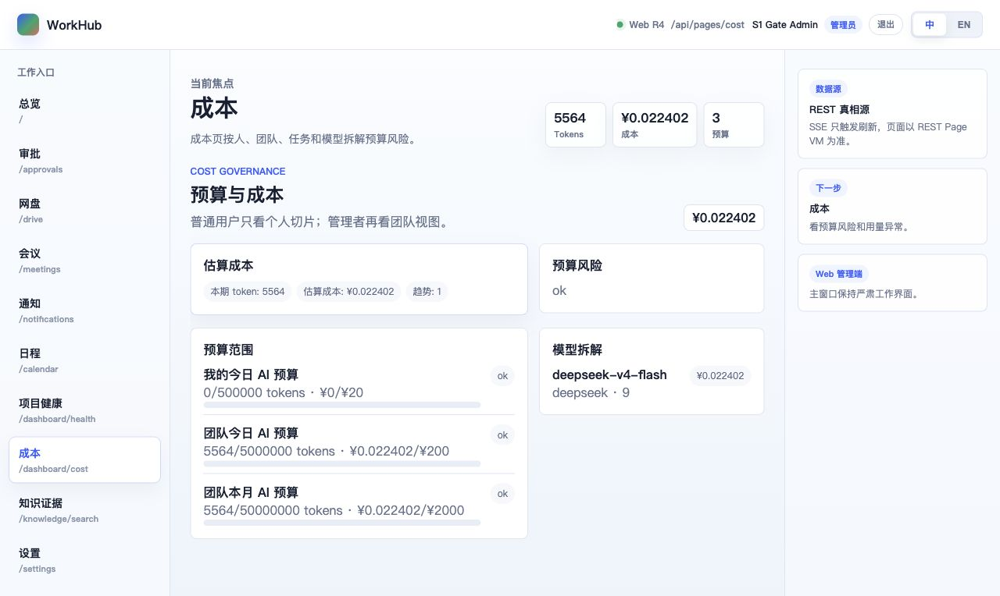
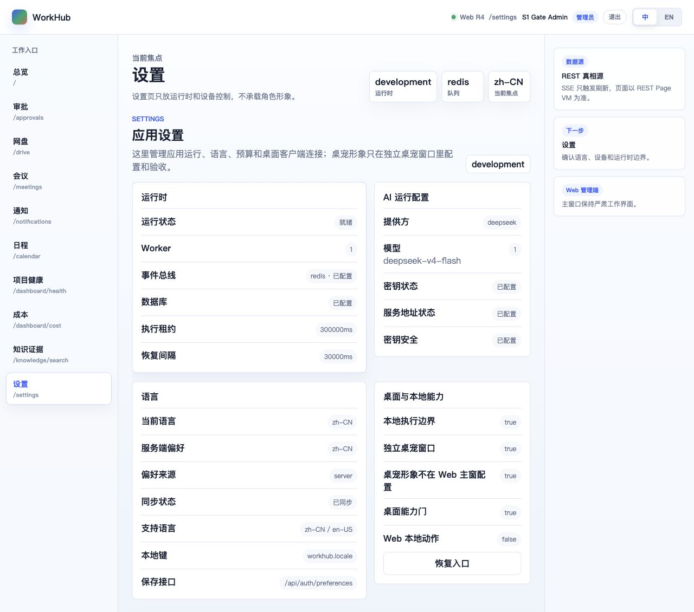
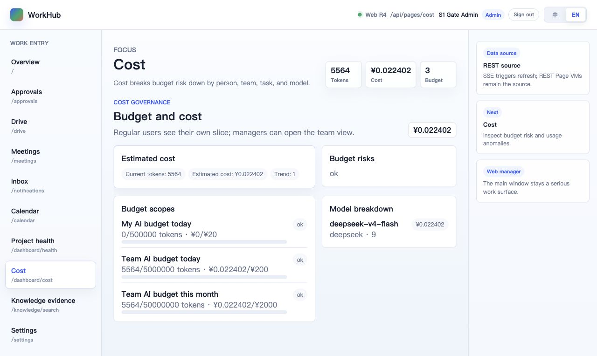
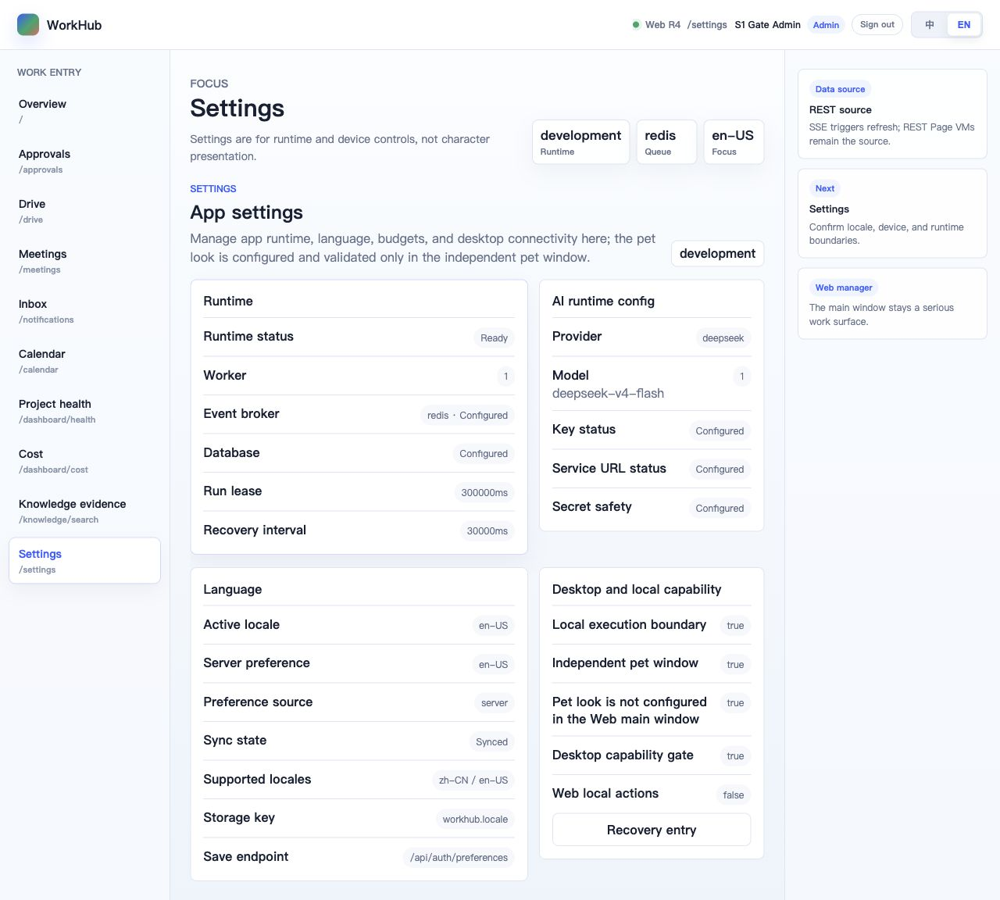
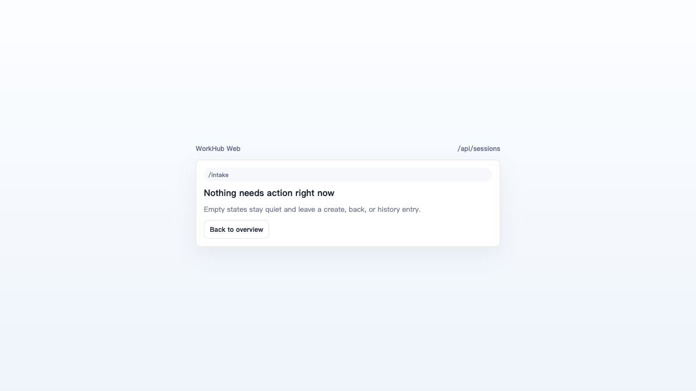

# S1 Pilot Launch Gate Report（2026-06-13）

## 1. 结论

**PASS：首轮 NO-GO 已解除；本机 Docker Desktop + pilot compose 现场门通过。**

首轮阻断是环境问题：本机没有 Docker，远端 Linux SSH 在 KEX 前断开。随后已在本机安装 Docker Desktop，使用真实 `.env.pilot` 起 `docker-compose.pilot.yml` 全栈，WorkHub / PostgreSQL / Redis 均 healthy，并在部署容器内复跑 dry 与 task-limit real smoke。

本轮还撞出并修复 1 个 fresh pilot UI 风险：生产 shell 仍把旧 `r4-live-*` smoke seed detail 链接暴露在稳定页面导航里，fresh compose 库点击会进入 500。已改为 detail-only 页面只在当前真实记录上下文中显示，稳定页导航只保留真实可达入口，并补 `S1 pilot shell omits R4 smoke seed detail links on stable routes` 测试。

## 2. Gate 结果

| Gate | 结果 | 证据 |
|---|---|---|
| G1 deploy stack | **PASS** | `docker compose --env-file .env.pilot -f docker-compose.pilot.yml up -d --build` 成功；`workhub/postgres/redis` 均 healthy；`GET /api/health` 返回 `ok=true`。 |
| G2 dry smoke | **PASS（部署容器）** | `docker compose ... exec -T workhub pnpm qa:r5-10-dry` 通过；修复后 run `17132ee8-c13a-4fde-a030-426e357f7327`，work item `53b84e53-6cf4-49d3-af10-8c1e9a7a5c6f`，proposal `79907118-0e02-4b03-a8a7-65942f3afc8c`，accepted change `6334096f-ae96-48d4-a904-756dd86fa395`。 |
| G3 real smoke | **PASS（部署容器，task limit 1）** | `R5_10_REAL_TASK_LIMIT=1 pnpm qa:r5-10-real` 通过；修复后 run `c49c6067-0879-449c-9260-8cd0687353bb`，operator quality `4`，成本 `0.019976 CNY`，无 fake transport。 |
| G4 backup / restore | **PASS** | `bash scripts/ops/backup-pg.sh /private/tmp/workhub-backups 14` 写出 `/private/tmp/workhub-backups/workhub-20260613-025228.sql.gz`（36K）；独立 `-p workhub_restore` project 恢复成功，恢复库关键表计数：agent_runs `4` / proposals `4` / accepted_changes `4` / usage_records `19` / cost_ledger_entries `57`。 |
| G5 secret hygiene | **PASS** | `.env.pilot` 被 `.gitignore` 排除；报告、截图、日志摘要不写入 provider key、cookie、DB password；收尾会再跑 refined secret scan。 |
| G6 operator browser loop | **PASS（受控 Day 0 前置）** | Browser 完成管理员认领、Cost/Settings 中英切换、compose 截图、旧 seed link 复验；`/intake` 为空态而非 500。真实“提需求→AI 干→审批/合并→成本”数据闭环由部署容器 dry/real smoke 覆盖。Day 0 继续把真实用户发起任务入口做成硬门。 |

## 3. Compose / Docker 记录

- Docker Desktop 安装后，`docker --version` 为 Docker 29.5.3，`docker compose version` 为 v5.1.4。
- 首次 build 拉取 `postgres:16` / `redis:7` / `node:22-slim`，镜像内安装 Python 办公文档库与 Noto CJK 字体。
- 修复 shell seed link 后重建镜像，Web bundle 更新为 `dist/assets/index-DKjF14g4.js`。
- 当前主 pilot 栈保留运行，便于 Day 0 继续使用：`http://127.0.0.1:8787/`。

## 4. Browser / UI 审查

截图证据：

- 
- 
- 
- 
- 
- 
- 

审查结论：

- 中英双语切换在真实 compose 页面可用，`html lang` 随偏好切换；Cost 英文页显示 `Team AI budget this month`，未再泄漏中文团队月预算标签。
- Cost 页显示真实 ledger 汇总：tokens、CNY 成本、预算范围、model breakdown 均来自 REST Page VM。
- Settings 页显示 runtime / Redis broker / DB / DeepSeek model / key configured / locale preference / desktop boundary，且不暴露密钥原文。
- Web 主窗继续无 Cuu 本体；Settings 只说明 pet 配置与验收在独立桌宠窗口。
- fresh pilot 稳定页导航已无 `r4-live-*` smoke seed detail 链接；旧链接直达风险已由代码修复和测试锁住。

## 5. 修复项

### 5.1 Fresh Pilot Shell 旧 Seed 链接

问题：稳定页面（Cost / Settings 等）的左侧导航仍暴露 `/intake/r4-live-session`、`/workitems/r4-live-workitem`、`/proposals/r4-live-proposal`、`/agent-runs/r4-live-run/replay`。这些只在 browser smoke seed 里存在，fresh compose 库点击会触发 500 / 404。

修复：

- `apps/web/src/routes.ts`：detail-only shell pages（intake/workitem/proposal/replay）只在当前 route 就是对应真实记录时显示；稳定页导航保留 Overview / Approvals / Drive / Meetings / Inbox / Calendar / Project health / Cost / Knowledge / Settings。
- `apps/web/src/routes.test.ts`：新增 S1 guard，断言稳定页 shell 不再包含 `r4-live-*`。

验证：

- `pnpm --filter @workhub/web test`：27 tests passed。
- 重新 build compose 后 Browser 审查：nav `hasR4Seed=false`，`navCount=10`。
- `/intake` 直达为受控空态，不再暴露旧 seed 500 链路。

### 5.2 Cost Page VM 英文标签漏翻译

延续首轮发现并已修复的问题：英文 locale 下团队月预算默认标签从中文“团队 AI 预算”改为 `Team AI budget this month`，并保留自定义团队名原文。

验证：

- `pnpm --filter @workhub/api test`：140 tests passed（首轮修复时已跑）。
- `pnpm --filter @workhub/api typecheck`：通过（首轮修复时已跑）。
- compose Browser 复查 Cost EN：`Team AI budget this month` 可见。

## 6. PRD / 概念图对齐

| 维度 | 判断 |
|---|---|
| PRD 核心闭环 | 部署容器 dry/real smoke 证明“提需求 → AI 干 → 升级/预算 → 审批 → 合并 → 回放/下载”可在 compose 现场复现。 |
| AI 默认劳动力 | task-limit real smoke 证明 provider、tool schema、ledger、置信度链路在部署镜像内可用。 |
| 人是审批者 | Browser 管理员认领、审批入口、成本/设置可见；真实审批/合并链路由 dry smoke 数据闭环覆盖。 |
| 中英双语 | 注册、Cost、Settings、Intake empty 覆盖中英；语言偏好服务端同步。 |
| Cuu 边界 | Web 主窗无 Cuu；Cuu 仍只在独立桌宠窗口与后续 C-PET 验收里出现。 |
| 操作安全 | `.env.pilot` 不入库，备份写仓库外，restore dry check 使用独立 compose project，secret 不入截图/报告。 |

## 7. 后续 Day 0 硬门

Launch Gate 通过后，下一模块不是扩业务面，而是启动受控 Day 0：

1. 用 [`s1-pilot-day0-real-work-entry-plan-2026-06-13.md`](../../../../06-roadmap/archive/s1-pilot-day0-real-work-entry-plan-2026-06-13.md) 做下一施工入口。
2. 把“真实用户从 UI 发起任务 / 项目种子”设为 Day 0 首个硬门，避免只靠 QA 脚本创建数据。
3. 用本次 compose 栈继续跑一条主持人可见的真实 work item：提交 → agent run → proposal → approval/merge → replay → cost。
4. Day 0 通过后再按 Pilot Week runbook 邀请更多使用者。

## 8. 收尾复扫计划

- `pnpm --filter @workhub/web test`：已通过，27 tests。
- `pnpm --filter @workhub/api test` / `typecheck`：首轮修复时已通过；收尾若 API 未再改可不重复。
- `docker compose --env-file .env.pilot -f docker-compose.pilot.yml ps`：healthy。
- `docker compose ... exec -T workhub pnpm qa:r5-10-dry`：已通过。
- `docker compose ... exec -T -e R5_10_REAL_TASK_LIMIT=1 workhub pnpm qa:r5-10-real`：已通过。
- backup / restore dry check：已通过。
- `git diff --check`、secret scan、reference scan：提交前执行。

## 9. Go / No-Go

**Launch Gate：GO。**

含义是：部署包、真实 provider、成本账本、备份恢复、管理员入口、双语关键页与 fresh pilot 稳定导航都已达启动 Day 0 的要求。Pilot Week 不直接扩大到多人使用；下一步先完成 Day 0 真实工作入口和主持人可见闭环，再放开一周试运行。
