# 当前真实截图审计与后续施工计划

> 本文是 2026-06-07 的真实 UI / 桌宠截图审计。目的不是复述 PRD，而是把「现在实际长什么样」与「概念图希望长什么样」放在同一张桌子上，给后续施工一个能验收的路线。
>
> 核心结论：当前 WorkHub 已有 TS-first Page VM、Gold Path shell、Cuu card、Tauri pet window、Windows `PrintWindow` smoke 和若干真实 Cuu 图形资产，但整体仍是 **P0.5 预览壳**，不是概念图里的完整 AI-native 产品。Web / desktop 主窗仍偏测试面板；Cuu 已能在桌面独立出现，本轮已修掉事件卡片被 body-only 小窗裁切的 P0 缺口，也修掉了“静态 fallback 伪装成动作”的路径问题；但用户复核确认：只靠缩放、弱位移、8 层裁片 prototype 都不能算鲜活感通过。当前已新增 GPT Image 绿幕零件板、144 层 `generated-psd-draft-v1` 和 `psd_draft_probe` 分层运行探针；因 PSD draft 有恐怖谷风险，默认视觉已切到参考 BongoCat 思路的 `bongo_cuu` 低恐怖谷 renderer。2026-06-08 已补 Bongo P1b 动作增强、真实 Tauri GIF/MP4 和 P1c first-painted 首帧门禁；下一步转向窗口体验、动作幅度二轮和 Live2D 精修。

---

## 0. 本轮截图与录像资产

### 0.1 当前页面总览

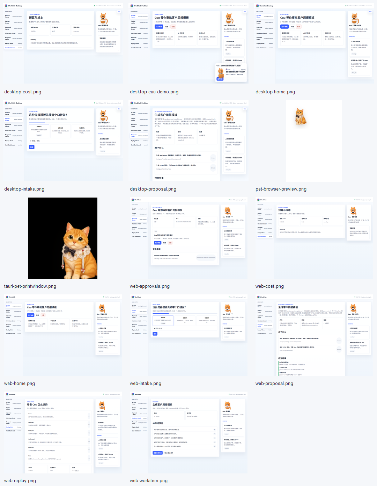

截图来源：

| 截图 | URL / 来源 | 用途 |
|---|---|---|
| `web-home.png` | `http://127.0.0.1:5173/#/` | Web Gold Path 首页 |
| `web-intake.png` | `http://127.0.0.1:5173/#/intake/...` | Web 选项澄清页 |
| `web-approvals.png` | `http://127.0.0.1:5173/#/approvals` | Web 审批中心入口 |
| `web-workitem.png` | `http://127.0.0.1:5173/#/workitems/...` | Web 工作项详情 |
| `web-proposal.png` | `http://127.0.0.1:5173/#/proposals/...` | Web 交付物变更申请 |
| `web-replay.png` | `http://127.0.0.1:5173/#/agent-runs/.../replay` | Web replay |
| `web-cost.png` | `http://127.0.0.1:5173/#/dashboard/cost` | Web 成本页 |
| `desktop-home.png` | `http://127.0.0.1:1420/#/` | desktop webview 主窗首页 |
| `desktop-cuu-demo.png` | `http://127.0.0.1:1420/?cuuDemo=1#/` | desktop webview 内 Cuu demo |
| `pet-browser-preview.png` | `http://127.0.0.1:1420/pet.html` | browser pet surface 预览 |
| `tauri-pet-printwindow.png` | Tauri `Cuu` hwnd `PrintWindow` | 真实独立桌宠窗口截图 |

### 0.2 Cuu 动作多帧抓取

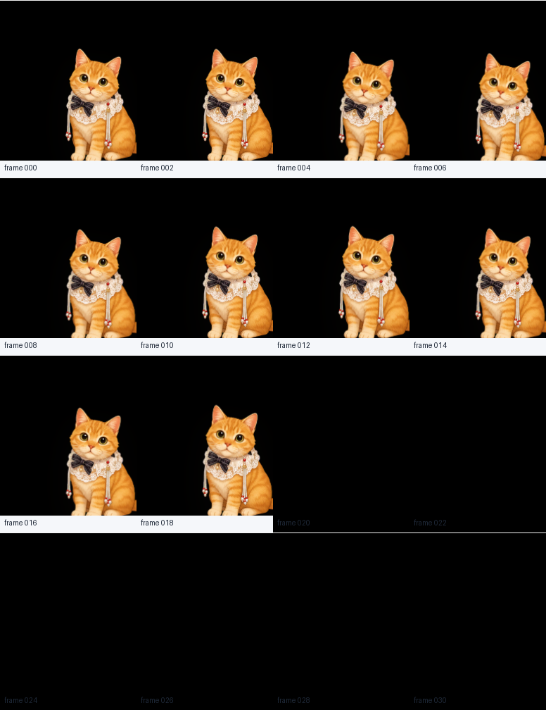

动图文件：

- GIF：`docs/workhub/05-clients/assets/audit/2026-06-07-cuu-motion/cuu-motion-printwindow.gif`
- MP4：`docs/workhub/05-clients/assets/audit/2026-06-07-cuu-motion/cuu-motion-printwindow.mp4`
- 原始帧：`docs/workhub/05-clients/assets/audit/2026-06-07-cuu-motion/frames/frame-000.png` 到 `frame-031.png`
- 像素报告：`docs/workhub/05-clients/assets/audit/2026-06-07-cuu-motion/motion-diff-report.json`

本轮抓取参数：

| 项 | 值 |
|---|---|
| 捕获对象 | 真实 Tauri `Cuu` 顶层窗口 |
| 捕获方式 | Win32 `PrintWindow(PW_RENDERFULLCONTENT)` |
| 帧数 | 32 |
| 间隔 | 180ms |
| 总时长 | 约 5.76 秒 |
| 窗口物理尺寸 | 194 x 228 |
| 最大相对首帧平均差异 | `40.637` |
| 最大相邻帧平均差异 | `40.528` |
| 最大相对首帧变化像素 | `11882` |
| 最大相邻帧变化像素 | `11817` |

解释：

- 前半段确实有轻微动作，主要表现为 Cuu 的呼吸/缩放/轮廓边缘变化。
- 第 20 帧附近出现 `SSE stream returned HTTP 401` 的离线卡片，窗口仍停在 body-only 小尺寸，气泡和 Cuu 被挤在 194 x 228 范围内。
- 这说明单张 smoke 截图只能证明「启动时可见」，不能证明「长时间活着、遇到事件时布局正确」。
- 后续 QA 必须把多帧截图 / GIF / 像素差异作为桌宠验收门。

### 0.3 Cuu card mode 修复后多帧抓取

第一轮修复只证明窗口可以扩到 card mode，但关键帧中 Cuu 仍只露耳朵 / 局部，因此这组图必须保留为失败证据：

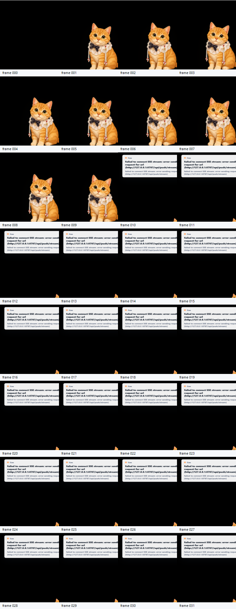

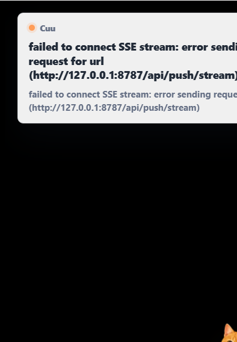

随后修复 card mode 中离线状态的可见动作、轻卡文案与 HiDPI 安全边距，fresh build 后重新抓取：

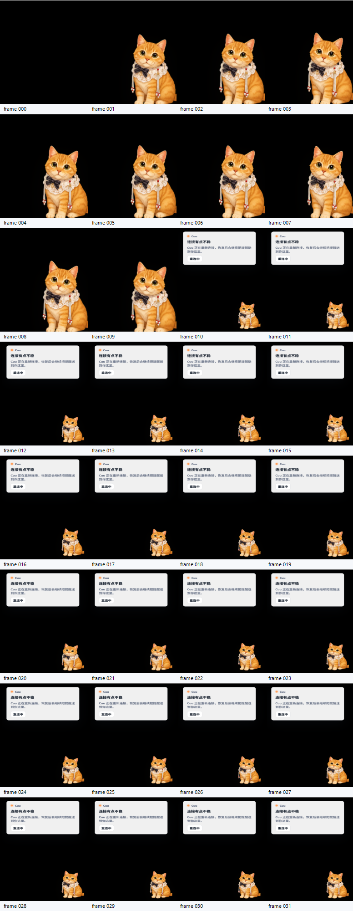

关键通过帧：

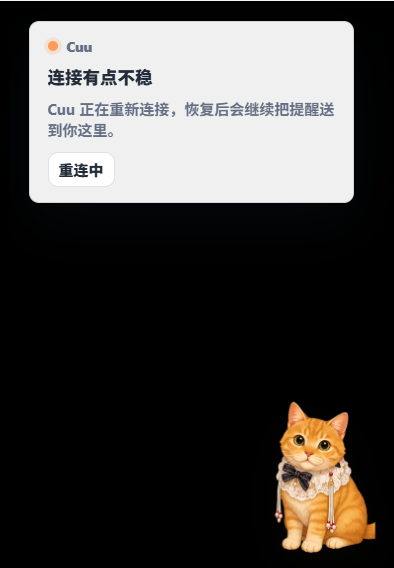

本轮修复后资产：

- GIF：`docs/workhub/05-clients/assets/audit/2026-06-07-cuu-card-mode-fix/cuu-motion-printwindow-after-card-layout.gif`
- Contact sheet：`docs/workhub/05-clients/assets/audit/2026-06-07-cuu-card-mode-fix/cuu-motion-contact-sheet-after-card-layout.png`
- 最终 GIF：`docs/workhub/05-clients/assets/audit/2026-06-07-cuu-card-mode-fix/cuu-motion-printwindow-after-full-body-hidpi-fix.gif`
- 最终 MP4：`docs/workhub/05-clients/assets/audit/2026-06-07-cuu-card-mode-fix/cuu-motion-printwindow-after-full-body-hidpi-fix.mp4`
- 最终 Contact sheet：`docs/workhub/05-clients/assets/audit/2026-06-07-cuu-card-mode-fix/cuu-motion-contact-sheet-after-full-body-hidpi-fix.png`
- 最终关键帧：`docs/workhub/05-clients/assets/audit/2026-06-07-cuu-card-mode-fix/frame-012-full-body-hidpi-card-mode.png`
- 修复前对照：`docs/workhub/05-clients/assets/audit/2026-06-07-cuu-card-mode-fix/cuu-motion-contact-sheet-before-card-layout.png`
- 像素报告：`docs/workhub/05-clients/assets/audit/2026-06-07-cuu-card-mode-fix/motion-diff-report-after-card-layout.json`
- 最终像素报告：`docs/workhub/05-clients/assets/audit/2026-06-07-cuu-card-mode-fix/motion-diff-report-after-full-body-hidpi-fix.json`
- 启动 smoke 截图：`docs/workhub/05-clients/assets/audit/2026-06-07-cuu-card-mode-fix/tauri-pet-smoke-after-card-mode.png`

窗口 / 布局修复结果：

| 检查项 | 结果 |
|---|---|
| `set_pet_window_mode("card")` 是否被真实调用 | 通过；bridge 同时支持 `__TAURI__.core.invoke` 和 legacy `__TAURI__.invoke` |
| Rust placement 是否被前端校验 | 通过；缺少 placement 或尺寸低于阈值会抛错，不再静默 |
| 事件卡出现后窗口尺寸 | 第 10 帧起由 `194 x 228` 扩到 `394 x 568` |
| card bubble 布局 | 已固定在扩展窗口左上，避免被右下角 Cuu body 或窗口底部裁切 |
| HiDPI 安全边距 | 通过；card bubble 收窄到 260px 逻辑宽，fresh `PrintWindow` 关键帧右侧有明确留白 |
| Cuu body 在 card mode 中完整可见 | 通过；最终关键帧显示完整坐姿、围兜、爪子和尾巴局部，不再只露耳朵 / 头部 |
| 离线卡表达 | 通过本轮 P0 修正；`sse-status` raw error 不再进入用户卡片，显示“连接有点不稳 / 重连中” |
| invoke 不可用时 | 走 compact fallback，只显示极短标题和一个动作按钮，并记录 `data-pet-window-mode-error` |
| motion QA | `scripts/qa/cuu-tauri-motion-capture.ps1` 可输出 frames、contact sheet、GIF/MP4、diff report |
| smoke QA | `scripts/qa/cuu-tauri-smoke.ps1` 会自动拉起 desktop webview dev server，避免误抓 WebView 错误页 |

#### CUX-MOTION-002：Cuu 非缩放鲜活感修复（2026-06-07）

用户验收口径更新：**只露耳朵是失败；只有大小变化 / 呼吸缩放也是失败；静态 fallback 在动不能算通过。** 因此在 card mode 修复后又追加了一轮真实 `Cuu` 顶层窗口 motion capture，确认动作 PNG 真的在 Tauri dev server 下加载并渲染。

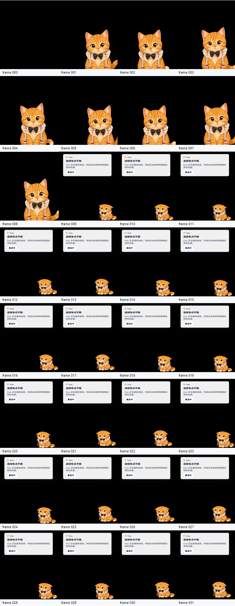

关键通过帧：

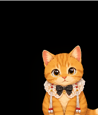

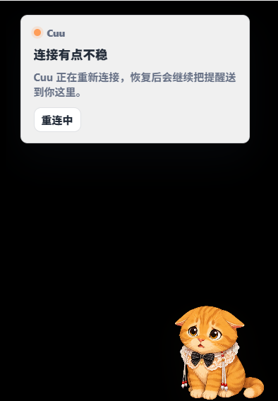

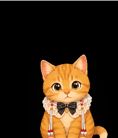

本轮修复后资产：

- GIF：`docs/workhub/05-clients/assets/audit/2026-06-07-cuu-alive-motion-fix/cuu-motion-printwindow-after-dev-asset-path-fix.gif`
- MP4：`docs/workhub/05-clients/assets/audit/2026-06-07-cuu-alive-motion-fix/cuu-motion-printwindow-after-dev-asset-path-fix.mp4`
- Contact sheet：`docs/workhub/05-clients/assets/audit/2026-06-07-cuu-alive-motion-fix/cuu-motion-contact-sheet-after-dev-asset-path-fix.png`
- 关键帧：`frame-003-idle-tail-sway.png`、`frame-010-card-worried-visible.png`
- 像素报告：`docs/workhub/05-clients/assets/audit/2026-06-07-cuu-alive-motion-fix/motion-diff-report-after-dev-asset-path-fix.json`
- Smoke 截图：`docs/workhub/05-clients/assets/audit/2026-06-07-cuu-alive-motion-fix/tauri-pet-smoke-after-dev-asset-path-fix.png`

根因与修复：

| 项 | 结论 |
|---|---|
| 静态 fallback 伪通过 | 之前 Tauri dev 下外部 clip sheet PNG 路径错误，inline fallback 一直可见，导致看起来只有缩放/呼吸 |
| dev 资源路径 | `documentRelativeAssetPath` 曾把 `/src/assets/...` 错误归一成 `./assets/...`，导致 dev server 404；现在只把打包态 `/assets/...` 转为 `./assets/...` |
| 运行态渲染 | pet surface 改用 clip sheet background sprite，不再让运行态静态 fallback 盖住动作帧 |
| 起始动作 | body-only 默认从 `idle_tail_sway` 开始，第一屏就是可见待机动作；scheduler 使用更快的 blink/tail/look cadence |
| 验收结果 | 第 001-008 帧可见 Cuu 摇尾/姿态变化；第 010 帧起进入 card mode，Cuu 全身可见且动作资源仍可见 |
| Smoke 像素 | 去掉静态 fallback 后仍通过：`orange_pixels=7858`、`visual_pixels=9900`，主窗隐藏后 `Cuu` 仍 visible/topmost |

仍待提升项：

| 检查项 | 结果 | 处理 |
|---|---|---|
| Cuu 鲜活感 P1 | **未通过最终验收**：真实 Tauri 窗口已不依赖静态 fallback，但当前 sprite/prototype 仍不像完整活体桌宠 | 转入 Live2D PSD / Cubism；Hatch 只保留 fallback |
| Live2D 表现力 | **进行中**：绿幕零件板、144 层 PSD draft v1、manifest/report 已落；尚未 Cubism 绑定 | 清理 PSD、补画遮挡、导入 Cubism、录屏验收 |

仍然没有完成的体验差距：

- 历史失败证据必须保留：第一轮 card layout 图中 Cuu 只露耳朵 / 局部，不能作为通过截图；后续任何回归再次出现都直接判失败。
- 历史伪通过证据也必须保留：只有静态 fallback 呼吸 / 缩放不能算 Cuu 活着；后续 motion QA 必须看到真实 clip sheet 或 Live2D 姿态变化。
- 现阶段只达到“动作资源真实加载、不是静态 fallback”的技术门槛；距离「会眨眼、看鼠标、尾巴/流苏轻物理、抱文件来找用户、任务动作可读」仍需要 Live2D / Cubism 资产路线。

### 0.4 CUX-L2D-001：PSD Draft Runtime Probe（2026-06-08）

用户最新验收口径：Cuu 不能只是 8 层裁片、不能只有缩放，也不能用一张静态图伪装动作；如果要走 Live2D，必须先把 PSD 分层做细。为此，本轮把 144 层 `generated-psd-draft-v1` 接成 `psd_draft_probe` 运行探针。随后用户复核认为该 PSD 草案有恐怖谷风险，因此它只保留为实验线，不再作为默认 pet surface。

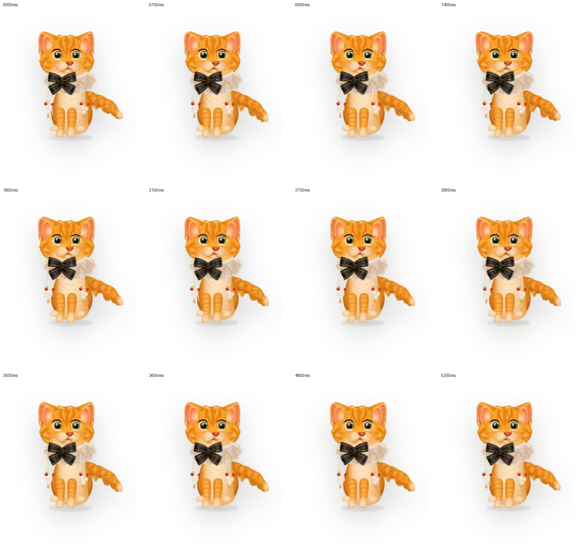

本轮新增资产：

- 多帧 contact sheet：`docs/workhub/05-clients/assets/audit/2026-06-08-cuu-psd-draft-probe/pet-psd-draft-cdp-contact-sheet-grid.png`
- 原始截图：`pet-psd-draft-cdp-frame-0000.png`、`pet-psd-draft-cdp-frame-0700.png`、`pet-psd-draft-cdp-frame-1400.png`、`pet-psd-draft-cdp-frame-2100.png`、`pet-psd-draft-cdp-frame-2800.png`、`pet-psd-draft-cdp-frame-3500.png`、`pet-psd-draft-cdp-frame-4800.png`、`pet-psd-draft-cdp-frame-5200.png`
- DOM：`docs/workhub/05-clients/assets/audit/2026-06-08-cuu-psd-draft-probe/pet-psd-draft-cdp-dom.json`
- 像素差分：`docs/workhub/05-clients/assets/audit/2026-06-08-cuu-psd-draft-probe/pet-psd-draft-cdp-diff-report.json`

本轮代码落点：

| 文件 | 作用 |
|---|---|
| `packages/cuu/src/live2d-psd-draft.ts` | 校验 PSD draft runtime probe 必需层，防止缺眼睛/尾巴/流苏仍被当成通过 |
| `apps/desktop-webview/src/cuu-live2d-psd-draft-assets.ts` | 从 144 层 draft 中显式列出 72 个运行时探针层和坐标 |
| `apps/desktop-webview/src/cuu-live2d-psd-draft-runtime.ts` | 渲染 layer PNG、data attrs 和 tail/ear/eye/mouth/bow/tassel/paw 动作 |
| `apps/desktop-webview/src/pet-surface.ts` | 曾用于验证 `psd_draft_probe -> prototype_layered -> sprite_atlas`；现默认已切到 `bongo_cuu` |
| `scripts/qa/cuu-pet-browser-capture.mjs` | 通过 Chrome CDP 多帧截图、DOM dump 和报告生成 |

验收结论：

| 检查项 | 结论 |
|---|---|
| 全身可见 | 通过；多帧截图中不是只露耳朵、局部或空白 |
| 实验 renderer | 通过；实验截图中 `data-cuu-visual-mode="live2d_psd_draft"`，DOM 里有 `data-cuu-live2d-runtime="psd_draft_probe"` |
| 真实分层 | 通过；DOM 可见 `Eye_L_Closed`、`Tail_01`、`Tassel_L_01` 等 PSD layer |
| 非缩放动作 | 技术通过；CSS 中尾巴、耳朵、眼睛、嘴型、蝴蝶结、流苏、爪子独立运动 |
| 动作鲜活感 | **未通过最终验收**；仍是 CSS 层动画，不是 Cubism mesh / physics |
| 美术质量 | **未通过最终验收**；尾巴、绿边、遮挡补画和部分生成件仍需精修 |
| Tauri 真实窗口 | 待补；本轮为 browser pet surface CDP 截图，下一轮必须跑真实 Tauri `Cuu` 顶层窗口录屏 |

下一步施工：

1. 继续批量生成更细的 `face-core`、`body-core`、`tail-chain`、`collar-lace`、`bow-tassel`、`paint-behind` 绿幕零件板。
2. 自动抠图后只把候选部件放进 PSD draft，正式 PSD 仍必须人工清理边缘、修遮挡和统一画风。
3. 用 Cubism Editor 导入精修 PSD，绑定 `ParamEyeOpen`、`ParamTailSway`、`ParamTasselSwing`、`ParamPawTap` 等参数。
4. 录制真实 Tauri 透明 `Cuu` window 多秒动作，验收眨眼、尾巴、耳朵、流苏、看鼠标和任务动作。

### 0.5 CUX-BONGO-001：低恐怖谷默认 Cuu（2026-06-08）

用户复核结论：PSD draft 会触发恐怖谷风险，不适合作为默认桌宠。参考 [BongoCat](https://github.com/ayangweb/BongoCat) 后，本轮把默认 pet renderer 改为 `bongo_cuu`：扁平圆润、少状态强反馈、形体稳定，不依赖 AI 生成肢体。

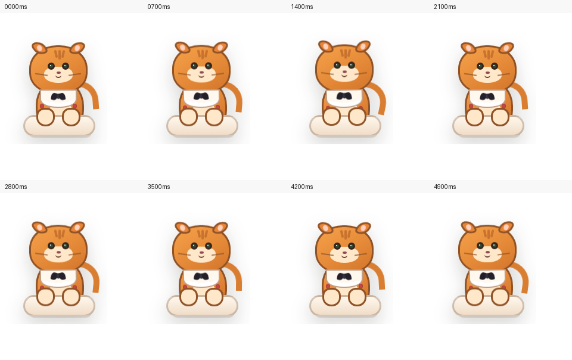

本轮新增 / 修改：

| 文件 | 作用 |
|---|---|
| `apps/desktop-webview/src/cuu-bongo-runtime.ts` | 31 个 DOM/CSS 组件组成低恐怖谷 Cuu，含头、耳、眼、尾、爪、围兜、蝴蝶结、红珠、文档、桌面、检索放大镜、同步环和庆祝星点 |
| `apps/desktop-webview/src/pet-surface.ts` | 默认 `data-cuu-visual-mode="bongo_cuu"`，`data-cuu-live2d-status="experiment_hidden"` |
| `apps/desktop-webview/src/pet-surface-qa.ts` | QA 改为要求默认 Bongo Cuu，不允许默认 HTML 出现 PSD layer |
| `scripts/qa/cuu-pet-browser-capture.mjs` | 默认等待 `[data-cuu-bongo-runtime="bongo_cuu"]` 并抓多帧截图 |
| `docs/workhub/05-clients/cuu-bongo-style-runtime-plan.md` | 新增默认路线专篇 |

截图证据：

- Contact sheet：`docs/workhub/05-clients/assets/audit/2026-06-08-cuu-bongo-runtime/pet-bongo-cuu-cdp-contact-sheet-grid.png`
- DOM：`docs/workhub/05-clients/assets/audit/2026-06-08-cuu-bongo-runtime/pet-bongo-cuu-cdp-dom.json`
- Diff：`docs/workhub/05-clients/assets/audit/2026-06-08-cuu-bongo-runtime/pet-bongo-cuu-cdp-diff-report.json`

验收结论：

| 检查项 | 结论 |
|---|---|
| 恐怖谷止损 | 通过；默认不再展示 PSD draft |
| 默认 renderer | 通过；`data-cuu-visual-mode="bongo_cuu"` |
| PSD 隐藏 | 通过；DOM 中 `live2d=null`，`layers=[]`，`data-cuu-live2d-layer-count="0"` |
| 全身可见 | 通过；多帧截图中 Cuu 全身可见，不是只露耳朵 |
| 动作 | P1 技术通过；尾巴、头、眨眼、爪、耳朵已有 keyframes |
| 鲜活感 | 继续增强；P1b 已补挥手、抱文件、检索、同步和庆祝，后续要加大动作幅度和卡片联动 |
| Tauri 真实窗口 | 已补 P1c first-painted 门禁；最新真实 `Cuu` hwnd 录屏 frame 000 即 body-only 全身可见 |

下一步不再默认推进 PSD 外观，而是按 `cuu-bongo-style-runtime-plan.md` 继续让 Bongo Cuu 在真实 Tauri 窗口里更鲜活，并补窗口设置与动作幅度二轮。

### 0.5.1 CUX-BONGO-002：Bongo Cuu 动作增强与真实 Tauri 录屏（2026-06-08）

本轮继续按用户反馈处理“Cuu 不能像死图、不能只靠缩放”的问题：不再追加恐怖谷 PSD，而是在默认 `bongo_cuu` 上增强动作可读性。新增道具层和 keyframes：放大镜 / 检索光线、同步旋转环、庆祝星点、挥手抬爪、抱文件、打回点头、拖拽抓握、看鼠标。

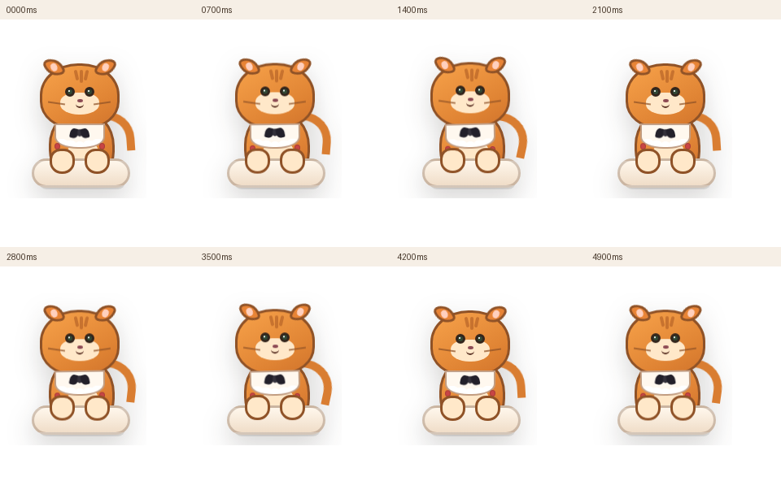

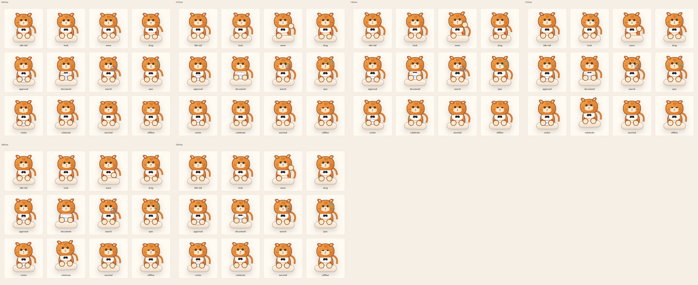

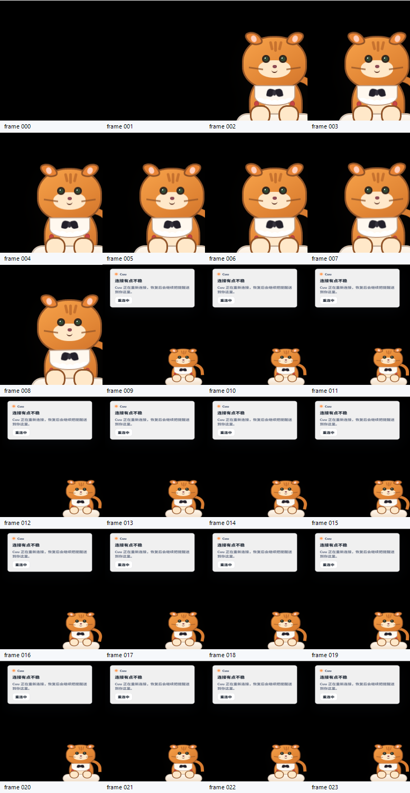

本轮新增 / 修改：

| 文件 | 作用 |
|---|---|
| `apps/desktop-webview/src/cuu-bongo-runtime.ts` | 组件数从 24 升到 31，补 `search-glass`、`sync-ring`、`spark` 和 P1b 状态动画 |
| `apps/desktop-webview/src/pet-surface.test.ts` | 新增 P1b business / idle actions readable 测试，覆盖 search/sync/revise/carry/wave/drag |
| `apps/desktop-webview/src/pet-surface-qa.ts` | QA 合同要求 31 组件、检索/同步/庆祝部件和关键 keyframes |
| `docs/workhub/05-clients/assets/audit/2026-06-08-cuu-bongo-p1b-runtime/` | browser idle 与状态墙多帧截图、DOM 和 diff report |
| `docs/workhub/05-clients/assets/audit/2026-06-08-cuu-bongo-p1b-tauri/` | 真实 Tauri `Cuu` 顶层窗口 frames、contact sheet、GIF、MP4、diff report |

验收结论：

| 检查项 | 结论 |
|---|---|
| 低恐怖谷 | 通过；仍是稳定扁平 Cuu，没有 PSD 恐怖谷和多肢体幻觉 |
| 默认 idle | 通过；8 帧 browser CDP 中尾巴、头、眼有可见变化，最高 `18.97%` 像素相对首帧变化 |
| 业务动作 | 通过 P1b；状态墙中 wave/search/sync/revise/celebrate 肉眼可辨 |
| 真实 Tauri | 技术通过；P1b `cuu-tauri-motion-capture.ps1` 输出 GIF/MP4，曾在 frame 000-001 记录空白帧，已由 CUX-BONGO-003 修复 |
| 启动首帧 | **历史未完美**；P1b frame 000-003 有空白/右侧局部过渡，说明 `pet` window visible 早于 webview first paint |
| 下一步 | 见 CUX-BONGO-003：Rust 启动只预定位，pet surface 首屏后同步窗口模式，motion QA 等首帧像素达标后再录 |

### 0.5.2 CUX-BONGO-003：Cuu first-painted 首帧稳定（2026-06-08）

本轮继续处理 P1b 真实 Tauri 证据里的 cold-start blank：旧 contact sheet 的 frame 000-001 是黑空帧，不能作为“启动就有桌宠”的通过证据。修复后 Rust 启动期只计算并设置 body-only 窗口尺寸/位置/置顶，不再抢先 `show()`；`pet-surface.ts` 在首屏 DOM 渲染后通过两帧 `requestAnimationFrame` 或 64ms timeout fallback 再调用 `set_pet_window_mode`；motion capture 脚本新增 `first-frame-probe.png` 像素门槛，通过后才写入正式 `frame-000.png`。

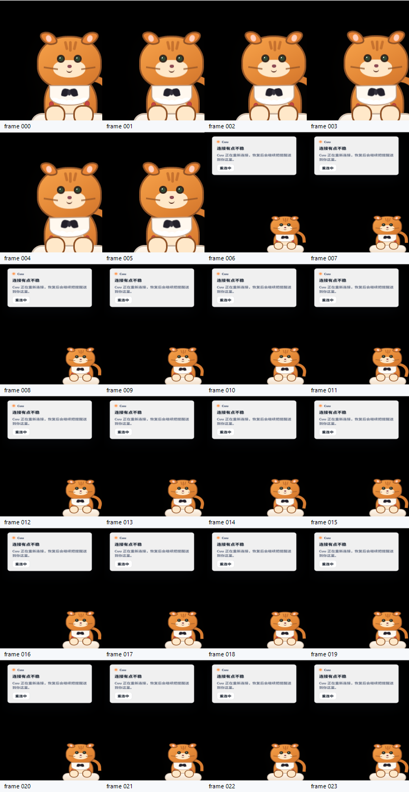

本轮新增 / 修改：

| 文件 | 作用 |
|---|---|
| `client-tauri/src-tauri/src/main.rs` | `prepare_pet_window_on_startup` 只预定位和保持置顶，不在 setup 里直接 show pet window |
| `apps/desktop-webview/src/pet-surface.ts` | 新增 `scheduleDesktopPetFirstPaint`，首屏 DOM 后再同步 `body_only/card` 窗口模式 |
| `apps/desktop-webview/src/pet-surface.test.ts` | 新增 rAF 两帧与 hidden webview timeout fallback 测试 |
| `scripts/qa/cuu-tauri-motion-capture.ps1` | 新增 `MinFirstFrameOrangePixels` / `MinFirstFrameVisualPixels`，首帧 probe 达标后才开始录制 |
| `docs/workhub/05-clients/assets/audit/2026-06-08-cuu-bongo-p1c-first-paint/` | 真实 Tauri frames、contact sheet、GIF、MP4、first-frame probe、diff report |

验收结论：

| 检查项 | 结论 |
|---|---|
| 首帧 | 通过；新 contact sheet 的 frame 000 已是 body-only Cuu 全身可见，不再出现黑空帧 |
| 像素门槛 | 通过；`first_frame_gate.passed=true`，第 7 次 probe 达到 `orange_pixels=9408`、`visual_pixels=15530` |
| 真实录屏 | 通过；24 帧 `PrintWindow` 输出 contact sheet / GIF / MP4 / diff report |
| 回归口径 | 任何 `frame-000.png` 橘色像素为 0、只露耳朵或只显示半身，都不能作为桌宠 motion QA 通过 |
| 仍待提升 | Bongo 动作幅度仍偏温和；下一步应做窗口设置（缩放/透明/贴边/hover 避让）和动作二轮，而不是回退恐怖谷 PSD |

### 0.6 P1.0 双语运行时底座（2026-06-07）

本轮在 Cuu motion 修复后，先补了客户端级中英双语底座，避免后续 Web / desktop 主窗 / Cuu 气泡各自发明一套语言切换。

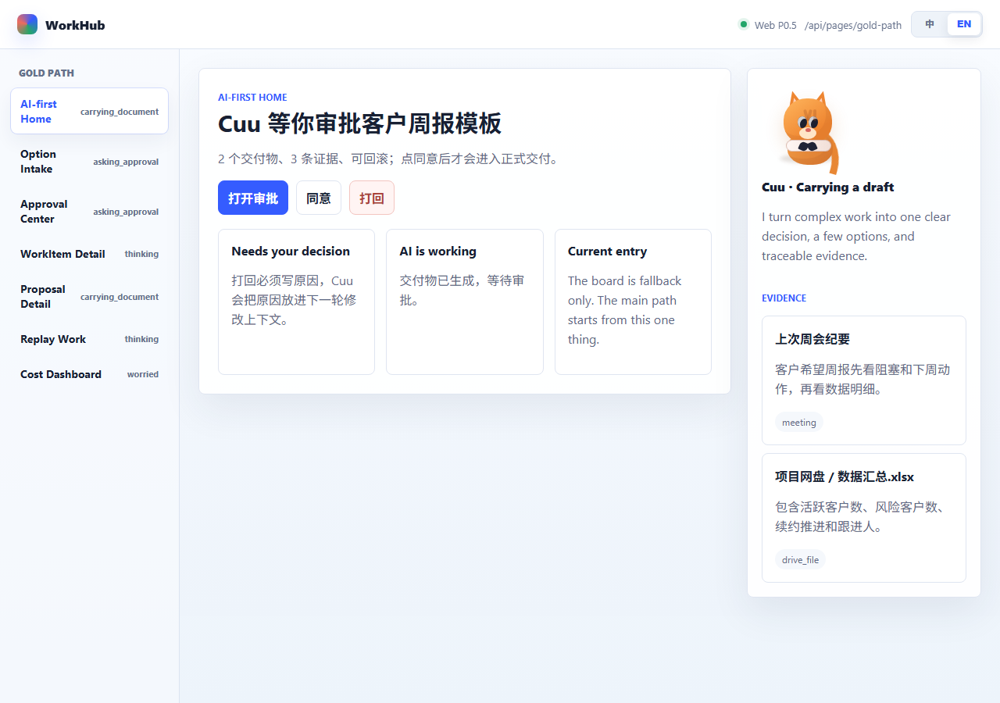

| 检查项 | 当前结论 |
|---|---|
| 设计对齐 | 语言切换放在右上角轻量 segmented control，不抢 AI-first 主路径；符合概念图里“主界面只保留必要入口”的方向 |
| 已落路径 | `packages/ui/src/gold-path/i18n.ts`、`packages/ui/src/gold-path/render.ts`、`packages/ui/src/gold-path/app-shell.ts`、`apps/web/src/browser.ts`、`apps/desktop-webview/src/browser.ts` |
| 已落能力 | `zh-CN` / `en-US` normalize、`workhub.locale` 持久化、Gold Path 静态 chrome、Cuu rail 状态、Web/desktop 运行时提示、桌面 Cuu 队列 badge 与审批原因按钮 |
| 测试 | `@workhub/ui` 覆盖 locale 规范化、英文静态文案、shell 语言按钮；`@workhub/web` / `@workhub/desktop-webview` 覆盖 locale 入口函数 |
| 未完成 | API Page VM 动态标题/摘要、proposal manifest、Cuu card payload、独立 pet 轻气泡仍跟随 daemon 原文；后续必须从 contracts/API 层补字段级 locale |

验收口径：切到 English 后，静态框架必须出现 `Needs your decision` / `Budget and cost` / `Language`，审批原因按钮也必须是英文；如果任务标题仍是中文，只能说明服务端 VM 尚未做多语种，不能把它伪装成本地化完成。

---

## 1. 设计基线

本轮审计采用这些概念图作为目标，不把当前实现截图误读为最终 UI。

### 1.1 Web AI-first 首页目标

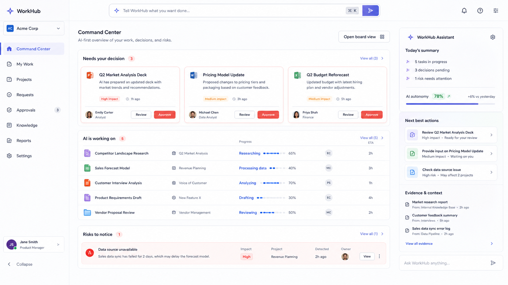

目标特征：

- 默认页是 AI 整理后的注意力中心，不是全量看板。
- 中央第一屏展示「需要你决定」「AI 正在做」「风险」。
- 看板入口只是高级视图按钮，不是首页主体。
- 右侧 Assistant / Cuu 区域承担摘要、下一步、证据上下文。
- 顶部有自然语言输入入口，用户可以直接说目标。

### 1.2 Web 选项优先提需求目标

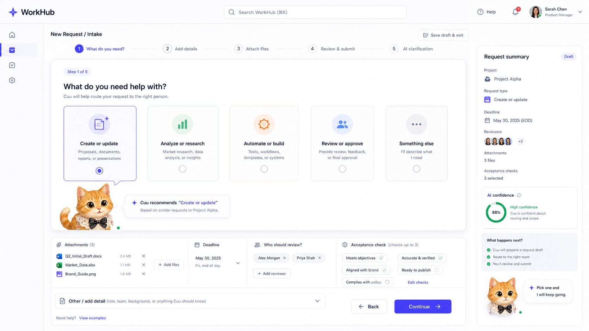

目标特征：

- 主交互是选项卡，不是大文本框。
- 有 stepper、附件、截止时间、负责人、验收项。
- Cuu 推荐项以气泡承接，文字输入折叠为「其他 / 补充」。
- 右侧有 Request Summary 和 AI confidence，用户知道自己已经给了什么信息。

### 1.3 Rust 客户端单件事干活桌目标

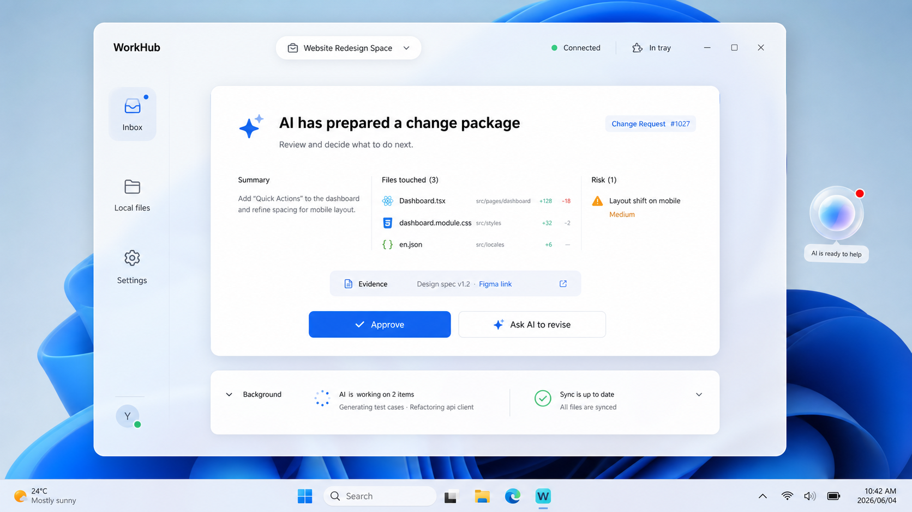

目标特征：

- 主窗不是 Web shell 原样复刻，而是一个本地桌面工作面板。
- 默认只处理当前一个决定或一个本地动作。
- 顶部有连接状态、托盘状态、窗口控制、工作空间切换。
- 中心卡片是可审批 / 可打回 / 可查看证据的变更包。
- 底部保留后台同步、AI 正在做、本地文件状态。

### 1.4 Cuu 桌面审批与项目检索目标

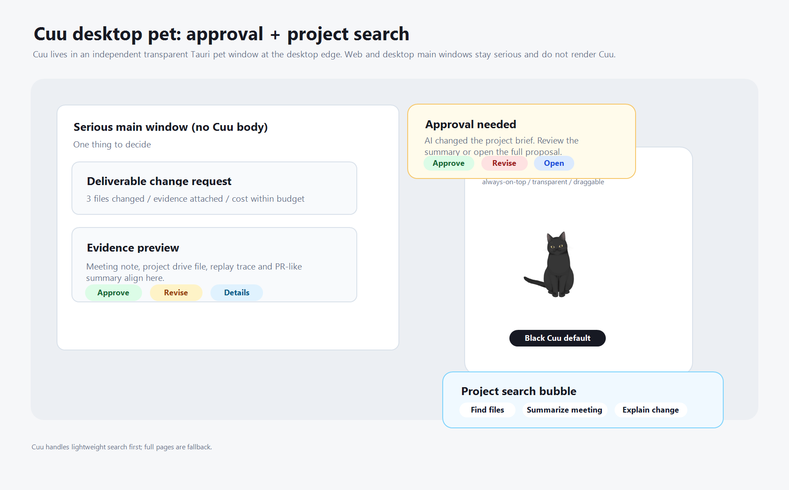

目标特征：

- Cuu 是桌面右下角独立存在的可爱小猫，不活在主窗里面。
- Cuu 有动作轨迹、主动靠近、挥手、提示，不只是静态图。
- 轻卡可展开为审批 / 证据 / 项目检索，不需要打开完整主窗。
- 复杂任务再 deep-link 到 WorkHub 主窗。

---

## 2. 当前实现总体判断

| 范围 | 当前截图事实 | 与概念图的距离 | 严重度 |
|---|---|---|---|
| Web 首页 | 有 Gold Path 左栏、中心单卡、右侧 Cuu 证据卡 | 还不是 AI-first Command Center；缺顶部自然语言输入、任务流、风险流、Next best actions、右侧 assistant 结构 | P1 |
| Web intake | 有选项卡和按钮 | 方向正确，但缺 stepper、附件/DDL/负责人/验收项、request summary、Cuu 推荐气泡和折叠文本输入 | P1 |
| Web proposal | 有交付物卡、按钮、部分输出 | 接近 PR-like 方向，但缺文件/证据/评论/风险/回滚的完整结构和可视 diff | P1 |
| Web replay | 有 trace/replay 页面 | 仍偏数据面板，缺人话 timeline、cost footer、snapshot/revert、脱敏 raw 展开 | P2 |
| Web cost | 有预算卡 | 只是基础页面，缺策略编辑、usage trend、告警说明、团队/用户视图切换 | P2 |
| Desktop 主窗 | 基本与 Web shell 一致 | 缺 Rust 客户端设计哲学：单件事干活桌、本地执行、同步、设备、托盘、诊断 | P1 |
| 中英双语 | 已有右上角轻量切换，Gold Path 静态 chrome 与运行时提示可切中英 | 动态 Page VM / Cuu payload / 独立 pet 轻卡仍是单语言，需要 API/Contracts 级 locale | P1 |
| 主窗内 Cuu | 右侧是抽象小猫/卡片 | 不符合最终 Cuu 角色，主窗内只能做轻同步，不能替代独立桌宠 | P1 |
| 独立 Cuu | 能独立出现，启动可见，主窗隐藏后仍可见；事件卡片现在能触发 card mode 扩窗，最终 HiDPI 抓帧中完整 Cuu 可见 | 形象有参考照特征，但动作弱；还不够活 | P1 |
| Motion QA | 已有 32 帧抓取脚本、contact sheet、GIF/MP4、diff JSON | 已能发现并验证 card mode 裁切、只露耳朵和 HiDPI 贴边问题；仍需纳入跨平台与长时间 QA | P1 |
| Cuu 默认视觉 | 已切到 `bongo_cuu` 低恐怖谷 renderer，browser CDP 多帧截图和 DOM 通过 | 方向正确；还需增强动作幅度、录真实 Tauri 窗口、补拖拽/hover/任务动作截图 | P1 |
| Live2D 资产路线 | 已生成绿幕零件板、编号组件、`generated-psd-draft-v1` 144 层 PSD 草案、文档预览和 `psd_draft_probe` 运行探针 | 只作为实验线；已证明批量生成部件并按 manifest 调整大小拼接可行，但因恐怖谷风险不能默认展示，还需修绿边、尾巴、遮挡补画、Cubism 绑定和真实 Tauri 录屏验收 | P1 |

一句话：**当前产品的技术地基好于体验完成度；体验上还像一套可点击 PRD 样机。下一阶段必须先把 Cuu 和单件事主路径做“像产品”，再铺全页面。**

---

## 3. 页面逐项差距

### 3.1 AI-first Home

当前截图：`assets/audit/2026-06-07-current-state/web-home.png`

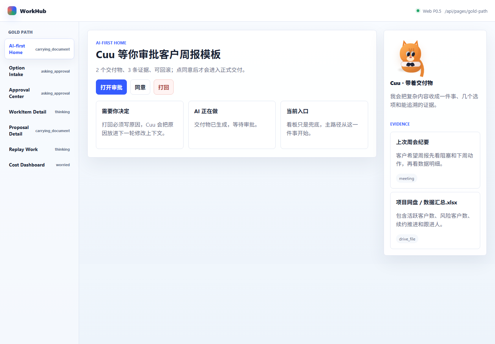

当前优点：

- 左侧 Gold Path 导航清楚。
- 中央能显示当前待审批事项。
- 右侧 Cuu 区域已有证据卡意识。
- 按钮可以表达「打开审批 / 同意 / 打回」。

当前问题：

- 第一屏大量空白，信息层级不像一个成熟工作台。
- 标题「Cuu 等你审批客户周报模板」更像测试 fixture，不像 WorkHub 首页。
- 「AI 正在做」「需要你决定」「当前入口」只是三张等权小卡，没有工作流状态和优先级。
- 没有顶部输入框，用户无法直接告诉 WorkHub 要做什么。
- 没有「Next best actions」和「Evidence & context」的右侧推进行为。
- 左侧导航暴露 motion state 字符串，如 `carrying_document`、`asking_approval`，这对小白非常不友好。
- 视觉语言与概念图差距大：当前是浅色 demo shell，概念图是成熟 SaaS attention center。

目标改造：

| 位置 | 目标 |
|---|---|
| 顶部 | 加全局 command input：「告诉 WorkHub 你想完成什么...」 |
| 主区第一块 | `Needs your decision`，按优先级展示 1-3 个需要用户点的事项 |
| 主区第二块 | `AI is working on`，展示后台 run，不做重看板 |
| 主区第三块 | `Risks to notice`，只显示需要人类注意的风险 |
| 右侧 | `Cuu / WorkHub Assistant`，包括今日摘要、下一步、证据上下文 |
| 左侧 | motion state 不可见，只显示页面名和必要 badge |

验收标准：

- 1440px 桌面截图第一屏必须同时看到当前决定、后台 run、风险和 Cuu 证据。
- 不出现 `snake_case` motion state。
- 看板入口不是默认主体，只作为二级按钮。
- 首页不要求用户理解项目管理术语即可点下一步。

### 3.2 Option Intake

当前截图：`assets/audit/2026-06-07-current-state/web-intake.png`

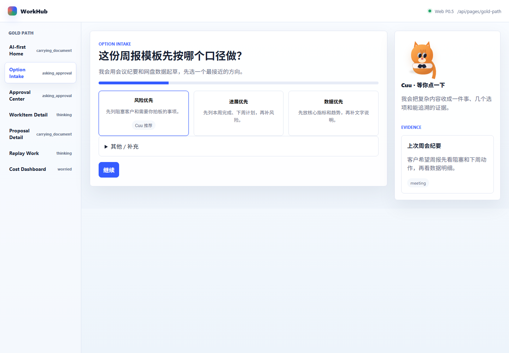

当前优点：

- 已经不是聊天墙，主路径是点选项。
- 有推荐选项和继续按钮。
- 页面简单，不重。

当前问题：

- 选项只有 3 个，且语义偏模板，不像真实需求收集。
- 缺 stepper，用户不知道后续还要补什么。
- 缺附件、Deadline、Reviewer、Acceptance check 这些真实交付信息。
- 缺右侧 Request Summary，用户不能确认已填字段。
- Cuu 没有真实出现，推荐不是小猫气泡。
- 「其他 / 补充」未折叠承接。

目标改造：

| 模块 | 目标 |
|---|---|
| Stepper | `What do you need? -> Add details -> Attach files -> Review & submit -> AI clarification` |
| Option cards | 5 个一级意图：创建/更新、分析/研究、自动化/构建、审阅/批准、其他 |
| Details | DDL、附件、负责人、验收项，默认轻量可点 |
| Cuu 推荐 | 小猫在已选卡旁提示「我建议选这个」 |
| Summary | 右侧实时累积项目、类型、DDL、reviewers、acceptance checks |
| Free text | 折叠在底部，标签为「其他 / 补充」 |

验收标准：

- 首屏不出现大文本输入。
- 375px 移动端选项卡不横向溢出。
- 用户不用打字即可完成一条最小需求草稿。

### 3.3 Approval Center

当前截图：`assets/audit/2026-06-07-current-state/web-approvals.png`

当前优点：

- 已有审批卡、通过/打回按钮。
- 与 Gold Path 的 proposal/action 契约已有连接。

当前问题：

- 审批中心不是阻塞收件箱，缺筛选、排序、来源、负责人、风险。
- 缺「记住规则」「委派」「打回理由」的一等入口。
- 缺批量但轻量的 pending queue。
- 缺 Cuu 桌宠与审批中心之间的状态同步。

目标改造：

- 左侧：待我审批、我发起、已处理、规则。
- 中间：按 urgency 和风险排序的审批列表。
- 右侧：选中项摘要、证据、风险、可回滚性。
- 动作：通过、打回并选原因、委派、记住一次/总是。

验收标准：

- 审批卡必须可完全由按钮完成，不强迫打字。
- 打回必须有 3 个推荐理由 + 「其他」。
- Cuu 轻卡点击「打开审批」能定位到同一条审批。

### 3.4 WorkItem Detail

当前截图：`assets/audit/2026-06-07-current-state/web-workitem.png`

当前优点：

- 能展示工作项详情和 AI 执行轨迹。
- 有验收项意识。
- 与 proposal/replay/cost 链路有关联。

当前问题：

- 信息结构偏 render helper，缺真实详情页节奏。
- 缺状态四态、权限态、编辑态。
- 缺「AI 现在在做什么」的实时流。
- 缺交付物预览、变更包入口和风险解释。
- Cuu 的状态没有在详情页形成可感知的协作层。

目标改造：

| 区域 | 目标 |
|---|---|
| Header | 标题、状态、人话下一步、负责人、DDL、风险 |
| Current Focus | 当前需要处理的一件事 |
| AI Trace | 事件流、工具调用、证据、成本 |
| Acceptance | 验收项可勾选，可绑定证据 |
| Deliverables | 文件/文档/PPT/表格/图片预览 |
| Proposal timeline | 变更申请、审批、merge、rollback |
| Cuu | 只弹关键轻卡，不变成聊天墙 |

### 3.5 Proposal Detail / 非代码 PR

当前截图：`assets/audit/2026-06-07-current-state/web-proposal.png`

当前优点：

- 当前页面最接近概念：已有交付物变更申请、输出物、动作按钮。
- 已经不是代码 diff 限定，有文档/报告意识。

当前问题：

- 缺 GitHub PR 式结构：说明、文件、证据、评论、检查、回滚。
- 文件变化没有 renderer 区分：文档、表格、PPT、图片、文件夹。
- 缺风险和审核意见的清晰区域。
- 通过/打回按钮还不够贴近负责人决策。

目标改造：

| Tab | 内容 |
|---|---|
| Overview | AI summary、why now、risk、rollback |
| Files | 按 target type 展示变更，不限代码 |
| Evidence | 会议、网盘、历史任务、用户评论 |
| Checks | 验收项、policy、预算、权限 |
| Discussion | 审核评论与 Cuu 打回理由 |

验收标准：

- 文件 target renderer 至少覆盖 `docx/md/xlsx/csv/pptx/image/folder/json/config/code`。
- LLM 生成 PR 说明必须字段化：summary、files_changed、evidence_refs、risk、rollback、review_questions。
- 用户能一眼判断「同意后会改什么」。

### 3.6 Replay / Cost

当前问题：

- Replay 仍像日志面板，不像给人看的复盘。
- Cost 仍像预算 fixture，不像治理页面。

目标：

- Replay：人话 timeline + tool trace + evidence + snapshot + rollback + cost footer。
- Cost：普通用户看自己额度；管理员看团队策略、usage trend、告警、模型路由影响。

---

## 4. 桌宠 Cuu 当前动作审计

### 4.1 已证明的事实

| 项 | 当前结论 |
|---|---|
| 独立窗口 | 已有真实 Tauri `pet` window |
| 主窗隐藏后常驻 | smoke 通过 |
| 右下角定位 | smoke 通过 |
| 可见像素 | startup smoke 通过，只能证明启动期 Cuu 可见 |
| 多帧动作 | 多帧抓取显示前半段有轻微呼吸/轮廓变化 |
| 事件后布局 | 首轮发现离线卡片触发后窗口仍 body-only；本轮已修复 card mode 扩窗、完整身体站位和 HiDPI 右侧留白 |
| Card mode Cuu body | **通过本轮 P0 门槛**：最终关键帧中 Cuu 完整可见；只露耳朵历史图保留为回归失败样例 |
| 视觉可爱度 | 参考照特征有了，但当前不是概念图里的 Q 版活体宠物 |

### 4.2 Motion Capture 发现的问题

#### CUX-MOTION-001：事件卡片触发后窗口没有扩展（已修）

证据：

- `frame-000` 到 `frame-018`：Cuu 可见，有轻微动效。
- `frame-020` 起：离线卡片出现，内容被挤在 194 x 228 的小窗口里。
- `motion-diff-report.json` 在第 20 帧出现最大相邻帧差异，说明不是稳定 idle，而是事件 UI 突然进入。

可能根因：

- `pet-surface.ts` 已调用 `syncPetWindowMode("card")`，但 Tauri bridge 的 `setMode` 可能没有真正可用。
- `resolveDesktopPetWindowBridge()` 可能只解析到了 window `startDragging`，没有解析到 `__TAURI__.core.invoke`，导致 `set_pet_window_mode` 未执行。
- `syncPetWindowMode()` 对 `setMode` 是 fire-and-forget，失败没有状态、日志和 fallback。
- 即使 Rust command 成功，前端也没有等待 resize 后再渲染 card 布局，截图可能抓到过渡裁切。

修复方向：

1. 在 desktop webview 内新增 `resolveTauriInvoke()`，同时支持 `window.__TAURI__.core.invoke`、`window.__TAURI__.invoke`、`window.__TAURI_INTERNALS__.invoke` 或通过 bundler 引入 `@tauri-apps/api/core`。
2. `syncPetWindowMode()` 必须 catch error 并写入 `data-pet-window-mode-error`，测试能断言失败。
3. card 进入时先请求 Rust resize，再渲染 card 或至少保留 body-only safe mini bubble。
4. smoke 增加 `Wait-ForPetCardWindowSize`：触发一张卡后，窗口必须扩展到接近 380 x 560。
5. 如果 resize 失败，pet surface 必须走 compact card layout，不允许内容被裁到不可读。

验收：

- 触发 `sse-status:closed/401` 后，`Cuu` 窗口尺寸从约 180 x 220 扩到约 380 x 560。
- card 截图中标题、正文、按钮、Cuu 本体都完整可见。
- `PrintWindow` 多帧 contact sheet 中不能出现大面积黑/透明空白掩盖卡片。

2026-06-07 修复后复核：

- **窗口扩展 / card 裁切修复通过**：修复后 motion report 显示第 10 帧起窗口从 `194 x 228` 扩到 `394 x 568`。
- **Cuu body 完整可见通过本轮 P0 门槛**：最终 HiDPI 关键帧中 Cuu 完整坐姿可见，card bubble 右侧有安全留白，离线卡不再显示 raw SSE error。
- 因此 `CUX-MOTION-001` 可以关闭；“鲜活感不足”继续转入 `CUX-MOTION-002` / `GAP-CUU-05 Live2D PSD + Cubism`。`GAP-CUU-06 Hatch Pack` 只作为 fallback / 过渡方案保留。

#### CUX-MOTION-002：当前动作太弱，不像活体桌宠

证据：

- 动作主要是轻微 scale / breathe，无法表达走动、挥手、跳跃、审批、检索、同步。
- 概念图里的 Cuu 有明显身体动作、尾巴、表情、气泡互动；当前更像静态贴纸。
- 当前 main shell 内 Cuu 仍是抽象橘色图标，和独立 pet 的参考照风格不一致。
- 历史第一轮修复曾出现 card mode 只露出 Cuu 耳朵 / 局部；这个回归样例必须长期保留，后续任何只露耳朵、裁尾、裁爪都判失败。

修复方向：

- 短期清理 `generated-psd-draft-v1`：修绿边、尾巴重拆、头底/耳朵拆分、遮挡补画、表情层整理。
- 中期导入 Live2D Cubism：绑定眼睛、眼皮、嘴、耳朵、尾巴、流苏、呼吸、看鼠标。
- Hatch Pet 8 x 9 spritesheet 只在 Cubism 工具链短期阻塞时作为 fallback 施工，不再作为首要主线。

验收：

- 5 秒 idle 不能像一张死图，必须能看出呼吸和眨眼。
- 60 秒 idle 至少出现眨眼、尾巴、耳朵、看鼠标、打盹/醒来中的两类随机待机动作。
- 任务事件必须先触发对应动作，再出现气泡。
- card mode 中 Cuu 必须完整、可爱、稳定地站在右下角；只露耳朵、裁尾、裁爪、离开 anchor 都判失败。

---

## 5. Hatch Pet 路线可行性

用户提到的 [Hatch Pet recipe](https://github.com/freestylefly/CodexGuide/blob/main/docs%2Frecipes%2Fhatch-pet-photo.md) 很适合 WorkHub 当前阶段。它的价值不在于取代 Live2D，而在于提供一套 **可验证的宠物包生产规格**。

### 5.1 Hatch Pet 合同

Codex Hatch Pet 本地合同：

```text
spritesheet: 1536 x 1872 PNG/WebP
grid: 8 columns x 9 rows
cell: 192 x 208
background: transparent
unused cells: fully transparent

${CODEX_HOME}/pets/<pet-name>/
  pet.json
  spritesheet.webp
```

默认状态行：

| Hatch state | WorkHub Cuu 映射 |
|---|---|
| `idle` | `idle_breathe` / `idle_blink` |
| `running-right` | 拖拽向右 / 桌面走动 |
| `running-left` | 拖拽向左 / 桌面走动 |
| `waving` | `wave_hello` / 提醒用户 |
| `jumping` | `celebrating_jump` |
| `failed` | `offline_sleep` / `worried_ears` |
| `waiting` | `asking_approval_bounce` |
| `running` | `thinking_tail` / `syncing_files_spin` |
| `review` | `revision_requested_nod` / proposal review |

### 5.2 为什么它能改善现在的 Cuu

当前 WorkHub 的 18 clip motion pack 有几个问题：

- 单个 PNG 行太大，bundle 里很多 1MB+ 图，另有 20MB atlas。
- 动作生成来自不同批次，角色一致性有风险。
- runtime 既要处理大 atlas，又要处理 clip sheet fallback，复杂度偏高。
- 当前独立 pet 的视觉更像照片剪出来的小猫，Q 版宠物感不足。

Hatch Pet 路线的优势：

- 固定 192 x 208 cell，适合桌面右下角小宠物。
- 8 x 9 网格天然适合 CSS background-position 或 Canvas renderer。
- 透明 unused cells 可被自动校验。
- 9 个状态足够覆盖「活着」「等待用户」「出错」「审查」「庆祝」。
- 可以用用户参考照做 canonical base，再生成一致的 Q 版状态行。

### 5.3 WorkHub Cuu Hatch Pack Fallback 规格

定位：Hatch Pack 只在 Live2D / Cubism 短期阻塞时作为高质量 sprite fallback，不替代正式桌宠主线。它仍可用于 motion storyboard、fallback renderer 和跨平台降级，但不能作为最终“活体 Cuu”验收。

目标新增资产：

```text
apps/desktop-webview/src/assets/cuu/hatch/
  cuu-hatch-v1/
    pet.json
    spritesheet.webp
    spritesheet.png                # 可选调试源
    contact-sheet.png
    motion-preview.gif
    qa-report.json
    source/
      canonical-base.png           # 原创 Q 版基准图，不放用户原照片
      row-idle.png
      row-waiting.png
      ...
```

Manifest shape：

```ts
export type CuuHatchPetManifest = {
  id: "cuu-hatch-v1";
  display_name: "Cuu";
  source: "hatch-pet";
  spritesheet_path: string;
  grid: {
    columns: 8;
    rows: 9;
    cell_width: 192;
    cell_height: 208;
  };
  states: Record<
    "idle" | "running_right" | "running_left" | "waving" | "jumping" | "failed" | "waiting" | "running" | "review",
    {
      row: number;
      frames: number;
      fps: number;
      loop: boolean;
      maps_to: string[];
    }
  >;
};
```

Renderer target：

```text
apps/desktop-webview/src/cuu-hatch-assets.ts
apps/desktop-webview/src/cuu-hatch-runtime.ts
apps/desktop-webview/src/pet-surface.ts
packages/cuu/src/hatch-state-map.ts
```

### 5.4 生成规则

Cuu Hatch Pack 的 prompt 必须锁定这些视觉特征：

- Q 版橘色虎斑小猫。
- 大眼睛，亲近但不幼稚。
- 白色蕾丝围兜。
- 黑色蝴蝶结。
- 珍珠流苏和小红珠。
- 全身可读，脚底 anchor 稳定。
- 透明或纯 chroma-key 背景。
- 不要文字、UI、气泡、阴影、场景、额外小猫。

不提交内容：

- 用户提供的原始参考照片。
- 失败生图批次。
- 本地临时 `reference` / `references` 目录。

可提交内容：

- 原创 Q 版 Cuu spritesheet。
- contact sheet / GIF preview。
- QA 报告。
- manifest 和 runtime。

### 5.5 与 Live2D 的关系

| 阶段 | 目标 | 为什么 |
|---|---|---|
| P1.1 Live2D PSD v1 | 清理 `generated-psd-draft-v1`，补画遮挡，修尾巴/耳朵/绿边 | 用户明确要求分层精细、活体动作，而不是 GIF/sprite |
| P2 Cubism runtime | 导出 `.model3.json` / `.moc3` / physics / motions 并接 Tauri pet window | 解决眨眼、眼神、耳朵、尾巴、流苏和鼠标互动 |
| Fallback Hatch Pack | Cubism 阻塞时提供高质量多动作 sprite 降级 | 成本低、格式固定、QA 容易，但不是最终主表现 |
| Hybrid runtime | Live2D 主表现，Hatch / atlas sprite fallback | 高表现力 + 可靠降级 |

结论：**当前最适合的下一步是 Live2D PSD v1 清理与 Cubism 绑定；Hatch Pet 是 fallback，不是退回 GIF，也不是最终主路线。**

---

## 6. 后续施工计划

### 6.0 P1.0：中英双语运行时底座

状态：**2026-06-07 已完成客户端固定文案底座；动态 VM / Cuu payload 多语种仍待 P1.3+ 接 API 契约。**

| ID | 任务 | Target paths | 验收 |
|---|---|---|---|
| I18N-P1-01 | 共享 locale 类型与词表 | `packages/ui/src/gold-path/i18n.ts` | **已落**：`WorkHubLocale`、`workhub.locale`、`normalizeWorkHubLocale()`、`goldPathT()` |
| I18N-P1-02 | Gold Path 静态 chrome 本地化 | `packages/ui/src/gold-path/render.ts`、`app-shell.ts` | **已落**：首页/澄清/审批/proposal/replay/cost 固定标签支持中英 |
| I18N-P1-03 | Web / desktop 主窗切换 | `apps/web/src/browser.ts`、`apps/desktop-webview/src/browser.ts` | **已落**：右上角 `中 / EN`，切换持久化并 reload |
| I18N-P1-04 | 桌面 Cuu 运行时提示 | `apps/desktop-webview/src/browser.ts` | **已落基础**：队列 badge、审批原因按钮、动作失败/未接线提示随 locale 变化 |
| I18N-P1-05 | 动态 VM 字段契约 | `packages/contracts/src/pages*`、`apps/api/routes/pages*`、`packages/cuu/src/*` | 待做：`GET /api/pages/*` 与 Cuu card adapter 接用户 locale |
| I18N-P1-06 | 视觉截图门 | `scripts/qa/*` / Playwright route screenshots | 待做：中/英两个 viewport 截图，检查文字不溢出 |

### 6.1 P0 立即修复：Cuu card mode 与 motion QA

目标：先修掉「事件卡片被小窗裁切」。

状态：**2026-06-07 已完成 card mode bridge / placement / compact fallback / full-body HiDPI 修复并通过 Windows debug motion capture；剩余问题转入 P1.1 Live2D PSD v1 / Cubism 与 P1.2 轻卡视觉深化。**

| ID | 任务 | Target paths | 验收 |
|---|---|---|---|
| CUX-P0-01 | Tauri invoke bridge 审计 | `apps/desktop-webview/src/pet-window-bridge.ts` | **已落**：支持 core / legacy invoke，并暴露 diagnostics |
| CUX-P0-02 | card mode resize await / fallback | `apps/desktop-webview/src/pet-surface.ts` | **已落**：card mode 等待 Rust placement；失败走 compact layout |
| CUX-P0-03 | Rust command diagnostic | `client-tauri/src-tauri/src/main.rs` / `pet_commands.rs` | **已落基础**：前端校验 command 返回 placement；Rust 测试覆盖既有 window plan |
| CUX-P0-04 | 多帧 motion capture QA 脚本 | `scripts/qa/cuu-tauri-motion-capture.ps1` | **已落**：输出 frames、contact sheet、GIF/MP4、diff report |
| CUX-P0-05 | smoke 扩展 card 验收 | `scripts/qa/cuu-tauri-smoke.ps1` | **已落基础**：自动拉起 1420 dev server，避免抓到 WebView 错误页 |

已新增测试：

- `pet-surface.test.ts`：覆盖 compact fallback、legacy invoke、缺失 placement、缺失 invoke、Rust injected pet surface diagnostic、Tauri `pet` label diagnostic、card mode CSS 锚点。
- Rust tests：继续覆盖 `pet_window.rs` / `pet_commands.rs` 的 route、size、position 与 active mode plan。

实现路径：

```text
apps/desktop-webview/src/pet-window-bridge.ts
  - resolveDesktopPetWindowBridge()
  - DesktopPetWindowBridgeDiagnostics
  - assertPetWindowModeResult()

apps/desktop-webview/src/pet-surface.ts
  - confirmedPetWindowMode / syncingPetWindowMode / failedPetWindowMode
  - data-pet-card-layout="compact|full"
  - card mode left/top bubble CSS

scripts/qa/cuu-tauri-motion-capture.ps1
  - PrintWindow frame capture
  - contact sheet
  - diff JSON
  - optional GIF / MP4

scripts/qa/cuu-tauri-smoke.ps1
  - auto-start desktop-webview dev server on 1420 when needed
```

新的验收证据目录：

```text
docs/workhub/05-clients/assets/audit/2026-06-07-cuu-card-mode-fix/
```

### 6.2 P1.1：Cuu Live2D PSD v1 清理与 Cubism 准备

目标：把当前 `generated-psd-draft-v1` 从“脚本拼装草案”推进到“可导入 Cubism 的生产 PSD”。Hatch Pack / GIF / sprite 只作为 fallback 或 motion storyboard，不再作为首要路线。

当前已落：

```text
scripts/assets/extract-cuu-generated-parts.py
scripts/assets/build-cuu-live2d-generated-psd.py
apps/desktop-webview/src/assets/cuu/live2d/source/generated-parts-v0/
apps/desktop-webview/src/assets/cuu/live2d/source/generated-psd-draft-v1/
docs/workhub/05-clients/assets/cuu/cuu-live2d-generated-*-components.png
docs/workhub/05-clients/assets/cuu/cuu-live2d-generated-psd-draft-v1-preview.png
```

已验证：

- PSD 可由 `psd-tools` 打开：`1200 x 1600` canvas、9 个顶层组、144 个叶子图层。
- `layers/*.png` 与 manifest 一一对应：144 个图层 PNG。
- 图层来源可追踪：`source_board`、`source_part_id`、`origin`、`bind_target`、`note` 均写入 manifest。
- 视觉仍不通过：尾巴段叠合偏厚，轮廓仍有少量绿边，遮挡补画未完成，尚未导入 Cubism。

施工步骤：

| ID | 任务 | Target paths | 验收 |
|---|---|---|---|
| CUX-L2D-01 | PSD 导入工具确认 | 本机 Krita / Photoshop / Live2D Cubism | 打开 `cuu-live2d-generated-psd-draft-v1.psd` 后 9 个组、144 层不丢失 |
| CUX-L2D-02 | 绿边二次清理 | `scripts/assets/build-cuu-live2d-generated-psd.py`、`layers/*.png` | 轮廓在黑/白/透明棋盘三种背景下无明显绿边 |
| CUX-L2D-03 | 尾巴重拆 | `generated-parts-v1`、`Tail_Base/01/02/03/Tip` | 默认预览只有一条自然尾巴，不出现厚重叠影 |
| CUX-L2D-04 | 耳朵/头底拆分 | `Head_BaseClean`、`Ear_*` | 头底不再包含可见重复耳朵结构，耳朵可单独摇动 |
| CUX-L2D-05 | 遮挡补画 | `Body_PaintBehind_*`、`LaceBib_Back`、`Tail_Root` | 摆动围兜、尾巴、爪子时不露洞 |
| CUX-L2D-06 | 表情层整理 | `Eye_*`、`Mouth_*`、`80_Expressions` | 闭眼、惊讶、微笑、说话嘴型均可单独开关 |
| CUX-L2D-07 | Cubism 参数草图 | `cuu-live2d-layered-asset-plan.md`、Cubism project | 建立呼吸、眼睛、眼皮、嘴、耳、尾、蝴蝶结、流苏参数 |
| CUX-L2D-08 | 导出 runtime 包 | `apps/desktop-webview/src/assets/cuu/live2d/exported/` | 产出 `.model3.json`、`.moc3`、textures、physics、motions |
| CUX-L2D-09 | Tauri runtime 接入 | `apps/desktop-webview/src/cuu-live2d-runtime.ts`、`pet-surface.ts` | pet window 默认加载 Cubism；失败时回落 atlas |
| CUX-L2D-10 | 多秒录屏验收 | `docs/workhub/05-clients/assets/audit/<date>-cuu-live2d-cubism/` | GIF/MP4 显示眨眼、呼吸、尾巴、流苏、任务动作，不只是缩放 |

需要的工具：

- **Krita**：可本机安装，用于打开 PSD、检查图层、修边、导出中间 PNG。
- **Live2D Cubism Editor**：用于 PSD 导入、网格、变形器、参数、物理和 motion。
- **Python / psd-tools / Pillow / OpenCV**：继续做批量抠图、去绿、拼装、manifest/report。
- **GPT Image**：继续生成更细的尾巴段、耳朵干净底、遮挡补画素材；每次生图都用绿幕或透明需求，并由脚本编号入库。

通过标准：

- 不能再用“图层数量多”当通过；必须能在 Cubism 中绑定并导出。
- 不能再用“不同等待时间截图像素有差异”当通过；必须录制多秒动作并肉眼看到不同身体部位有连续运动。
- 不能再用“只有缩放/呼吸”当通过；idle 至少包含眨眼、呼吸、尾巴/流苏微动、偶发看鼠标。
- 不能出现只露耳朵、裁尾、裁爪、多腿、角色变脸、饰品漂移或绿幕边。

Hatch Pack 保留策略：

- 若 Cubism 工具链短期阻塞，可按 Hatch Pet 合同生成 `cuu-hatch-v1` 作为 sprite fallback。
- Hatch 只解决过渡动画和回退，不替代正式 Live2D。
- Hatch 输出仍需通过同样的 motion capture；只有 GIF 预览不能算桌宠验收。

### 6.3 P1.2：桌宠轻卡重做

目标：让 Cuu 气泡像概念图，而不是把 Web notice 挤进小窗。

页面 / 卡片类型：

| 卡片 | 内容 | 动作 |
|---|---|---|
| Approval card | 摘要、风险、证据数、文件数 | 通过、打回、打开详情 |
| Clarify card | 一个问题、3-5 个选项 | 选择、其他、稍后 |
| Evidence card | 证据摘要、来源 chip | 用这些证据、打开完整检索 |
| Offline card | 离线说明、重连状态 | 打开设置、稍后 |
| Budget card | 当前额度、影响 | 降级模型、打开成本页 |

布局原则：

- body-only：只显示 Cuu 本体 + 极短 badge，不显示长文本。
- card：窗口扩到 `380 x 560`，Cuu 固定右下，卡片从左上展开。
- compact fallback：如果 resize 失败，最多 1 行标题 + 1 个按钮，不渲染长正文。
- 不允许横向溢出，不允许按钮被 Cuu 遮挡。

Target paths：

```text
apps/desktop-webview/src/pet-card-layout.ts
apps/desktop-webview/src/pet-surface.ts
apps/desktop-webview/src/pet-surface-qa.ts
apps/desktop-webview/src/pet-surface.test.ts
```

2026-06-08 施工状态：

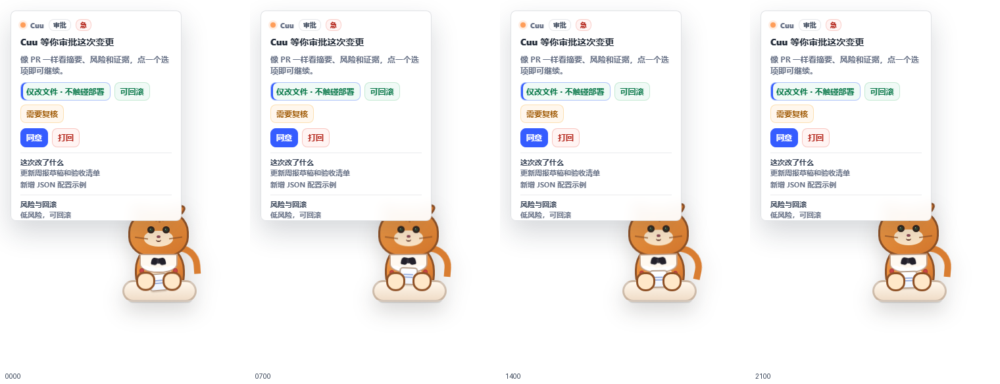

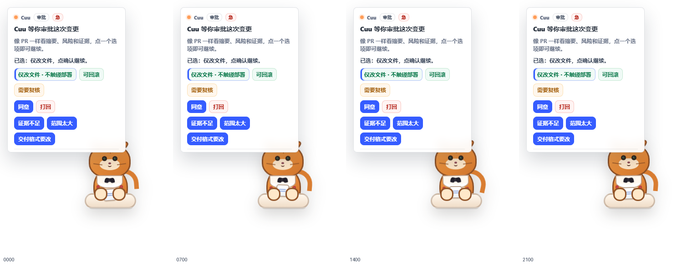

已落：

- `apps/desktop-webview/src/pet-surface.ts` 现在会把 `CuuCard.kind` / `priority` / `sections` / `progress` / `evidence_refs` / `input` 渲染进独立桌宠轻卡；正常审批态能同时看到 Cuu 全身、主按钮、变更摘要和风险摘要。
- 轻卡根节点新增 `data-pet-card-kind`、`data-pet-card-priority`、`data-pet-card-has-context`；bubble 新增 kind / priority badge、PR 式 section、证据摘要、progress、option-first input hint。
- 澄清卡的 chips 已变成可点击 option button；单选会本地切换选中态并提示「点确认继续」，打字仍保持折叠，不在桌宠窗里放 textarea。
- P1.2b 已把 `selected_option_ids` 接成 contracts / API / api-client / desktop runtime 闭环：未选时桌宠提示先点选项，已选时 `nextQuestion(sessionId, { selected_option_ids })` 会把 option id 发回 session API。
- 操作区前置：chips 后立即展示「同意 / 打回」等按钮；打回原因状态下仍能看到固定原因按钮，不再把按钮挤到不可见区域。
- `pet-surface-qa.ts` 新增 `heavy_card_context` 门禁，防止审批 / proposal / evidence / budget 的 PR-like context 被再次丢掉。
- 浏览器 CDP 抓帧已生成两组证据：正常审批态展示摘要与风险；打回原因态展示按钮和原因选择。两组截图中 Cuu 均为 Bongo-style 全身可见，不再只露耳朵，也没有多腿 AI 幻觉。

仍未完成：

- 证据区域在轻卡高度内只适合摘要；完整证据列表、证据详情、引用定位和二次追问需要 deep-link 到主窗证据/项目检索页。
- Budget / evidence / sync / offline 四类卡已具备同一渲染能力，但仍需要分别制作真实事件 fixture 和截图验收。
- 这次是 browser CDP 视觉证据；下一轮要把 P1.2 card fixture 接进真实 Tauri `PrintWindow` motion capture，验证透明顶层窗口中的同一布局。

已落 P1.2b Target paths：

```text
packages/contracts/src/experience.ts
packages/api-client/src/client.ts
apps/api/src/routes/sessions.ts
apps/desktop-webview/src/desktop-cuu-runtime.ts
apps/desktop-webview/src/pet-surface.ts
apps/desktop-webview/src/pet-surface.test.ts
apps/desktop-webview/src/desktop-cuu-runtime.test.ts
apps/api/src/gold-path.test.ts
packages/api-client/src/api-client.test.ts
packages/contracts/src/contracts.test.ts
```

后续 P1.2c Target paths：

```text
apps/desktop-webview/src/shell-events.ts
apps/desktop-webview/src/pet-surface.ts
apps/desktop-webview/src/pet-surface.test.ts
docs/workhub/05-clients/assets/audit/<date>-cuu-pet-card-p1-2-tauri/
```

### 6.4 P1.3：Web 真页面路线

目标：把 Gold Path shell 从 render helper demo 变成真实 SPA。

优先顺序：

1. `apps/web/src/routes/home.tsx`：AI-first Home。
2. `apps/web/src/routes/intake.tsx`：Option Intake。
3. `apps/web/src/routes/proposal.tsx`：非代码 PR。
4. `apps/web/src/routes/workitem.tsx`：WorkItem Detail。
5. `apps/web/src/routes/replay.tsx`：Replay Work。
6. `apps/web/src/routes/cost.tsx`：Cost Dashboard。

共享组件：

```text
packages/ui/src/components/attention-card.ts
packages/ui/src/components/option-card.ts
packages/ui/src/components/cuu-side-panel.ts
packages/ui/src/components/proposal-change-renderer.ts
packages/ui/src/components/replay-timeline.ts
packages/ui/src/components/budget-summary.ts
```

验收：

- 首页 1440px 截图接近 `web-ai-first-home.png`。
- Intake 1440px 截图接近 `web-option-first-intake-wizard.png`。
- 移动端 375px 截图无横向滚动。
- 页面四态齐全：loading / empty / error / permission。
- 看板不是默认首页。

### 6.5 P1.4：Rust 主窗单件事干活桌

目标：desktop main window 不再只是 Web shell，而是符合 Rust 客户端概念。

Target Rust：

```text
client-tauri/src-tauri/src/window_controls.rs
client-tauri/src-tauri/src/tray.rs
client-tauri/src-tauri/src/config.rs
client-tauri/src-tauri/src/notify.rs
client-tauri/src-tauri/src/sse_worker.rs
```

Target TS：

```text
apps/desktop-webview/src/routes/one-thing-desk.ts
apps/desktop-webview/src/routes/settings.ts
apps/desktop-webview/src/routes/sync-center.ts
apps/desktop-webview/src/routes/diagnostics.ts
```

主窗页面：

| 页面 | 目标 |
|---|---|
| One Thing Desk | 当前需要用户决定的一件事 |
| Inbox | 审批、打回、冲突、预算、离线 |
| Local Files | 本地目录、同步状态、文件变更 |
| Settings | 设备 token、server、Cuu、通知、启动项 |
| Diagnostics | SSE、API、权限、pet runtime、日志 |

验收：

- 主窗隐藏后 Cuu 仍在。
- Cuu 点击复杂卡片可 deep-link 打开对应主窗页面。
- 设置页可切换 Cuu 显隐、勿扰、声音、减少动效。
- 托盘 tooltip 能显示连接 / 待审批状态。

### 6.6 P2：Live2D Cubism 导出与桌宠运行时

P1.1 解决 PSD 生产资料；P2 解决 Cubism 绑定、导出和真实桌宠运行时。

步骤：

1. 导入清理后的 `cuu-live2d-generated-psd-v1.psd` 到 Live2D Cubism。
2. 建 mesh / deformer：`Head`、`Body`、`Ear_L/R`、`Eye_L/R`、`Mouth`、`Tail_01..Tip`、`Bow`、`LaceBib`、`Tassel_L/R`。
3. 建参数：`ParamAngleX/Y/Z`、`ParamBodyAngleX/Y`、`ParamEyeLOpen/ROpen`、`ParamEyeBallX/Y`、`ParamMouthOpenY/Form`、`ParamTailSway/Curl`、`ParamBibSway`、`ParamBowBounce`、`ParamTasselSwingL/R`。
4. 建 physics：尾巴链、左右流苏链、蝴蝶结轻回弹、耳朵微动。
5. 建 motions：`idle`、`blink`、`look_at_mouse`、`thinking`、`approval_waiting`、`searching_evidence`、`celebrate`、`worried/offline`。
6. 导出 `.model3.json`、`.moc3`、textures、`physics3.json`、`motions/*.motion3.json`、`expressions/*.exp3.json`。
7. Tauri pet surface 用 Cubism SDK for Web 加载，atlas / Hatch sprite 仅作为 fallback。
8. 录制 Windows / Linux / macOS 至少各一套 motion capture；Linux 可用用户提供的测试环境做透明窗口与动作截图。

验收：

- 眼睛会看鼠标，眨眼不是遮罩假眨。
- 尾巴和流苏有轻物理，动作连续不卡顿。
- idle 10 秒内有呼吸、眨眼、尾巴/流苏微动；60 秒内有至少两类随机微动作。
- 审批、澄清、检索、完成、离线至少 5 个业务状态有对应动作。
- idle CPU/GPU 可接受；reduced-motion 下停用复杂动作并保留轻提示。
- 多秒 GIF/MP4 肉眼通过，不再出现五条腿、角色漂移、绿边、只露耳朵或只有缩放变化。

---

## 7. QA 与截图门禁

### 7.1 新增截图门

| QA | 输出 | 必须检查 |
|---|---|---|
| Web screenshot | `docs/.../assets/audit/<date>/web-*.png` | 首页、intake、proposal、replay、cost |
| Desktop screenshot | `desktop-*.png` | 主窗、Cuu demo、settings、sync |
| Pet startup smoke | `tauri-pet-printwindow.png` | 可见、topmost、右下角 |
| Pet motion capture | frames + GIF + MP4 + diff JSON | 5 秒内不是静态；事件卡不裁切 |
| Mobile screenshot | 375px PNG | 无横向滚动、按钮不溢出 |
| Concept comparison | Markdown audit | 当前 vs 概念差距更新 |

### 7.2 Motion QA 通过阈值

建议初始阈值：

| 指标 | 阈值 |
|---|---|
| idle 5 秒变化帧 | 至少 8 帧相对前一帧 `changed_pixels_gt8 > 300` |
| idle 最大变化 | `max_vs_first_changed_pixels_gt8 > 1000` |
| 事件卡尺寸 | card mode 宽 >= 360，高 >= 520 |
| Cuu 可见像素 | orange pixels >= 80，visual pixels >= 180 |
| 首帧 probe | `orange_pixels >= 8000` 且 `visual_pixels >= 12000` 后才允许写入正式 frame 000 |
| 空白帧 | 不允许连续 3 帧 visual pixels < 180 |

### 7.3 文档更新门

每轮 UI / Cuu / Rust 主窗施工后必须更新：

1. 本文或新的 `current-state-visual-audit-<date>.md`。
2. `page-concepts.md` 的审计资产索引。
3. `prd-concept-reproduction-gap-audit.md` 的差距状态。
4. 涉及 Cuu 时更新 `cuu-desktop-pet-concept.md`。
5. 涉及 Rust 时更新 `desktop-pet-tauri.md`。

---

## 8. 下一轮推荐施工切片

不要先铺更多页面。当前最影响「像不像产品」的是 Cuu 和首页。

推荐顺序：

1. **深化 pet card layout**：审批、澄清、证据、离线、预算五类轻卡继续按人话卡、选项优先和 HiDPI 安全边距打磨，并让卡片出现前先触发对应动作。
2. **Bongo 动作二轮增强**：抱文件和审批敲桌仍偏保守，下一轮加大文件上浮、双爪节奏和完成反馈，但继续保持低恐怖谷、固定部件。
3. **Pet window 设置与窗口能力**：补缩放、透明度、贴边、hover 避让、显示/隐藏快捷入口和拖拽后位置截图。
4. **Live2D PSD 精修并行线**：打开并审查 `generated-psd-draft-v1.psd`，修绿边、尾巴、耳朵、遮挡补画；精修前不得替换 Bongo 默认。
5. **Cubism 基础绑定实验**：完成 idle / blink / look_at_mouse / tail sway / tassel physics，只有多秒录屏肉眼通过后才允许进入默认候选。
6. **Web Home 真页面**：按 AI-first concept 改首屏。
7. **Option Intake 真页面**：补 stepper、附件、summary、Cuu 推荐。
8. **Desktop One Thing Desk**：主窗变成本地单件事干活桌。

这条路径最符合项目设计哲学：**用户先看到 Cuu 活起来，再看到 WorkHub 把复杂任务收成几个可点选择，而不是先学会一堆看板。**
