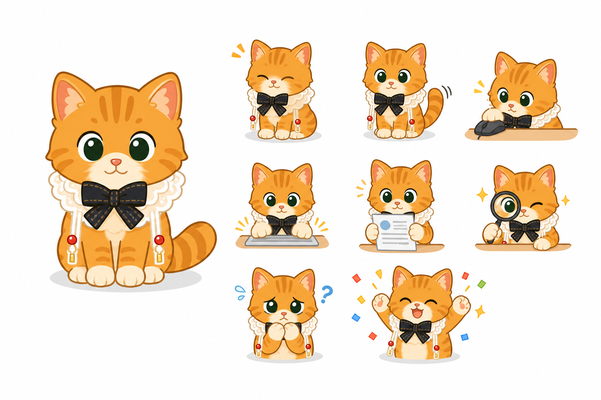
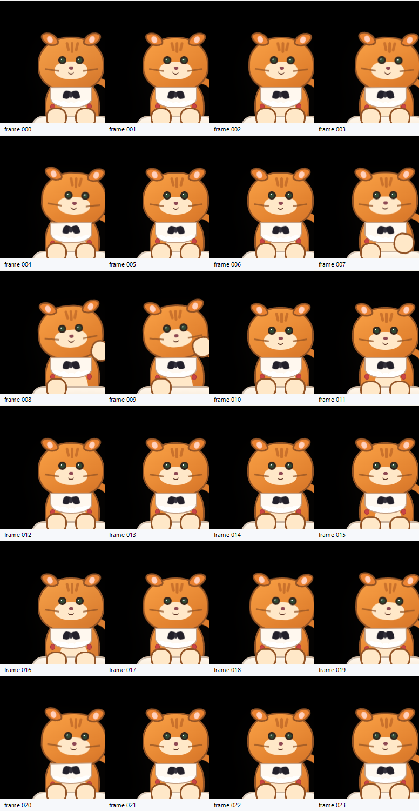
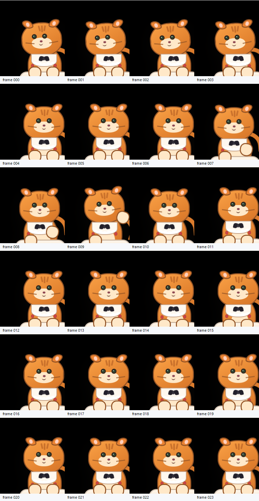
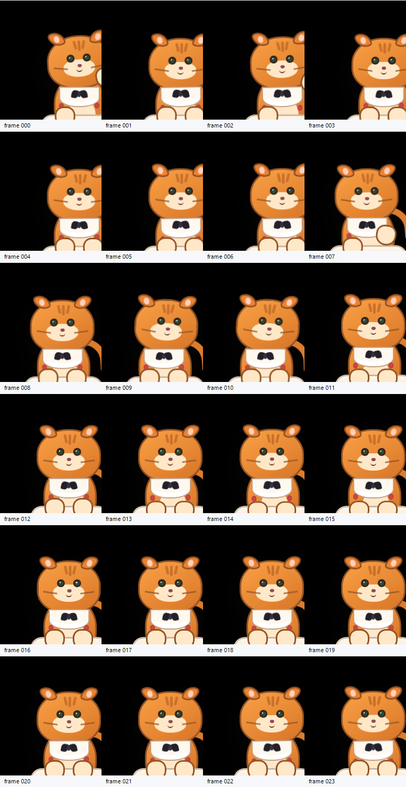
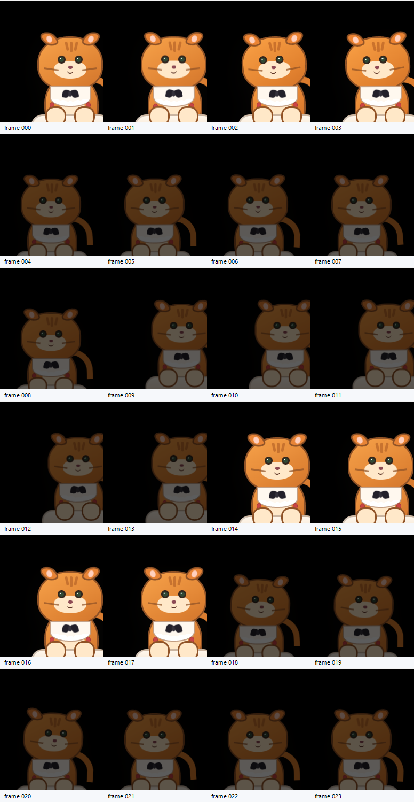
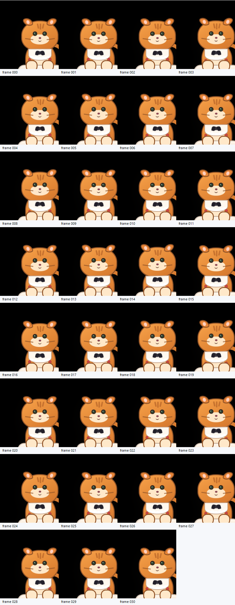

# Cuu Bongo-style 低恐怖谷桌宠路线

> 结论：当前 `generated-psd-draft-v1` 只能作为技术探针，不应该默认展示给用户。Cuu P1 默认视觉改为 **BongoCat 式扁平、稳定、低恐怖谷 renderer**；PSD / Live2D 继续保留为实验线，只有精修 PSD + Cubism + 多秒录屏全部通过后，才允许回到默认。
>
> **2026-06-08 复核更新**：用户再次确认 PSD draft 已触发恐怖谷风险，尤其是拟真眼睛、写实毛发、尾巴/流苏叠层和局部 AI 形体不稳定。后续不再把 `generated-psd-draft-v1` 当成可美化后直接默认的候选，而是把它冻结为工程探针；默认体验继续走低恐怖谷 Bongo Cuu。若要重启 Live2D，必须新开 `cuu-live2d-cubism-v2` 资产线，并先满足本篇和 [`cuu-live2d-layered-asset-plan.md`](./cuu-live2d-layered-asset-plan.md) 的 model pack 晋级门。

参考项目：[ayangweb/BongoCat](https://github.com/ayangweb/BongoCat)。本仓库只学习架构和交互思路，不复制它的模型或素材；本地参考代码放在 `reference/ayangweb-BongoCat/`，禁止提交。

---

## 0. 当前截图




第二张图是 **Cuu Bongo / Live2D v2 低恐怖谷风格板**。它由 GPT Image 生成后同步到文档资产目录，用来替代 PSD draft 的写实参考方向：大形体圆润、五官简化、动作缩略图清楚、保留白围兜/黑蝴蝶结/红珠识别点，但不追求拟真毛发和照片级眼睛。它只作为美术风格基准，不是最终 PSD、sprite 或 Cubism 源。

本轮 browser pet surface 抓图确认：

| 检查项 | 结果 |
|---|---|
| 默认 renderer | `data-cuu-visual-mode="bongo_cuu"` |
| Bongo runtime | `data-cuu-bongo-runtime="bongo_cuu"` |
| 默认模型包 | `data-cuu-model-pack="cuu-bongo-p1"` |
| 低恐怖谷门 | `data-cuu-default-visual-gate="low_uncanny"` |
| 状态 | `p1_default_low_uncanny` |
| 组件数 | `31` 个 DOM/CSS 组件 |
| PSD 暴露 | `live2d=null`，`layers=[]`，默认 HTML 不含 `data-psd-layer` |
| 截图 | 全身可见，不是只露耳朵 / 局部 / 空白 |
| 动作 | 尾巴、头、眨眼、爪子、耳朵、文档卡状态由 CSS keyframes 驱动 |

2026-06-08 P1b/P1c 追加证据：












| 检查项 | 结果 |
|---|---|
| 默认 idle 多帧 | 8 帧 browser CDP；尾巴/头/眼可见变化，最高 `18.97%` 像素相对首帧变化 |
| 状态墙多帧 | 12 个状态同屏；wave/search/sync/revise/celebrate 等动作可肉眼区分，最高 `25.17%` 像素相对首帧变化 |
| 真实 Tauri 录屏 | `scripts/qa/cuu-tauri-motion-capture.ps1` 通过；输出 contact sheet、GIF、MP4 和 diff report |
| first-painted gate | 通过；`first_frame_gate.passed=true`，第 7 次 probe 后达到 `orange_pixels=9408`、`visual_pixels=15530` |
| 真实窗口首帧 | 通过；P1c contact sheet 的 frame 000 已是 body-only Cuu 全身可见，不再把 blank 帧收进证据 |
| 输入手感真实录屏 | 通过；P1e 场景用真实鼠标触发 cursor-near、hover、tap、drag、release，全程 body-only Cuu 可见，无离线卡片污染，窗口坐标从 `(1844,860)` 移到 `(1748,804)` |
| 连续看鼠标 / hover 避让 | 通过；P1e-c `look-avoidance` 真实 Tauri 场景包含 `cursor_near_left_outside`、`cursor_near_right_outside`、`hover_top_right_inside`、`tap_body`、`drag_start/move/release`，first-frame `orange_pixels=10737`、`visual_pixels=16870`，最大相邻变化 `3352` 像素，窗口坐标最终移动到 `(1748,804)` |
| pointer smoothing / drag grip | 通过 P1e-d-a；参考 BongoCat `DAMPING_DECAY` 思路，WorkHub 新增 `desktopPetPointerSmoothingAlpha=0.58`、`data-pet-pointer-smoothing-alpha` QA 属性和 `drag-smoothing` 真实 Tauri 场景。report 记录 9 个 scenario events，first-frame `orange_pixels=9090`、`visual_pixels=14540`，窗口从 `(1844,860)` 连续拖到 `(1710,780)` |
| hide-on-hover 软隐藏 / 恢复 | 通过 P1d-b-a；参考 BongoCat `hideOnHover` 思路，但 WorkHub P1 先做可恢复 soft dodge，不做不可找回的全透明穿透。report 记录 5 个 scenario events：`cursor_near_left_outside`、`hover_top_right_inside_soft_hide`、`hover_inside_hold`、`cursor_leave_recover`、`hover_inside_again`；first-frame `orange_pixels=9291`、`visual_pixels=15423`，contact sheet 可见 frame 004-013 软隐藏、frame 014-017 恢复、frame 018 后再次软隐藏 |
| 60s idle jitter / flicker | 通过 P1e-d-b；`idle-long-run` 真实 Tauri 场景抓取 31 帧、间隔 2000ms，`long_run.passed=true`，first-frame `orange_pixels=9406`、`visual_pixels=15530`，最低帧仍有 `orange_pixels=9287`、`visual_pixels=15417`，无低可见帧、无窗口漂移，24 个相邻帧超过变化阈值 |
| 当前结论 | BONGO-P1b 动作增强通过；BONGO-P1c 首帧稳定通过；BONGO-P1d-a 窗口手感契约通过；BONGO-P1d-b-a hide-on-hover 软隐藏/恢复通过；BONGO-P1e-b 输入手感底座通过；BONGO-P1e-c 连续看鼠标与 hover 避让通过；BONGO-P1e-d-a 已补输入平滑与拖拽抓握保持；BONGO-P1e-d-b 已补 60 秒长驻可见 / 防闪烁门。下一步转向真实设置页截图、多屏恢复、model pack loader、动作幅度二轮和 Live2D 精修 |

证据文件：

```text
docs/workhub/05-clients/assets/audit/2026-06-08-cuu-bongo-runtime/
  pet-bongo-cuu-cdp-contact-sheet-grid.png
  pet-bongo-cuu-cdp-frame-0000.png
  pet-bongo-cuu-cdp-frame-0700.png
  pet-bongo-cuu-cdp-frame-1400.png
  pet-bongo-cuu-cdp-frame-2100.png
  pet-bongo-cuu-cdp-frame-2800.png
  pet-bongo-cuu-cdp-frame-3500.png
  pet-bongo-cuu-cdp-frame-4200.png
  pet-bongo-cuu-cdp-frame-4900.png
  pet-bongo-cuu-cdp-dom.json
  pet-bongo-cuu-cdp-diff-report.json
  pet-bongo-cuu-cdp-report.json
```

---

## 1. 为什么转向 Bongo-style

用户复核后给出的判断非常明确：当前 PSD draft 有恐怖谷风险，不能默认展示。桌宠是常驻桌面角色，视觉失败比功能缺失更伤体验。

BongoCat 值得参考的不是“键盘猫”这个具体题材，而是这几个工程原则：

| 原则 | Cuu 落地 |
|---|---|
| 低拟真 | 用圆润扁平造型，不追求真实毛发、复杂五官和照片感 |
| 少状态、强反馈 | idle、tap、thinking、approval、worried、celebrate 等少量动作先做清楚 |
| 输入映射直观 | 键盘/鼠标映射手和眼；WorkHub 映射审批、证据、文件、离线 |
| 模型可替换 | 默认 renderer 简洁，后续可以换成 Live2D / Cubism / 自定义模型 |
| 窗口能力独立 | 透明、置顶、缩放、穿透、拖动、贴屏是桌宠底座能力 |
| 离线隐私友好 | 桌宠本体可离线运行，事件和数据由 WorkHub 安全通道提供 |

对 Cuu 来说，P1 的成功标准不是“像真猫”，而是“用户愿意让它待在右下角”。

### 1.1 BongoCat 参考实现吸收点

已下载到 `reference/ayangweb-BongoCat/` 的参考项目只用于学习，不提交进仓库。对 WorkHub 有价值的实现点如下：

| BongoCat 能力 | 参考落点 | WorkHub 当前状态 | 后续落点 |
|---|---|---|---|
| 可替换模型 | `src/stores/model.ts`、`src/composables/useModel.ts` | 新增 `packages/cuu/src/model-pack.ts` 作为 Cuu 模型包契约；默认包为 `cuu-bongo-p1` | P2 做 `Cuu model preset + custom model slot`，Live2D 通过后作为另一个 pack |
| 输入到动作参数 | `useDevice.ts`、`useModel.ts` 的键鼠/光标映射；`useDevice.ts` 的 `DAMPING_DECAY=0.75` 鼠标阻尼 | WorkHub 已有 hover / tap / drag / cursor_near 调度；业务事件映射审批、证据、同步、预算；P1d-a 已把 scale / opacity / pass-through 接成偏好和 Rust bridge；P1d-b-a 已把 `pet_hide_on_hover` 接进偏好、TS bridge、Rust settings 和真实 Tauri `hide-on-hover` 录屏；P1e-a 已把 cursor-near 进入事件映射为立即 `look_at_mouse`，并把 pointer state 写入 DOM；P1e-b 已用真实 Tauri 录屏验证 hover/tap/drag 底座；P1e-c 已把 Rust `look_x_percent/look_y_percent` 归一为 TS `look_x/look_y`，驱动头/眼/面部凝视和 hover 反向避让；P1e-d-a 已把 250ms Rust sample 接上 `desktopPetPointerSmoothingAlpha=0.58`，并在 dragging 时保护本地 DOM pointer pose 不被 Rust sample 覆盖，同时会在 Rust outside sample 明确离开时清掉 hover，避免 Cuu 软隐藏后不恢复 | 后续把同一 pointer contract 接入 Live2D `ParamAngleX/Y`、`ParamEyeBallX/Y` 与 Cubism 物理，并把 full hide/pass-through 安全策略做成可配置窗口能力 |
| 独立透明窗口 | Tauri window plugin、always-on-top、skip taskbar | WorkHub 已有 `pet` 透明顶层窗口、body/card mode、拖动、保存位置、缩放几何、CSS 透明度、点击穿透命令和 hover soft hide/recover | P1d-b 继续补 keep-in-screen 多屏实测、Settings 视觉页与截图、full hide-on-hover/pass-through 安全恢复 |
| 低恐怖谷默认 | BongoCat 低拟真角色动作 | WorkHub 默认 `bongo_cuu`，PSD draft 被降级为实验 | 默认候选必须过 `assertCuuModelPackCanBeDefault()` |
| 离线隐私友好 | README 明确离线运行 | Cuu 本体可在 webview 里离线渲染，数据从 WorkHub 安全通道来 | 设备输入监听只做本地手感，不采集无关数据 |

### 1.2 参考实现转 WorkHub 施工切片

BongoCat 给 WorkHub 的下一步不是复制角色素材，而是把桌宠拆成 **模型包、运行时、输入、窗口、安全恢复、QA** 六条工程线：

| 切片 | 参考依据 | WorkHub 目标 | 首个可验收交付 |
|---|---|---|---|
| BONGO-P2a model pack loader | BongoCat `stores/model.ts` 维护 preset / current model | `CuuModelPackManifest` 从纯常量升级为可枚举、可选择、可禁止默认的 loader；默认仍是 `cuu-bongo-p1` | `GET /api/pages/cuu-settings` 或本地 settings VM 能列出 `cuu-bongo-p1` 和 `cuu-live2d-cubism-v2`，后者显示实验不可默认 |
| BONGO-P2b Live2D adapter spike | BongoCat `utils/live2d.ts` 用 `easy-live2d` + Pixi 读取 `.model3.json` | 新增 `cuu-live2d-cubism-runtime.ts`，只接受导出的 `.model3.json` / `.moc3` / texture，不接受 PSD draft 直接默认 | 浏览器 pet surface 能加载一个 mock/fixture Cubism pack；失败时自动回 `bongo_cuu` |
| BONGO-P2c pointer parameter bridge | BongoCat `useModel.handleMouseMove()` 映射 `ParamAngleX/Y`、`ParamEyeBallX/Y` | 复用 WorkHub 已有 `look_x/look_y/hover_avoidance`，映射到 Cubism 参数；不另起鼠标协议 | Tauri `look-avoidance` QA 同时能验证 Bongo DOM pose 和 Cubism parameter trace |
| BONGO-P2d behavior trigger map | BongoCat 支持 motion / expression 快捷键 | WorkHub 把 approval/search/sync/revision/celebrate 映射到 `motion3.json` 或 expression，而不是只靠 CSS keyframes | `CuuMotionHint.sprite_state -> CubismMotionBinding` 表覆盖 18 个状态 |
| BONGO-P2e safe hide / pass-through | BongoCat `hideOnHover` 可全透明并忽略鼠标事件 | WorkHub P1 继续 soft dodge；full hide 只在托盘、快捷键、边缘热区和超时恢复全部有 QA 后开放 | `hide-on-hover-full` 真实 Tauri 录屏：隐藏、穿透、托盘恢复、热区恢复均可见 |
| BONGO-P2f visual anti-uncanny gate | BongoCat 低拟真角色稳定 | Cuu 禁止默认使用写实毛发、拟真眼珠、AI 逐帧漂移、多肢体、拼接错位 | model pack QA 输出 `low_uncanny=true`、`no_ai_artifact=true`，并附 contact sheet |

这意味着后续 Live2D 不是“继续修当前 PSD draft”，而是按新概念板重做低恐怖谷 Cuu v2：统一正面基准、简化眼睛、简化毛发、减少尾巴分段错觉，先做 Cubism 可控参数，再谈动作丰富度。

新增代码门禁：

```text
packages/cuu/src/model-pack.ts
packages/cuu/src/model-pack.test.ts
apps/desktop-webview/src/cuu-bongo-runtime.ts
```

2026-06-08 新增代码口径：`packages/cuu/src/model-pack.ts` 已加入 `plannedCuuLive2DCubismModelPack`。它可以被设置页和文档展示为未来路线，但 `assertCuuModelPackCanBeDefault()` 会拒绝它作为默认；`cuu-bongo-p1` 的默认窗口能力也已收紧到 `transparent_window / always_on_top / draggable / pass_through / scale / opacity / hide_on_hover / keep_in_screen` 全部 supported。

2026-06-08 P1e-c 输入凝视 / hover 避让真实证据：

```text
docs/workhub/05-clients/assets/audit/2026-06-08-cuu-bongo-p1e-look-avoidance/
  cuu-motion-contact-sheet.png
  cuu-motion-printwindow.gif
  cuu-motion-printwindow.mp4
  motion-diff-report.json
  frames/frame-000.png ... frame-023.png
```

2026-06-08 P1e-d-a 输入平滑 / 拖拽抓握真实证据：

```text
docs/workhub/05-clients/assets/audit/2026-06-08-cuu-bongo-p1e-d-drag-smoothing/
  cuu-motion-contact-sheet.png
  cuu-motion-printwindow.gif
  cuu-motion-printwindow.mp4
  motion-diff-report.json
  first-frame-probe.png
  frames/frame-000.png ... frame-023.png
```

2026-06-08 P1d-b-a hide-on-hover 软隐藏 / 恢复真实证据：

```text
docs/workhub/05-clients/assets/audit/2026-06-08-cuu-bongo-p1d-b-hide-on-hover/
  cuu-motion-contact-sheet.png
  cuu-motion-printwindow.gif
  cuu-motion-printwindow.mp4
  motion-diff-report.json
  first-frame-probe.png
  frames/frame-000.png ... frame-023.png
```

2026-06-08 P1e-d-b 60s idle jitter / flicker 真实证据：

```text
docs/workhub/05-clients/assets/audit/2026-06-08-cuu-bongo-p1e-60s-idle-jitter/
  cuu-motion-contact-sheet.png
  cuu-motion-printwindow.gif
  cuu-motion-printwindow.mp4
  motion-diff-report.json
  first-frame-probe.png
  frames/frame-000.png ... frame-030.png
```

`CuuModelPackManifest` 把“默认可展示”收敛为一个可测试合同：默认包必须低恐怖谷、非 PSD draft、全身可见、角色稳定、无 AI 肢体幻觉、有活体动作，并覆盖所有业务动作与 idle 微动作。`cuu-psd-draft-v1` 这类资产即使技术可挂载，也会因为 `default_not_approved`、`visual_gate_failed`、`psd_default_asset` 被拒绝为默认。

---

## 2. 当前实现落点

```text
apps/desktop-webview/src/cuu-bongo-runtime.ts
apps/desktop-webview/src/pet-surface.ts
apps/desktop-webview/src/pet-surface-qa.ts
apps/desktop-webview/src/pet-surface.test.ts
scripts/qa/cuu-pet-browser-capture.mjs
```

`cuu-bongo-runtime.ts` 使用 DOM/CSS 画出 Cuu 的低恐怖谷版本：

| 组件 | 作用 |
|---|---|
| head / body / cream muzzle | 保持小猫识别，不追求写实 |
| ears | idle 轻动，worried/offline 压耳 |
| eyes | idle 眨眼，offline 眯眼 |
| tail | idle / thinking / search 时独立摆动 |
| paws | approval / tap 时敲桌面 |
| bib / bow / beads | 保留参考照的围兜、黑蝴蝶结、红珠识别点 |
| desk / doc | BongoCat 式桌面动作，approval / carrying document 时出现 |
| search glass / rays | 检索状态的放大镜和短光线 |
| sync ring | 同步状态的绿色旋转环 |
| sparks | 完成/庆祝状态的跳跃反馈 |

默认 pet surface 现在只渲染 Bongo Cuu：

```text
renderDesktopPetSurface()
  -> renderDesktopCuuAtlasState/Sprite(...)   # fallback 诊断仍保留
  -> renderDesktopCuuBongo...                 # 默认主视觉
  -> data-cuu-visual-mode="bongo_cuu"
  -> data-cuu-live2d-status="experiment_hidden"
```

PSD / Live2D 文件仍保留，但不进入默认 HTML：

```text
apps/desktop-webview/src/cuu-live2d-psd-draft-runtime.ts  # 实验探针
apps/desktop-webview/src/cuu-live2d-runtime.ts            # 8 层 regression fixture
packages/cuu/src/live2d-psd-draft.ts                      # PSD draft validator
```

---

## 3. Runtime Contract

当前默认 renderer 的字段：

```ts
type DesktopCuuBongoRender = {
  runtime_kind: "bongo_cuu";
  status: "p1_default_low_uncanny";
  model_pack_id: "cuu-bongo-p1";
  state: CuuSpriteAtlasClipState | CuuIdleMicroAction;
  motion_state: CuuSpriteAtlasClipState;
  component_count: number;
  duration_ms: number;
  html: string;
  css: string;
};
```

默认 surface 必须满足：

| 字段 | 目标 |
|---|---|
| `visual_mode` | `bongo_cuu` |
| `data-cuu-bongo-runtime` | `bongo_cuu` |
| `data-cuu-model-pack` | `cuu-bongo-p1` |
| `data-cuu-default-visual-gate` | `low_uncanny` |
| `data-cuu-bongo-status` | `p1_default_low_uncanny` |
| `data-cuu-live2d-status` | `experiment_hidden` |
| `data-cuu-live2d-layer-count` | `0` |
| PSD layer DOM | 默认不得出现 |
| atlas fallback | 仍保留，且 `data-cuu-atlas-fallback="false"` 表示 fallback 资产可用 |

### 3.1 Pointer / Input Pose Contract

BONGO-P1e-c 已把“鼠标靠近”升级为连续输入 pose，而不是只切一个状态名：

| 层 | 字段 / 文件 | 职责 |
|---|---|---|
| Rust cursor sample | `client-tauri/src-tauri/src/pet_window.rs` | `PetWindowPointerDecision` 返回 `cursor_near`、`distance_to_window_px`、`look_x_percent`、`look_y_percent`；百分比以 pet window 中心为原点，包含 near radius，范围 `-100..100` |
| Rust command | `client-tauri/src-tauri/src/pet_commands.rs` / `sample_pet_cursor_near` | 返回 typed pointer plan，供 webview 轮询；不拥有 Cuu 动画状态 |
| TS bridge | `apps/desktop-webview/src/pet-window-bridge.ts` | `desktopPetPointerSnapshotFromSample()` 把百分比归一为 `look_x/look_y: -1..1`，并可按 `smoothing_alpha` 做低通插值；`pointerPatchFromEvent()` 从 hover / drag DOM event 推导本地 `look_x/look_y` 与 hover 避让；drag / hover 的本地 pose 不被 Rust sample 覆盖 |
| Surface VM | `apps/desktop-webview/src/pet-surface.ts` | `DesktopPetPointerSnapshot` 输出 `data-pet-look-x/y`、`data-pet-hover-avoidance`、`data-pet-pointer-smoothing-alpha`、`--wh-pet-look-*`、`--wh-pet-avoid-*`；轮询频率为 `250ms`，默认 smoothing alpha 为 `0.58`，避免窗口外靠近时错过动作或左右凝视突然跳变 |
| Bongo renderer | `apps/desktop-webview/src/cuu-bongo-runtime.ts` | `look_at_mouse` 状态用 CSS 变量驱动头、眼、鼻口、胡须方向；hover 时 body 轻微反向避让，drag 时取消避让并保持抓握感 |
| QA | `apps/desktop-webview/src/pet-surface-qa.ts`、`scripts/qa/cuu-tauri-motion-capture.ps1` | 静态 QA 检查 pointer-reactive pose、smoothing alpha 与 hover soft-hide DOM；真实 Tauri `look-avoidance` 场景录制左看、右看、hover、tap、drag；`drag-smoothing` 场景录制左右凝视跳转、hover、tap、连续拖动和 release；`hide-on-hover` 场景录制 hover 软隐藏、离开恢复、再次 hover |

这套合同是后续 Live2D 的输入端口：Cubism model pack 不应重新定义鼠标协议，而应直接消费 `look_x/look_y` 映射到 `ParamAngleX/Y`、`ParamEyeBallX/Y`、耳朵轻摆、尾巴警觉和 hover avoidance。

---

## 4. Motion Mapping

| WorkHub / Cuu state | Bongo Cuu 表现 |
|---|---|
| `idle_breathe` | 头部轻浮动，尾巴低幅度摆动 |
| `idle_blink` | 眨眼 |
| `idle_tail_sway` | 尾巴明显摆动 |
| `look_at_mouse` | P1e-c 已有连续 `look_x/look_y`：头、眼、鼻口、胡须跟随鼠标方向，hover 时身体轻微避让 |
| `asking_approval_bounce` | 双爪敲桌，文档卡弹出 |
| `thinking_tail` | 尾巴更快摆动 |
| `searching_evidence_peek` | 尾巴/眼睛状态变为检索感，后续补放大镜/文件动作 |
| `carrying_document_step` | 文档卡出现，双爪托住 |
| `worried_ears` | 压耳，低头感 |
| `celebrating_jump` | 整体轻跳 |
| `offline_sleep` | 眯眼、压耳、低存在感 |
| `tap_bubble` | 单次爪击反馈 |
| `drag_hold` | 双爪压住桌面，尾巴收紧，表达正在拖动/抓握 |
| `wave_hello` | 单爪抬起挥手，头和尾巴同步更大幅度动作 |

---

## 5. QA 门禁

默认 Cuu 必须先过这些低恐怖谷门：

- 全身可见，不允许只露耳朵、只露局部或被气泡裁切。
- 默认 HTML 不允许出现 `data-psd-layer`。
- DOM 必须出现 `data-cuu-bongo-runtime="bongo_cuu"`。
- DOM 必须出现 `data-cuu-model-pack="cuu-bongo-p1"` 和 `data-cuu-default-visual-gate="low_uncanny"`。
- 必须有 paws / eyes / tail 三类组件。
- 搜索、同步、庆祝三类状态必须有对应道具层：`search-glass` / `sync-ring` / `spark`。
- 任何多腿、多眼、尾巴断裂、脸部拟真漂移都直接失败。
- reduced-motion 必须关闭 keyframes。
- Bongo Cuu 可以简单，但不能冷冰冰；至少要有待机、眨眼、尾巴、爪击和担心动作。

截图门：

```text
node scripts/qa/cuu-pet-browser-capture.mjs
```

默认输出到：

```text
docs/workhub/05-clients/assets/audit/2026-06-08-cuu-bongo-runtime/
```

P1b 动作增强输出到：

```text
docs/workhub/05-clients/assets/audit/2026-06-08-cuu-bongo-p1b-runtime/
  pet-bongo-p1b-idle-contact-sheet-grid.png
  pet-bongo-p1b-gallery-contact-sheet-grid.png
  pet-bongo-p1b-idle-diff-report.json
  pet-bongo-p1b-gallery-diff-report.json
```

真实 Tauri 门：

- 已用 `scripts/qa/cuu-tauri-motion-capture.ps1 -WaitSeconds 12 -FrameCount 24 -IntervalMs 180` 抓真实 `Cuu` 顶层窗口。
- 证据目录：`docs/workhub/05-clients/assets/audit/2026-06-08-cuu-bongo-p1c-first-paint/`。
- browser CDP 只能作为快速视觉检查，不能替代最终透明窗口录屏。
- motion capture 会先用 `first-frame-probe.png` 等到 `orange_pixels>=8000` 且 `visual_pixels>=12000`，通过后才开始写入 `frame-000.png`。
- 输入手感场景使用 `scripts/qa/cuu-tauri-motion-capture.ps1 -Scenario input-handfeel -WaitSeconds 12 -FrameCount 24 -IntervalMs 180`。
- 输入手感证据目录：`docs/workhub/05-clients/assets/audit/2026-06-08-cuu-bongo-p1e-input-handfeel/`。
- `input-handfeel` 场景会在启动 Tauri 前设置 `WORKHUB_DISABLE_SSE=1`，只隔离 QA 录屏中的离线卡片干扰；正式客户端仍启动 SSE worker 并显示离线/重连 Cuu 卡。
- 输入手感 report 必须包含 `scenario="input-handfeel"`、`sse_disabled_for_scenario=true`、6 个 scenario events、`first_frame_gate.passed=true`，并且所有帧保持 body-only Cuu 全身可见。
- 凝视与 hover 避让场景使用 `scripts/qa/cuu-tauri-motion-capture.ps1 -Scenario look-avoidance -WaitSeconds 12 -FrameCount 24 -IntervalMs 180`。
- 凝视与 hover 避让证据目录：`docs/workhub/05-clients/assets/audit/2026-06-08-cuu-bongo-p1e-look-avoidance/`。
- `look-avoidance` report 必须包含 `scenario="look-avoidance"`、`sse_disabled_for_scenario=true`、7 个 scenario events：`cursor_near_left_outside`、`cursor_near_right_outside`、`hover_top_right_inside`、`tap_body`、`drag_start`、`drag_move`、`drag_release`。
- `look-avoidance` 通过条件：首帧 `orange_pixels>=8000` 且 `visual_pixels>=12000`；contact sheet 肉眼可见左右凝视差异、hover 轻避让/抬爪和 drag 后窗口坐标移动；本轮通过值为 `orange_pixels=10737`、`visual_pixels=16870`、`max_vs_previous_changed_pixels_gt8=3352`。
- 输入平滑与 drag grip 场景使用 `scripts/qa/cuu-tauri-motion-capture.ps1 -Scenario drag-smoothing -WaitSeconds 12 -FrameCount 24 -IntervalMs 180`。
- 输入平滑与 drag grip 证据目录：`docs/workhub/05-clients/assets/audit/2026-06-08-cuu-bongo-p1e-d-drag-smoothing/`。
- `drag-smoothing` report 必须包含 `scenario="drag-smoothing"`、`sse_disabled_for_scenario=true`、9 个 scenario events：`cursor_near_left_outside`、`cursor_near_right_outside`、`cursor_near_left_outside_again`、`hover_top_right_inside`、`tap_body`、`drag_start`、`drag_move`、`drag_move_second`、`drag_release`。
- `drag-smoothing` 通过条件：首帧 `orange_pixels>=8000` 且 `visual_pixels>=12000`；DOM 静态 QA 出现 `data-pet-pointer-smoothing-alpha="0.58"`；contact sheet 肉眼可见左右凝视过渡、hover 抬爪、drag 阶段保持 body-only 全身可见；本轮通过值为 `orange_pixels=9090`、`visual_pixels=14540`、`max_vs_previous_changed_pixels_gt8=4256`，窗口从 `(1844,860)` 移到 `(1710,780)`。
- hide-on-hover 软隐藏场景使用 `scripts/qa/cuu-tauri-motion-capture.ps1 -Scenario hide-on-hover -WaitSeconds 12 -FrameCount 24 -IntervalMs 180`。
- hide-on-hover 证据目录：`docs/workhub/05-clients/assets/audit/2026-06-08-cuu-bongo-p1d-b-hide-on-hover/`。
- `hide-on-hover` 启动前会把鼠标移到安全位置，并通过 `WORKHUB_CUU_QA_HIDE_ON_HOVER=1` 只对 QA 注入 `pet_hide_on_hover=true`；report 必须包含 `scenario="hide-on-hover"`、`sse_disabled_for_scenario=true`、`cuu_qa_hide_on_hover=true`、5 个 scenario events：`cursor_near_left_outside`、`hover_top_right_inside_soft_hide`、`hover_inside_hold`、`cursor_leave_recover`、`hover_inside_again`。
- `hide-on-hover` 通过条件：首帧 `orange_pixels>=8000` 且 `visual_pixels>=12000`；contact sheet 肉眼可见初始完整明亮、hover 后 soft hide、离开后恢复明亮、再次 hover 后重新 soft hide；本轮通过值为 `orange_pixels=9291`、`visual_pixels=15423`、`max_vs_previous_changed_pixels_gt8=5544`。
- 60s idle jitter 场景使用 `scripts/qa/cuu-tauri-motion-capture.ps1 -Scenario idle-long-run -WaitSeconds 12 -FrameCount 31 -IntervalMs 2000`。
- 60s idle jitter 证据目录：`docs/workhub/05-clients/assets/audit/2026-06-08-cuu-bongo-p1e-60s-idle-jitter/`。
- `idle-long-run` report 必须包含 `scenario="idle-long-run"`、`sse_disabled_for_scenario=true`、`frame_pixel_reports` 和 `long_run.passed=true`；通过条件：每帧可见像素不低于首帧 70%、窗口 rect 不漂移、至少 3 个相邻帧超过变化阈值，避免把死图误判为长驻稳定。
- 本轮 `idle-long-run` 通过值：31 帧、间隔 2000ms、first-frame `orange_pixels=9406` / `visual_pixels=15530`，最低帧 `orange_pixels=9287` / `visual_pixels=15417`，`changed_frames_gt8_count=24`，无 `low_visual_frames` 和 `rect_drift_frames`。

模型包门：

```text
pnpm --filter @workhub/cuu test
```

必须通过：

- `Cuu Bongo model pack is the approved low-uncanny default`
- `Cuu default model pack covers all business and idle actions`
- `Cuu PSD draft packs are blocked from becoming the default surface`

---

## 6. 后续施工

| 阶段 | 目标 | 产物 | 验收 |
|---|---|---|---|
| BONGO-P1a | 默认低恐怖谷 renderer | `cuu-bongo-runtime.ts` | 已落；浏览器截图和 DOM 证明默认不是 PSD |
| BONGO-P1b | 加强动作可读性 | 更明显的眨眼、挥手、抱文件、检索、庆祝、拖拽姿态 | **已落**：多帧截图中 wave/search/sync/revise/celebrate 可辨 |
| BONGO-P1c | 真实 Tauri 录屏 | Windows `PrintWindow` GIF/MP4/contact sheet | **已通过**：Rust 启动只预定位，pet surface 首屏后同步窗口模式；motion QA 首帧像素门槛通过，frame 000 不再空白 |
| BONGO-P1d-a | 设置和窗口能力契约 | scale / opacity / pass-through 偏好、DOM/CSS、TS bridge、Rust command、几何缩放 | **已落**：`set_pet_window_settings`、`pet_scale_percent` / `pet_opacity_percent` / `pet_pass_through`、scaled body/card placement 和静态 QA 均已可测 |
| BONGO-P1d-b | 设置体验与窗口手感 QA | hide-on-hover / keep-in-screen / 多屏恢复 / 设置页截图 | **已落 P1d-b-a**：`pet_hide_on_hover` 偏好、DOM/Rust settings、QA 注入和真实 Tauri soft hide/recover 录屏通过；仍待真实设置页截图、多屏恢复和 full hide/pass-through 安全策略 |
| BONGO-P1e-a | 输入手感合同 | `cursor_near` interaction、立即 `look_at_mouse`、DOM pointer QA attrs | **已落单测**：靠近不再等几秒；`data-pet-cursor-near` / `hovered` / `dragging` 可被截图脚本读取 |
| BONGO-P1e-b | 输入手感真实 QA | hover / tap / drag 真实 Tauri 录屏，QA 隔离 SSE 干扰 | **已通过底座**：contact sheet/GIF/MP4/report 已落；全程 Cuu 可见，hover 有抬爪反馈，drag 会移动窗口；后续继续做鼠标平滑视线和 hover 避让 |
| BONGO-P1e-c | 连续看鼠标与 hover 避让 | Rust `look_x/y_percent`、TS pointer snapshot、CSS pose variables、hover 反向避让、`look-avoidance` 真实 Tauri 录屏 | **已通过**：左右靠近、hover、tap、drag 7 个事件录屏；全程 Cuu 可见，首帧像素门过，drag 后窗口移动 |
| BONGO-P1e-d | 输入手感细抛光 | pointer smoothing / easing、hover 避让阈值、drag grip 持续姿态、长驻 60s jitter QA | **已落 P1e-d-a / P1e-d-b**：pointer smoothing alpha、drag grip 持续姿态、`drag-smoothing` 真实 Tauri 录屏通过；`idle-long-run` 60 秒长驻可见 / 防闪烁 QA 通过；仍待多屏边界避让和动作幅度二轮 |
| BONGO-P2 | 可替换模型机制 | Cuu model preset + custom model slot + `CuuModelPackManifest` loader | 可从默认 Bongo Cuu 切到未来 Live2D；任何 pack 都先跑 default gate |
| L2D-P2+ | 精修 PSD / Cubism | `cuu-live2d-v0.psd`、`.model3.json` | 只有美术 QA 通过后才允许替换 Bongo 默认 |

当前取舍：**P1 先让 Cuu 可爱、稳定、愿意常驻；P2/P3 再追求 Live2D 高表现力。**

### 6.1 P1d 详细施工路径

| 子任务 | TS/Rust 落点 | 验收 |
|---|---|---|
| 缩放 | `CuuPreferencePanel` 新增 75/100/125/150；`packages/cuu/src/controller.ts` 写入 `pet_scale_percent`；`pet-surface.ts` 输出 CSS 变量和缩放后的 body/card size；Rust `pet_window.rs` / `pet_commands.rs` 按 scale 计算窗口尺寸 | **P1d-a 已落单测**；下一步补 4 档真实 Tauri 截图，Cuu 不裁切，card mode 仍从 body anchor 向左上扩 |
| 透明度 | preference 写入 `pet_opacity_percent`；pet surface root 设置 `--wh-pet-opacity`；Rust command 返回 settings plan，暂不依赖平台窗口 opacity | **P1d-a 已落单测**；下一步截图对比 60/80/100，bubble 文本仍可读 |
| 点击穿透 | Rust command `set_pet_window_settings` 调用 Tauri `set_ignore_cursor_events(pass_through)`；TS bridge 校验 settings plan | **P1d-a 已落单测**；下一步实测桌宠不挡鼠标，并设计 hover/card 时临时关闭穿透的安全规则 |
| 悬停避让 | `packages/cuu/src/controller.ts` 写入 `pet_hide_on_hover`；`cuu-preferences.ts` 提供“悬停避让”开关；`pet-window-bridge.ts`/Rust settings plan 统一 `hide_on_hover`；`pet-surface.ts` 用 `data-pet-hover-hidden`、`--wh-pet-hide-*` 做可恢复 soft dodge；`desktopPetPointerSnapshotFromSample()` 在 Rust outside sample 时清掉 hover，防止软隐藏后不恢复 | **P1d-b-a 已落并录屏**；后续若做 BongoCat 式全透明隐藏，必须先设计托盘/快捷键/边缘热区恢复策略 |
| hover / cursor near | `sample_pet_cursor_near` + idle scheduler；P1e-a 已新增 `cursor_near` interaction，进入附近区域立即 `look_at_mouse`，surface 输出 `data-pet-cursor-near` / `data-pet-hovered` / `data-pet-dragging`；P1e-b 已有真实录屏底座 | 后续 P1e-c 做连续视线参数、hover 避让和重新录屏 |
| 屏幕边界 | 已有 `clamp_position`，补多显示器/缩放 QA | 贴边不出屏，重启恢复位置 |

P1d-a / P1d-b-a 已落代码路径：

```text
packages/cuu/src/controller.ts
apps/desktop-webview/src/cuu-preferences.ts
apps/desktop-webview/src/pet-window-bridge.ts
apps/desktop-webview/src/pet-surface.ts
apps/desktop-webview/src/pet-surface-qa.ts
client-tauri/src-tauri/src/pet_window.rs
client-tauri/src-tauri/src/pet_commands.rs
client-tauri/src-tauri/src/main.rs
scripts/qa/cuu-tauri-motion-capture.ps1
```

P1d-a / P1d-b-a 当前测试门：

```text
pnpm --filter @workhub/cuu test
pnpm --filter @workhub/desktop-webview test
pnpm --filter @workhub/cuu typecheck
pnpm --filter @workhub/desktop-webview typecheck
cargo test --manifest-path client-tauri/src-tauri/Cargo.toml
powershell -ExecutionPolicy Bypass -File scripts/qa/cuu-tauri-motion-capture.ps1 -Scenario hide-on-hover
```

### 6.2 P1e 输入手感施工路径

| 子任务 | TS/Rust 落点 | 验收 |
|---|---|---|
| cursor-near 立即反应 | `packages/cuu/src/idle-scheduler.ts` 新增 `CuuIdleInteraction="cursor_near"`，reason 为 `cursor_near_start`，动作映射 `look_at_mouse` | **P1e-a 已落单测**：首次进入附近区域立即转头看；睡着时仍先 `wake_up` |
| pointer state 可观测 | `apps/desktop-webview/src/pet-surface.ts` 接收 `DesktopPetPointerSnapshot`，输出 `data-pet-cursor-near`、`data-pet-hovered`、`data-pet-dragging` 和可选 `data-pet-last-pointer-ms` | **P1e-a 已落单测**：DOM 和 CSS contract 可被 browser CDP / Tauri capture 脚本读取 |
| Bongo model pack 手感状态 | `packages/cuu/src/model-pack.ts` 将 `scale` / `opacity` / `pass_through` 更新为 `supported`，保持默认门禁与真实窗口能力一致 | **P1e-a 已落单测**：`defaultCuuBongoModelPack` 不再把已实现窗口能力标成 planned |
| 真实录屏 | `scripts/qa/cuu-tauri-motion-capture.ps1` 新增 `input-handfeel` scenario：frame 1 cursor-near、frame 7 hover、frame 11 tap、frame 15 drag start、frame 16 drag move、frame 18 release；场景启动时设置 `WORKHUB_DISABLE_SSE=1` | **P1e-b 已通过底座**：24 帧真实 Tauri `PrintWindow` 录屏无离线卡污染；首帧 `orange_pixels=9416`、`visual_pixels=15536`；最大相邻变化 `1695` 像素；窗口坐标随拖拽移动 |
| 连续凝视与 hover 避让 | `client-tauri/src-tauri/src/pet_window.rs` 返回 `look_x_percent/look_y_percent`；`pet-window-bridge.ts` 归一到 `look_x/look_y`；`cuu-bongo-runtime.ts` 用 CSS 变量驱动头、眼、鼻口、胡须和 hover 反向位移 | **P1e-c 已通过真实录屏**：`look-avoidance` 场景覆盖左右 cursor-near、hover、tap、drag/release；首帧 `orange_pixels=10737`、`visual_pixels=16870` |
| 输入平滑与 drag grip | `pet-window-bridge.ts` 新增 `DesktopPetPointerSmoothingOptions` 与 `smoothDesktopPetPointerSnapshot()`；`pet-surface.ts` 固定 `desktopPetPointerSmoothingAlpha=0.58`，输出 `data-pet-pointer-smoothing-alpha`，dragging 时强制保持 `drag_hold`；`pet-surface-qa.ts` 检查 smoothing contract | **P1e-d-a 已通过单测与真实录屏**：`drag-smoothing` 场景覆盖左/右/左凝视、hover、tap、drag_start、两段 drag_move、release；首帧 `orange_pixels=9090`、`visual_pixels=14540`，窗口坐标从 `(1844,860)` 移到 `(1710,780)` |
| 长驻 60s jitter / flicker | `scripts/qa/cuu-tauri-motion-capture.ps1` 新增 `idle-long-run`；报告写入每帧 `frame_pixel_reports` 与 `long_run` 汇总，按首帧可见像素比例、窗口漂移和相邻变化帧数判定 | **P1e-d-b 已通过真实录屏**：31 帧、2 秒间隔、`long_run.passed=true`；最低可见像素仍为 `visual_pixels=15417`，无低可见帧和窗口漂移 |

P1e-b 当前证据：

```text
docs/workhub/05-clients/assets/audit/2026-06-08-cuu-bongo-p1e-input-handfeel/
  cuu-motion-contact-sheet.png
  cuu-motion-printwindow.gif
  cuu-motion-printwindow.mp4
  motion-diff-report.json
  frames/frame-000.png ... frame-023.png
```

仍未算最终完成的输入手感：

- P1e-c/P1e-d-a 已有连续头/眼/面部凝视、hover 避让、pointer smoothing 和 drag grip 持续姿态，但仍是 Bongo CSS pose，不是 Cubism 物理；后续 Live2D 必须消费同一 `look_x/look_y` contract。
- hover 避让目前已有轻微反向位移和 P1d-b-a soft hide/recover；后续需要按屏幕边界、气泡 card、pass-through 状态决定避让方向、收起策略和 full hide-on-hover 安全恢复。
- drag 姿态已能触发、保持和保存位置，60s jitter / flicker 可见性 QA 已通过；仍缺长驻 CPU/GPU 采样和多屏边界拖拽恢复。
- 当前录屏证明的是 P1 Bongo 底座；Live2D 替换默认前必须重新跑同一输入手感门。

### 6.2 P2 模型包详细路径

`CuuModelPackManifest` 不是 UI 文档，而是后续资产加载器的源合同：

```text
Cuu model pack
  -> manifest.json
  -> renderer kind: bongo_cuu | sprite_atlas | live2d_cubism
  -> visual_gate
  -> motions map
  -> window_affordances
  -> assets
```

加载顺序：

1. 读取内置 `cuu-bongo-p1`，跑 `assertCuuModelPackCanBeDefault()`。
2. 如果用户选择自定义 pack，只能在设置页预览；未通过 default gate 只能标 `experimental`，不能设为默认。
3. Live2D Cubism pack 必须包含 `.model3.json` / `.moc3` / texture / physics / motions，并通过多秒桌宠录屏。
4. PSD draft 只能作为 source/probe，不得作为 renderer default。
5. 加载失败时回退 `cuu-bongo-p1`，再回退 sprite atlas；绝不回退到未验收 PSD。
