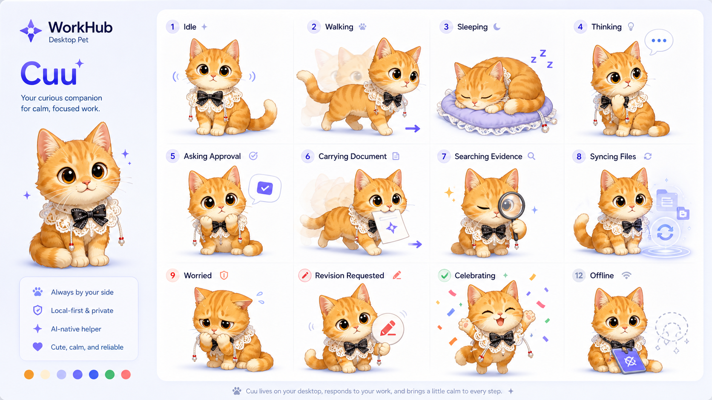
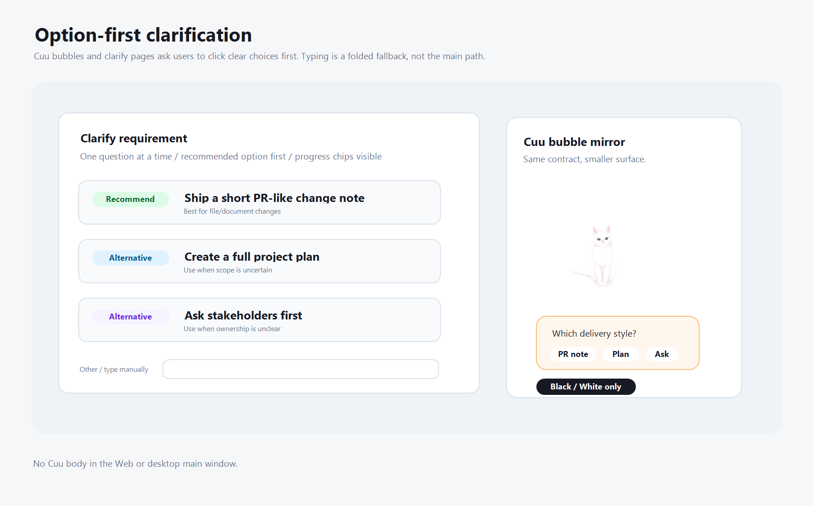
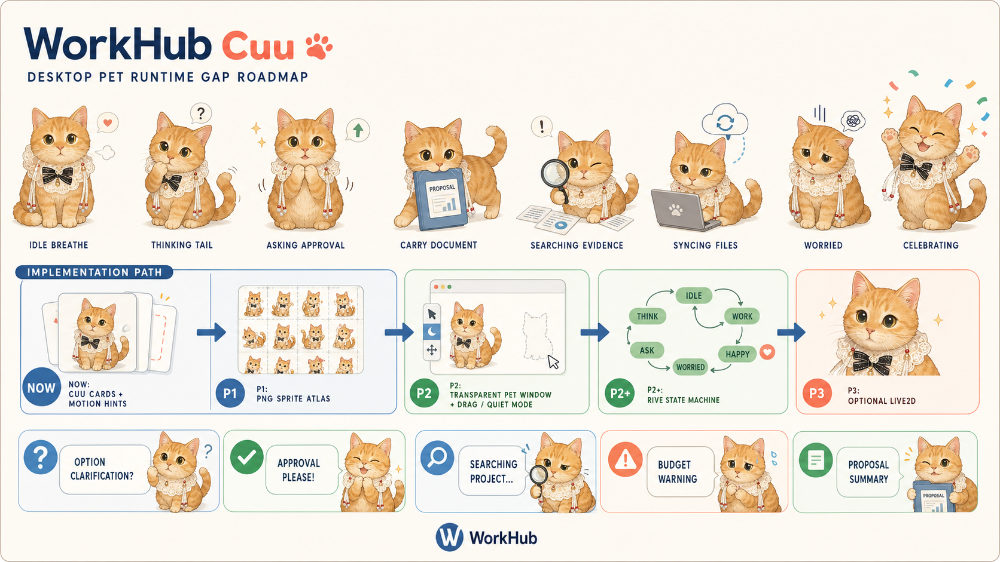
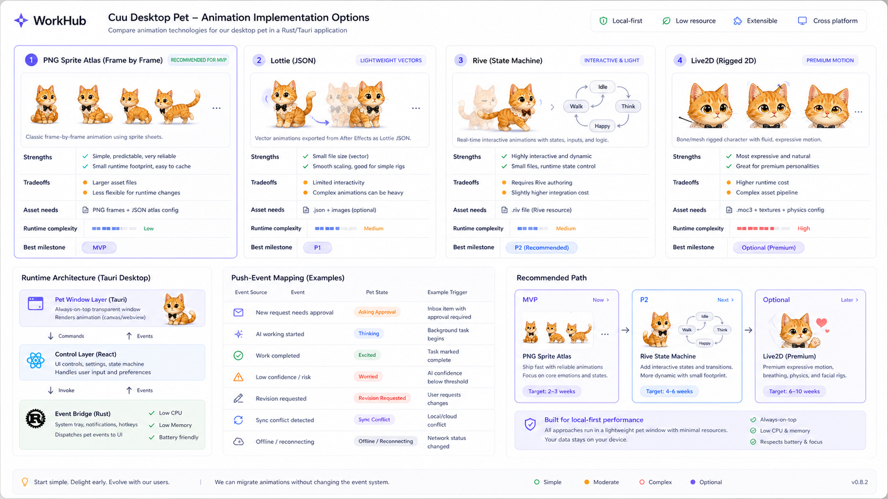
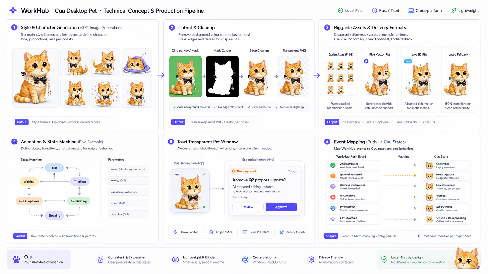

# Cuu 桌宠形象与交互概念

> **Cuu** 是 WorkHub 桌宠客户端的默认形象：一只会动、会提醒、会陪用户处理工作的橘色卡通小猫。它不是冷冰冰的状态图标，而是 WorkHub AI-native 体验的常驻入口。
>
> **绿幕素材与独立窗口施工方案**：见 [`cuu-green-screen-desktop-pet-solution.md`](./cuu-green-screen-desktop-pet-solution.md)。该方案把 Cuu 明确为独立 Tauri `pet` 透明窗口，并规定 GPT Image 绿幕多帧素材、抠图裁切、sprite atlas、idle scheduler 与 QA 门禁。

## 1. 角色定位

Cuu 的职责是把「AI 在后台工作」变成用户能感知、能信任、愿意点击的桌面陪伴。

- **默认状态**：在桌面边缘活动、待命、睡觉或轻微呼吸，不打扰用户。
- **轻提醒**：有审批、澄清、交付、检索结果时，用动作和气泡提醒用户。
- **重要动作**：展开成清楚的审批卡、证据卡、澄清选项卡，用户一眼能判断。
- **复杂信息**：不直接铺满屏幕，先用一句话摘要和少量可点选项承接。

## 2. 视觉特征

参考用户提供的猫咪照片，Cuu 采用原创卡通化处理，保留如下识别点：

- 橘色虎斑毛色，脸部和爪子偏奶油色。
- 大而圆的好奇眼神，表情要明显、亲近。
- 白色蕾丝围兜，黑色蝴蝶结。
- 珍珠流苏与红色小珠点缀。
- WorkHub 状态色只作为小面积点缀：靛蓝、珊瑚、绿色。

不要提交参考原图到公开仓库；当前仓库只沉淀原创概念图。

## 3. 概念图

### 3.1 角色动效状态表



这张图定义 Cuu 的基础动作状态：

- idle：空闲呼吸，表示「我在」。
- walking：在桌面边缘走动，用于轻量存在感。
- sleeping：长时间无事时休眠。
- thinking：AI 正在整理/推理。
- asking approval：需要用户确认。
- carrying document：带着交付物或变更包来找用户。
- searching evidence：项目检索/知识库查证。
- syncing files：本地文件或项目网盘同步中。
- worried：低置信度或风险较高。
- revision requested：用户打回后继续修改。
- celebrating：审批通过或任务完成。
- offline：离线/重连中。

### 3.2 桌面审批与项目检索


这张图定义 Cuu 的默认工作方式：

- Cuu 常驻桌面，不强制打开完整主窗。
- 审批事项以气泡提醒，用户点击后展开为透明 Tauri 卡片。
- 变更申请不是代码 PR，而是任意交付物的变更包，包含文档、表格、PPT、图片和文件夹。
- 项目检索属于桌宠能力，用建议 chips 发起，例如「找相关文件」「总结上次会议」「这次改了什么」。

### 3.3 选项优先澄清



澄清不应默认让用户打字。Cuu 应该一次只问一个问题，并给出可点击选项。

- 主交互是选项卡，而不是大文本框。
- 推荐项可以突出显示。
- 「其他 / 补充」折叠在底部，只作为兜底。
- 右侧显示已经澄清的内容，帮助用户知道还剩几步。

### 3.4 当前实现差距



当前 WorkHub 仓库里，Cuu 已经有这些地基：

- `packages/cuu/src/cards.ts`：把 session、workitem、proposal、agent live、event 转成 `CuuCard`。
- `packages/cuu/src/motion.ts`：为每个 `CuuState` 提供 `sprite_state`、`emphasis`、`loop` 和 reduced-motion 文案。
- `packages/cuu/src/controller.ts`：提供纯 TS 的 show / replace / queue / badge / drop 决策，覆盖静音、勿扰、低优先级降级和 reduced-motion。
- `apps/desktop-webview/src/desktop-cuu-runtime.ts`：把 Tauri/mock 的 `push-event` 与 `sse-status` 转成 Cuu notice。
- `apps/desktop-webview/src/cuu-preferences.ts`：提供 Cuu 轻入口与偏好面板，面板默认隐藏，本地存储提醒模式、声音、减少动效和队列上限，并写回 `CuuController`。
- `apps/desktop-webview/src/browser.ts`：支持 `cuuDemo=1` / `cuuDemo=offline` 的 scripted event 预览；Cuu action 可把知识检索结果回显成 evidence card，并把 evidence card 的 `evidence_refs` 通过 POST action 带回当前任务。

但这些还不等于「桌宠已经完成」：

- 已有 18 clip 真实小猫绿幕 motion pack，业务状态与 idle / interaction 微动作均已覆盖；但还没有 Rive 文件或 Live2D rig。
- `CuuController`、desktop-webview badge / 队列推进、偏好面板已有 MVP，仍缺真实 Tauri 设置页承接、拖拽位置偏好和长期 idle 行为。
- 没有真实 Tauri `pet` 透明窗口 runtime；当前已有 desktop webview notice、`/pet` surface、Rust pet window plan/config scaffold 和几何合同。
- 拖拽/hover 的 webview bridge 已落，并已接真实 Tauri `startDragging`、mode resize/position/show、cursor-near 采样和 body anchor 位置落盘；仍缺收起、真实独立设置页、多屏实测恢复和低电量降帧。
- 证据卡已能触发 typed `knowledge-search` 并回显结果；「用这些证据继续」已通过 `POST /api/workitems/{id}/evidence-bindings` 绑定到当前任务上下文。仍缺真实知识库持久化、证据详情展开和完整检索页分页。
- 没有透明窗口边缘、帧率、HiDPI、多屏和点击区域 QA。

因此后续验收不能只看 Cuu 卡片是否生成，必须看 Cuu 是否真实可见、会动、可点、不挡事，并能在主窗隐藏后继续承接提醒。

### 3.5 施工进展（2026-06-06）

已落一个 **sprite runtime MVP**，用于把 `CuuMotionHint` 真正接到可渲染的 Cuu 动画层：

- `packages/cuu/src/sprite-manifest.ts`：新增 `defaultCuuSpriteManifest`、`cuuSpriteClipForMotion`、`validateCuuSpriteManifest`、`assertValidCuuSpriteManifest`。
- `packages/cuu/src/controller.ts`：新增 `createCuuController`，把 Cuu 提醒收敛为 `show` / `replace` / `queue` / `badge` / `drop` 决策。
- `apps/desktop-webview/src/cuu-sprite-runtime.ts`：新增 procedural CSS sprite renderer，在 notice 中显示 Cuu 小猫视觉层。
- `packages/cuu/src/atlas-manifest.ts`：新增真实 PNG/WebP atlas manifest schema、grid frame helper、partial/full coverage 校验。
- `apps/desktop-webview/src/assets/cuu/source-green/{idle_breathe,thinking_tail,asking_approval_bounce,carrying_document_step,celebrating_jump,searching_evidence_peek,syncing_files_spin,worried_ears,revision_requested_nod,offline_sleep}/`：GPT Image 绿幕 sprite sheets，保留原始绿幕源图。
- `apps/desktop-webview/src/assets/cuu/alpha/{idle_breathe,thinking_tail,asking_approval_bounce,carrying_document_step,celebrating_jump,searching_evidence_peek,syncing_files_spin,worried_ears,revision_requested_nod,offline_sleep}/`：本地 chroma-key + despill + edge-contract 后的透明 PNG。
- `apps/desktop-webview/src/assets/cuu/atlas/cuu-p1-motion-pack.png`：P1 motion pack atlas，当前覆盖 18 个业务状态与 idle / interaction clip。
- `apps/desktop-webview/src/assets/cuu/atlas/cuu.sprite.json`：与 motion pack atlas 对齐的 JSON manifest，便于 Tauri bundle 读取。
- `apps/desktop-webview/src/cuu-atlas-assets.ts` / `cuu-atlas-runtime.ts`：desktop webview 可按 atlas frame rect 生成 CSS keyframes；非覆盖状态会标记 fallback。
- `apps/desktop-webview/src/pet-surface.ts`：`/pet` 或 `?surface=pet` 已能只渲染 Cuu 本体和轻气泡，不加载 Gold Path 主壳。
- `packages/cuu/src/idle-scheduler.ts`：新增 Cuu 活体 idle scheduler，覆盖呼吸、眨眼、尾巴、看鼠标、睡觉、醒来、拖动、轻敲和挥手等微动作语义。
- `client-tauri/src-tauri/src/pet_window.rs`：新增 Cuu 独立窗口几何合同，覆盖 body-only/card 双模式、右下角定位、展开锚点、屏幕内 clamp、鼠标接近判定和拖拽 plan。
- `client-tauri/src-tauri/src/pet_commands.rs`：新增 Cuu 独立窗口 command scaffold，固定 `set_pet_window_mode`、`start_pet_window_drag`、`save_pet_window_position`、`sample_pet_cursor_near`，并让 capability 开放最小 `core:window:allow-start-dragging`。
- `client-tauri/src-tauri/{build.rs,src/main.rs}`：新增最小 Tauri runtime scaffold，接 `tauri-build`、`tauri::Builder`、`generate_context!`、pet command handler；`set_pet_window_mode` 已执行 resize/position/show，`start_pet_window_drag` 已执行 `start_dragging`，`save_pet_window_position` 已读取真实窗口位置并保存 body anchor，`sample_pet_cursor_near` 已读取真实桌面 cursor 与 pet window rect。
- `apps/desktop-webview/src/pet-window-bridge.ts`：新增 pet window bridge，支持 mock / Tauri-like 模式切换、`startDragging`、位置保存和 cursor-near 采样端口；`pet-surface.ts` 已把 pointer hover/drag/release 与 Rust cursor sample 喂给 idle scheduler。
- `apps/desktop-webview/src/desktop-cuu-runtime.ts`：Cuu notice 已嵌入 sprite render，并先经过 controller 判断是否弹出、排队或降级 badge。
- `apps/desktop-webview/src/cuu-preferences.ts`：新增默认隐藏的偏好面板，支持正常/安静/勿扰、开启/静音、减少动效、队列上限，并持久化到 localStorage。
- `apps/desktop-webview/src/browser.ts`：新增 queue badge 和偏好面板；启动时会按 `/pet` 或 `?surface=pet` 分流到独立 pet surface，否则加载完整 Gold Path 主壳。
- 测试已覆盖：每个 `CuuMotionHint.sprite_state` 都有对应 procedural clip；atlas manifest 可校验真实 motion pack，业务状态可通过 `require_full_motion_coverage`，idle / interaction 微动作可通过 `require_idle_micro_action_coverage`；pet surface 无卡片时会按 scheduler `idle_action` 选择真实 atlas clip；Rust pet window command plan 与 pet window bridge 可解析 body/card 模式、Tauri-like command 和拖拽 fallback；desktop notice 能输出 `data-cuu-sprite-state`；pet surface 不渲染 `wh-app-shell`；勿扰模式下 urgent 审批不会弹窗但会保留系统通知意图；queue badge CSS 有锚点；偏好加载/存储/归一化和面板 HTML 有测试；`knowledge-search` 可返回 evidence card；`use_for_current_task` 可提交证据并回显 WorkItem card。

仍未完成：

- 18 个动作的正式透明 PNG / WebP 已落 P1 pack；后续仍需做体积压缩、anchor 微调、真实透明窗口截图和长时间性能 QA。
- `cuu.sprite.json` 已有运行时 JSON manifest，并覆盖业务状态与 idle / interaction 微动作。
- 独立 Tauri `pet` window runtime；目前已有 webview `/pet` surface 分流、Rust window plan / config scaffold、pet 几何合同、command scaffold、最小 Tauri `main.rs`、前端 bridge，并已把 mode/drag/save-position/cursor-sample 执行到真实 Tauri window / AppHandle API；位置会保存到 Tauri Config 目录下的 `pet-window-state.json`，启动时会 clamp 回当前 work area；基础托盘显隐已落，仍缺多显示器实测、动态通知联动和真实截图 QA。
- 真实 Tauri 设置页承接、系统通知、收起/恢复、多屏监视器恢复策略和透明窗口长驻 QA。
- Rive / Live2D 高表现力路线。
- 主窗 notice 仍使用 procedural sprite 作为轻量占位；后续需要评估是否替换为同一套 atlas 或保持主窗轻量、桌宠用真实 atlas。

## 4. 交互原则

1. **Cuu 先动，用户再点**：有事时 Cuu 用动作、表情和小气泡发起，不要求用户主动找页面。
2. **一次只处理一件事**：桌宠展开后默认只呈现一个审批、一个问题或一个检索结果。
3. **选项优先**：澄清、审批原因、检索入口都优先给按钮/chips，打字只作为「其他」。
4. **证据随手可见**：凡是 AI 建议、变更说明、项目检索，都必须能展开来源证据。
5. **可爱但可靠**：Cuu 的外观可以活泼，审批卡、风险、回滚、权限说明必须清楚。
6. **不挡事**：Cuu 需要可拖动、可收起、可静音，长时间无事应进入低存在感状态。

## 5. 实现提示

- **窗口**：独立 `pet` Tauri 窗口，`transparent:true`、`decorations:false`、`alwaysOnTop:true`、`skipTaskbar:true`。
- **动效**：MVP 必须用 GPT Image 绿幕生成的真实小猫多帧 PNG/WebP，抠图后打成 sprite atlas；CSS procedural sprite 只能作为占位，不算完成。空闲态降帧，避免持续占 GPU。
- **事件映射**：继续使用 Rust SSE worker 转发的 `push-event`，由前端将正式 `WorkHubEvent.type` 映射到 Cuu 状态；映射表与 payload 形状以 [`_experience-deliverable-contracts.md`](../../plans/p0-foundation/_experience-deliverable-contracts.md) §4 为准。
- **轻卡类型**：审批、澄清、证据、项目检索、交付物变更包统一消费 `AttentionItem` / `QuestionCard` / `EvidenceRef` / `DeliverableChangeManifest`，避免桌宠、主窗、Web 各自手写结构。
- **主窗关系**：Cuu 可单独展开轻卡；复杂操作再通过 deep-link 打开主客户端。
- **隐私**：项目检索卡只显示用户有权限看到的证据，私有通知走 user-scoped 事件。

## 6. 端侧归属

- **Web 端**：项目、审批、负责人视角，适合结构化管理。
- **Rust 客户端**：本地执行、同步、交付、设备令牌、权限确认。
- **Cuu 桌宠**：提醒、澄清、项目检索、证据气泡、轻审批和陪伴。

结论：Cuu 是 WorkHub 的 AI-native 入口。用户不应该先学会看板或复杂页面，而是先看到 Cuu 把当前需要处理的一件事递到面前。

## 7. 动画实现架构选型



桌宠动画不要一开始锁死单一技术。Cuu 建议按阶段选择运行时：

| 方案 | 资产形态 | 优点 | 风险/代价 | 建议阶段 |
|---|---|---|---|---|
| **PNG Sprite Atlas** | 多帧透明 PNG + JSON 帧配置 | 最简单、最可靠、最容易由 GPT Image 生成，适合先跑起来 | 文件体积偏大，状态切换不够丝滑 | **MVP/P1** |
| **Lottie** | After Effects/Bodymovin JSON，Web 端 `lottie-web` 渲染 | 轻量、SVG/Canvas/HTML 多渲染器，适合简单循环和 UI 动效 | 角色形变/交互状态有限，美术需 AE 流程 | P1 兜底 |
| **Rive** | `.riv` 文件 + state machine | Web/React 运行时支持 state machine input，适合把 `push-event` 映射成动作 | 需要 Rive 制作流程，初期资产准备成本高于 sprite | **P2 推荐** |
| **Live2D Cubism** | `.moc3` + texture + physics/motion config | 表现力强，适合呼吸、眼神、脸部、轻微身体形变 | 美术/绑定/许可/运行时复杂度最高，Cubism Core 需官方包 | P3/Premium |

推荐路线：**先 sprite，让 Cuu 真的出现在桌面；再 Rive，让 Cuu 具备状态机和自然过渡；最后按价值评估 Live2D。**

P1 sprite 不是抽象图标，而是绿幕生图后的透明小猫动作帧。完整动作批次、prompt、抠图、anchor 对齐、atlas manifest 与独立窗口策略见 [`cuu-green-screen-desktop-pet-solution.md`](./cuu-green-screen-desktop-pet-solution.md)。

官方资料锚点：

- [Tauri v2 window API](https://v2.tauri.app/reference/javascript/api/namespacewindow/) / [window customization](https://v2.tauri.app/learn/window-customization/)：支持 `transparent`、`decorations`、`alwaysOnTop` 等窗口属性；多窗口创建需要相应 capability。
- [Rive Web runtime](https://rive.app/docs/runtimes/web) / [Rive React runtime](https://rive.app/docs/runtimes/react)：支持 canvas/WebGL 渲染、state machine 和 input trigger。
- [`lottie-web`](https://github.com/airbnb/lottie-web)：支持 SVG/Canvas/HTML renderer，并可通过 `playSegments` 播放片段。
- [Live2D Cubism SDK manual](https://docs.live2d.com/en/cubism-sdk-manual/top/) / [CubismWebFramework](https://github.com/Live2D/CubismWebFramework)：可作为高表现力路线；注意 Cubism Core 与许可/分发约束。
- [OpenAI image generation guide](https://platform.openai.com/docs/guides/image-generation)：用于规划正式图片生成接口；若当前生成链路不支持原生透明，则走 chroma-key + 本地抠图兜底。

## 8. 美术资产生产流水线



建议把美术流水线分成 6 步：

1. **风格定稿**：固定 Cuu 的橘猫毛色、蕾丝围兜、黑色蝴蝶结、珍珠/红珠、眼睛比例、轮廓比例。
2. **GPT Image 生图**：用统一 prompt 生成状态帧，不直接要求透明背景时，优先生成纯色 chroma-key 背景。
3. **抠图/去底**：
   - 如果调用的图片模型/接口支持透明背景，直接输出 PNG/WebP 透明图。
   - 如果当前工具链不支持原生透明，用纯色背景 + 本地 `remove_chroma_key.py` 做 alpha，必要时人工修边。
4. **一致性修正**：统一眼睛大小、围兜位置、蝴蝶结朝向、红珠数量、阴影边缘和色温。
5. **打包**：
   - MVP：`cuu.sprite.json` + `*.png` frames。
   - P2：`.riv` + state machine input。
   - P3：Live2D `.moc3` + texture + physics/motion。
6. **运行时验收**：在 Tauri 透明窗口中检查边缘、帧率、CPU/GPU、点击区域、HiDPI、多显示器和低电量表现。

### 8.1 目录建议

```text
apps/desktop-webview/src/assets/cuu/
  source-green/
    idle_breathe/
    thinking_tail/
  alpha/
    idle_breathe/
    thinking_tail/
  atlas/
    cuu-p1-motion-pack.png
    cuu.sprite.json
  rive/
    cuu.riv
  live2d/
    cuu.model3.json
    textures/
docs/workhub/05-clients/assets/cuu/
  *.png  # 概念图与设计说明用，不作为运行时生产资产
```

如果后续 Tauri 前端目录从 `apps/desktop-webview` 迁到 `client-tauri/web-src`，仍保持 `assets/cuu/{source-green,alpha,atlas}` 结构，不改变 manifest 语义。

### 8.2 Sprite 配置草案

```json
{
  "version": 1,
  "defaultState": "idle",
  "states": {
    "idle": { "frames": ["idle-000.png", "idle-001.png"], "fps": 8, "loop": true },
    "approval": { "frames": ["approval-000.png"], "fps": 8, "loop": false },
    "syncing": { "frames": ["sync-000.png", "sync-001.png"], "fps": 10, "loop": true }
  }
}
```

## 9. 事件到 Cuu 状态映射

| WorkHub 事件/状态 | Cuu 状态 | UI 呈现 | 用户动作 |
|---|---|---|---|
| `agent_run.started` / `agent_run.step` | thinking | Cuu 思考/转圈 | 可点开看执行步骤 |
| `permission.ask` | asking approval | Cuu 轻敲审批气泡 | 通过 / 打回 / 委派 / 永远允许 |
| `proposal.opened` | carrying document | Cuu 抱文件出现 | 查看变更包 |
| `knowledge.evidence.ready` | searching evidence | Cuu 放大镜/证据气泡 | 打开证据 / 用于当前任务 |
| `sync.progress` | syncing files | Cuu 同步动作 | 查看同步队列 |
| `sync.conflict` | worried / sync conflict | Cuu 紧张 + 冲突卡 | 应用 AI 合并 / 保留本地 / 保留云端 |
| `revision.requested` | revision requested | Cuu 委屈/拿笔 | 查看打回原因 |
| `proposal.merged` | celebrating | Cuu 庆祝 | 查看交付物 |
| `sse-status:disconnected` | offline | Cuu 灰态/重连 | 打开诊断 |

## 10. Tauri 部署与运行时边界

Cuu 应是独立 `pet` window，而不是主窗内固定浮层。

- `pet` 窗口：透明、无边框、always-on-top、skip-taskbar、记忆位置。
- `main` 窗口：承载完整客户端页面；复杂操作由 Cuu deep-link 唤起。
- Rust 侧：SSE worker / reminders / tray / deep-link 发事件；不承担动画逻辑。
- TS/React 侧：`packages/cuu` 的纯 controller 管打扰策略与队列，React/Webview 层管动画 runtime、气泡卡片和用户输入。
- 资源加载：生产资产打入 Tauri bundle；概念图只放文档目录。
- 更新：Cuu 资产版本跟随客户端版本；未来可做独立 asset manifest，但 P1 不需要。

## 11. 施工顺序建议

1. P1：绿幕生成 PNG/WebP sprite 版 Cuu，至少 18 个动作，能 idle、blink、tail、sleep、wake、thinking、approval、searching、carrying、celebrating、offline（procedural MVP 只算占位，待正式资产）。
2. P1：Cuu 气泡承接选项式澄清和项目检索 chips（审批/澄清/知识检索回显/证据带回当前任务已落，待证据详情展开、完整检索页和真实持久化）。
3. P2：独立 `pet` Tauri window，支持拖动、收起、托盘显隐（基础菜单已落，待跨平台 smoke 和动态状态），并把已有偏好面板迁入真实 Settings / pet window。
4. P2：引入 Rive state machine，把事件映射为自然过渡。
5. P3：评估 Live2D：只在 Cuu 的表情/呼吸/头部转动明显提升体验时使用。
6. P4：性能/电量/多屏/HiDPI/透明边缘 QA，形成桌宠发布 checklist。

### 11.1 施工验收门

| 门禁 | 必须证明 |
|---|---|
| Motion hint 不漂移 | `allCuuMotionHints()` 的每个 `sprite_state` 都能在 sprite manifest 找到对应资产 |
| Cuu 真会动 | `idle → thinking → asking_approval → carrying_document → celebrating` 能由 scripted event 触发 |
| Cuu 像活物 | 60 秒 idle 内至少出现呼吸、眨眼、尾巴、睡觉/看鼠标中的两类微动作 |
| 选项优先 | 澄清、审批、打回理由都有可点击 chips；长文本只作为兜底 |
| 桌宠独立 | 主窗隐藏后 `pet` window 仍能显示提醒 |
| 不挡事 | 支持拖动、收起、静音、勿扰和低存在感 idle |
| 可访问 | reduced-motion 模式下不播放复杂动画，但保留状态文案和可点动作 |
| 可部署 | 运行时资产进入 Tauri bundle；概念图只留在 `docs/workhub/05-clients/assets/cuu` |

更多当前差距和跨端路线见 [`prd-concept-reproduction-gap-audit.md`](./prd-concept-reproduction-gap-audit.md)。
