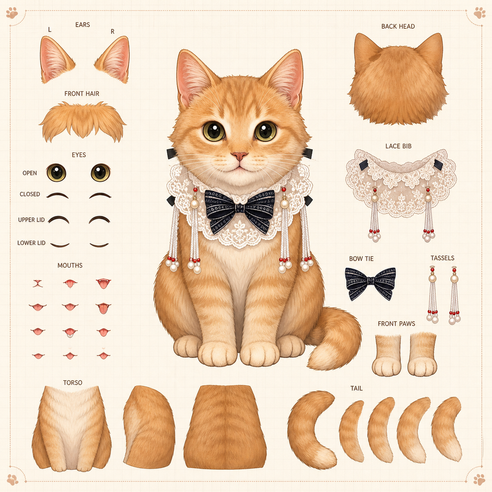
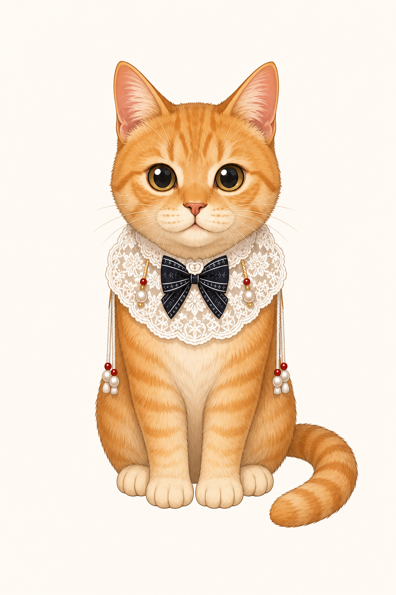
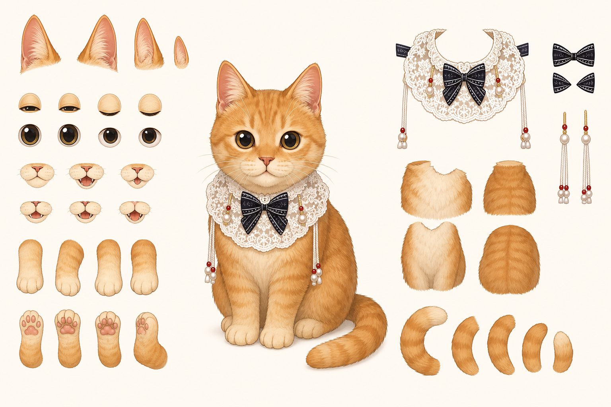
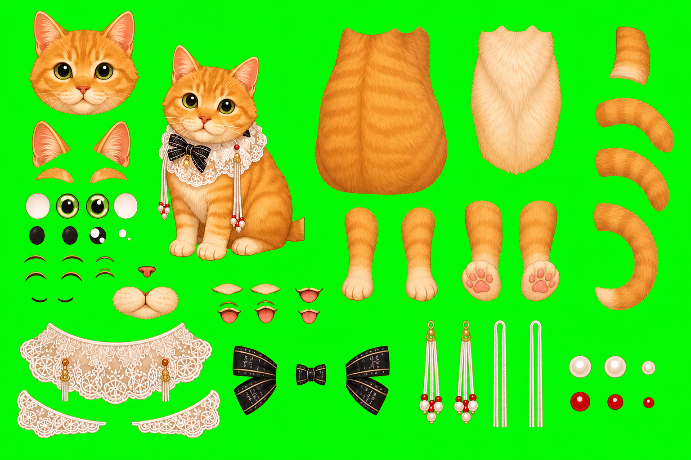
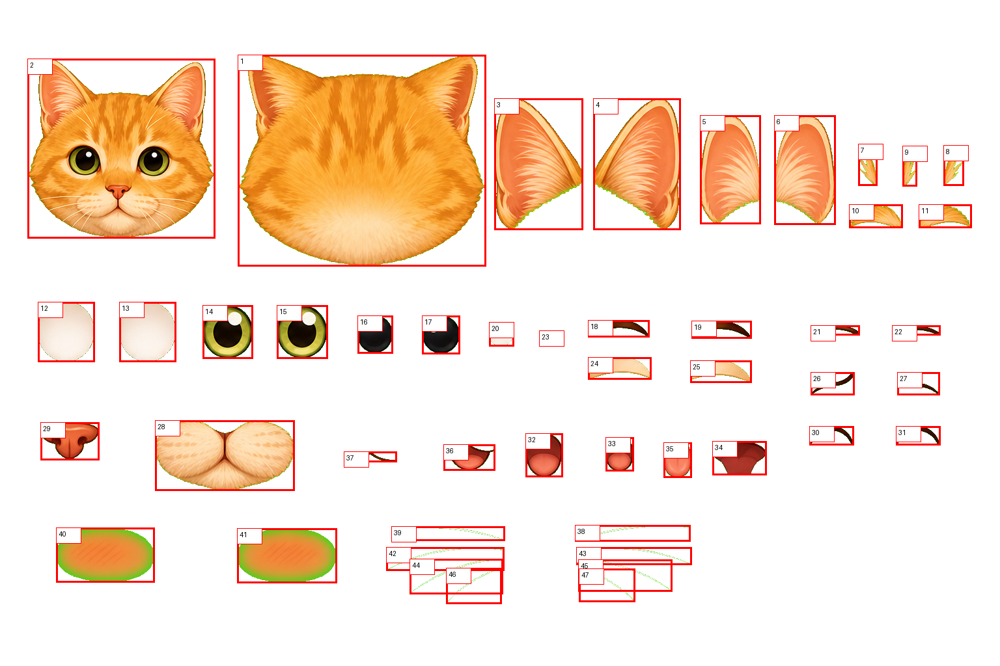
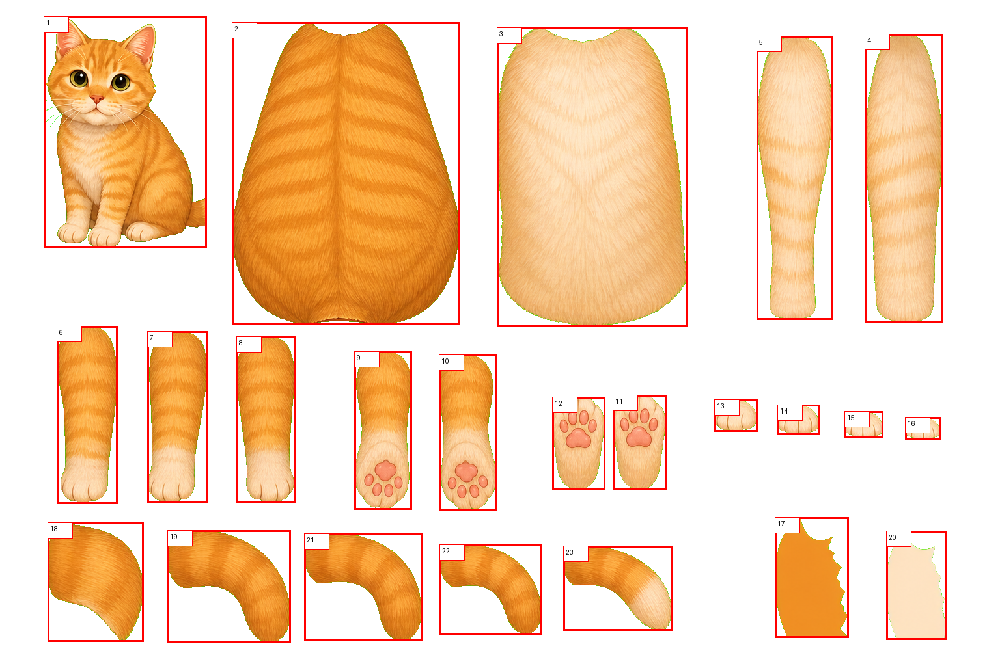
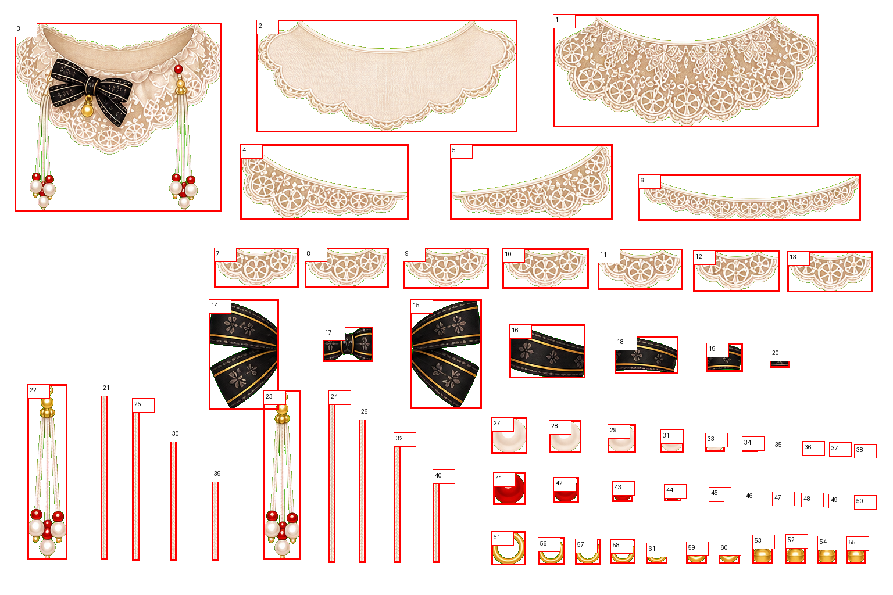
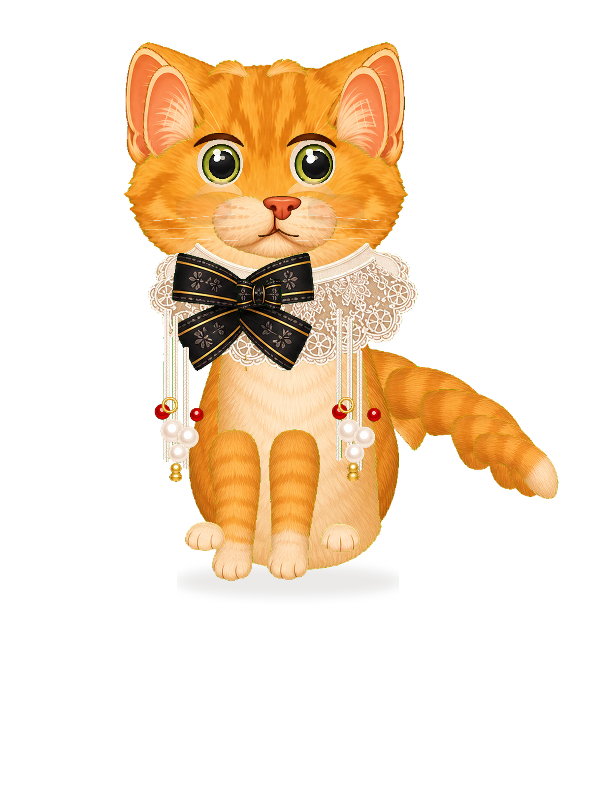
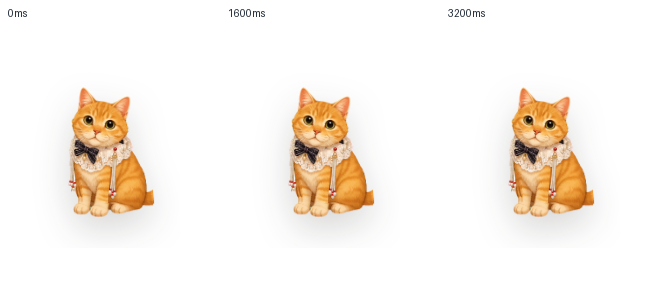

# Cuu Live2D 分层资产与建模施工方案

> **结论**：Cuu 的长期高表现力目标应优先走 **Live2D 分层 PSD -> Cubism 绑定 -> Tauri pet window runtime**。现有 sprite atlas 继续保留为 P1 可运行资产和降级层；GIF 只允许作为临时预览/沟通稿，不能作为最终桌宠方案。  
> **2026-06-07 更新**：8 层同源裁片 prototype 只能证明运行时分层管线可挂载，视觉验收失败：等待不同时间肉眼差异不足，动作像缩放/位移而不是活体，且不是 PSD / Cubism 可绑定素材。本轮改走 **GPT Image 绿幕零件板 -> 自动抠图编号 -> 144 层 PSD draft v1 -> Cubism 绑定**。`cuu-live2d-generated-psd-draft-v1.psd` 已能打开并保留 9 个顶层组 / 144 个叶子图层，但仍是 `draft_created_not_visual_pass`：尾巴段重叠、边缘抠图、遮挡补画和 Cubism motion capture 未完成前，不能算桌宠最终通过。
> **2026-06-08 更新**：`psd_draft_probe` 已能直接消费 `generated-psd-draft-v1/layers/*.png` 中 72 个运行时探针层，并通过 DOM / CSS 让眼睛、耳朵、尾巴、蝴蝶结、流苏、爪子与嘴型独立动起来。它回答了“能否用生成图像批量生成很多分层素材，再调整大小拼接”的工程问题：可以，而且必须由 manifest 驱动。但用户复核后确认当前 PSD draft 有恐怖谷风险，所以它已退出默认视觉，降为实验探针；当前默认路线见 [`cuu-bongo-style-runtime-plan.md`](./cuu-bongo-style-runtime-plan.md)。
> **参考**：拆图方法参考 [Moonku 的 Live2D PSD 拆图教程](https://moonku44.com/live2d-psd/)，运行时边界参考 Live2D 官方 [Cubism SDK for Web](https://docs.live2d.com/en/cubism-sdk-manual/cubism-sdk-for-web/) 与 [model3.json Web 模型说明](https://docs.live2d.com/en/cubism-sdk-manual/model-web/)。

---

## 0. 概念图



这张图是 **Live2D 分层参考概念图**，不是最终运行时资产。它用于固定 Cuu 的正面基准、拆件方向和美术细节：橘色虎斑、奶油脸和爪、白蕾丝围兜、黑蝴蝶结、珍珠流苏、红色小珠、尾巴分段。后续正式 PSD 必须重新按图层规范输出，不能直接把概念图裁成模型。



这张图是 **正面基准稿概念**，用于锁定 Cuu 的比例、脸部识别点、围兜/蝴蝶结/流苏位置和脚底 anchor。正式 PSD 可以参考它重绘，但仍必须按第 4 节图层树拆件并补画遮挡区域。



这张图是 **PSD 生产板 / 拆件参考图**，由 GPT Image 生成后同步到文档资产目录。它把中心正面 Cuu 与周边可拆部件放在同一画布：耳朵、眼皮、眼睛、嘴型、前后爪、胸腹、背毛、蕾丝围兜、蝴蝶结、珍珠流苏和尾巴段。它仍不是最终 PSD，但可以直接指导后续绘图工具中的补画、切层与命名。









这四张图是 **生成式拆件资产 v0**：先用 GPT Image 生成绿幕零件板，再由 `scripts/assets/extract-cuu-generated-parts.py` 自动抠图、编号、裁切成独立 PNG。脸部板包含干净头底、眼白、虹膜、瞳孔、眼皮、鼻子、嘴型、腮红和须线；身体板包含背毛、胸毛、前后爪、爪垫和尾巴候选段；饰品板包含蕾丝围兜、蝴蝶结、流苏绳、珍珠、红珠和金属环。它们不是最终艺术定稿，但已经足够支撑 PSD 分层草案。



这张图是 **自动拼装的 144 层 PSD draft v1 预览**。它来自 `scripts/assets/build-cuu-live2d-generated-psd.py`，输出 `apps/desktop-webview/src/assets/cuu/live2d/source/generated-psd-draft-v1/`。它比 8 层裁片原型更接近 Live2D 生产资料：眼睛、嘴型、耳朵、身体、爪、尾巴、蕾丝、蝴蝶结、流苏、珍珠/红珠都已拆层；但它仍没有通过最终视觉验收，必须继续做边缘清理、遮挡补画、尾巴段重绘和 Cubism 绑定。


这张图是 **浏览器 pet surface 中真实挂载 PSD draft layer PNG 后的多帧截图**。它证明运行时已经不是 8 层 prototype，也不是静态 fallback：DOM 中有 72 个 PSD layer ``，其中尾巴、耳朵、眼睛、嘴型、蝴蝶结、流苏等层拥有独立 CSS 动作。但它仍只能算 `psd_draft_probe` 证据，不能算 Cubism / Live2D 最终验收证据。


这张图是 **当前默认 Cuu**：因为 PSD draft 视觉有恐怖谷风险，P1 默认先使用 Bongo-style 低拟真 renderer。Live2D 专篇继续保留分层资产与 Cubism 施工计划，但默认用户体验不再展示未精修 PSD。

---

## 1. 原则

1. **Live2D 是主目标**：Cuu 要像活的桌宠，不是 GIF 或状态图标。
2. **Sprite 是降级层**：当前 18 clip atlas 负责先跑通窗口、事件、QA；Live2D 就绪后替换主要表现层。
3. **GIF 只做无奈兜底**：只用于建模前的 motion storyboard、PR 预览或 Cubism runtime 暂时不可用时的演示，不进入最终验收。
4. **正面基准优先**：先做纯正面可绑定模型，再扩展 3/4 角度、侧身走动和复杂动作。
5. **拆件比整帧重要**：Live2D 的价值来自眼睛、耳朵、嘴、围兜、流苏、尾巴等部件可变形，而不是用一串帧硬切。
6. **遮挡处必须补画**：围兜后面的身体、前爪后面的胸毛、尾巴根部、蝴蝶结后面的蕾丝都要画完整，避免转头/摆动时露洞。
7. **运行时不承担美术修补**：Web/Tauri 只加载 `.model3.json`、`.moc3`、texture、motion、physics；坏图层不在代码里补救。

---

## 2. 从参考教程转成 Cuu 规则

Moonku 教程的核心经验可以转成 Cuu 的施工规则：

| 教程要点 | Cuu 落地 |
|---|---|
| 大画布、正面立绘 | `4096x4096` 或 `4096x5120` 透明/中性底正面小猫，脚底 anchor 固定 |
| 部件越细越自然 | 眼睛、眼皮、嘴型、耳朵、围兜、蝴蝶结、流苏、尾巴必须拆 |
| 遮挡处要补画 | 蕾丝、蝴蝶结、前爪、尾巴遮挡的身体都要补齐 |
| 图层命名清晰 | 使用英文稳定名，便于脚本、Cubism、TS manifest 对齐 |
| PSD 交付前检查 | 无同名图层、无隐藏废层、无杂点、图层模式 normal、透明度 100% |
| 配件单独拆 | 红珠、珍珠、流苏绳、蝴蝶结左右翼都拆出物理摆动层 |

参考页对 WorkHub 的实际启发是：**不要把 AI 生成的整猫图直接当 Live2D 成品**。Cuu 需要先有正面生产板，再把被遮挡的身体、围兜、蝴蝶结、前爪和尾巴根部补完整，最后用可审计图层名交给 Cubism。任何 “整图切几块就导入” 的路线都不算通过。

---

## 3. 资产目录

```text
apps/desktop-webview/src/assets/cuu/
  live2d/
    source/
      cuu-live2d-v0.psd              # 正式 PSD 源文件，若体积过大后续迁 Git LFS
      cuu-live2d-v0-layer-preview.png
      cuu-live2d-v0-layer-manifest.json
      generated-parts-v0/
        cuu-live2d-generated-face-parts-v0-green.png
        cuu-live2d-generated-face-parts-v0-components.png
        cuu-live2d-generated-face-parts-v0/components/*.png
        cuu-live2d-generated-body-parts-v0/components/*.png
        cuu-live2d-generated-accessory-parts-v0/components/*.png
      generated-psd-draft-v1/
        cuu-live2d-generated-psd-draft-v1.psd
        cuu-live2d-generated-psd-draft-v1-preview.png
        cuu-live2d-generated-psd-draft-v1-psd-composite.png
        cuu-live2d-generated-psd-draft-v1.manifest.json
        cuu-live2d-generated-psd-draft-v1-report.json
        layers/*.png
    exported/
      cuu.model3.json
      cuu.moc3
      cuu.physics3.json
      cuu.pose3.json
      textures/
        texture_00.png
      motions/
        idle.motion3.json
        thinking.motion3.json
        approval.motion3.json
        search.motion3.json
        celebrate.motion3.json
      expressions/
        happy.exp3.json
        worried.exp3.json
        sleepy.exp3.json
docs/workhub/05-clients/assets/cuu/
  cuu-live2d-layer-breakdown-concept.png
  cuu-live2d-front-model-concept.png
  cuu-live2d-psd-production-board.png
  cuu-live2d-generated-*-green.png
  cuu-live2d-generated-*-components.png
  cuu-live2d-generated-psd-draft-v1-preview.png
docs/workhub/05-clients/assets/audit/2026-06-08-cuu-psd-draft-probe/
  pet-psd-draft-cdp-contact-sheet-grid.png
  pet-psd-draft-cdp-frame-*.png
  pet-psd-draft-cdp-dom.json
  pet-psd-draft-cdp-diff-report.json
```

文档目录只放概念图、编号参考图和预览审查图；运行时源素材、PSD、layer PNG 和导出模型必须进入 `apps/desktop-webview/src/assets/cuu/live2d/`，随 Tauri bundle 或后续资产包发布。

当前已落：`apps/desktop-webview/src/assets/cuu/live2d/source/cuu-live2d-v0-layer-manifest.json`，状态为 `contract_only`。它列出必需图层、遮挡补画、Cubism 参数、motion fallback 与 QA 门禁；正式 PSD 未落前，不能把它误读为完成的 Live2D 模型。

2026-06-07 新增可运行原型：

```text
apps/desktop-webview/src/assets/cuu/live2d/prototype/cuu-layered-rig-v0/
  body-backfur.png
  tail.png
  front-paws.png
  head.png
  lace-bib.png
  bow.png
  tassel-l.png
  tassel-r.png
  cuu-layered-rig-v0.manifest.json
  cuu-layered-rig-v0-preview.png
packages/cuu/src/live2d-manifest.ts
apps/desktop-webview/src/cuu-live2d-assets.ts
apps/desktop-webview/src/cuu-live2d-runtime.ts
scripts/assets/generate-cuu-live2d-prototype.py
```

这套原型状态为 `prototype_layered`：它使用同一张 Cuu 透明基准图裁切，避免逐帧 AI 生图导致角色漂移、肢体数量错误、脚底 anchor 漂移。它仍然有局限：头/眼/嘴没有真正拆成 Cubism 可变形层，遮挡区没有人工补画，眨眼只是 runtime 遮罩模拟。因此它只能作为 **Live2D-ready runtime prototype**，不能替代正式 PSD / Cubism 模型。

### 3.1 Live2D Prototype v0 审查证据



本轮运行态证据：

| 证据 | 路径 |
|---|---|
| 0ms 截图 | `docs/workhub/05-clients/assets/audit/2026-06-07-cuu-live2d-prototype/pet-live2d-frame-000.png` |
| 1600ms 截图 | `docs/workhub/05-clients/assets/audit/2026-06-07-cuu-live2d-prototype/pet-live2d-frame-1600.png` |
| 3200ms 截图 | `docs/workhub/05-clients/assets/audit/2026-06-07-cuu-live2d-prototype/pet-live2d-frame-3200.png` |
| Contact sheet | `docs/workhub/05-clients/assets/audit/2026-06-07-cuu-live2d-prototype/pet-live2d-contact-sheet.png` |
| 审查 GIF | `docs/workhub/05-clients/assets/audit/2026-06-07-cuu-live2d-prototype/pet-live2d-motion-sample.gif` |
| DOM dump | `docs/workhub/05-clients/assets/audit/2026-06-07-cuu-live2d-prototype/pet-live2d-dom.txt` |

像素差分：

```text
000_vs_1600: bbox=(34, 44, 180, 219), changed_pixels=3225
1600_vs_3200: bbox=(39, 44, 175, 220), changed_pixels=5441
```

验收结论：

- 技术通过：Cuu 在浏览器 pet surface 中完整可见，不是只露耳朵 / 局部。
- 技术通过：DOM 实际挂载 `data-cuu-live2d-runtime="prototype_layered"`，不是文档假设。
- 技术通过：8 个图层来自同一张透明基准图，可以作为 runtime 分层探针。
- 视觉不通过：等待不同时间的肉眼差异不足，动作主要像缩放/位移，不像有骨骼、眼皮、尾巴和流苏物理的活体。
- 资产不通过：它不是 PSD 分层，不含眼白/虹膜/瞳孔/眼皮/嘴型/耳朵/流苏/珠子等细部图层，也没有遮挡补画。
- 施工结论：`cuu-layered-rig-v0` 只保留为 regression / runtime contract fixture；不能再作为 Cuu 鲜活感或 Live2D 资产通过证据。

### 3.2 绿幕零件板与 PSD Draft v1

本轮新增生产草案路线：

```text
scripts/assets/extract-cuu-generated-parts.py
scripts/assets/build-cuu-live2d-generated-psd.py
apps/desktop-webview/src/assets/cuu/live2d/source/generated-parts-v0/
apps/desktop-webview/src/assets/cuu/live2d/source/generated-psd-draft-v1/
```

已生成资产：

| 资产 | 结果 |
|---|---:|
| `cuu-live2d-generated-face-parts-v0` | 47 个自动裁切组件 |
| `cuu-live2d-generated-body-parts-v0` | 23 个自动裁切组件 |
| `cuu-live2d-generated-accessory-parts-v0` | 61 个自动裁切组件 |
| `cuu-live2d-generated-parts-board-v0` | 58 个自动裁切组件 |
| `cuu-live2d-generated-psd-draft-v1.psd` | 9 个顶层组 / 144 个叶子图层 / 14.5MB |
| `layers/*.png` | 144 个独立图层 PNG，与 manifest 一一对应 |

PSD draft v1 图层组：

```text
00_Guide_DoNotExport
10_Back
20_Body
30_Tail
40_Head
50_Face
60_Collar
70_Accessories
80_Expressions
```

默认可见层 `65` 个，隐藏/表达式/候选层 `79` 个。来源统计：`generated_layer_png=131`、`paint_behind_placeholder=5`、`procedural_detail=8`。这证明“生成很多部件图 -> 自动裁切 -> 调整大小拼接 -> PSD 分组保存”路线可行。

当前不通过项必须继续保留：

- 尾巴是多段候选件叠合，视觉上偏厚，正式绑定前需要重绘或精确切段。
- 头底仍带部分耳朵结构，耳朵拆层需要美术清理。
- 绿幕边缘仍有少量残留，正式贴图前要继续 despill / edge contract。
- 围兜后身体、蝴蝶结后蕾丝、爪后胸毛、尾巴根部仍需要人工或生图补画。
- 静态 PSD 预览不能证明 Cuu 活着；最终必须导出 Cubism 并录制多秒桌宠动作。

### 3.3 PSD Draft Runtime Probe（2026-06-08）

本轮把 `generated-psd-draft-v1` 从“静态 PSD 预览”推进到“运行时分层探针”，随后因视觉恐怖谷风险降为实验线：

```text
packages/cuu/src/live2d-psd-draft.ts
apps/desktop-webview/src/cuu-live2d-psd-draft-assets.ts
apps/desktop-webview/src/cuu-live2d-psd-draft-runtime.ts
apps/desktop-webview/src/pet-surface.ts
scripts/qa/cuu-pet-browser-capture.mjs
docs/workhub/05-clients/assets/audit/2026-06-08-cuu-psd-draft-probe/
```

运行时探针合同：

| 项 | 当前值 |
|---|---|
| `runtime_kind` | `psd_draft_probe` |
| `visual_mode` | `live2d_psd_draft` |
| artifact | `cuu-live2d-generated-psd-draft-v1` |
| status | `draft_created_not_visual_pass` |
| PSD draft 总图层 | `144` |
| 默认可见图层 | `65` |
| runtime probe 图层 | `72` |
| canvas / anchor | `1200 x 1600`，脚底 anchor `600,1216` |
| renderer fallback | 实验线为 `psd_draft_probe -> prototype_layered -> sprite_atlas`；默认线为 `bongo_cuu -> sprite_atlas` |

运行时已选入的关键层：

| 部位 | 层 / bind target |
|---|---|
| 身体 | `Body_BackFur`、`Body_ChestCream`、`Paw_L_FrontUpper`、`Paw_R_FrontUpper`、`Paw_L_Back`、`Paw_R_Back` |
| 头和耳朵 | `Head_BaseClean`、`Ear_L_Outer`、`Ear_R_Outer`、`Ear_L_Inner`、`Ear_R_Inner`、`FurTuft_Front_01/02` |
| 眼睛 | `Eye_*_White`、`Eye_*_Iris`、`Eye_*_Pupil`、`Eye_*_Highlight_01`、`Eye_*_UpperLid`、`Eye_*_LowerLid`、`Eye_*_Closed`、`Eye_*_WorriedLine` |
| 嘴型 | `Mouth_Line_Closed`、`Mouth_OpenSmall`、`Mouth_Surprised`、`Mouth_Smile` |
| 尾巴 | `Tail_Base`、`Tail_01`、`Tail_02`、`Tail_03`、`Tail_Tip` |
| 围兜/蝴蝶结 | `LaceBib_Back`、`LaceBib_Front`、`Bow_L_Wing`、`Bow_R_Wing`、`Bow_Center` |
| 流苏/珠子 | `Tassel_*_String_01..03`、`Pearl_*_01..03`、`RedBead_*_01..02`、`GoldRing_*_01`、`GoldBead_*_01` |

浏览器 QA 证据：

| 证据 | 路径 |
|---|---|
| 多帧 contact sheet | `docs/workhub/05-clients/assets/audit/2026-06-08-cuu-psd-draft-probe/pet-psd-draft-cdp-contact-sheet-grid.png` |
| 首帧 | `docs/workhub/05-clients/assets/audit/2026-06-08-cuu-psd-draft-probe/pet-psd-draft-cdp-frame-0000.png` |
| 3.5s 帧 | `docs/workhub/05-clients/assets/audit/2026-06-08-cuu-psd-draft-probe/pet-psd-draft-cdp-frame-3500.png` |
| DOM dump | `docs/workhub/05-clients/assets/audit/2026-06-08-cuu-psd-draft-probe/pet-psd-draft-cdp-dom.json` |
| 像素差分 | `docs/workhub/05-clients/assets/audit/2026-06-08-cuu-psd-draft-probe/pet-psd-draft-cdp-diff-report.json` |

当前判定：

- 技术通过：`psd_draft_probe` 可以独立验证 PSD layer PNG 是否能被运行时挂载，并保留 prototype / atlas fallback。
- 技术通过：首帧和多帧 contact sheet 中 Cuu 全身可见，不是“只露耳朵”的失败态。
- 技术通过：DOM 中有 `data-cuu-live2d-runtime="psd_draft_probe"`、`data-cuu-live2d-layer-count="144"`、`data-psd-layer="Eye_L_Closed"`、`data-psd-layer="Tail_01"`、`data-psd-bind-target="Tassel_L_01"`。
- 技术通过：CSS 中存在独立 tail / ear / eye / mouth / bow / tassel / paw 动作，不再是单张图缩放。
- 视觉未通过：动作幅度仍偏探针级，缺 Cubism mesh deformation、物理链、参数 tween 和鼠标凝视。
- 资产未通过：PSD draft 仍有尾巴厚重、边缘残留、遮挡补画不足和个别生成件风格漂移，不能导入 Cubism 后直接交付。
- 施工结论：`psd_draft_probe` 是后续 Cubism 绑定前的可运行验证层；它让 QA 能持续检查“分层 PNG 是否真的能被运行时渲染”，但不能替代正式 Live2D，也不能默认展示给用户。

---

## 4. 图层树

命名采用 `Part_Side_Subpart_Index`，左右以 **Cuu 自己的左右** 为准。图层名必须稳定，禁止空格、中文、重复名。

### 4.1 Root

```text
CuuRoot
  00_Guide_DoNotExport
  10_Back
  20_Body
  30_Tail
  40_Head
  50_Face
  60_Collar
  70_Accessories
  80_Expressions
```

### 4.2 Body

| 图层 | 说明 | 必须补画 |
|---|---|---|
| `Body_BackFur` | 背部/臀部毛色底层 | 被尾巴遮住区域 |
| `Body_ChestCream` | 胸口奶油色毛 | 被围兜、前爪遮住区域 |
| `Body_BellyStripe` | 身体虎斑纹 | 被围兜遮住区域 |
| `Paw_L_FrontUpper` | 左前爪上段 | 爪根完整 |
| `Paw_L_FrontLower` | 左前爪下段/脚掌 | 脚趾完整 |
| `Paw_R_FrontUpper` | 右前爪上段 | 爪根完整 |
| `Paw_R_FrontLower` | 右前爪下段/脚掌 | 脚趾完整 |
| `Paw_L_Back` | 左后爪 | 被前爪遮住区域 |
| `Paw_R_Back` | 右后爪 | 被前爪遮住区域 |

### 4.3 Tail

| 图层 | 说明 | 绑定用途 |
|---|---|---|
| `Tail_Base` | 尾巴根部，接身体 | 跟随身体转动 |
| `Tail_01` | 第一段 | 摆动骨架 |
| `Tail_02` | 第二段 | 摆动骨架 |
| `Tail_03` | 第三段 | 摆动骨架 |
| `Tail_Tip` | 尾尖 | 物理回弹 |
| `Tail_ShadowOnBody` | 尾巴投影，可选 | 随尾巴透明度/角度调整 |

### 4.4 Head / Ears

| 图层 | 说明 |
|---|---|
| `Head_BackFur` | 后脑完整毛团 |
| `Head_FaceBase` | 脸和头型底色 |
| `Head_CreamMuzzle` | 奶油嘴套 |
| `Head_Stripes` | 额头与脸颊虎斑 |
| `FurTuft_Front_01` | 前额毛束左 |
| `FurTuft_Front_02` | 前额毛束中 |
| `FurTuft_Front_03` | 前额毛束右 |
| `Ear_L_Outer` / `Ear_R_Outer` | 外耳 |
| `Ear_L_Inner` / `Ear_R_Inner` | 内耳粉色 |
| `Ear_L_Fur` / `Ear_R_Fur` | 耳内毛 |

### 4.5 Eyes

每只眼至少拆这些层：

```text
Eye_L_White
Eye_L_Iris
Eye_L_Pupil
Eye_L_Highlight_01
Eye_L_Highlight_02
Eye_L_UpperLid
Eye_L_LowerLid
Eye_L_UpperLine
Eye_L_LowerLine
Eye_L_Shadow
Eye_L_Closed
```

右眼同理。眼睛反光不能简单镜像，左右高光要保持自然。

### 4.6 Mouth

| 图层 | 说明 |
|---|---|
| `Mouth_Line_Closed` | 闭嘴线 |
| `Mouth_UpperLip` | 上唇/鼻下线 |
| `Mouth_LowerLip` | 下唇 |
| `Mouth_Inside` | 口腔内 |
| `Mouth_Tongue` | 舌头 |
| `Mouth_Tooth_Upper` | 上牙，可选 |
| `Mouth_Tooth_Lower` | 下牙，可选 |
| `Mouth_MaskSkin` | 嘴型遮盖皮肤 |

嘴型目标：闭嘴、微笑、惊讶、小声说话、吐舌、委屈。

### 4.7 Collar / Bow / Tassels

| 图层 | 说明 | 动效 |
|---|---|---|
| `LaceBib_Back` | 围兜后层 | 身体转动时保持遮挡 |
| `LaceBib_Front` | 围兜主体 | 轻微摆动 |
| `LaceBib_Edge_L` / `LaceBib_Edge_R` | 左右蕾丝边 | 细微物理 |
| `Bow_Center` | 蝴蝶结中心 | 稳定锚点 |
| `Bow_L_Wing` / `Bow_R_Wing` | 左右翼 | 轻摆 |
| `Tassel_L_String_01..03` | 左流苏绳 | 物理链 |
| `Tassel_R_String_01..03` | 右流苏绳 | 物理链 |
| `Pearl_L_01..03` / `Pearl_R_01..03` | 珍珠 | 跟随绳摆动 |
| `RedBead_L_01..02` / `RedBead_R_01..02` | 红珠 | 跟随绳摆动 |

---

## 5. GPT Image 生成策略

### 5.1 两条并行线

| 线 | 目标 | 产物 |
|---|---|---|
| `model-sheet` | 锁定完整正面 Cuu | `cuu-live2d-v0-front.png` |
| `layer-parts` | 生成可分层/补画部件参考 | `layer-preview.png` + 分件 PNG |
| `micro-parts-batch` | 批量生成更细部件，用于 PSD 细拆与补画 | face/body/accessory/tail patch sheets + numbered component PNG |
| `paint-behind-patches` | 生成被遮挡区域的补画片 | body-behind-bib、fur-behind-paws、tail-root-behind-body PNG |

不能直接要求模型“一次输出 PSD”。正确路线是：先让生成图固定角色和拆件参考，再用人工/脚本/编辑器装配 PSD。

用户提出的“不同分层素材能否用生成图像功能生成非常多的部件图，然后调整大小拼接”，结论是：**可以，但必须按生产流水线做**。不能让模型每次自由发挥一只新猫；所有部件都必须继承同一个正面基准稿和同一套识别点，经过编号、抠图、锚点、尺寸、遮挡关系和运行时验证后才能进入 PSD。

### 5.2 正面模型 prompt

```text
Use case: stylized-concept
Asset type: Live2D front model source art
Primary request: Cuu, an original orange cartoon kitten desktop pet, pure front-facing full body pose for Live2D rigging.
Subject: orange tabby kitten, cream muzzle and paws, big curious eyes, white lace bib collar, black bow tie, pearl tassels with tiny red beads.
Style/medium: polished 2D game character model, crisp line art, soft shading, detailed but clean fur.
Composition/framing: full body centered, symmetrical neutral pose, paws aligned to one baseline, tail visible and separated from body, large canvas, generous padding.
Constraints: no cropped ears or tail, no extra animals, no text, no watermark, no background detail, no cast shadow.
```

### 5.3 分层参考 prompt

```text
Use case: stylized-concept
Asset type: Live2D layer breakdown reference
Primary request: Show Cuu as a front-facing full character with separated Live2D parts around it: ears, eyes, eyelids, mouth shapes, lace bib, bow tie, pearl tassels, front paws, torso, tail segments.
Style/medium: clean model sheet for 2D rigging, readable cut parts, soft shading, crisp outlines.
Constraints: separated parts must match the main Cuu design, no final production labels required, no watermark, no extra characters.
```

### 5.4 透明/抠图策略

优先级：

1. 生成中性背景模型板，用作人工拆件参考。
2. 生成单个部件时，使用纯色 chroma-key 背景，本地抠图。
3. 如果毛边、蕾丝或流苏复杂到 chroma-key 质量不足，再转人工精修或原生透明生成链路。

蕾丝和毛发是高风险区域，不能只靠自动抠图通过验收。

### 5.5 批量部件生成流水线

批量生成时，每个批次只解决一类部件，避免一张图里信息过多导致 AI 幻觉：

| 批次 | 目标 | 输出 | 失败判据 |
|---|---|---|---|
| `face-core` | 头底、眼白、虹膜、瞳孔、高光、上下眼皮、闭眼线、鼻子、嘴型 | `generated-face-parts-v{n}` | 左右眼大小漂移、嘴型不在同一嘴套、头底自带完整表情 |
| `body-core` | 背毛、胸毛、前爪、后爪、爪垫、身体遮挡补画 | `generated-body-parts-v{n}` | 多腿、爪子数量错误、身体姿态漂移 |
| `tail-chain` | 尾根、尾巴 1-4 段、尾尖、尾影 | `generated-tail-parts-v{n}` | 尾巴段无法连续、粗细突变、花纹方向混乱 |
| `collar-lace` | 围兜后层、前层、左右蕾丝边、小蕾丝片 | `generated-lace-parts-v{n}` | 蕾丝绿边严重、孔洞粘连、透视不正 |
| `bow-tassel` | 蝴蝶结左右翼、中心结、流苏绳、珍珠、红珠、金属环 | `generated-accessory-parts-v{n}` | 珠子数量漂移、流苏方向不一致、黑结风格漂移 |
| `paint-behind` | 被围兜/蝴蝶结/爪/尾巴挡住的身体补画 | `generated-paint-behind-v{n}` | 补画颜色不接、毛纹不连续、补画片无法覆盖露洞 |

每个批次的 prompt 必须包含这些硬约束：

```text
Create Cuu Live2D production parts on a perfectly flat solid #00ff00 chroma-key background.
Use the same original orange tabby kitten design: cream muzzle and paws, white lace bib, black bow, pearl tassels, tiny red beads.
Generate separated individual parts, each with generous padding and crisp edges.
Keep all parts front-facing, orthographic, same lighting, same line weight, same soft shading.
Do not draw a full extra cat, no text labels, no cast shadow, no floor plane, no watermark.
Do not add extra limbs, duplicated paws, duplicated eyes, or inconsistent tail count.
```

自动处理流水线：

```text
GPT Image parts board
  -> save source green PNG under apps/desktop-webview/src/assets/cuu/live2d/source/generated-parts-v{n}/
  -> remove chroma key with soft matte / despill
  -> component detection + bbox crop
  -> write numbered PNG components
  -> classify component to target layer name
  -> assign x/y/width/height/z_index/default_visible/bind_target
  -> build PSD draft + per-layer PNG
  -> render pet surface probe
  -> capture frames + DOM + diff
```

拼接不是一次性视觉操作，而是 manifest 操作。每个运行层至少要有：

```ts
type CuuLayerPlacement = {
  name: string;
  group: "20_Body" | "30_Tail" | "40_Head" | "50_Face" | "60_Collar" | "70_Accessories" | "80_Expressions";
  image_path: string;
  x: number;
  y: number;
  width: number;
  height: number;
  z_index: number;
  opacity: number;
  default_visible: boolean;
  bind_target?: string;
};
```

人工审查标准：

- 单个部件放大 300% 后不能有明显绿边、白边、脏边和孤立像素。
- 左右眼、左右耳、左右流苏不能简单镜像到僵硬，也不能漂移到像两套画风。
- 爪子数量、尾巴段数、眼睛数量必须由脚本和截图双重检查；任何“五条腿”或多眼幻觉直接整批退回。
- 拼装预览必须先过“全身可见、脚底 anchor 稳定、没有只露耳朵、没有静态缩放假动”。
- 只有通过 Cubism 导入、mesh 绑定和多秒桌宠录屏后，才能从 `draft_created_not_visual_pass` 升级。

---

## 6. PSD 装配流程

### 6.1 工具

| 工具 | 用途 |
|---|---|
| Photoshop / CLIP STUDIO PAINT | 正式 PSD 装配与人工精修 |
| Krita / Photopea | 可选开源/在线检查 |
| Python + Pillow | 抠图、边缘检查、alpha bbox、manifest 生成 |
| Live2D Cubism Editor | 导入 PSD、建模、物理、导出 `.moc3` / `.model3.json` |

### 6.2 步骤

1. 生成 `front model` 和 `layer breakdown`。
2. 批量生成 `face-core`、`body-core`、`tail-chain`、`collar-lace`、`bow-tassel`、`paint-behind` 绿幕零件板。
3. 运行抠图、编号、bbox 裁切和 component report。
4. 在绘图工具中重绘或清理 Cuu 正面稿。
5. 按第 4 节图层树拆件，并把自动组件只作为底稿或可复用素材。
6. 对所有遮挡处补画。
7. 合并每个部件的线稿、底色、阴影、高光为可导入图层。
8. 保持图层模式 `normal`、透明度 `100%`。
9. 删除隐藏废层、测试草图、参考图层。
10. 导出 `cuu-live2d-v0.psd`。
11. 从 PSD 生成 per-layer PNG + manifest，并跑 `psd_draft_probe` 截图。
12. 在 Cubism Editor 导入 PSD，确认部件无错位、无同名、无杂点。
13. 绑定参数、物理、表情和动作。
14. 导出 `cuu.model3.json` 套件。

### 6.3 PSD 交付检查

| 检查 | 通过标准 |
|---|---|
| 图层名 | 全部唯一，英文稳定名，无空格 |
| 背景 | 无背景层或背景层放在 `00_Guide_DoNotExport` 并导出前删除 |
| 隐藏层 | 不需要的隐藏层全部删除 |
| 图层模式 | normal |
| 图层透明度 | 100% |
| 遮罩/效果 | 已 rasterize，避免导入丢失 |
| 杂点 | alpha 边界外无孤立像素 |
| 遮挡补画 | 转头/摆尾/围兜摆动不会露洞 |
| 画布 | 脚底 anchor 固定，角色居中 |

---

## 7. Cubism 建模参数

### 7.1 基础参数

| 参数 | 用途 | Cuu 目标 |
|---|---|---|
| `ParamAngleX` | 左右转头 | 小幅看向气泡/鼠标 |
| `ParamAngleY` | 抬头低头 | 低头看文件、抬头看用户 |
| `ParamAngleZ` | 头部倾斜 | 卖萌、疑惑 |
| `ParamBodyAngleX` | 身体左右 | 配合头部，但幅度小 |
| `ParamBodyAngleY` | 身体上下 | 呼吸/打盹 |
| `ParamEyeLOpen` / `ParamEyeROpen` | 睁闭眼 | 眨眼、睡觉 |
| `ParamEyeBallX` / `ParamEyeBallY` | 眼球 | 看鼠标、看气泡 |
| `ParamMouthOpenY` | 张嘴 | 说话/喵一下 |
| `ParamMouthForm` | 嘴形 | 微笑、担心、惊讶 |

### 7.2 Cuu 专属参数

| 参数 | 用途 |
|---|---|
| `ParamEarLWiggle` / `ParamEarRWiggle` | 耳朵轻动、担心时压耳 |
| `ParamTailSway` | 尾巴自然摆动 |
| `ParamTailCurl` | 睡觉卷尾 |
| `ParamBibSway` | 蕾丝围兜随身体动 |
| `ParamBowBounce` | 蝴蝶结轻弹 |
| `ParamTasselSwingL` / `ParamTasselSwingR` | 珍珠流苏物理摆动 |
| `ParamPawTap` | 轻敲气泡 |
| `ParamPawHoldDoc` | 叼/抱文件时前爪姿态 |

### 7.3 物理

必须启用：

- 耳朵回弹。
- 尾巴摆动。
- 围兜和蕾丝边轻摆。
- 蝴蝶结左右翼轻摆。
- 流苏绳、珍珠、红珠链式摆动。

不能过度：

- Cuu 是工作桌宠，不是舞台角色；物理要轻，不要一直晃。
- idle 时 CPU/GPU 占用必须低。

---

## 8. Motion 与 WorkHub 事件映射

| WorkHub / Cuu state | Live2D motion | 表情 | 循环 |
|---|---|---|---|
| idle | `idle.motion3.json` | normal | yes |
| idle_blink | eye blink auto | normal | no |
| look_at_mouse | parameter tween | curious | no |
| sleeping_curl | `sleep.motion3.json` | sleepy | yes |
| wake_up | `wake.motion3.json` | normal | no |
| thinking_tail | `thinking.motion3.json` | focused | yes |
| asking_approval_bounce | `approval.motion3.json` | asking | yes |
| searching_evidence_peek | `search.motion3.json` | curious | yes |
| carrying_document_step | `carry_doc.motion3.json` | proud | yes |
| syncing_files_spin | `sync.motion3.json` | focused | yes |
| worried_ears | `worried.motion3.json` | worried | yes |
| revision_requested_nod | `revision.motion3.json` | sorry | no |
| celebrating_jump | `celebrate.motion3.json` | happy | no |
| offline_sleep | `offline.motion3.json` | sleepy_gray | yes |

运行时仍由 `packages/cuu` 的 controller 决定打扰策略；Live2D 只负责视觉表现。

---

## 9. Web / Tauri Runtime 接入

### 9.1 TS 模块

已落 / 目标文件：

```text
packages/cuu/src/live2d-manifest.ts
packages/cuu/src/live2d-psd-draft.ts
apps/desktop-webview/src/cuu-live2d-assets.ts
apps/desktop-webview/src/cuu-live2d-runtime.ts
apps/desktop-webview/src/cuu-live2d-psd-draft-assets.ts
apps/desktop-webview/src/cuu-live2d-psd-draft-runtime.ts
apps/desktop-webview/src/pet-surface.ts
scripts/qa/cuu-pet-browser-capture.mjs
```

当前 `prototype_layered` contract：

```ts
export type CuuLive2DManifest = {
  version: 1;
  character: "Cuu";
  artifact: string;
  status: "contract_only" | "prototype_layered" | "cubism_exported";
  model?: {
    model3_json: string;
    moc3: string;
    textures: string[];
  };
  source: {
    static_alpha: string;
    layer_manifest: string;
    psd_path: string;
  };
  stage: { width: number; height: number; anchor_x: number; anchor_y: number };
  layers: CuuLive2DLayer[];
  bones: CuuLive2DBone[];
  parameters: CuuLive2DParameter[];
  motions: Record<CuuLive2DMotionId, CuuLive2DMotion>;
};
```

`validateCuuLive2DManifest()` 当前会检查：

- `body_backfur`、`tail`、`front_paws`、`head`、`lace_bib`、`bow`、`tassel_l`、`tassel_r` 八个必需图层。
- `root`、body/head/tail/front paw/collar/bow/tassel 骨骼引用完整。
- `ParamAngleX/Y/Z`、眼睛、尾巴、围兜、蝴蝶结、流苏、前爪等必需参数完整。
- motion 参数必须存在。
- 若状态为 `cubism_exported`，必须有 `model3_json`、`moc3` 和 texture。

`pet-surface.ts` 当前默认顺序：

```text
renderDesktopPetSurface()
  -> renderDesktopCuuAtlasState/Sprite(...)       # fallback 诊断
  -> renderDesktopCuuBongo...                     # 当前默认主视觉
  -> data-cuu-visual-mode="bongo_cuu"

Live2D 实验线
  -> renderDesktopCuuLive2DPsdDraft...
  -> renderDesktopCuuLive2DPrototype...
  -> data-cuu-visual-mode="live2d_psd_draft"      # 仅实验 / QA
```

这意味着：运行态优先显示低恐怖谷 Bongo Cuu；8 层同源拆层 rig 只保留为 regression fixture；旧 18 clip atlas 继续作为 fallback 和对照；144 层 PSD draft 仅在实验/QA 中启用。

### 9.2 Runtime 策略

1. `pet-surface` 启动时默认使用 `bongo_cuu` renderer。
2. `bongo_cuu` 失败或 reduced-motion 需要静态兜底时：降级到当前 atlas renderer。
3. PSD / Live2D 实验模式才尝试 `psd_draft_probe` renderer。
4. PSD draft layer validator 通过：使用 72 个选中图层渲染 `live2d_psd_draft`。
5. PSD draft 不可用或校验失败：降级到 `prototype_layered` 技术 fixture。
6. 正式 Cubism 导出就绪且美术 QA 通过后：才允许从 Bongo 默认切换到 `cubism_exported`。
7. reduced-motion：关闭复杂层动画和眨眼遮罩，仅保留状态文案与可点动作。
8. `sse-status:retrying/closed`：card mode 中优先映射为 `worried` 或 `offline`；fallback sprite 仍使用 `worried_ears` / `offline_sleep`。

### 9.3 许可与依赖风险

Live2D 官方文档说明 Web SDK 需要 Cubism SDK / Cubism Core 组件；Cubism Core 不在 GitHub 源码中公开，需要从官方 SDK 获取。施工时必须确认：

- SDK / Cubism Core 许可是否允许当前 WorkHub 分发方式。
- Tauri bundle 内是否可以携带 wasm/js runtime。
- Web / macOS / Windows / Linux 打包路径是否一致。
- 如果许可或包体阻碍 P1 发布，则 sprite atlas 保持默认，Live2D 留在 P2/P3。

---

## 10. GIF 兜底规则

GIF 不是目标，只能在这些场景使用：

- 给非技术协作者预览一个 motion storyboard。
- PR / 文档里展示 “大概会怎么动”。
- Live2D runtime 还没接好，但需要临时验收 Cuu 节奏。

GIF 不允许：

- 作为 Tauri pet window 的最终 renderer。
- 替代图层拆分、参数绑定和物理。
- 绕过透明边缘、点击区域、HiDPI、性能 QA。

若必须生成 GIF，来源也必须是同一套 Cuu 角色资产，不能另画一只风格漂移的小猫。

---

## 11. 施工切片

| 阶段 | 目标 | 产物 | 验收 |
|---|---|---|---|
| L2D-P0 | 分层规范与概念图 | 本文 + `cuu-live2d-layer-breakdown-concept.png` | 角色和拆件方向明确 |
| L2D-P1 | 正面基准稿 / 生产板 | `cuu-live2d-front-model-concept.png` + `cuu-live2d-psd-production-board.png` | Cuu 外观与概念图一致，拆件清晰 |
| L2D-P1.5 | 同源拆层 runtime prototype | `cuu-layered-rig-v0` 8 layer PNG + TS manifest/runtime | 已降级为 regression fixture；不能作为鲜活感通过证据 |
| L2D-P1.6 | PSD draft runtime probe | `generated-psd-draft-v1` 72 runtime layers + `psd_draft_probe` renderer + 多帧截图 | 实验截图证明 PSD draft layers 能运行，且不是 8 层 prototype / atlas / 静态图；因恐怖谷风险不得默认展示，仍标记 final visual fail |
| L2D-P2 | 精修分层 PSD | `cuu-live2d-v0.psd` + `cuu-live2d-v0-layer-manifest.json` | Cubism 可导入，无同名/杂点/丢层，遮挡补画完整 |
| L2D-P3 | Cubism 绑定 | `.cmo3` 源 + exported `.model3.json` 套件 | 呼吸、眨眼、看鼠标、耳朵、尾巴、流苏可动 |
| L2D-P4 | Tauri Cubism runtime | `cuu-live2d-runtime.ts` / Cubism adapter | `pet` window 优先加载 Cubism 模型，失败降级 PSD probe / sprite |
| L2D-P5 | 事件动作 | motion / expression map | approval/search/carry/worried/celebrate 可由事件触发 |
| L2D-QA | 透明窗口验收 | 截图、像素、性能、HiDPI、多屏报告 | 无绿边/黑底/离屏/高占用 |

---

## 12. 验收门

### 12.1 美术

- 正面 Cuu 与概念图一致，不漂成另一只猫。
- 蕾丝围兜、蝴蝶结、珍珠流苏、红珠都可识别。
- 拆件后的单个部件边缘干净，无绿边、白边、锯齿和孤立像素。
- 遮挡处补画完整。
- 图层结构可读，命名稳定。

### 12.2 建模

- 呼吸、眨眼、看鼠标、耳朵轻动、尾巴摆动、流苏摆动全部可触发。
- `asking_approval` 能有明显但不吵的提醒动作。
- `worried` 能压耳/低头，不靠文字表达。
- `celebrating` 播一次后自然回 idle。
- `offline` 能低存在感休眠。

### 12.3 工程

- `pet` window 使用透明背景，主窗隐藏后仍显示。
- 运行 fallback 链必须明确：Cubism -> PSD draft probe -> 8-layer prototype fixture -> sprite atlas。
- Live2D 加载失败自动降级，不允许回到静态单图并伪装成 motion pass。
- reduced-motion 有静态/低动效路径。
- 资源随 Tauri bundle 打包。
- 不把 PSD/Cubism 源误放到 `reference` / `references`。

### 12.4 运行时截图

- browser pet surface 和真实 Tauri `Cuu` window 都要能截图。
- 多帧截图必须能看到 Cuu 全身，不能只露耳朵、局部、空白或被气泡裁切。
- 不同等待时间必须有可解释的独立部件差异：眨眼、尾巴、耳朵、流苏、嘴型或爪子，不接受只有整体缩放。
- 任一帧出现多腿、多眼、尾巴断裂、绿边大面积残留，整批资产不得升级。
- `pet-*-dom.json` 必须能证明当前 renderer 种类、layer count、motion id 和 fallback 状态。

---

## 13. 与现有文档关系

| 文档 | 关系 |
|---|---|
| [`cuu-desktop-pet-concept.md`](./cuu-desktop-pet-concept.md) | 角色、交互、事件状态总纲 |
| [`cuu-green-screen-desktop-pet-solution.md`](./cuu-green-screen-desktop-pet-solution.md) | sprite / 绿幕 P1 可运行资产与降级层 |
| [`desktop-pet-tauri.md`](./desktop-pet-tauri.md) | Tauri pet window、SSE、tray、deep-link、通知等端能力 |
| [`prd-concept-reproduction-gap-audit.md`](./prd-concept-reproduction-gap-audit.md) | 当前实现与最终概念差距 |

本篇只负责 **Live2D 分层资产、建模、运行时接入计划**。业务卡片、审批、知识检索、交付物变更包仍由 Page VM / Cuu card / event contract 决定。
