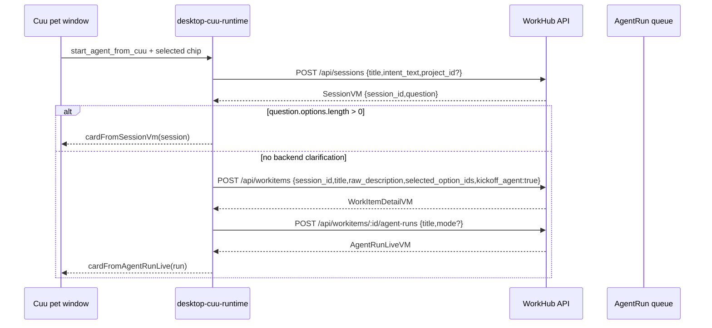

# Cuu R3 Agent 入口施工计划

## 1. 目标

R3 补 `FR-PET-002`：Cuu 不只是提醒和审批入口，也能从独立桌宠窗口发起真实 AI 工作。

当前原则：

- Cuu 仍只存在于独立透明 Tauri `pet` window。
- Web 与 desktop 主窗继续保持严肃工作界面，不显示 Cuu 本体。
- 不新增猫模型、不改色、不扩展外观动作矩阵。
- 用户优先点选，不默认打字。
- Cuu 出站必须复用 Web 同一套 typed API：`/api/sessions`、`/api/workitems`、`/api/workitems/:id/agent-runs`。
- Cuu 不拥有权限旁路；所有请求继续走 API client、auth、WorkItem/Proposal/Approval gate。

## 2. R3.1 已落切片：option-first 启动卡

本轮已完成第一刀：点击 Cuu body 时，如果当前没有业务卡片，pet surface 会展开一个 option-first 启动卡。

| 项 | 已落行为 |
|---|---|
| 卡片工厂 | `createDesktopCuuAgentLauncherCard()` |
| 卡片位置 | `apps/desktop-webview/src/desktop-cuu-runtime.ts` |
| 展开入口 | `apps/desktop-webview/src/pet-surface.ts`，点击 `[data-pet-drag-handle]` 且无当前 card 时显示 launcher |
| 选项 | `document-draft`、`structured-data`、`code-template` |
| 输入策略 | `input.mode="single_choice"`、`option_first=true`、`free_text_enabled=false` |
| 提交动作 | `start_agent_from_cuu` -> `/api/cuu/start-agent` |
| 中英双语 | `packages/cuu/src/i18n.ts` 新增 `cuuStart.*` 文案 |
| 公共导出 | `apps/desktop-webview/src/main.ts` 导出 launcher/action helpers |

R3.1 deliberately uses a local pseudo endpoint path (`/api/cuu/start-agent`) only inside the webview runtime resolver. It is not a backend route and does not bypass the daemon. The submit handler converts it into real API calls.

## 3. R3.2 已落切片：run stream 回流与错误卡

R3.2 补上第一版“启动后 Cuu 继续跟进”的 TS 合同。它不宣称真实 Tauri 视觉验收完成；当前完成的是 webview runtime 与 pet surface 可复用的订阅、刷新和错误映射。

| 项 | R3.2 行为 |
|---|---|
| 启动 helper | 新增 `startDesktopCuuAgentFromLauncher()`，封装 `createSession -> createWorkItem -> startAgentRun` |
| submit 返回 | `submitDesktopCuuAction()` 对 `cuu-start-agent` 返回 `agentRun`，供 pet surface 订阅 `stream_href` |
| run stream | 新增 `subscribeDesktopCuuAgentRunStream()`，使用 `EventSource(run.stream_href)`，过滤 `topic=run:{id}` / `run_id` 事件 |
| card refresh | 每个匹配 run 事件触发 `client.getAgentRun(run_id)`，再用 `cardFromAgentRunLive()` 更新 Cuu |
| 终态关闭 | `succeeded` / `failed` / `escalated` / `budget_exhausted` / `cancelled` 等非 `queued/running` 状态关闭订阅 |
| 错误卡 | 新增 `cardFromDesktopCuuRuntimeError()`，把 `budget_exhausted`、401/403、offline/network、generic error 映射为 Cuu 轻卡 |
| pet surface | 启动成功后持有 run subscription；切换到非同 run card 或 dispose 时关闭旧订阅 |
| 公共导出 | `apps/desktop-webview/src/main.ts` 导出 R3.2 helper / subscription / error card types |

R3.2 仍保持边界：Rust shell 不解析 intent、不直接调业务 API、不拥有 AgentRun 状态机；真实 daemon SSE、真实 pet window 截图和录屏仍是下一刀。

## 3.5 R3.3 已落切片：SessionVM question 回退

R3.3 补上“不能绕过澄清”的关键分支。真实 API 的 `POST /api/sessions` 可能返回带 `question.options[]` 的 `SessionVM`，这代表后端要求用户继续点选口径。Cuu 不能因为用户已经在 launcher 点过一次选项，就直接 `createWorkItem -> startAgentRun`。

| 项 | R3.3 行为 |
|---|---|
| 后端澄清判定 | `startDesktopCuuAgentFromLauncher()` 在 `createSession()` 后检查 `session.question.options.length > 0` |
| Cuu 返回 | 如果需要澄清，返回 `outcome="clarification"`、`cardFromSessionVm(session)`，不调用 `createWorkItem()` / `startAgentRun()` |
| 折叠输入 | `free_text.enabled=true` 只表示可选补充输入，不单独触发阻断；主路径仍是 `options[]` |
| 下一题 | `submitDesktopCuuAction()` 对 `session-next-question` 接收真实 API `SessionVM`，返回 `cardFromSessionVm(session)`，桌宠继续显示下一题 |
| 启动成功 | 只有无后端澄清时才返回 `outcome="started"`、`workItem`、`run`、`cardFromAgentRunLive(run)` |
| 中英双语 | 新增 `cuuStart.clarificationNeeded` |

该切片直接对应概念图 `cuu-option-first-clarify.png`：一次只问一个问题，默认点选，不把用户推回打字框，也不把 Cuu 放进主窗。

## 3.6 R3.4 已落切片：确认后启动 AgentRun

R3.4 把确认题里的 `create-workitem` 选项接成真实 typed action。Cuu 不再只能停在澄清卡：当用户在确认题里点选“创建事项”时，桌宠会沿用同一个 session，先记录澄清答案，再固化 WorkItem，最后启动 AgentRun。

| 项 | R3.4 行为 |
|---|---|
| 触发条件 | `session-next-question.selectedOptionIds` 包含 `create-workitem` |
| 记录选择 | 先调用 `nextQuestion(session_id, {selected_option_ids})`，保留用户确认事实 |
| 固化事项 | 再调用 `createWorkItem({session_id, selected_option_ids, kickoff_agent:true})` |
| 启动执行 | 用返回的 `workitem.id/title` 调用 `startAgentRun(workitem.id, {title})` |
| Cuu 返回 | 返回 `cardFromAgentRunLive(run)` 与 `agentRun`，pet surface 继续订阅 run stream |
| 权限边界 | 仍走 typed API client；缺少 `createWorkItem` 或 `startAgentRun` capability 时 fail closed |

这一步完成了 Cuu 从“点选澄清”到“真实 AI 执行”的最小闭环。后续 R3.5 需要先证明该闭环不是 mock client 内循环，再继续补真实 Tauri pet window 截图/录屏。

## 3.7 R3.5 已落切片：launcher-to-run route-stack smoke

R3.5 先补上 API route-stack 级别的真实链路验收：不再只用 desktop-webview mock client 证明 Cuu helper，而是在 `@workhub/api` 包内搭建 Hono route stack，复用真实 `sessions -> workitems -> agent-runs` routes、typed API client、desktop Cuu runtime action resolver 与 card renderer，跑通：

```text
launcher card -> createSession -> clarification SessionVM -> nextQuestion -> confirmation SessionVM -> createWorkItem -> startAgentRun -> AgentRun Cuu card
```

本切片同步修正一个真实契约错误：`POST /api/sessions/:id/next-question` 的服务端实际返回 `SessionVM`，但 API client 与 desktop runtime 旧类型按 `QuestionCard` 处理。当前已统一为：

| 层 | R3.5 行为 |
|---|---|
| API route/service | `nextQuestion()` 返回 `SessionVM`，保持会话、topic、stream 与 question 一起返回 |
| API client | `WorkHubApiClient.nextQuestion()` 类型改为 `Promise<SessionVM>` |
| desktop runtime | `submitDesktopCuuAction()` 对下一题走 `cardFromSessionVm(session)` |
| smoke | `apps/api/src/qa/cuu-r3-launcher-to-run-smoke.ts` 通过真实 Hono route stack 和 typed client 证明链路 |
| root gate | `pnpm lint` 已串入 `pnpm qa:cuu-r3-launcher-smoke`，避免后续回退 |

本切片仍不宣称真实 Tauri 视觉完成：当前 smoke 是 API route-stack + desktop runtime 的进程内验证，不是实际桌面窗口点击、daemon SSE、截图或 motion capture。

## 3.8 R3.6 已落切片：双语边界 + session 选择历史

R3.6 先补两个会影响真实用户判断的低层缺口：Cuu 英文环境不能继续露出中文 fallback，且 option-first 的前一轮交付方向不能在最终创建事项时丢失。当前切片不新增 Cuu 外观，不把 Cuu 放回主窗，也不宣称真实 Tauri 点击/截图完成。

| 层 | R3.6 行为 |
|---|---|
| Cuu event fallback | `cardFromEvent(en-US)` 对未知、无 preview 的默认事件返回 `WorkHub update` / `Cuu received a new status update.`，不再透出中文默认 attention |
| AgentRun budget state | `AgentRunLiveVM.status="budget_exhausted"` 转 `kind="budget"`、`state="asking_approval"`，标题和 message 走 `cuuStart` / `budget` 双语文案 |
| Replay cost | `cardFromReplayTrace()` 的 remaining budget 行改走 `cuuFormat(locale, "cost.remaining")`，不再硬编码“剩余” |
| runtime error | `cardFromDesktopCuuRuntimeError()` 对 budget / permission / offline / generic 固定错误使用本地化 fallback；不把中文服务端 message 直接塞进英文 Cuu 卡 |
| DB session history | `WorkItemDataRepository.listSessionSelectedOptionIds()` 从 `clarification_answer` chat history 读取 `selected_option_ids` 与 `selectedOptionKey` 并去重 |
| createWorkItem finalization | `createWorkItem({session_id})` 合并历史选择与当前确认选择，`workitem_finalized` 和 planning note 保留完整 option path |
| route-stack smoke | `qa:cuu-r3-launcher-smoke` 现在回读 work item，断言 `planning_note="selected_options: document-draft,create-workitem"` |

R3.6 关闭的是数据流与双语边界，不覆盖真实桌面窗口视觉。下一步必须把同一链路升级到 dev server / Tauri pet window 级别，并补刷新恢复。

## 3.9 R3.7 已落切片：pet runtime flow harness

R3.7 先补一层可复跑的 pet runtime flow harness，证明 Cuu pet bubble 的真实 card render、option-first chip selection、typed action resolver 与 `submitDesktopCuuAction()` 可以连续跑完：

```text
launcher card -> select document-draft -> createSession -> clarification card -> select document-draft -> nextQuestion -> confirmation card -> select create-workitem -> nextQuestion -> createWorkItem -> startAgentRun -> trace card
```

本切片使用 `renderDesktopPetSurface()` 检查每一步的 pet bubble DOM 属性，并复用真实 `resolveDesktopCuuAction()` / `submitDesktopCuuAction()`。它不新增 UI、不改 Cuu 外观、不冒充真实 Tauri window click；真实 dev server / Tauri screenshot 仍是下一刀。

| 层 | R3.7 行为 |
|---|---|
| launcher render | 断言 `data-cuu-card-id="cuu-agent-launcher"`、`data-pet-option-id="document-draft"`、无 `textarea/input` |
| option selection | 断言已选 chip 渲染为 `data-selected="true"` |
| clarification | fake typed client 返回 `SessionVM.question.options[]` 后，Cuu 渲染 session question card |
| confirmation | `submit_option` 后渲染 `create-workitem` 确认卡 |
| run card | `create-workitem` 后调用 `nextQuestion -> createWorkItem -> startAgentRun`，最终渲染 `data-pet-bubble-kind="trace"`、`data-cuu-state="thinking"` |
| API order | 测试记录并断言 `createSession`、两次 `nextQuestion`、`createWorkItem`、`startAgentRun` 的 payload 顺序 |

## 3.10 R3.8 已落切片：boot client injection seam

R3.8 补一个很小的 boot 级接入缝隙：`bootDesktopPetSurface()` 支持可选 `client` 注入，默认仍创建原来的 `createApiClient({ baseUrl:"", getClientToken })`。这让后续真实 boot click harness、dev-server smoke 或 Tauri evidence 脚本可以复用同一个 pet runtime 入口，而不是只能绕到 helper 或静态 renderer。

| 层 | R3.8 行为 |
|---|---|
| runtime boot | `bootDesktopPetSurface(root, { client })` 可注入 typed client |
| 默认行为 | 未传 `client` 时仍走原有 `createApiClient()`，生产路径不变 |
| stream / preference | 注入 client 同时供 `submitDesktopCuuAction()`、`subscribeDesktopCuuAgentRunStream()`、`updatePreferences()` 使用 |
| public export | `main.ts` 导出 `DesktopPetSurfaceClient` 类型，供 QA/dev-server harness 使用 |

本切片仍不宣称真实 Tauri 视觉完成；它只移除“boot click harness 不能注入可控 typed client”的阻塞。

## 3.11 R3.9 已落切片：boot click harness

R3.9 把 R3.7 的 runtime harness 向真实 pet boot 入口推进一层：测试从 `bootDesktopPetSurface(root, { client })` 启动，经过 production click event delegation，而不是直接调用 renderer / action helper。

```text
idle body -> body click -> launcher card -> option click -> submit anchor -> clarification -> confirm -> run card
```

| 层 | R3.9 行为 |
|---|---|
| boot 入口 | 使用 `bootDesktopPetSurface()` 真实初始化 controller、idle scheduler、pointer sensor 与 click listener |
| fake DOM 范围 | 只提供 `Element` / `Node`、`root.innerHTML`、`closest()`、click listener、无真实定时器的 `window.setInterval()` |
| launcher 展开 | 点击 `data-pet-drag-handle` 后渲染 `cuu-agent-launcher`，且仍无 `textarea/input` |
| option-first 选择 | 点击 `data-pet-option-id="document-draft"` 后通过生产 click handler 写回 `data-selected="true"` |
| action submit | 点击真实 action anchor 触发 `submitDesktopCuuAction()`，依次进入澄清卡、确认卡与 AgentRun trace card |
| API 顺序 | 同一 fake typed client 断言 `createSession -> nextQuestion -> nextQuestion -> createWorkItem -> startAgentRun` |

本切片不冒充真实 Tauri window 截图，也不覆盖真实 dev server / SSE 回流。它关闭的是“boot 后真实 click handler 是否会串起同一条链路”的缺口。

## 4. 字段级契约

### 4.1 Cuu launcher card

```ts
type CuuLauncherCard = CuuCard & {
  id: "cuu-agent-launcher";
  kind: "question";
  state: "asking_approval";
  input: {
    mode: "single_choice";
    option_first: true;
    free_text_enabled: false;
    free_text_collapsed_by_default: true;
  };
  actions: [{
    id: "start_agent_from_cuu";
    method: "POST";
    href: "/api/cuu/start-agent";
    payload: {
      title: string;
      intent_text: string;
    };
  }];
};
```

### 4.2 Runtime action

`resolveDesktopCuuAction()` maps the card action to:

```ts
type DesktopCuuStartAgentAction = {
  kind: "cuu-start-agent";
  title: string;
  intentText: string;
  selectedOptionIds?: string[];
  projectId?: string;
  runTitle?: string;
  mode?: "worker" | "pm";
};
```

`intentText` is composed from:

1. action payload `intent_text`;
2. selected chip label/description;
3. URL query fallback, only for future deep-link or test harness use.

If no chip is selected, submit fails with the existing `pet.optionRequired` message. This preserves the "先点选项" principle.

### 4.3 Real API chain

`submitDesktopCuuAction()` executes with a clarification gate:



返回给 Cuu 的 card 有两种合法形态：

- `outcome="clarification"`：`payload_ref.entity_type="session"`，action 继续指向 `/api/sessions/:id/next-question`。
- `outcome="started"`：`payload_ref.entity_type="agent_run"`，用于后续 replay、abort、open task。

### 4.4 Run stream subscription

```ts
type DesktopCuuRunStreamSubscription = {
  runId: string;
  streamUrl?: string;
  close: () => void;
};

subscribeDesktopCuuAgentRunStream({
  client, // getAgentRun + streamUrl
  run,    // AgentRunLiveVM from startAgentRun()
  onCard(card, message) {
    // pet surface setCard(card, message)
  }
});
```

事件处理规则：

1. 只接受 `topic === "run:{run_id}"`、`event.run_id === run_id` 或 `event.data.run_id === run_id` 的事件。
2. 收到 run 事件后不信任 event payload 直接渲染，而是重新拉 `GET /api/agent-runs/:id`。
3. 拉回的 `AgentRunLiveVM` 仍走 `cardFromAgentRunLive()`，保持 Web / Desktop / Cuu 同一 DTO。
4. 终态自动关闭订阅，避免旧 run 继续抢占 Cuu。
5. EventSource 不可用时只报告 unavailable，不伪造成功。

### 4.5 Runtime error card

```ts
cardFromDesktopCuuRuntimeError(error, { locale, run? })
```

| 错误 | Cuu card |
|---|---|
| `WorkHubApiError.code="budget_exhausted"` | `kind="budget"`、`state="asking_approval"` |
| 401 / 403 / `permission_denied` | `kind="bubble"`、`state="worried"` |
| `TypeError` / network / EventSource error | `kind="offline"`、`state="offline"` |
| 其他异常 | `kind="bubble"`、`state="worried"` |

如果已知 `run`，错误卡会保留 `payload_ref.entity_type="agent_run"`，并提供“查看回放 / 打开事项”动作。

## 5. Rust / Tauri 边界

R3.1 仍由 TS webview runtime 处理业务 action。Rust shell 不解析 intent、不创建 work item、不启动 AgentRun。

Rust 只负责：

- `pet` 透明窗口几何；
- body/card mode 切换；
- drag；
- cursor near sample；
- tray 恢复；
- SSE/system notification 转发。

下一步如果要把点击 Cuu body 的首卡展示做成更强的系统行为，Rust 也只能发 `tray-action` 或 `push-event` 给 webview，不直接调用业务 API。

## 6. 当前验证

已通过：

- `corepack pnpm --filter @workhub/desktop-webview test`
- `corepack pnpm --filter @workhub/desktop-webview typecheck`
- `corepack pnpm --filter @workhub/api typecheck`
- `corepack pnpm --filter @workhub/db typecheck`
- `corepack pnpm --filter @workhub/cuu typecheck`
- `corepack pnpm --filter @workhub/cuu test`
- `corepack pnpm --filter @workhub/desktop-webview test`
- `corepack pnpm qa:cuu-r3-launcher-smoke`
- `corepack pnpm lint`

新增测试覆盖：

| 测试 | 覆盖 |
|---|---|
| `desktop Cuu actions start a real agent run from an option-first launcher card` | selected chip -> `createSession` -> `createWorkItem` -> `startAgentRun` -> AgentRun Cuu card |
| `pet surface renders the Cuu outbound agent launcher as option-first without text input` | launcher card DOM、无 `textarea/input`、可点击 action |
| `desktop Cuu launcher helper returns session, work item, run, and Cuu card` | helper 直接返回 session/workItem/run/card/message |
| `desktop Cuu launcher stops at backend clarification instead of bypassing the question` | `SessionVM.question.options[]` -> `cardFromSessionVm()`，且不调用 `createWorkItem()` / `startAgentRun()` |
| `desktop Cuu run stream refreshes agent cards and closes on terminal status` | EventSource run event -> `getAgentRun()` -> Cuu card refresh -> terminal close |
| `desktop Cuu runtime maps API and stream failures to Cuu cards` | budget / permission / offline error card 分类 |
| `desktop Cuu actions advance option-first clarification sessions` | `nextQuestion()` -> `SessionVM` -> `cardFromSessionVm()`，澄清链路不断流 |
| `desktop Cuu actions finalize confirmed sessions and start the agent run` | `create-workitem` -> `nextQuestion()` -> `createWorkItem()` -> `startAgentRun()` -> AgentRun Cuu card |
| `qa:cuu-r3-launcher-smoke` | 真实 Hono route stack + typed API client + desktop runtime 跑通 launcher -> clarification -> confirmation -> AgentRun |
| `budget-exhausted live agent runs use budget Cuu cards` | `budget_exhausted` AgentRun -> budget Cuu card、英文固定文案、primary replay action |
| `replay cost cards localize remaining budget labels` | Replay cost section 不再出现硬编码中文 `剩余` |
| `generic English events use localized fallback instead of Chinese attention defaults` | en-US 未知事件 fallback 不含 CJK |
| `desktop Cuu runtime maps API and stream failures to Cuu cards` | budget / permission / offline / generic 错误卡英文环境不透出中文服务端 message |
| `pet runtime harness advances launcher selections through clarification into a run card` | pet render + option selection + typed runtime action 连续跑通 launcher -> clarification -> confirmation -> AgentRun |
| `pet surface boot flow opens launcher, resolves clarification, confirms, and renders a run card` | `bootDesktopPetSurface()` + production click delegation 跑通 body click -> launcher -> clarification -> confirmation -> AgentRun |

本轮 Cuu test 当前为 33/33 通过，desktop-webview test 当前为 68/68 通过；R2 release gate 在 root `pnpm lint` 中为 PASS；`corepack pnpm verify` 通过。

## 7. 与概念图对齐

| 概念要求 | 当前状态 |
|---|---|
| Cuu 独立 pet window | 保持，未把 Cuu 放回主窗 |
| 选项优先澄清 | launcher 与后端 `SessionVM.question` 都走 option-first Cuu 气泡 |
| 主力是 AI，不是看板 | Cuu 能从澄清确认直接进入 AgentRun；需要澄清时只展示用户必须看到的问题 |
| 桌宠要像入口而不是装饰 | R3.9 已从 `bootDesktopPetSurface()` click handler 证明 body click 可展开真实启动卡，后续返回 question 或 run 进度卡 |
| 任务时候有对应动作 | R3.2 已把 run stream 刷新接回 `cardFromAgentRunLive()`，Cuu 可从 thinking 变为 celebrating/worried/offline；R3.6 已补 budget exhausted 预算态 |
| 中英双语边界 | R3.6 已补未知事件 fallback、runtime error、Replay cost、budget exhausted AgentRun 的 en-US 测试 |
| 黑猫/白猫 Live2D 二选项 | 未改变模型白名单与外观 |

## 8. 尚未完成

R3.9 已补 boot 级 click harness；仍不能宣称 R3 完成。真实 Tauri 桌面窗口截图/录屏、SSE 回流截图、刷新恢复和 dev server 级 smoke 仍未验收。

| 缺口 | 计划 |
|---|---|
| 真实 Tauri 点击截图 | R3.9 已补 boot click harness；仍需用真实 `pet` window 跑 launcher card，截 body-only -> card 展开前后两张图 |
| 真实 daemon SSE 回流 | R3.2 已落 EventSource + `getAgentRun()` 合同；还需真实 API dev server / Tauri pet window 端到端验证 |
| 失败态 | R3.2 已落 budget/403/offline/generic card mapping；还需真实 API error smoke |
| 真实确认后启动 | R3.5 已落 API route-stack smoke，R3.9 已落 boot click harness；仍需真实 dev server / desktop shell smoke |
| option payload 更细 | 每个 chip 可带 `delivery_kind` / `risk_hint` / `default_acceptance`，进入 WorkItem spec |
| 真实端到端 smoke | R3.5 已补进程内 Hono route-stack；下一步升级到 API dev server + Tauri pet window |
| 可恢复状态 | launcher 启动后记录 pending run id，刷新 pet window 后能恢复当前卡 |
| 真实双语截图 | R3.6 已补 TS 级 en-US 边界；仍需真实 pet window 英文截图 |
| 选择历史产品化 | R3.6 已合并 selected option IDs 到 planning note；后续可把 `delivery_kind` / `risk_hint` 结构化进 WorkItem spec |

## 9. 下一刀 R3.10

R3.10 建议顺序：

1. 升级 smoke 到真实 API dev server + desktop webview runtime，证明不只是进程内 Hono route stack 或纯 TS runtime harness。
2. 生成真实 Tauri `pet` window 截图/录屏：body-only idle、launcher card、clarification card、queued/running card、completion card、failure/offline card 六组；其中至少一组 en-US。
3. 新增 `/api/pages/cuu-current` 或轻量 local state adapter，刷新 pet window 后恢复当前 session/run card。
4. 把 launcher chip metadata 结构化：`delivery_kind` / `risk_hint` / `default_acceptance` 进入 WorkItem spec，而不是只落 planning note。
5. 再运行 full `pnpm verify`、R2 release gate、reference path hygiene，并提交。
