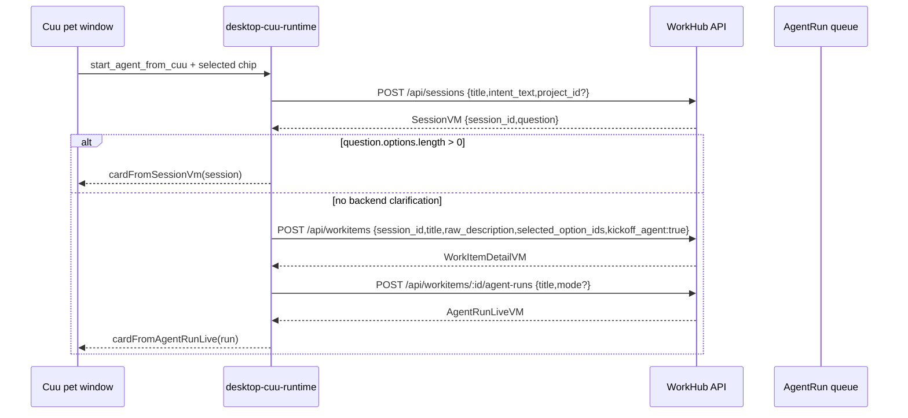

# Cuu R3 Agent 入口施工计划

## 1. 目标

R3 补 `FR-PET-002`：Cuu 不只是提醒和审批入口，也能从独立桌宠窗口发起真实 AI 工作。

当前原则：

- Cuu 仍只存在于独立透明 Tauri `pet` window。
- Web 与 desktop 主窗继续保持严肃工作界面，不显示 Cuu 本体。
- 不新增猫模型、不改色、不扩展外观动作矩阵。
- 用户优先点选，不默认打字。
- Cuu 出站必须复用 Web 同一套 typed API：`/api/sessions`、`/api/workitems`、`/api/workitems/:id/agent-runs`。
- Cuu 不拥有权限旁路；所有请求继续走 API client、auth、WorkItem/Proposal/Approval gate。

## 2. R3.1 已落切片：option-first 启动卡

本轮已完成第一刀：点击 Cuu body 时，如果当前没有业务卡片，pet surface 会展开一个 option-first 启动卡。

| 项 | 已落行为 |
|---|---|
| 卡片工厂 | `createDesktopCuuAgentLauncherCard()` |
| 卡片位置 | `apps/desktop-webview/src/desktop-cuu-runtime.ts` |
| 展开入口 | `apps/desktop-webview/src/pet-surface.ts`，点击 `[data-pet-drag-handle]` 且无当前 card 时显示 launcher |
| 选项 | `document-draft`、`structured-data`、`code-template` |
| 输入策略 | `input.mode="single_choice"`、`option_first=true`、`free_text_enabled=false` |
| 提交动作 | `start_agent_from_cuu` -> `/api/cuu/start-agent` |
| 中英双语 | `packages/cuu/src/i18n.ts` 新增 `cuuStart.*` 文案 |
| 公共导出 | `apps/desktop-webview/src/main.ts` 导出 launcher/action helpers |

R3.1 deliberately uses a local pseudo endpoint path (`/api/cuu/start-agent`) only inside the webview runtime resolver. It is not a backend route and does not bypass the daemon. The submit handler converts it into real API calls.

## 3. R3.2 已落切片：run stream 回流与错误卡

R3.2 补上第一版“启动后 Cuu 继续跟进”的 TS 合同。它不宣称真实 Tauri 视觉验收完成；当前完成的是 webview runtime 与 pet surface 可复用的订阅、刷新和错误映射。

| 项 | R3.2 行为 |
|---|---|
| 启动 helper | 新增 `startDesktopCuuAgentFromLauncher()`，封装 `createSession -> createWorkItem -> startAgentRun` |
| submit 返回 | `submitDesktopCuuAction()` 对 `cuu-start-agent` 返回 `agentRun`，供 pet surface 订阅 `stream_href` |
| run stream | 新增 `subscribeDesktopCuuAgentRunStream()`，使用 `EventSource(run.stream_href)`，过滤 `topic=run:{id}` / `run_id` 事件 |
| card refresh | 每个匹配 run 事件触发 `client.getAgentRun(run_id)`，再用 `cardFromAgentRunLive()` 更新 Cuu |
| 终态关闭 | `succeeded` / `failed` / `escalated` / `budget_exhausted` / `cancelled` 等非 `queued/running` 状态关闭订阅 |
| 错误卡 | 新增 `cardFromDesktopCuuRuntimeError()`，把 `budget_exhausted`、401/403、offline/network、generic error 映射为 Cuu 轻卡 |
| pet surface | 启动成功后持有 run subscription；切换到非同 run card 或 dispose 时关闭旧订阅 |
| 公共导出 | `apps/desktop-webview/src/main.ts` 导出 R3.2 helper / subscription / error card types |

R3.2 仍保持边界：Rust shell 不解析 intent、不直接调业务 API、不拥有 AgentRun 状态机；真实 daemon SSE、真实 pet window 截图和录屏仍是下一刀。

## 3.5 R3.3 已落切片：SessionVM question 回退

R3.3 补上“不能绕过澄清”的关键分支。真实 API 的 `POST /api/sessions` 可能返回带 `question.options[]` 的 `SessionVM`，这代表后端要求用户继续点选口径。Cuu 不能因为用户已经在 launcher 点过一次选项，就直接 `createWorkItem -> startAgentRun`。

| 项 | R3.3 行为 |
|---|---|
| 后端澄清判定 | `startDesktopCuuAgentFromLauncher()` 在 `createSession()` 后检查 `session.question.options.length > 0` |
| Cuu 返回 | 如果需要澄清，返回 `outcome="clarification"`、`cardFromSessionVm(session)`，不调用 `createWorkItem()` / `startAgentRun()` |
| 折叠输入 | `free_text.enabled=true` 只表示可选补充输入，不单独触发阻断；主路径仍是 `options[]` |
| 下一题 | `submitDesktopCuuAction()` 对 `session-next-question` 接收真实 API `SessionVM`，返回 `cardFromSessionVm(session)`，桌宠继续显示下一题 |
| 启动成功 | 只有无后端澄清时才返回 `outcome="started"`、`workItem`、`run`、`cardFromAgentRunLive(run)` |
| 中英双语 | 新增 `cuuStart.clarificationNeeded` |

该切片直接对应概念图 `cuu-option-first-clarify.png`：一次只问一个问题，默认点选，不把用户推回打字框，也不把 Cuu 放进主窗。

## 3.6 R3.4 已落切片：确认后启动 AgentRun

R3.4 把确认题里的 `create-workitem` 选项接成真实 typed action。Cuu 不再只能停在澄清卡：当用户在确认题里点选“创建事项”时，桌宠会沿用同一个 session，先记录澄清答案，再固化 WorkItem，最后启动 AgentRun。

| 项 | R3.4 行为 |
|---|---|
| 触发条件 | `session-next-question.selectedOptionIds` 包含 `create-workitem` |
| 记录选择 | 先调用 `nextQuestion(session_id, {selected_option_ids})`，保留用户确认事实 |
| 固化事项 | 再调用 `createWorkItem({session_id, selected_option_ids, kickoff_agent:true})` |
| 启动执行 | 用返回的 `workitem.id/title` 调用 `startAgentRun(workitem.id, {title})` |
| Cuu 返回 | 返回 `cardFromAgentRunLive(run)` 与 `agentRun`，pet surface 继续订阅 run stream |
| 权限边界 | 仍走 typed API client；缺少 `createWorkItem` 或 `startAgentRun` capability 时 fail closed |

这一步完成了 Cuu 从“点选澄清”到“真实 AI 执行”的最小闭环。后续 R3.5 需要先证明该闭环不是 mock client 内循环，再继续补真实 Tauri pet window 截图/录屏。

## 3.7 R3.5 已落切片：launcher-to-run route-stack smoke

R3.5 先补上 API route-stack 级别的真实链路验收：不再只用 desktop-webview mock client 证明 Cuu helper，而是在 `@workhub/api` 包内搭建 Hono route stack，复用真实 `sessions -> workitems -> agent-runs` routes、typed API client、desktop Cuu runtime action resolver 与 card renderer，跑通：

```text
launcher card -> createSession -> clarification SessionVM -> nextQuestion -> confirmation SessionVM -> createWorkItem -> startAgentRun -> AgentRun Cuu card
```

本切片同步修正一个真实契约错误：`POST /api/sessions/:id/next-question` 的服务端实际返回 `SessionVM`，但 API client 与 desktop runtime 旧类型按 `QuestionCard` 处理。当前已统一为：

| 层 | R3.5 行为 |
|---|---|
| API route/service | `nextQuestion()` 返回 `SessionVM`，保持会话、topic、stream 与 question 一起返回 |
| API client | `WorkHubApiClient.nextQuestion()` 类型改为 `Promise<SessionVM>` |
| desktop runtime | `submitDesktopCuuAction()` 对下一题走 `cardFromSessionVm(session)` |
| smoke | `apps/api/src/qa/cuu-r3-launcher-to-run-smoke.ts` 通过真实 Hono route stack 和 typed client 证明链路 |
| root gate | `pnpm lint` 已串入 `pnpm qa:cuu-r3-launcher-smoke`，避免后续回退 |

本切片仍不宣称真实 Tauri 视觉完成：当前 smoke 是 API route-stack + desktop runtime 的进程内验证，不是实际桌面窗口点击、daemon SSE、截图或 motion capture。

## 3.8 R3.6 已落切片：双语边界 + session 选择历史

R3.6 先补两个会影响真实用户判断的低层缺口：Cuu 英文环境不能继续露出中文 fallback，且 option-first 的前一轮交付方向不能在最终创建事项时丢失。当前切片不新增 Cuu 外观，不把 Cuu 放回主窗，也不宣称真实 Tauri 点击/截图完成。

| 层 | R3.6 行为 |
|---|---|
| Cuu event fallback | `cardFromEvent(en-US)` 对未知、无 preview 的默认事件返回 `WorkHub update` / `Cuu received a new status update.`，不再透出中文默认 attention |
| AgentRun budget state | `AgentRunLiveVM.status="budget_exhausted"` 转 `kind="budget"`、`state="asking_approval"`，标题和 message 走 `cuuStart` / `budget` 双语文案 |
| Replay cost | `cardFromReplayTrace()` 的 remaining budget 行改走 `cuuFormat(locale, "cost.remaining")`，不再硬编码“剩余” |
| runtime error | `cardFromDesktopCuuRuntimeError()` 对 budget / permission / offline / generic 固定错误使用本地化 fallback；不把中文服务端 message 直接塞进英文 Cuu 卡 |
| DB session history | `WorkItemDataRepository.listSessionSelectedOptionIds()` 从 `clarification_answer` chat history 读取 `selected_option_ids` 与 `selectedOptionKey` 并去重 |
| createWorkItem finalization | `createWorkItem({session_id})` 合并历史选择与当前确认选择，`workitem_finalized` 和 planning note 保留完整 option path |
| route-stack smoke | `qa:cuu-r3-launcher-smoke` 现在回读 work item，断言 `planning_note="selected_options: document-draft,create-workitem"` |

R3.6 关闭的是数据流与双语边界，不覆盖真实桌面窗口视觉。下一步必须把同一链路升级到 dev server / Tauri pet window 级别，并补刷新恢复。

## 3.9 R3.7 已落切片：pet runtime flow harness

R3.7 先补一层可复跑的 pet runtime flow harness，证明 Cuu pet bubble 的真实 card render、option-first chip selection、typed action resolver 与 `submitDesktopCuuAction()` 可以连续跑完：

```text
launcher card -> select document-draft -> createSession -> clarification card -> select document-draft -> nextQuestion -> confirmation card -> select create-workitem -> nextQuestion -> createWorkItem -> startAgentRun -> trace card
```

本切片使用 `renderDesktopPetSurface()` 检查每一步的 pet bubble DOM 属性，并复用真实 `resolveDesktopCuuAction()` / `submitDesktopCuuAction()`。它不新增 UI、不改 Cuu 外观、不冒充真实 Tauri window click；真实 dev server / Tauri screenshot 仍是下一刀。

| 层 | R3.7 行为 |
|---|---|
| launcher render | 断言 `data-cuu-card-id="cuu-agent-launcher"`、`data-pet-option-id="document-draft"`、无 `textarea/input` |
| option selection | 断言已选 chip 渲染为 `data-selected="true"` |
| clarification | fake typed client 返回 `SessionVM.question.options[]` 后，Cuu 渲染 session question card |
| confirmation | `submit_option` 后渲染 `create-workitem` 确认卡 |
| run card | `create-workitem` 后调用 `nextQuestion -> createWorkItem -> startAgentRun`，最终渲染 `data-pet-bubble-kind="trace"`、`data-cuu-state="thinking"` |
| API order | 测试记录并断言 `createSession`、两次 `nextQuestion`、`createWorkItem`、`startAgentRun` 的 payload 顺序 |

## 3.10 R3.8 已落切片：boot client injection seam

R3.8 补一个很小的 boot 级接入缝隙：`bootDesktopPetSurface()` 支持可选 `client` 注入，默认仍创建原来的 `createApiClient({ baseUrl:"", getClientToken })`。这让后续真实 boot click harness、dev-server smoke 或 Tauri evidence 脚本可以复用同一个 pet runtime 入口，而不是只能绕到 helper 或静态 renderer。

| 层 | R3.8 行为 |
|---|---|
| runtime boot | `bootDesktopPetSurface(root, { client })` 可注入 typed client |
| 默认行为 | 未传 `client` 时仍走原有 `createApiClient()`，生产路径不变 |
| stream / preference | 注入 client 同时供 `submitDesktopCuuAction()`、`subscribeDesktopCuuAgentRunStream()`、`updatePreferences()` 使用 |
| public export | `main.ts` 导出 `DesktopPetSurfaceClient` 类型，供 QA/dev-server harness 使用 |

本切片仍不宣称真实 Tauri 视觉完成；它只移除“boot click harness 不能注入可控 typed client”的阻塞。

## 3.11 R3.9 已落切片：boot click harness

R3.9 把 R3.7 的 runtime harness 向真实 pet boot 入口推进一层：测试从 `bootDesktopPetSurface(root, { client })` 启动，经过 production click event delegation，而不是直接调用 renderer / action helper。

```text
idle body -> body click -> launcher card -> option click -> submit anchor -> clarification -> confirm -> run card
```

| 层 | R3.9 行为 |
|---|---|
| boot 入口 | 使用 `bootDesktopPetSurface()` 真实初始化 controller、idle scheduler、pointer sensor 与 click listener |
| fake DOM 范围 | 只提供 `Element` / `Node`、`root.innerHTML`、`closest()`、click listener、无真实定时器的 `window.setInterval()` |
| launcher 展开 | 点击 `data-pet-drag-handle` 后渲染 `cuu-agent-launcher`，且仍无 `textarea/input` |
| option-first 选择 | 点击 `data-pet-option-id="document-draft"` 后通过生产 click handler 写回 `data-selected="true"` |
| action submit | 点击真实 action anchor 触发 `submitDesktopCuuAction()`，依次进入澄清卡、确认卡与 AgentRun trace card |
| API 顺序 | 同一 fake typed client 断言 `createSession -> nextQuestion -> nextQuestion -> createWorkItem -> startAgentRun` |

本切片不冒充真实 Tauri window 截图，也不覆盖真实 dev server / SSE 回流。它关闭的是“boot 后真实 click handler 是否会串起同一条链路”的缺口。

## 4. 字段级契约

### 4.1 Cuu launcher card

```ts
type CuuLauncherCard = CuuCard & {
  id: "cuu-agent-launcher";
  kind: "question";
  state: "asking_approval";
  input: {
    mode: "single_choice";
    option_first: true;
    free_text_enabled: false;
    free_text_collapsed_by_default: true;
  };
  actions: [{
    id: "start_agent_from_cuu";
    method: "POST";
    href: "/api/cuu/start-agent";
    payload: {
      title: string;
      intent_text: string;
    };
  }];
};
```

### 4.2 Runtime action

`resolveDesktopCuuAction()` maps the card action to:

```ts
type DesktopCuuStartAgentAction = {
  kind: "cuu-start-agent";
  title: string;
  intentText: string;
  selectedOptionIds?: string[];
  projectId?: string;
  runTitle?: string;
  mode?: "worker" | "pm";
};
```

`intentText` is composed from:

1. action payload `intent_text`;
2. selected chip label/description;
3. URL query fallback, only for future deep-link or test harness use.

If no chip is selected, submit fails with the existing `pet.optionRequired` message. This preserves the "先点选项" principle.

### 4.3 Real API chain

`submitDesktopCuuAction()` executes with a clarification gate:



返回给 Cuu 的 card 有两种合法形态：

- `outcome="clarification"`：`payload_ref.entity_type="session"`，action 继续指向 `/api/sessions/:id/next-question`。
- `outcome="started"`：`payload_ref.entity_type="agent_run"`，用于后续 replay、abort、open task。

### 4.4 Run stream subscription

```ts
type DesktopCuuRunStreamSubscription = {
  runId: string;
  streamUrl?: string;
  close: () => void;
};

subscribeDesktopCuuAgentRunStream({
  client, // getAgentRun + streamUrl
  run,    // AgentRunLiveVM from startAgentRun()
  onCard(card, message) {
    // pet surface setCard(card, message)
  }
});
```

事件处理规则：

1. 只接受 `topic === "run:{run_id}"`、`event.run_id === run_id` 或 `event.data.run_id === run_id` 的事件。
2. 收到 run 事件后不信任 event payload 直接渲染，而是重新拉 `GET /api/agent-runs/:id`。
3. 拉回的 `AgentRunLiveVM` 仍走 `cardFromAgentRunLive()`，保持 Web / Desktop / Cuu 同一 DTO。
4. 终态自动关闭订阅，避免旧 run 继续抢占 Cuu。
5. EventSource 不可用时只报告 unavailable，不伪造成功。

### 4.5 Runtime error card

```ts
cardFromDesktopCuuRuntimeError(error, { locale, run? })
```

| 错误 | Cuu card |
|---|---|
| `WorkHubApiError.code="budget_exhausted"` | `kind="budget"`、`state="asking_approval"` |
| 401 / 403 / `permission_denied` | `kind="bubble"`、`state="worried"` |
| `TypeError` / network / EventSource error | `kind="offline"`、`state="offline"` |
| 其他异常 | `kind="bubble"`、`state="worried"` |

如果已知 `run`，错误卡会保留 `payload_ref.entity_type="agent_run"`，并提供“查看回放 / 打开事项”动作。

## 5. Rust / Tauri 边界

R3.1 仍由 TS webview runtime 处理业务 action。Rust shell 不解析 intent、不创建 work item、不启动 AgentRun。

Rust 只负责：

- `pet` 透明窗口几何；
- body/card mode 切换；
- drag；
- cursor near sample；
- tray 恢复；
- SSE/system notification 转发。

下一步如果要把点击 Cuu body 的首卡展示做成更强的系统行为，Rust 也只能发 `tray-action` 或 `push-event` 给 webview，不直接调用业务 API。

## 6. 当前验证

已通过：

- `corepack pnpm --filter @workhub/desktop-webview test`
- `corepack pnpm --filter @workhub/desktop-webview typecheck`
- `corepack pnpm --filter @workhub/api typecheck`
- `corepack pnpm --filter @workhub/db typecheck`
- `corepack pnpm --filter @workhub/cuu typecheck`
- `corepack pnpm --filter @workhub/cuu test`
- `corepack pnpm --filter @workhub/desktop-webview test`
- `corepack pnpm qa:cuu-r3-launcher-smoke`
- `corepack pnpm lint`

新增测试覆盖：

| 测试 | 覆盖 |
|---|---|
| `desktop Cuu actions start a real agent run from an option-first launcher card` | selected chip -> `createSession` -> `createWorkItem` -> `startAgentRun` -> AgentRun Cuu card |
| `pet surface renders the Cuu outbound agent launcher as option-first without text input` | launcher card DOM、无 `textarea/input`、可点击 action |
| `desktop Cuu launcher helper returns session, work item, run, and Cuu card` | helper 直接返回 session/workItem/run/card/message |
| `desktop Cuu launcher stops at backend clarification instead of bypassing the question` | `SessionVM.question.options[]` -> `cardFromSessionVm()`，且不调用 `createWorkItem()` / `startAgentRun()` |
| `desktop Cuu run stream refreshes agent cards and closes on terminal status` | EventSource run event -> `getAgentRun()` -> Cuu card refresh -> terminal close |
| `desktop Cuu run stream fallback maps failed runs to worried replay cards` | active-run fallback refresh -> failed AgentRun -> `worried` trace card + replay action |
| `desktop Cuu runtime maps API and stream failures to Cuu cards` | budget / permission / offline error card 分类 |
| `desktop Cuu actions advance option-first clarification sessions` | `nextQuestion()` -> `SessionVM` -> `cardFromSessionVm()`，澄清链路不断流 |
| `desktop Cuu actions finalize confirmed sessions and start the agent run` | `create-workitem` -> `nextQuestion()` -> `createWorkItem()` -> `startAgentRun()` -> AgentRun Cuu card |
| `qa:cuu-r3-launcher-smoke` | 真实 Hono route stack + typed API client + desktop runtime 跑通 launcher -> clarification -> confirmation -> AgentRun |
| `budget-exhausted live agent runs use budget Cuu cards` | `budget_exhausted` AgentRun -> budget Cuu card、英文固定文案、primary replay action |
| `replay cost cards localize remaining budget labels` | Replay cost section 不再出现硬编码中文 `剩余` |
| `generic English events use localized fallback instead of Chinese attention defaults` | en-US 未知事件 fallback 不含 CJK |
| `desktop Cuu runtime maps API and stream failures to Cuu cards` | budget / permission / offline / generic 错误卡英文环境不透出中文服务端 message |
| `pet runtime harness advances launcher selections through clarification into a run card` | pet render + option selection + typed runtime action 连续跑通 launcher -> clarification -> confirmation -> AgentRun |
| `pet surface boot flow opens launcher, resolves clarification, confirms, and renders a run card` | `bootDesktopPetSurface()` + production click delegation 跑通 body click -> launcher -> clarification -> confirmation -> AgentRun |
| `WorkHubEvent envelope creates browser-safe UUID ids` | `packages/events` 不再把 `node:crypto` 静态带进浏览器/Tauri pet 入口 |
| `pet surface renders only the Live2D cat runtime without main shell or fallback sprites` | 断言 Live2D iframe 不吃掉 body 点击，body overlay 负责打开 launcher |

本轮 Cuu test 当前为 33/33 通过，events test 当前为 12/12 通过，desktop-webview test 当前为 72/72 通过；R2 release gate 在 root `pnpm lint` 中为 PASS；`corepack pnpm verify` 通过。

## 7. 与概念图对齐

| 概念要求 | 当前状态 |
|---|---|
| Cuu 独立 pet window | 保持，未把 Cuu 放回主窗 |
| 选项优先澄清 | launcher 与后端 `SessionVM.question` 都走 option-first Cuu 气泡 |
| 主力是 AI，不是看板 | Cuu 能从澄清确认直接进入 AgentRun；需要澄清时只展示用户必须看到的问题 |
| 桌宠要像入口而不是装饰 | R3.10 已用真实 Tauri `pet` window 证明 body-only -> launcher card 展开；R3.11 已用真实本机 HTTP dev server 证明同一 launcher-to-run 数据流不只是进程内 route stack |
| 任务时候有对应动作 | R3.2 已把 run stream 刷新接回 `cardFromAgentRunLive()`，Cuu 可从 thinking 变为 celebrating/worried/offline；R3.6 已补 budget exhausted 预算态；R3.13.1 已用真实 Tauri run-failure 证明 failed AgentRun 会进入 `worried` trace card；R3.13.2 已用真实 Tauri capture 证明 401/403 进入 permission/worried 轻卡，stream offline 进入 offline card |
| 中英双语边界 | R3.10 已补真实 Tauri `pet` window en-US launcher capture；R3.6 已补未知事件 fallback、runtime error、Replay cost、budget exhausted AgentRun 的 en-US 测试；R3.13.1 已补 en-US run-failure capture；R3.13.2 已补 401/403/offline 的 zh-CN 与 en-US capture |
| 黑猫/白猫 Live2D 二选项 | 未改变模型白名单与外观 |

## 8. R3.10 已落：真实 Tauri launcher capture

本切片把 R3.9 的 fake DOM boot harness 升级为真实 Tauri `pet` window launcher capture。它仍不新增 Cuu 外观、不改变黑/白 Live2D 二选项，不把 Cuu 放回主窗。

改动：

- `client-tauri/src-tauri/src/main.rs`
  - 手动创建 `pet` window 时显式使用 `WebviewUrl::App("pet.html")`，避免 WebView2 target 退回 `about:blank`。
  - QA 环境允许 `WORKHUB_CUU_QA_SCENARIO=launcher` 与 `WORKHUB_CUU_QA_LOCALE=en-US`，并注入 DOM report flag。
- `apps/desktop-webview/src/pet-surface.ts`
  - `desktopPetLocale()` 支持 QA locale injection。
  - `wh-pet-body::after` 加透明点击 overlay，保证 Live2D iframe 上方的 body tap 命中 launcher 入口。
- `packages/events/src/envelope.ts`
  - 去掉浏览器入口不兼容的 `node:crypto` 静态导入，改为 `globalThis.crypto` / `getRandomValues` / fallback 生成 UUID。
- `scripts/qa/cuu-tauri-motion-capture.ps1`
  - `launcher` 进入 QA scenario allowlist。
  - 真实 Tauri `pet` window 捕获时使用 WebView2 CDP mouse event 驱动 body tap，并继续用 PrintWindow frames + DOM report 作为验收证据。
  - 报告记录 `webview2_cdp_enabled=true` 与 `scenario_events[0].input_driver="webview2_cdp"`。

验收证据：

- `docs/workhub/05-clients/assets/audit/2026-06-10-cuu-r3-10-sidecar/hijiki/launcher-en-US/motion-diff-report.json`
  - `passed=true`
  - `motion_gate_passed=true`
  - `actual_dom_matches_expected=true`
  - `cuu_qa_preferences.pet_locale="en-US"`
  - `cuu_qa_preferences.pet_qa_scenario="launcher"`
  - `scenario_events[0].action="tap_body_open_launcher"`
  - `scenario_events[0].input_driver="webview2_cdp"`
  - `actual_dom_report.bubble.data.data_cuu_card_id="cuu-agent-launcher"`
  - `actual_dom_report.primary_action.data.data_cuu_action_id="start_agent_from_cuu"`
  - `actual_dom_report.primary_chip.data.data_pet_option_id="document-draft"`
- `docs/workhub/05-clients/assets/audit/2026-06-10-cuu-r3-10-sidecar/hijiki/launcher-en-US/cuu-motion-contact-sheet.png`
  - frame 000-002 为 body-only 黑猫；frame 003 起展开英文 launcher card。
- 同目录保留 `cuu-motion-printwindow.gif`、`cuu-motion-printwindow.mp4`、`cuu-tauri-dom-report.json`、32 帧 `frames/` 与 `first-frame-probe.png`。

验证：

- `corepack pnpm --filter @workhub/events test`：12/12 通过。
- `corepack pnpm --filter @workhub/events typecheck`：通过。
- `corepack pnpm --filter @workhub/desktop-webview typecheck`：通过。
- `corepack pnpm --filter @workhub/desktop-webview test`：69/69 通过。
- `cargo test --manifest-path client-tauri/src-tauri/Cargo.toml`：66 + 9 + 3 通过。
- `powershell -ExecutionPolicy Bypass -File scripts/qa/cuu-tauri-motion-capture.ps1 -SkipBuild -Scenario launcher -Locale en-US -FrameCount 32 -IntervalMs 180 -OutDir docs/workhub/05-clients/assets/audit/2026-06-10-cuu-r3-10-sidecar/hijiki/launcher-en-US`：通过。

## 9. R3.11 已落：真实 API dev-server launcher-to-run smoke

本切片把 R3.5 的进程内 `app.request()` route-stack smoke 升级为真实本机 HTTP server 验收。它仍不冒充真实 Tauri window 截图，也不新增 Cuu 外观；目标是证明桌面 Cuu runtime 通过 typed API client 访问真实监听端口后，仍能完成 option-first launcher -> backend clarification -> confirmation -> WorkItem -> AgentRun。

改动：

- `apps/api/src/qa/cuu-r3-launcher-harness.ts`
  - 抽出共享 smoke harness：client-token auth 桩、真实 `sessions/workitems/agent-runs` routes、内存 WorkItem service、内存 AgentRun queue、Cuu launcher/action 断言。
  - 统一断言 launcher input 为 `mode="single_choice"`、`option_first=true`、`free_text_enabled=false`。
- `apps/api/src/qa/cuu-r3-dev-server-launcher-smoke.ts`
  - 用 `@hono/node-server` 在 `127.0.0.1:0` 启动真实 Hono HTTP server。
  - `createApiClient({ baseUrl, getClientToken })` 不传 `fetchFn`，请求经 Node 原生 `fetch` 进入本机 API server。
  - 验证 `/api/health`、`createSession`、`nextQuestion`、`createWorkItem`、`startAgentRun`、`getAgentRun` 和 `streamUrl()`。
- `apps/api/src/qa/cuu-r3-launcher-to-run-smoke.ts`
  - 保留进程内 route-stack smoke，但复用同一 harness，避免两套断言漂移。
- `packages/api-client/src/client.ts`
  - 收紧 envelope 判断，只把真正的 `{ ok, data/error }` 视为 WorkHub envelope；裸 `/api/health` payload 不再被误解包成 `undefined`。
- `package.json` / `apps/api/package.json`
  - 新增 `qa:cuu-r3-dev-server-smoke`，并接入 root `pnpm lint` / `pnpm verify`。

验收证据：

- `corepack pnpm --filter @workhub/api qa:cuu-r3-launcher-smoke`：通过，`transport="in-process-hono"`，回读 `planning_note="selected_options: document-draft,create-workitem"`。
- `corepack pnpm --filter @workhub/api qa:cuu-r3-dev-server-smoke`：通过，`transport="http-dev-server"`，`api_base_url="http://127.0.0.1:<ephemeral>"`，`stream_url` 指向同一真实监听端口。
- `corepack pnpm --filter @workhub/api-client test`：9/9 通过，包含裸 health payload 回归测试。
- `corepack pnpm --filter @workhub/api typecheck` / `test`：通过，API 测试 100/100。
- `corepack pnpm --filter @workhub/desktop-webview typecheck` / `test`：通过，desktop webview 测试 69/69。

数据流审视：

```text
Tauri/pet runtime action contract
  -> WorkHubApiClient(baseUrl=http://127.0.0.1:<port>, client-token)
  -> real Hono HTTP server
  -> sessions route
  -> SessionVM clarification card
  -> nextQuestion confirmation
  -> WorkItem creation with merged option history
  -> AgentRun enqueue
  -> getAgentRun readback + stream URL contract
```

PRD/概念图一致性：

- 符合 `cuu-option-first-clarify.png`：默认点选、一步一问、无输入框默认占位。
- 符合 `cuu-desktop-approval-search.png` / `endpoint-page-cuu-alignment.png`：Cuu 是独立 pet surface 入口，主窗不承载 Cuu 本体。
- 符合 TS-first runtime 概念：Rust/Tauri 不拥有业务 API 或 Agent 状态；server、contracts、typed client 和 webview runtime 仍是边界。

## 10. 尚未完成

R3.12 已补真实 Tauri `pet` window run-stream completion 终态截图/录屏与中英双语证据；R3.13.1 已补真实 Tauri `run-failure` 终态截图/录屏与中英双语证据；R3.13.2 已补真实 Tauri 401/403 与 stream offline 错误态中英双语证据；R3.13.3 已补 pet webview boot 层 session/run 恢复；R3.14 已补 launcher chip metadata 结构化进入 WorkItem spec，并补 Cuu 卡片长文本不超框样式门；R3.15 已补真实 Tauri reload capture，覆盖 session question、active AgentRun、terminal AgentRun 三类恢复；R3.16 已补 `clarify/search/sync/done/offline/approval` 真实 Tauri 业务状态矩阵 capture；R3.17 已补 settings matrix、右键菜单双语 capture、模型切换 capture 与 `settings_menu_layout_gate`；R3.18 已补 pass-through 主窗 settings 恢复；R3.19 已补 tray handler recovery；R3.20a 已补右键 hover -> main settings 同步截图；R3.20b 已补 Windows 物理 OS 托盘菜单恢复和 run card 文本 overflow 自动门；R3.23 已补 Linux GNOME StatusNotifier/AppIndicator 菜单动作。R3 Agent entry 的最小可恢复闭环已有真实窗口证据；后续继续补 macOS menu bar 与 R4 主窗产品化。

| 缺口 | 计划 |
|---|---|
| 真实 Tauri 点击截图 | R3.10 已补真实 `pet` window launcher/en-US capture；R3.12 已补 zh-CN/en-US run-stream completion capture；R3.13.1 已补 zh-CN/en-US run-failure capture；R3.13.2 已补 zh-CN/en-US 401/403/offline capture |
| 真实 daemon SSE 回流 | R3.2 已落 EventSource + `getAgentRun()` 合同；R3.11 已补本机 HTTP server launcher-to-run；R3.12 已补 Tauri pet window 内 stream 订阅 + fallback refresh 的 DOM/capture 证据 |
| 失败态 | R3.2 已落 budget/403/offline/generic card mapping；R3.13.1 已落真实 run failure smoke + Tauri capture；R3.13.2 已落 401/403/offline route-stack fault smoke + 真实 Tauri capture |
| 真实确认后启动 | R3.5 已落 API route-stack smoke，R3.9 已落 boot click harness，R3.11 已落真实 dev-server smoke，R3.12 已落 Tauri run-stream 终态 capture |
| option payload 更细 | R3.14 已让 launcher chip 带 `delivery_kind` / `risk_hint` / `default_acceptance`，并写入 WorkItem `planning_note` JSON spec 与默认 acceptance items |
| 真实端到端 smoke | R3.5 已补进程内 Hono route-stack；R3.11 已补 API dev server；R3.12 已补 run-stream smoke 与 Tauri capture；R3.13.1 已补 run-failure smoke 与 Tauri capture；R3.13.2 已补 error fault route-stack smoke 与 Tauri capture |
| 可恢复状态 | R3.13.3 已补 `bootDesktopPetSurface()` 刷新/重启恢复：session question 用本地 card snapshot 恢复，AgentRun 用 `GET /api/agent-runs/:id` 重新拉取并恢复 active/terminal card；R3.15 已用真实 Tauri reload capture 证明 session/active run/terminal run 恢复且不裁切 |
| 真实双语截图 | R3.10 已补真实 pet window 英文 launcher 截图；R3.12 已补 zh-CN 与 en-US run-stream completion 截图；R3.13.1 已补 zh-CN 与 en-US run-failure 截图；R3.13.2 已补 zh-CN 与 en-US 401/403/offline 截图；R3.15 已补 zh-CN reload session、en-US reload active run、zh-CN reload terminal run 截图；R3.16 已补 zh-CN/en-US 混合覆盖的业务状态矩阵截图；R3.17 已补 zh-CN/en-US 右键菜单截图；R3.18/R3.19/R3.20a/R3.20b 已补 zh-CN/en-US 主窗 settings 恢复/同步/物理托盘截图 |
| settings / menu 真实证据 | R3.17 已补 settings 八组合、右键菜单 zh-CN/en-US 和黑猫切白猫模型切换 capture；R3.18 已补 pass-through 主窗恢复；R3.19 已补 tray handler recovery；R3.20a 已补右键 hover -> 主窗 settings 同步截图；R3.20b 已补 Windows 物理 OS 托盘点击恢复证据；R3.23 已补 Linux GNOME StatusNotifier/AppIndicator 菜单动作；下一步补 macOS menu bar smoke |
| 选择历史产品化 | R3.6 已合并 selected option IDs 到 planning note；R3.14 已把 `delivery_kind` / `risk_hint` / `default_acceptance` 结构化进 WorkItem spec |

## 11. R3.12 已落切片：真实 Tauri run-stream capture + 回流证据

R3.12 关闭 R3.11 后最关键的可视缺口：Cuu 不再只由 dev-server smoke 证明“能启动 run”，而是在真实 Tauri `pet` window 里从 option-first launcher 走到 AgentRun completion card，并把 DOM report、contact sheet、GIF/MP4 和 motion diff 一起落盘。capture 运行时也会在本地生成 API/Tauri stdout/stderr，便于调试，但 Git 跟踪证据以审计图像、视频和 JSON report 为准。范围只覆盖 R3 数据流与 capture 可信度，不新增模型、改色、动效或设置矩阵。

改动：

| 层 | R3.12 行为 |
|---|---|
| API QA server | `apps/api/src/qa/cuu-r3-tauri-run-stream-server.ts` 启动 `127.0.0.1:8787` 本机 Hono server，挂载真实 session/workitem/agent-run/push routes |
| HTTP/SSE smoke | `apps/api/src/qa/cuu-r3-run-stream-smoke.ts` 走真实 HTTP + SSE，等待 `agent_run.step kind=done` 与最终 `status=succeeded` |
| desktop runtime | `DesktopCuuFetchEventSource` 在 WebView 有 client token 时用 `fetch()` 订阅 SSE，并带 `X-WorkHub-Client-Token` / `X-YQGL-Client-Token` |
| run refresh | `subscribeDesktopCuuAgentRunStream()` 在 SSE 外增加 active-run fallback refresh，终态关闭订阅并刷新 completion card |
| pet surface | `run-stream` QA scenario 使用真实 `client` 与现有 Cuu action runtime：launcher -> clarification -> confirmation -> WorkItem -> AgentRun -> stream card |
| DOM report | `pet` root 输出 `data-cuu-run-stream-state`、`data-cuu-run-stream-run-id`、`data-cuu-run-stream-event-type`、`data-cuu-run-stream-refreshed-status`、`data-cuu-run-stream-close-reason` |
| Tauri shell | Rust 只注入 QA scenario/locale/client token；不调用业务 API、不拥有 session/run 状态 |
| capture script | `scripts/qa/cuu-tauri-motion-capture.ps1 -Scenario run-stream` 自动启动/探测 R3.12 API server，并保留 stream enabled |

验收证据：

| 证据 | 结果 |
|---|---|
| `corepack pnpm --filter @workhub/api qa:cuu-r3-run-stream-smoke` | 通过，最终 `final_status="succeeded"` |
| `corepack pnpm --filter @workhub/desktop-webview typecheck` | 通过 |
| `corepack pnpm --filter @workhub/desktop-webview test` | 71/71 通过 |
| zh-CN Tauri capture | `docs/workhub/05-clients/assets/audit/2026-06-10-cuu-r3-run-stream/hijiki/run-stream-zh-pass/` |
| en-US Tauri capture | `docs/workhub/05-clients/assets/audit/2026-06-10-cuu-r3-run-stream/hijiki/run-stream-en-pass2/` |

两个 capture 目录均保留 `cuu-motion-contact-sheet.png`、`cuu-motion-printwindow.gif`、`cuu-motion-printwindow.mp4`、`cuu-tauri-dom-report.json` 与 `motion-diff-report.json`。`motion-diff-report.json` 均满足 `passed=true`、`motion_gate_passed=true`、`actual_dom_matches_expected=true`、`sse_disabled_for_scenario=false`；DOM report 终态均显示 `data_cuu_state="celebrating"`、`data_pet_card_kind="completion"`、`data_cuu_run_stream_state="closed"`、`data_cuu_run_stream_close_reason="terminal_status"`、primary action 为 `view_replay`。

Bug / 数据流审查：

| 项 | 结论 |
|---|---|
| 已修 bug | 首轮真实 capture 中后端已经 `run_done succeeded`，但 WebView card 停在 queued/thinking；R3.12 加入 active-run fallback refresh，并把 run-stream 状态写入 DOM report，防止 SSE 事件缺失时卡片不终态刷新 |
| 数据流 | `pet` window QA click flow -> typed API client -> `/api/sessions` -> `/api/workitems` -> `/api/workitems/:id/agent-runs` -> in-process queue delayed run -> PushBus SSE -> desktop runtime stream subscribe/fallback refresh -> `GET /api/agent-runs/:id` -> completion card |
| PRD/概念图 | 仍符合 `cuu-option-first-clarify.png` 的 option-first；符合 `cuu-desktop-approval-search.png` 与 `endpoint-page-cuu-alignment.png` 的独立 pet window；主窗无 Cuu 本体 |
| Rust 边界 | Rust/Tauri 只负责窗口、QA preference 与 token 注入；业务 API、Agent 状态机和 DOM card 更新仍在 TS-first runtime |
| 禁止项 | 未新增模型、改色、动效、设置矩阵；未提交 `reference/` |

复跑命令：

```powershell
corepack pnpm --filter @workhub/api qa:cuu-r3-run-stream-smoke
corepack pnpm --filter @workhub/desktop-webview typecheck
corepack pnpm --filter @workhub/desktop-webview test
powershell -ExecutionPolicy Bypass -File scripts\qa\cuu-tauri-motion-capture.ps1 -Scenario run-stream -Locale zh-CN -ModelPackId cuu-hijiki-live2d-cubism2 -FrameCount 72 -IntervalMs 180 -OutDir docs\workhub\05-clients\assets\audit\2026-06-10-cuu-r3-run-stream\hijiki\run-stream-zh-pass
powershell -ExecutionPolicy Bypass -File scripts\qa\cuu-tauri-motion-capture.ps1 -Scenario run-stream -Locale en-US -ModelPackId cuu-hijiki-live2d-cubism2 -FrameCount 72 -IntervalMs 180 -OutDir docs\workhub\05-clients\assets\audit\2026-06-10-cuu-r3-run-stream\hijiki\run-stream-en-pass2
```

## 12. R3.13.1 已落切片：真实 Tauri run-failure capture

R3.13.1 先关闭 failure/offline 计划里的第一条真实终态：AgentRun provider 失败后，Cuu 必须在真实 Tauri `pet` window 里进入 `worried` trace card，并保留 replay 入口。范围仍只覆盖 R3 数据流与 capture 可信度，不新增模型、改色、动效或设置矩阵。

改动：

| 层 | R3.13.1 行为 |
|---|---|
| API QA harness | `createCuuR3SmokeApp({ runOutcome:"failed" })` 让同一 session/workitem/agent-run/push route stack 生成 failed AgentRun |
| HTTP/SSE + fallback smoke | `apps/api/src/qa/cuu-r3-run-failure-smoke.ts` 建立真实 HTTP SSE 连接，并通过 `GET /api/agent-runs/:id` fallback 验证最终 `status="failed"` 与 failure trace |
| desktop runtime | 新增测试覆盖 active-run fallback refresh：无 terminal SSE 事件时，failed AgentRun 必须刷新为 `state="worried"`、`kind="trace"`、primary action `view_replay` |
| pet surface | `run-failure` QA scenario 复用真实 `client` 与 Cuu action runtime：launcher -> clarification -> confirmation -> WorkItem -> AgentRun -> failed terminal card；同时修复 context-heavy trace card 的高 DPI 截图溢出，把含进度/预算的业务卡收敛到安全左锚、`minmax(0,1fr)` grid 和可滚动上限内 |
| Tauri shell | Rust QA allowlist 增加 `run-failure`；仍只注入 scenario/locale/client token，不调用业务 API |
| capture script | `scripts/qa/cuu-tauri-motion-capture.ps1 -Scenario run-failure` 自动启动 run-stream QA server，并通过 `WORKHUB_CUU_QA_RUN_OUTCOME=failed` 切换失败终态 |

验收证据：

| 证据 | 结果 |
|---|---|
| `corepack pnpm --filter @workhub/api qa:cuu-r3-run-failure-smoke` | 通过，SSE `connected`，REST fallback 最终 `final_status="failed"` |
| `corepack pnpm --filter @workhub/desktop-webview typecheck` | 通过 |
| `corepack pnpm --filter @workhub/desktop-webview test` | 72/72 通过 |
| zh-CN Tauri capture | `docs/workhub/05-clients/assets/audit/2026-06-10-cuu-r3-run-failure/hijiki/run-failure-zh-pass/` |
| en-US Tauri capture | `docs/workhub/05-clients/assets/audit/2026-06-10-cuu-r3-run-failure/hijiki/run-failure-en-pass/` |

两个 capture 目录均保留 `cuu-motion-contact-sheet.png`、`cuu-motion-printwindow.gif`、`cuu-motion-printwindow.mp4`、`cuu-tauri-dom-report.json` 与 `motion-diff-report.json`。`motion-diff-report.json` 均满足 `passed=true`、`motion_gate_passed=true`、`actual_dom_matches_expected=true`、`sse_disabled_for_scenario=false`；DOM report 终态均显示 `data_cuu_state="worried"`、`data_pet_card_kind="trace"`、`data_cuu_live2d_motion="worried_ears"`、`data_cuu_run_stream_state="closed"`、`data_cuu_run_stream_close_reason="terminal_status"`、primary action 为 `view_replay`。人工复核最终帧：zh-CN 与 en-US 的 `Run progress/执行进度`、`Budget/预算`、replay/back actions 和长英文 failure 文案均完整留在卡片边界内，右边框没有被 PrintWindow 裁切。

Bug / 数据流审查：

| 项 | 结论 |
|---|---|
| 已识别时序 | 内存 PushBus 不回放历史 run events；failure 比 success 更快到终态时，API smoke 可能只看到 SSE `connected`。R3.12 的 active-run fallback refresh 是正确兜底，R3.13.1 用 smoke 与 Tauri DOM 证明 fallback 能把 failed run 刷成 `worried` card。 |
| 已修 UI bug | 用户截图发现 failed trace card 底部 `Budget` 和英文长行会被旧的 288px/268px 固定卡片裁切。修复为 context-heavy 业务卡专用 300px 安全左锚布局、`grid-template-columns:minmax(0,1fr)`、长文本 `overflow-wrap:anywhere` 与 320px 垂直上限；重新生成 zh-CN/en-US 真实 Tauri frames 后确认无文本超框。 |
| 数据流 | `pet` window QA click flow -> typed API client -> `/api/sessions` -> `/api/workitems` -> `/api/workitems/:id/agent-runs` -> delayed run with forced provider failure -> PushBus SSE connected + fallback refresh -> `GET /api/agent-runs/:id` -> worried trace card |
| PRD/概念图 | 仍符合 option-first；Cuu 仍是独立 pet window；失败时给轻卡和 replay 入口，不把 Cuu 放回主窗 |
| Rust 边界 | Rust/Tauri 只负责窗口、QA preference 与 token 注入；业务 API、Agent 状态机和 DOM card 更新仍在 TS-first runtime |
| 禁止项 | 未新增模型、改色、动效、设置矩阵；未提交 `reference/` |

复跑命令：

```powershell
corepack pnpm --filter @workhub/api qa:cuu-r3-run-failure-smoke
corepack pnpm --filter @workhub/desktop-webview typecheck
corepack pnpm --filter @workhub/desktop-webview test
powershell -ExecutionPolicy Bypass -File scripts\qa\cuu-tauri-motion-capture.ps1 -Scenario run-failure -Locale zh-CN -ModelPackId cuu-hijiki-live2d-cubism2 -FrameCount 72 -IntervalMs 180 -OutDir docs\workhub\05-clients\assets\audit\2026-06-10-cuu-r3-run-failure\hijiki\run-failure-zh-pass
powershell -ExecutionPolicy Bypass -File scripts\qa\cuu-tauri-motion-capture.ps1 -Scenario run-failure -Locale en-US -ModelPackId cuu-hijiki-live2d-cubism2 -FrameCount 72 -IntervalMs 180 -OutDir docs\workhub\05-clients\assets\audit\2026-06-10-cuu-r3-run-failure\hijiki\run-failure-en-pass
```

## 13. R3.13.2 已落切片：真实 Tauri 401/403/offline capture

R3.13.2 关闭权限与网络错误态的真实窗口缺口。范围仍只覆盖 R3 数据流、错误映射、视觉裁切和 capture 可信度；不新增 Cuu 模型、不改色、不扩设置矩阵。

改动：

| 层 | R3.13.2 行为 |
|---|---|
| API QA harness | `createCuuR3SmokeApp({ apiFault })` 支持 `permission-401`、`permission-403`、`stream-offline`；`/api/health` 暴露 `api_fault` |
| error fault smoke | `apps/api/src/qa/cuu-r3-error-fault-smoke.ts` 通过真实 route stack + typed client 验证 401/403 -> `bubble/worried`，503 offline -> `offline/offline`，且保留 `payload_ref.entity_type="agent_run"` 与 `view_replay` |
| desktop runtime | `network_unavailable` / `stream_unavailable` / `offline` / `disconnected` 统一进入 offline 分支；permission error 仍进入 worried 轻卡 |
| pet surface | `permission-401` / `permission-403` / `stream-offline` QA scenario 复用真实 launcher -> clarification -> confirmation -> WorkItem -> AgentRun flow；气泡 DOM 暴露 `data-pet-payload-ref-*` |
| Tauri shell | Rust QA allowlist 增加三个错误态 scenario；仍只注入 scenario/locale/client token |
| capture script | `WORKHUB_CUU_QA_API_FAULT` 驱动本机 QA server；新增 right-edge light-pixel gate，真实 PNG 右边缘出现白色卡片裁切即失败；同时修复 stale QA server 子进程端口清理 |
| card layout | 普通 card bubble 从右锚改为 `left:88px;width:300px` 安全区，避免高 DPI/PrintWindow 下 DOM 通过但右侧实际裁切 |

验收证据：

| 证据 | 结果 |
|---|---|
| `corepack pnpm qa:cuu-r3-error-fault-smoke` | 通过；401=`unauthorized`、403=`permission_denied`、offline=`network_unavailable` |
| `corepack pnpm --filter @workhub/desktop-webview test` | 72/72 通过 |
| `cargo test --manifest-path client-tauri\src-tauri\Cargo.toml cuu_qa_preferences_env_accepts_qa_capture_scenarios` | 通过 |
| 401 zh-CN capture | `docs/workhub/05-clients/assets/audit/2026-06-10-cuu-r3-error-states/hijiki/permission-401-zh-pass/` |
| 401 en-US capture | `docs/workhub/05-clients/assets/audit/2026-06-10-cuu-r3-error-states/hijiki/permission-401-en-pass/` |
| 403 zh-CN capture | `docs/workhub/05-clients/assets/audit/2026-06-10-cuu-r3-error-states/hijiki/permission-403-zh-pass/` |
| 403 en-US capture | `docs/workhub/05-clients/assets/audit/2026-06-10-cuu-r3-error-states/hijiki/permission-403-en-pass/` |
| offline zh-CN capture | `docs/workhub/05-clients/assets/audit/2026-06-10-cuu-r3-error-states/hijiki/stream-offline-zh-pass/` |
| offline en-US capture | `docs/workhub/05-clients/assets/audit/2026-06-10-cuu-r3-error-states/hijiki/stream-offline-en-pass/` |

六个 capture 目录均保留 `cuu-motion-contact-sheet.png`、`cuu-motion-printwindow.gif`、`cuu-motion-printwindow.mp4`、`cuu-tauri-dom-report.json`、`first-frame-probe.png` 与 `motion-diff-report.json`。`motion-diff-report.json` 均满足 `passed=true`、`motion_gate_passed=true`、`actual_dom_matches_expected=true`、`right_edge_clip_gate.passed=true`、`right_edge_clip_gate.max_right_edge_light_pixels=0`。权限态 DOM 终态显示 `data_cuu_state="worried"`、`data_pet_card_kind="bubble"`、`data_cuu_live2d_motion="worried_ears"`、primary action `view_replay`；offline 终态显示 `data_cuu_state="offline"`、`data_pet_card_kind="offline"`、primary action `view_replay`。人工复核最终帧：中英文 permission/offline 文案、chip 与 actions 均完整留在卡片边界内，右边框未被 PrintWindow 裁切。

Bug / 数据流审查：

| 项 | 结论 |
|---|---|
| 已修 UI bug | 用户截图指出轻卡右侧文本被窗口裁切；R3.13.2 发现 DOM rect gate 不能覆盖高 DPI/PrintWindow 真实像素裁切，已新增右边缘亮色像素门并把普通 card bubble 改为安全左锚 |
| 数据流 | `pet` window QA click flow -> typed API client -> `/api/sessions` -> `/api/workitems` -> `/api/workitems/:id/agent-runs` -> forced API fault -> `cardFromDesktopCuuRuntimeError(error,{run})` -> permission/offline card |
| PRD/概念图 | 仍符合 option-first；Cuu 仍是独立 transparent `pet` window；错误态用轻卡和 replay/open task 入口，不把 Cuu 放回主窗 |
| 中英双语 | zh-CN/en-US 真实 frames 均已覆盖；英文不透出中文 fallback |

## 14. R3.13.3 已落切片：pet window session/run 恢复

R3.13.3 关闭 `pet` webview 刷新或重启后丢失当前 Cuu 上下文的缺口。范围只覆盖当前 card 的最小恢复，不新增 Cuu 外观、不新增 Rust 业务状态机、不改变黑猫/白猫模型白名单。

改动：

| 层 | R3.13.3 行为 |
|---|---|
| pet surface persistence | `setCard()` 在当前卡带 `payload_ref.entity_type="session"` 或 `agent_run` 时写入 `workhub.cuu.currentRun.v1`；切到无 payload 的 launcher/普通卡时清理旧恢复引用 |
| session restore | 当前卡是 SessionVM question 时保存 card snapshot；刷新后先恢复同一 option-first 问题卡，下一步点击仍走原 `submit_option` typed action |
| AgentRun restore | 当前卡是 AgentRun 时只保存 run id；刷新后调用 `client.getAgentRun(run_id)`，再用 `cardFromAgentRunLive()` 重建 active/terminal card，避免用旧快照伪装状态 |
| stream recovery | 如果恢复到 `queued/running`，继续调用 `subscribeDesktopCuuAgentRunStream()` 订阅或 fallback refresh；如果恢复到 `succeeded/failed/escalated/budget_exhausted/cancelled`，只显示终态卡并保留 replay/open task |
| QA boundary | 有 `__WORKHUB_CUU_QA_SCENARIO__` 时跳过本地恢复，避免污染 R3.12/R3.13.1/R3.13.2 的 deterministic capture |
| i18n | 新增 `cuuStart.restored` zh-CN/en-US 文案 |
| public export | `apps/desktop-webview/src/main.ts` 导出 `desktopPetRunRestoreStorageKey` 供后续 QA harness 复用同一 key |

验收：

- `corepack pnpm --filter @workhub/desktop-webview test`：75/75 通过，覆盖 session question restore、active AgentRun restore、terminal AgentRun restore。
- `corepack pnpm --filter @workhub/desktop-webview typecheck`：通过。
- `corepack pnpm --filter @workhub/cuu test`：33/33 通过。

复核：

| 项 | 结论 |
|---|---|
| bug 审查 | 恢复读取 fail-closed；localStorage 禁用或 JSON 损坏不会打断 pet boot；用户先点击产生新 current card 时，异步恢复结果会被丢弃 |
| 数据流 | `pet` card -> versioned local restore ref -> boot -> session snapshot 或 typed API `GET /api/agent-runs/:id` -> `cardFromAgentRunLive()` -> active run 重新订阅 stream |
| PRD/概念图 | 符合 TS-first runtime 与 endpoint/page/Cuu 独立映射：Rust 不读写业务状态，Cuu 仍只在独立 transparent `pet` window 展示 |
| UI/文本边界 | 本轮不改 bubble 布局；R3.13.2 的安全左锚与 `right_edge_clip_gate` 继续作为后续真实 capture 回归门 |
| 中英双语 | 恢复状态文案已补 zh-CN/en-US；现有英文固定卡测试继续通过 |

## 15. R3.14 已落切片：launcher spec metadata + 文本超框防线

R3.14 关闭 launcher chip 只留下 `selected_options` 文本痕迹的缺口。范围限定在 option-first launcher 的交付方向 spec：不新增 Cuu 外观、不新增 Rust 业务状态机、不改变 R3.13.3 的恢复机制。

改动：

| 层 | R3.14 行为 |
|---|---|
| contracts | `CreateWorkItemRequest` 新增 `cuu_launcher_spec`，包含 `source="cuu_desktop_launcher"`、`selected_options[]`、`delivery_kind`、`risk_hint`、`default_acceptance[]` |
| launcher chip | `createDesktopCuuAgentLauncherCard()` 为 `document-draft` / `structured-data` / `code-template` 写入中英双语默认验收 metadata |
| action resolver | `resolveDesktopCuuAction()` 从已选 chip 组装 `action.cuuLauncherSpec`，并在直接启动路径传给 `createWorkItem({ cuu_launcher_spec })` |
| API service | `createWorkItem()` 若收到 spec 则使用 payload spec；若真实确认链路只带 selected ids，则从 `document-draft` 等 option id 推导同一 spec |
| DB / memory repository | WorkItem `planning_note` 继续保留 `selected_options: ...`，并追加 `cuu_launcher_spec: {...}` JSON；同时写入默认 `work_item_acceptance_items` |
| QA smoke | `qa:cuu-r3-launcher-smoke` 与 `qa:cuu-r3-dev-server-smoke` 断言 `launcher_spec_delivery_kind="document_draft"` 和 `launcher_acceptance_count=2` |
| 文本边界 | `pet-surface` 与 `desktopCuuNoticeCss` 补 `min-width:0`、`max-width:100%`、长词换行、chip/action/section 宽度约束，防止标题、进度和按钮在窄卡片中超框 |

数据流：

```text
launcher chip metadata
  -> CuuCardChip.metadata
  -> resolveDesktopCuuAction().cuuLauncherSpec
  -> CreateWorkItemRequest.cuu_launcher_spec
  -> WorkItem planning_note JSON + acceptance items
```

真实 clarification/confirmation 链路中，最终确认卡只会提交 `create-workitem`；因此 API service 会合并 session 历史里的 `document-draft`，再用 `cuuLauncherSpecFromSelectedOptionIds()` 推导 spec，保证真实 route-stack smoke 不依赖前端私有状态。

验收：

- `corepack pnpm --filter @workhub/contracts test`：19/19 通过。
- `corepack pnpm --filter @workhub/cuu test`：33/33 通过。
- `corepack pnpm --filter @workhub/desktop-webview test`：75/75 通过。
- `corepack pnpm --filter @workhub/api test`：100/100 通过。
- `corepack pnpm --filter @workhub/contracts typecheck`、`@workhub/cuu typecheck`、`@workhub/db typecheck`、`@workhub/api typecheck`、`@workhub/desktop-webview typecheck` 均通过。
- `corepack pnpm qa:cuu-r3-launcher-smoke` 通过，readback 包含 `cuu_launcher_spec` 与 2 条 acceptance。
- `corepack pnpm qa:cuu-r3-dev-server-smoke` 通过，真实 HTTP route-stack 输出同样 spec 与 acceptance。

审查：

| 项 | 结论 |
|---|---|
| Bug | 没有发现 schema strip、payload 丢失或长文本样式回退；旧请求不带 `cuu_launcher_spec` 时仍可用 selected ids 推导 |
| 数据流 | option metadata 贯穿 `contracts -> desktop runtime -> API service -> DB/memory detail -> QA readback` |
| PRD/概念图 | 符合 option-first 与 TS-first runtime：用户仍只点选，主窗不出现 Cuu，Rust 不拥有业务状态 |
| UI/文本边界 | 修复用户反馈的同类风险：Cuu 卡片内 title/message/chip/action/progress/section 均有宽度与换行约束 |
| 中英双语 | launcher 默认 acceptance 文案已补 zh-CN/en-US；英文 action spec 测试覆盖 `structured-data` |

## 16. R3.15 已落切片：真实 Tauri reload capture

R3.15 关闭 R3.13.3 留下的真实窗口缺口：`pet` window 不是只在源码单测里恢复 card，而是在真实 Tauri 启动前注入同一 versioned restore key，再由 webview boot 走生产恢复路径。范围仍限定在 reload capture 与恢复证据：不新增模型、不改色、不扩动效、不新增设置矩阵。

改动：

| 层 | R3.15 行为 |
|---|---|
| desktop QA scenarios | `reload-session`、`reload-active-run`、`reload-terminal-run` 进入 allowlist；它们使用真实 restore seed，不触发本地 click-flow listener |
| pet surface restore | reload QA scenario 不再跳过 local restore；session 从 snapshot 直接恢复，AgentRun 仍通过 typed API `GET /api/agent-runs/:id` 重建 active/terminal card |
| Rust init | `WORKHUB_CUU_QA_RESTORE_STATE` 只在 QA 下写入 `localStorage["workhub.cuu.currentRun.v1"]`；Rust 仍不读写业务状态 |
| API QA seed | `POST /api/qa/cuu-r3-restore-seed` 生成真实 session question、queued active run、succeeded terminal run 三类 restore seed |
| capture script | `scripts/qa/cuu-tauri-motion-capture.ps1` 支持三类 reload scenario，自动启动 Cuu R3 QA server、取 seed、注入 restore state，并继续执行 DOM / motion / right-edge gates |
| tests | 新增 API reload seed smoke、desktop scenario normalization test、pet surface seeded restore test、Rust localStorage injection test |

数据流：

```text
WORKHUB_CUU_QA_RESTORE_STATE
  -> Tauri pet init script
  -> localStorage["workhub.cuu.currentRun.v1"]
  -> bootDesktopPetSurface() restore
  -> session snapshot or GET /api/agent-runs/:id
  -> cardFromAgentRunLive()
  -> active run stream/fallback refresh or terminal card
```

验收证据：

| 证据 | 结果 |
|---|---|
| `corepack pnpm --filter @workhub/api qa:cuu-r3-reload-restore-smoke` | 通过；session 恢复为 `session`，active run 最终 `succeeded`，terminal run 初始即 `succeeded` |
| `corepack pnpm --filter @workhub/desktop-webview test` | 76/76 通过 |
| `corepack pnpm --filter @workhub/api typecheck` | 通过 |
| `corepack pnpm --filter @workhub/desktop-webview typecheck` | 通过 |
| `cargo test --manifest-path client-tauri\src-tauri\Cargo.toml` | 通过 |
| reload-session zh-CN capture | `docs/workhub/05-clients/assets/audit/2026-06-10-cuu-r3-reload-restore/hijiki/reload-session-zh-pass/` |
| reload-active-run en-US capture | `docs/workhub/05-clients/assets/audit/2026-06-10-cuu-r3-reload-restore/hijiki/reload-active-run-en-pass/` |
| reload-terminal-run zh-CN capture | `docs/workhub/05-clients/assets/audit/2026-06-10-cuu-r3-reload-restore/hijiki/reload-terminal-run-zh-pass/` |

三个 capture 目录均保留 `cuu-motion-contact-sheet.png`、`cuu-motion-printwindow.gif`、`cuu-motion-printwindow.mp4`、`cuu-tauri-dom-report.json`、`first-frame-probe.png` 与 `motion-diff-report.json`。`motion-diff-report.json` 均满足 `passed=true`、`motion_gate_passed=true`、`actual_dom_matches_expected=true`、`right_edge_clip_gate.passed=true`。人工复核最终帧：中文 session 澄清卡、英文 active run 长标题/Run progress/Budget/action buttons、中文 terminal run 完成卡均留在 bubble/card 边界内，没有复现用户截图里的文本超出框。

审查：

| 项 | 结论 |
|---|---|
| Bug | 首轮 zh-CN reload-session capture 暴露 PowerShell `Invoke-RestMethod` 对 seed response 的 UTF-8 解码乱码；已改为 `System.Net.Http.HttpClient` 读取 byte array 后显式 UTF-8 decode，并重跑 zh-CN capture，DOM 与最终帧中文恢复正常 |
| 数据流 | seed endpoint 只为 QA harness 服务；运行时仍是 TS-first：Rust 只注入 localStorage 初始值，业务恢复由 `bootDesktopPetSurface()`、typed API client 与 card mapper 完成 |
| PRD/概念图 | 符合 `cuu-option-first-clarify.png` 的 option-first 恢复；符合 `cuu-desktop-approval-search.png` 与 `endpoint-page-cuu-alignment.png` 的独立 pet window；主窗仍无 Cuu 本体 |
| UI/文本边界 | 三组真实 contact sheet 均复核无超框；active run 英文长标题、progress、budget 与按钮留在卡片内；right-edge pixel gate 继续作为硬门 |
| 中英双语 | reload-session 与 reload-terminal-run 覆盖 zh-CN，reload-active-run 覆盖 en-US；DOM report 文案无乱码和错误 fallback |

复跑命令：

```powershell
corepack pnpm --filter @workhub/api qa:cuu-r3-reload-restore-smoke
corepack pnpm --filter @workhub/desktop-webview test
corepack pnpm --filter @workhub/api typecheck
corepack pnpm --filter @workhub/desktop-webview typecheck
cargo test --manifest-path client-tauri\src-tauri\Cargo.toml
powershell -ExecutionPolicy Bypass -File scripts\qa\cuu-tauri-motion-capture.ps1 -SkipBuild -Scenario reload-session -Locale zh-CN -ModelPackId cuu-hijiki-live2d-cubism2 -FrameCount 40 -IntervalMs 180 -OutDir docs\workhub\05-clients\assets\audit\2026-06-10-cuu-r3-reload-restore\hijiki\reload-session-zh-pass
powershell -ExecutionPolicy Bypass -File scripts\qa\cuu-tauri-motion-capture.ps1 -SkipBuild -Scenario reload-active-run -Locale en-US -ModelPackId cuu-hijiki-live2d-cubism2 -FrameCount 80 -IntervalMs 180 -OutDir docs\workhub\05-clients\assets\audit\2026-06-10-cuu-r3-reload-restore\hijiki\reload-active-run-en-pass
powershell -ExecutionPolicy Bypass -File scripts\qa\cuu-tauri-motion-capture.ps1 -SkipBuild -Scenario reload-terminal-run -Locale zh-CN -ModelPackId cuu-hijiki-live2d-cubism2 -FrameCount 48 -IntervalMs 180 -OutDir docs\workhub\05-clients\assets\audit\2026-06-10-cuu-r3-reload-restore\hijiki\reload-terminal-run-zh-pass
```

## 17. R3.16 已落切片：真实 Tauri 业务状态矩阵 capture

R3.16 关闭 P1.9/P1.10 旧证据不能替代当前 R3 文本边界门的问题：`clarify/search/sync/done/offline/approval` 六个业务状态已用当前 `scripts/qa/cuu-tauri-motion-capture.ps1` 在真实 Tauri `pet` window 中重录，且全部经过 DOM attrs、motion diff、contact sheet/GIF/MP4、`right_edge_clip_gate` 与人工视觉复核。范围仍限定为 scripted push-event / sse-status 的真实窗口状态矩阵；不把它宣称为真实审批、检索、同步后端端到端闭环。

证据：

| 场景 | Locale | 证据目录 |
|---|---|---|
| `clarify` | zh-CN | `docs/workhub/05-clients/assets/audit/2026-06-10-cuu-r3-business-matrix/hijiki/clarify-zh-pass/` |
| `approval` | en-US | `docs/workhub/05-clients/assets/audit/2026-06-10-cuu-r3-business-matrix/hijiki/approval-en-pass/` |
| `search` | zh-CN | `docs/workhub/05-clients/assets/audit/2026-06-10-cuu-r3-business-matrix/hijiki/search-zh-pass/` |
| `sync` | en-US | `docs/workhub/05-clients/assets/audit/2026-06-10-cuu-r3-business-matrix/hijiki/sync-en-pass/` |
| `done` | zh-CN | `docs/workhub/05-clients/assets/audit/2026-06-10-cuu-r3-business-matrix/hijiki/done-zh-pass/` |
| `offline` | en-US | `docs/workhub/05-clients/assets/audit/2026-06-10-cuu-r3-business-matrix/hijiki/offline-en-pass/` |

每个目录保留 `cuu-motion-contact-sheet.png`、`cuu-motion-printwindow.gif`、`cuu-motion-printwindow.mp4`、`cuu-tauri-dom-report.json`、`first-frame-probe.png` 与 `motion-diff-report.json`。六组 `motion-diff-report.json` 均满足 `passed=true`、`motion_gate_passed=true`、`actual_dom_matches_expected=true`、`right_edge_clip_gate.passed=true`，且右侧亮色像素计数均为 0。

数据流：

```text
WORKHUB_CUU_QA_SCENARIO
  -> Tauri pet init script
  -> createDesktopPetQaShellListen()
  -> scripted push-event or sse-status
  -> bindDesktopShellCuuRuntime()
  -> CuuCard mapper
  -> renderDesktopPetSurface()
  -> real Tauri PrintWindow capture + DOM report
```

审查：

| 项 | 结论 |
|---|---|
| Bug | 没有发现 R3.14/R3.15 文本边界样式回退；`approval` 多按钮、`search` evidence refs、`sync` 英文状态、`offline` 英文 reconnecting chip、`done` 完成按钮均留在 bubble/card 内 |
| 数据流 | 六场景仍是 QA scripted events；它们验证真实 Tauri window、DOM render、motion mapping 与文本边界，不替代真实审批/检索/同步服务链路 |
| PRD/概念图 | 符合 `cuu-desktop-approval-search.png` 的独立 pet window 和气泡承接；符合 `endpoint-page-cuu-alignment.png` 的 endpoint/page/CuuState 分离；主窗仍无 Cuu 本体 |
| UI/文本边界 | 六张 contact sheet 已人工复核无文本超框；`right_edge_clip_gate` 全部通过，用户截图中卡片文字穿出框的问题未复现 |
| 中英双语 | zh-CN 覆盖 clarify/search/done，en-US 覆盖 approval/sync/offline；DOM report 文案无乱码和错误 fallback |
| 资产纪律 | 中间 `frames/`、ffmpeg/Tauri log 已清理；未提交 `reference/` |

复跑命令：

```powershell
powershell -ExecutionPolicy Bypass -File scripts\qa\cuu-tauri-motion-capture.ps1 -SkipBuild -Scenario clarify -Locale zh-CN -ModelPackId cuu-hijiki-live2d-cubism2 -FrameCount 40 -IntervalMs 180 -OutDir docs\workhub\05-clients\assets\audit\2026-06-10-cuu-r3-business-matrix\hijiki\clarify-zh-pass
powershell -ExecutionPolicy Bypass -File scripts\qa\cuu-tauri-motion-capture.ps1 -SkipBuild -Scenario approval -Locale en-US -ModelPackId cuu-hijiki-live2d-cubism2 -FrameCount 40 -IntervalMs 180 -OutDir docs\workhub\05-clients\assets\audit\2026-06-10-cuu-r3-business-matrix\hijiki\approval-en-pass
powershell -ExecutionPolicy Bypass -File scripts\qa\cuu-tauri-motion-capture.ps1 -SkipBuild -Scenario search -Locale zh-CN -ModelPackId cuu-hijiki-live2d-cubism2 -FrameCount 40 -IntervalMs 180 -OutDir docs\workhub\05-clients\assets\audit\2026-06-10-cuu-r3-business-matrix\hijiki\search-zh-pass
powershell -ExecutionPolicy Bypass -File scripts\qa\cuu-tauri-motion-capture.ps1 -SkipBuild -Scenario sync -Locale en-US -ModelPackId cuu-hijiki-live2d-cubism2 -FrameCount 40 -IntervalMs 180 -OutDir docs\workhub\05-clients\assets\audit\2026-06-10-cuu-r3-business-matrix\hijiki\sync-en-pass
powershell -ExecutionPolicy Bypass -File scripts\qa\cuu-tauri-motion-capture.ps1 -SkipBuild -Scenario done -Locale zh-CN -ModelPackId cuu-hijiki-live2d-cubism2 -FrameCount 40 -IntervalMs 180 -OutDir docs\workhub\05-clients\assets\audit\2026-06-10-cuu-r3-business-matrix\hijiki\done-zh-pass
powershell -ExecutionPolicy Bypass -File scripts\qa\cuu-tauri-motion-capture.ps1 -SkipBuild -Scenario offline -Locale en-US -ModelPackId cuu-hijiki-live2d-cubism2 -FrameCount 40 -IntervalMs 180 -OutDir docs\workhub\05-clients\assets\audit\2026-06-10-cuu-r3-business-matrix\hijiki\offline-en-pass
```

## 18. R3.17 已落切片：settings matrix + 右键菜单边界

R3.17 关闭右键菜单和基础 settings matrix 没有真实窗口证据的问题。本轮范围限定在现有黑猫/白猫 Live2D、菜单、scale、opacity、pass-through、hide-on-hover 与 QA gate，不新增模型、不改色、不扩动作路线。

改动：

| 层 | R3.17 行为 |
|---|---|
| Live2D iframe | Hijiki/Tororo canvas 改为比例定位，`bottom:-35%`、`width:91.304%`、`height:175%`，避免 75/150/125 scale 下首帧贴边或裁身 |
| pet surface 菜单 | 右键菜单改为 `right:88px;width:164px;overflow:hidden`，行内按钮使用 `minmax(0,1fr)`、省略号和 `min-width:0`，zh-CN/en-US 菜单文本留在窗口内 |
| transient status | 修复模型切换后的 `Cuu 形象已更新。` body-only 提示被默认 bubble 压成竖向残片的问题；无业务 card 的短提示现在走 150px compact bubble，并两行截断 |
| DOM report | `cuu-qa-dom-report` 新增 `settings_menu` snapshot，菜单开合会 patch 写入 DOM report |
| capture script | `settings-menu` / `settings-menu-model-switch` 场景走 WebView2 CDP 右键和点击；新增 `settings_menu_layout_gate`，自动校验菜单或模型切换提示在 260px surface 内 |
| settings script | `cuu-tauri-settings-capture.ps1` 补首帧 bounds gate、MP4 奇数尺寸 padding、transient 文件清理和零字节媒体清理 |

证据：

| 证据 | 结果 |
|---|---|
| settings matrix | `docs/workhub/05-clients/assets/audit/2026-06-10-cuu-r3-settings-matrix/hijiki/` |
| menu / model switch | `docs/workhub/05-clients/assets/audit/2026-06-10-cuu-r3-settings-menu-recovery/hijiki/` |
| zh-CN 右键菜单 | `menu-zh-boundary-pass3/`，`settings_menu_layout_gate.passed=true`，menu rect `x=8,width=164,right=172` |
| en-US 右键菜单 | `menu-en-boundary-pass3/`，`settings_menu_layout_gate.passed=true`，menu rect `x=8,width=164,right=172` |
| 黑猫 -> 白猫模型切换 | `menu-model-switch-boundary-pass3/`，最终 DOM 为 `cuu-tororo-live2d-cubism2` / `white_cat`，短提示 bubble rect `x=102,width=150,right=252` |
| settings 8 组合 | `default`、`white-cat`、`scale-75`、`scale-150`、`opacity-60`、`pass-through`、`hide-on-hover`、`combo-125-80-pass-hide` 均 `first_frame_bounds_gate.passed=true`，GIF/MP4/contact sheet/DOM/report 均保留 |

数据流：

```text
WebView2 CDP right-click / click
  -> pet surface menu handlers
  -> Cuu preferences localStorage
  -> desktopPetWindowSettingsFromPreferences()
  -> Tauri set_pet_window_settings / model iframe rerender
  -> DOM report + PrintWindow frames + settings_menu_layout_gate
```

审查：

| 项 | 结论 |
|---|---|
| Bug | 用户截图同类风险继续作为硬门；本轮额外发现模型切换短提示被挤成竖向文字残片，已改 compact status bubble 并用真实 Tauri capture 重录通过 |
| 数据流 | 设置仍由 TS preferences 驱动，Rust 只接收窗口设置和 QA 注入；右键菜单没有 pass-through 入口，避免用户开启后失去右键恢复路径 |
| PRD/概念图 | Cuu 仍只在独立 transparent `pet` window；主窗 `/settings` 仍是严肃恢复面，不显示 Cuu 本体或模型预览 |
| UI/文本边界 | zh-CN/en-US 菜单、模型切换短提示、settings matrix contact sheet 已人工复核；新增 `settings_menu_layout_gate` 后菜单边界不再只靠人工看图 |
| 中英双语 | 右键菜单 zh-CN/en-US 均有真实 capture；模型切换短提示本轮覆盖 zh-CN，英文短提示由同一 compact status CSS 与单测覆盖 |
| 限制 | `pass-through` 与组合 case 证明设置可进入真实 pet window；主窗 `/settings` 恢复已由 R3.18 补齐，Windows 物理 OS 托盘恢复已由 R3.20b 补齐；跨平台 tray/menu smoke 仍留给 R3.21 |

复跑命令：

```powershell
corepack pnpm --filter @workhub/desktop-webview test
corepack pnpm --filter @workhub/desktop-webview build
powershell -ExecutionPolicy Bypass -File scripts\qa\cuu-tauri-settings-capture.ps1 -SkipBuild -OutDir docs\workhub\05-clients\assets\audit\2026-06-10-cuu-r3-settings-matrix\hijiki
powershell -ExecutionPolicy Bypass -File scripts\qa\cuu-tauri-motion-capture.ps1 -SkipBuild -Scenario settings-menu -Locale zh-CN -ModelPackId cuu-hijiki-live2d-cubism2 -FrameCount 6 -IntervalMs 260 -OutDir docs\workhub\05-clients\assets\audit\2026-06-10-cuu-r3-settings-menu-recovery\hijiki\menu-zh-boundary-pass3
powershell -ExecutionPolicy Bypass -File scripts\qa\cuu-tauri-motion-capture.ps1 -SkipBuild -Scenario settings-menu -Locale en-US -ModelPackId cuu-hijiki-live2d-cubism2 -FrameCount 6 -IntervalMs 260 -OutDir docs\workhub\05-clients\assets\audit\2026-06-10-cuu-r3-settings-menu-recovery\hijiki\menu-en-boundary-pass3
powershell -ExecutionPolicy Bypass -File scripts\qa\cuu-tauri-motion-capture.ps1 -SkipBuild -Scenario settings-menu-model-switch -Locale zh-CN -ModelPackId cuu-hijiki-live2d-cubism2 -FrameCount 8 -IntervalMs 260 -OutDir docs\workhub\05-clients\assets\audit\2026-06-10-cuu-r3-settings-menu-recovery\hijiki\menu-model-switch-boundary-pass3
```

## 19. R3.18 已落切片：pass-through recovery + 主窗 settings 截图门

R3.18 关闭 P1.5 留下的真实恢复缺口：开启点击穿透后，用户可以从 desktop 主窗 `/settings` 恢复交互，并重新使用 pet 右键菜单。范围仍限定在现有黑猫/白猫 Live2D、主窗 settings 恢复面和文本边界；不新增模型、不改色、不把 Cuu 本体放回主窗。

改动：

| 层 | R3.18 行为 |
|---|---|
| QA API server | `createCuuR3SmokeApp()` 接入 `/api/auth` 与 `/api/pages`，并用 `WORKHUB_CUU_QA_LOCALE` 初始化 owner locale，真实 desktop main `/api/pages/gold-path` 与语言切换不再 fallback 到中文 |
| main settings | `/settings` 继续只显示严肃应用设置与独立 pet window 恢复控件；新增 zh-CN/en-US CDP 截图 gate，检查无 Cuu 本体、无模型预览、无全局横向滚动、长文本不超框 |
| pet settings sync | Rust `set_pet_window_settings` 后向 `pet` webview emit `pet-settings`；`pet-surface` 监听后同步 Cuu preferences、DOM 与 localStorage，避免主窗恢复后 pet 仍按旧 pass-through 状态重绘 |
| capture script | 新增 `pass-through-recovery-settings` 场景：启动 QA server、同时连接 main/pet WebView2 CDP、写入 pass-through 初始偏好、抓取 main settings 恢复前/后截图、点击恢复、再右键 pet 验证菜单可用 |
| layout gate | `New-CuuMainSettingsLayoutGate` 检查主窗 settings 面板 locale、copy、禁止视觉元素、恢复状态和 overflow offender；`New-CuuPassThroughRecoveryGate` 检查 `pass=false/hide=false/opacity=100` 与最终菜单可用 |
| 文本边界 | `pet-surface`、`desktopCuuNoticeCss`、gold-path shell/render、desktop pet settings CSS 补 `min-width:0`、`max-width:100%`、`width:100%`、正常换行和 `overflow-wrap:anywhere`，覆盖截图反馈的失败运行卡片、progress/budget section、状态徽标和 settings 文案 |

证据：

| 证据 | 结果 |
|---|---|
| pass-through recovery zh-CN | `docs/workhub/05-clients/assets/audit/2026-06-10-cuu-r3-pass-through-recovery/hijiki/settings-restore-zh/`，`passed=true`、`motion_gate_passed=true`、`settings_menu_layout_gate.passed=true`、`pass_through_recovery_gate.passed=true` |
| pass-through recovery en-US | `docs/workhub/05-clients/assets/audit/2026-06-10-cuu-r3-pass-through-recovery/hijiki/settings-restore-en/`，同上 |
| main settings overflow gate | 两个 locale 的 `main_settings_before_restore.layout_gate.overflow.offenders=[]` 与 `main_settings_after_restore.layout_gate.overflow.offenders=[]` |
| run-failure card regression | `docs/workhub/05-clients/assets/audit/2026-06-10-cuu-r3-pass-through-recovery/hijiki/run-failure-card-en/`，真实 `run-failure` card mode 通过，人工复核 `This run needs attention`、Run progress、Budget 与按钮均在卡片内 |
| 视觉复核 | zh-CN/en-US 主窗 settings 截图无 Cuu 本体、无模型预览、无横向裁切；run-failure contact sheet 中长英文 failure 文案和 section 文本未超框 |

数据流：

```text
main /settings
  -> saveCuuPreferences(pass=false, hide=false, opacity=100)
  -> Tauri set_pet_window_settings()
  -> emit_to("pet", "pet-settings")
  -> pet surface updates controller preferences + localStorage
  -> WebView2 CDP right-click opens pet menu again
  -> DOM report + PrintWindow frames + recovery gate
```

审查：

| 项 | 结论 |
|---|---|
| Bug | 修复主窗 settings 长文案、状态徽标、失败运行卡片 section 文本的同类超框风险；`pass-through-recovery-settings` 的 liveness 改为恢复交互烟测，完整 Live2D 动画门仍由 idle/long-run 场景承担 |
| 数据流 | 主窗恢复不再只停在 Rust 窗口设置；`pet-settings` 事件把恢复状态回写到 pet webview，避免 localStorage 旧值反向覆盖 |
| PRD/概念图 | Cuu 仍只在独立 transparent `pet` window；主窗 `/settings` 是严肃设置和恢复入口，不展示 Cuu 形象或模型预览；符合 `endpoint-page-cuu-alignment.png` |
| 中英双语 | zh-CN/en-US 都有主窗 settings 恢复截图和 gate；英文 QA locale 从 auth/page route 层闭环 |
| R0/R1/R2 口径 | R2 仍是多 worker/PG claim/Redis/release gate 地基首版；R1 仍不能宣称全量完成；R0 主窗 `/settings` 无 Cuu 证据已推进，但完整主工作台截图复核仍需 R4 继续补 |

复跑命令：

```powershell
corepack pnpm --filter @workhub/api test
corepack pnpm --filter @workhub/desktop-webview test
corepack pnpm --filter @workhub/ui test
corepack pnpm --filter @workhub/desktop-webview build
powershell -ExecutionPolicy Bypass -File scripts\qa\cuu-tauri-motion-capture.ps1 -SkipBuild -Scenario pass-through-recovery-settings -Locale zh-CN -ModelPackId cuu-hijiki-live2d-cubism2 -FrameCount 16 -IntervalMs 500 -WaitSeconds 16 -OutDir docs\workhub\05-clients\assets\audit\2026-06-10-cuu-r3-pass-through-recovery\hijiki\settings-restore-zh
powershell -ExecutionPolicy Bypass -File scripts\qa\cuu-tauri-motion-capture.ps1 -SkipBuild -Scenario pass-through-recovery-settings -Locale en-US -ModelPackId cuu-hijiki-live2d-cubism2 -FrameCount 16 -IntervalMs 500 -WaitSeconds 16 -OutDir docs\workhub\05-clients\assets\audit\2026-06-10-cuu-r3-pass-through-recovery\hijiki\settings-restore-en
powershell -ExecutionPolicy Bypass -File scripts\qa\cuu-tauri-motion-capture.ps1 -SkipBuild -Scenario run-failure -Locale en-US -ModelPackId cuu-hijiki-live2d-cubism2 -FrameCount 16 -IntervalMs 500 -WaitSeconds 18 -OutDir docs\workhub\05-clients\assets\audit\2026-06-10-cuu-r3-pass-through-recovery\hijiki\run-failure-card-en
```

## 20. R3.19 已落切片：tray handler recovery + settings event bridge

R3.19 关闭托盘恢复链路的代码/截图证据缺口：从 pass-through 初始态触发 `restore-pet-interaction` 同一 Rust tray handler，恢复 `pass=false/hide=false/opacity=100`，并确认 pet 右键菜单仍可用、desktop main `/settings` 同步为可交互状态。范围仍限定现有黑猫/白猫 Live2D、主窗 settings 恢复面和右键菜单；不新增模型、不改色、不扩动作路线。

改动：

| 层 | R3.19 行为 |
|---|---|
| Tauri tray handler | 新增 QA command `restore_pet_window_interaction`，只调用 `handle_tray_action(TRAY_RESTORE_PET_INTERACTION_ID)`，不接受任意 tray id；用于在 capture 中触发与托盘菜单相同的恢复 handler |
| QA scenario | `pass-through-recovery-tray` 进入 Rust/TS/PowerShell 白名单；空脚本 QA 场景不再抢占真实 Tauri listener，避免挡住 `tray-action` |
| settings event bridge | `pet-settings` payload 统一 snake/camel parser；pet menu/tray 更新会 emit 到 main，main `/settings` 监听后刷新 controller、localStorage 和面板状态 |
| pet surface | `tray-action=restore-pet-interaction` 后写回 `pass=false/hide=false/opacity=100`，并广播 `source="tray"`；右键菜单 hover 切换会广播 `source="pet-menu"` |
| 文本边界 | status-only transient bubble 增加标记；右键菜单打开前清掉短提示，避免恢复提示被菜单遮挡；恢复提示缩短为 `Interaction restored.` / `已恢复交互。` |
| capture script | `pass-through-recovery-tray` 同时连接 pet/main CDP：记录 main settings 恢复前/后截图，调用 tray handler command，再右键 pet 验证菜单可用和 DOM gate |

证据：

| 证据 | 结果 |
|---|---|
| tray handler recovery en-US | `docs/workhub/05-clients/assets/audit/2026-06-10-cuu-r3-tray-recovery/hijiki/tray-restore-en-official/`，`passed=true`、`motion_gate_passed=true`、`settings_menu_layout_gate.passed=true`、`pass_through_recovery_gate.passed=true` |
| tray handler recovery zh-CN | `docs/workhub/05-clients/assets/audit/2026-06-10-cuu-r3-tray-recovery/hijiki/tray-restore-zh-official/`，同上 |
| main settings overflow gate | 两个 locale 的 `main_settings_before_restore.layout_gate.overflow.offenders=[]` 与 `main_settings_after_restore.layout_gate.overflow.offenders=[]` |
| tray -> pet -> main 状态同步 | 两个 locale 均从初始 `pass_checked=true` 恢复到 `pass_checked=false`，最终 `pet_settings.state="interactive"` |
| 菜单可用性 | 最终 DOM report `bubble=null`、`surface.text` 仅含菜单文案，右键菜单无遮挡；contact sheet frame 1 起不再显示被菜单压住的 transient 恢复提示 |

数据流：

```text
QA command restore_pet_window_interaction
  -> handle_tray_action("restore-pet-interaction")
  -> restore_pet_window_interaction_state()
  -> set_pet_window_settings(pass=false, hide=false, opacity=100)
  -> emit tray-action
  -> pet surface updates preferences + localStorage
  -> pet surface emit_to("main", "pet-settings", source="tray")
  -> main /settings refreshes panel state
  -> WebView2 CDP right-click opens pet menu
```

审查：

| 项 | 结论 |
|---|---|
| Bug | 修复空脚本 QA listener 抢占真实 Tauri listener 导致 tray restore 后 pet DOM 仍显示 `pass_through=true` 的问题；修复 transient 恢复提示被菜单遮住和英文短提示截断的问题 |
| 数据流 | Rust 仍只做窗口/tray handler；状态同步由 `pet-settings` shell event 在 desktop webview 内完成，不引入 Rust 业务状态 |
| PRD/概念图 | Cuu 仍只在独立 transparent `pet` window；主窗 `/settings` 仍是严肃恢复面，不显示 Cuu 本体或模型预览 |
| 中英双语 | zh-CN/en-US 都有 tray handler recovery capture；主窗 settings 和右键菜单文案均无乱码、无错误 fallback、无文本超框 |
| 限制 | 本轮是 command-backed tray handler 证据，不是物理 OS 托盘图标点击录像；物理 OS 托盘图标点击已由 R3.20b 补齐，右键菜单切 hover 后主窗 settings 同步已由 R3.20a 补齐 |

复跑命令：

```powershell
corepack pnpm --filter @workhub/desktop-webview test
cargo test --manifest-path client-tauri\src-tauri\Cargo.toml
powershell -ExecutionPolicy Bypass -File scripts\qa\cuu-tauri-motion-capture.ps1 -Scenario pass-through-recovery-tray -Locale en-US -ModelPackId cuu-hijiki-live2d-cubism2 -FrameCount 16 -IntervalMs 500 -WaitSeconds 18 -OutDir docs\workhub\05-clients\assets\audit\2026-06-10-cuu-r3-tray-recovery\hijiki\tray-restore-en-official
powershell -ExecutionPolicy Bypass -File scripts\qa\cuu-tauri-motion-capture.ps1 -SkipBuild -Scenario pass-through-recovery-tray -Locale zh-CN -ModelPackId cuu-hijiki-live2d-cubism2 -FrameCount 16 -IntervalMs 500 -WaitSeconds 18 -OutDir docs\workhub\05-clients\assets\audit\2026-06-10-cuu-r3-tray-recovery\hijiki\tray-restore-zh-official
```

## 21. R3.20a 已落切片：right-click hover sync -> main settings screenshot

R3.20a 关闭 R3.19 留下的右键菜单到主窗 settings 真实截图缺口：在真实 Tauri `pet` window 中右键打开菜单、点击 `hide-on-hover`，再确认 desktop main `/settings` 面板同步为 `hide_checked=true`，并保存中英双语可见控件截图。范围仍限定现有黑猫/白猫 Live2D、右键菜单和主窗 settings；不新增模型、不改色、不扩动作路线。

改动：

| 层 | R3.20a 行为 |
|---|---|
| QA scenario | 新增 `settings-menu-hover-sync`，进入 TS/Rust/PowerShell 白名单；该场景不生成 scripted listener，仍走真实 WebView2 CDP 右键/点击 |
| capture script | 同时连接 pet/main CDP：主窗 settings 初始截图滚动到 `Desktop client` 设置区，pet 右键菜单点击 hover，再抓取主窗同步后截图 |
| layout gate | 新增 `settings_menu_hover_sync_gate`：要求 before `hide_checked=false`、after `hide_checked=true`、最终 pet DOM `data_pet_hide_on_hover=true`、菜单仍可用 |
| screenshot gate | main settings 截图前滚动到 `data-desktop-pet-settings`，避免截图只停在 settings 顶部而看不到实际同步状态 |

证据：

| 证据 | 结果 |
|---|---|
| hover sync en-US | `docs/workhub/05-clients/assets/audit/2026-06-10-cuu-r3-settings-hover-sync/hijiki/hover-sync-en-official/`，`passed=true`、`settings_menu_hover_sync_gate.passed=true`、`settings_menu_layout_gate.passed=true` |
| hover sync zh-CN | `docs/workhub/05-clients/assets/audit/2026-06-10-cuu-r3-settings-hover-sync/hijiki/hover-sync-zh-official/`，同上 |
| main settings overflow gate | 两个 locale 的 `main_settings_before_hover_sync.layout_gate.overflow.offenders=[]` 与 `main_settings_after_hover_sync.layout_gate.overflow.offenders=[]` |
| 可见截图复核 | after 截图直接显示 `dodge hover` / `悬停避让` 已勾选；菜单 contact sheet 中按钮、短提示、菜单项均未超出 260px pet surface |

数据流：

```text
WebView2 CDP right-click pet body
  -> pet right-click settings menu
  -> click data-pet-menu-toggle-hover
  -> pet-surface update preferences + localStorage
  -> emit_to("main", "pet-settings", source="pet-menu")
  -> desktop main /settings refreshes panel state
  -> visible screenshot + DOM gate
```

审查：

| 项 | 结论 |
|---|---|
| Bug | 修复 capture 证据质量问题：主窗 settings 截图前滚动到 pet settings 区域，截图本身可直接看到同步后的状态 |
| 数据流 | pet 菜单只发 settings event，不绕过主窗 controller；main settings 仍是严肃恢复面，不显示 Cuu 本体或模型预览 |
| PRD/概念图 | Cuu 仍只在独立 transparent `pet` window；主窗只显示桌面客户端设置和恢复能力 |
| 中英双语 | zh-CN/en-US 都有主窗前后截图、contact sheet、DOM report 和 motion diff；菜单和主窗文案无乱码、无超框 |
| 限制 | R3.20a 不解决物理 OS 托盘图标点击；该项已由 R3.20b 补齐，R3.21 转向 Linux/macOS 跨平台 smoke |

复跑命令：

```powershell
corepack pnpm --filter @workhub/desktop-webview test
cargo test --manifest-path client-tauri\src-tauri\Cargo.toml
powershell -ExecutionPolicy Bypass -File scripts\qa\cuu-tauri-motion-capture.ps1 -Scenario settings-menu-hover-sync -Locale en-US -ModelPackId cuu-hijiki-live2d-cubism2 -FrameCount 12 -IntervalMs 500 -WaitSeconds 18 -OutDir docs\workhub\05-clients\assets\audit\2026-06-10-cuu-r3-settings-hover-sync\hijiki\hover-sync-en-official
powershell -ExecutionPolicy Bypass -File scripts\qa\cuu-tauri-motion-capture.ps1 -SkipBuild -Scenario settings-menu-hover-sync -Locale zh-CN -ModelPackId cuu-hijiki-live2d-cubism2 -FrameCount 12 -IntervalMs 500 -WaitSeconds 18 -OutDir docs\workhub\05-clients\assets\audit\2026-06-10-cuu-r3-settings-hover-sync\hijiki\hover-sync-zh-official
```

## 22. R3.20b 已落切片：physical OS tray restore + card text overflow gate

R3.20b 关闭 R3.19/R3.20a 留下的“只证明 Rust tray handler、未证明物理 OS 托盘菜单点击”的缺口：在 Windows 桌面会话中通过 UI Automation 定位系统托盘 `WorkHub - Cuu is ready` 图标，右键打开原生 tray menu，左键点击 `Restore Cuu interaction`，不调用 `restore_pet_window_interaction` command fallback。同步补强用户截图中的文本超框风险：run failure / run stream 卡片现在把 `bubble.layout.horizontal_overflow`、`primary_action.layout.horizontal_overflow` 和 `bubble.overflow_offenders` 纳入 `pet_card_text_overflow_gate`。

改动：

| 层 | R3.20b 行为 |
|---|---|
| QA scenario | 新增 `pass-through-recovery-tray-physical`，进入 TS/Rust/PowerShell 白名单；该场景没有 scripted listener，仍走真实 Tauri listener |
| Windows input | `scripts/qa/cuu-tauri-motion-capture.ps1` 新增 UIA + Win32 mouse driver：只接受右下角 tray/overflow 区域的 WorkHub/Cuu button，避免误点 app 内同名控件 |
| physical tray gate | 新增 `physical_tray_recovery_gate`：要求托盘图标右键、菜单项左键、`command_fallback_used=false`、桌面截图齐全 |
| text overflow gate | DOM report 为 `bubble` / `primary_action` 增加 client/scroll layout 和 `overflow_offenders`；run-failure/run-stream/permission/offline 场景要求 offender count 为 0 |

证据：

| 证据 | 结果 |
|---|---|
| physical tray en-US | `docs/workhub/05-clients/assets/audit/2026-06-10-cuu-r3-physical-tray-recovery/hijiki/physical-tray-restore-en-official/`，`passed=true`、`physical_tray_recovery_gate.passed=true`、`command_fallback_used=false` |
| physical tray zh-CN | `docs/workhub/05-clients/assets/audit/2026-06-10-cuu-r3-physical-tray-recovery/hijiki/physical-tray-restore-zh-official/`，同上 |
| main settings overflow | 两个 locale 的 `main_settings_before_restore.layout_gate.overflow.offenders=[]` 与 `main_settings_after_restore.layout_gate.overflow.offenders=[]` |
| run-failure text gate | `run-failure-en-pass/` 与 `run-failure-zh-pass/` 均 `pet_card_text_overflow_gate.passed=true`、`overflow_offender_count=0` |
| run-stream text gate | `run-stream-en-pass/` 与 `run-stream-zh-pass/` 均 `pet_card_text_overflow_gate.passed=true`、`overflow_offender_count=0` |

数据流：

```text
Windows tray icon right click
  -> native tray menu
  -> Restore Cuu interaction menu item left click
  -> handle_tray_action("restore-pet-interaction")
  -> set_pet_window_settings(pass=false, hide=false, opacity=100)
  -> emit tray-action
  -> pet surface persists restored preferences
  -> pet-settings source="tray"
  -> main /settings visible state updates to interactive
```

审查：

| 项 | 结论 |
|---|---|
| Bug | 修复 UIA 初版误点 app 内 `WorkHub` 同名按钮的问题：现在只接受系统托盘/溢出区域元素；修复 UIA Rect 在 PowerShell StrictMode 下 `X/Y` 与 `Left/Top` 属性兼容 |
| 数据流 | 物理点击只触发原生 tray menu item，不走 Tauri command fallback；Rust 仍只负责窗口/tray handler，业务状态由 TS pet/main 事件同步 |
| PRD/概念图 | Cuu 仍只在独立 transparent `pet` window；主窗 `/settings` 是恢复控制面，不显示 Cuu 本体或模型预览 |
| 中英双语 | zh-CN/en-US 都有物理托盘恢复、主窗 settings 前后截图、右键菜单可用性和文本 overflow gate |
| 文本边界 | 用户截图对应的 run failure/run stream card 已有自动 gate；标题、动作按钮、Run progress、Budget 均要求不产生横向 overflow offender |
| 限制 | Windows 物理托盘已闭环；Linux/macOS transparent window + tray/menu bar smoke 仍是下一刀 |

复跑命令：

```powershell
corepack pnpm --filter @workhub/desktop-webview test
cargo test --manifest-path client-tauri\src-tauri\Cargo.toml
powershell -ExecutionPolicy Bypass -File scripts\qa\cuu-tauri-motion-capture.ps1 -Scenario pass-through-recovery-tray-physical -Locale en-US -ModelPackId cuu-hijiki-live2d-cubism2 -FrameCount 16 -IntervalMs 500 -WaitSeconds 22 -OutDir docs\workhub\05-clients\assets\audit\2026-06-10-cuu-r3-physical-tray-recovery\hijiki\physical-tray-restore-en-official
powershell -ExecutionPolicy Bypass -File scripts\qa\cuu-tauri-motion-capture.ps1 -SkipBuild -Scenario pass-through-recovery-tray-physical -Locale zh-CN -ModelPackId cuu-hijiki-live2d-cubism2 -FrameCount 16 -IntervalMs 500 -WaitSeconds 22 -OutDir docs\workhub\05-clients\assets\audit\2026-06-10-cuu-r3-physical-tray-recovery\hijiki\physical-tray-restore-zh-official
powershell -ExecutionPolicy Bypass -File scripts\qa\cuu-tauri-motion-capture.ps1 -SkipBuild -Scenario run-failure -Locale en-US -ModelPackId cuu-hijiki-live2d-cubism2 -FrameCount 24 -IntervalMs 250 -WaitSeconds 18 -OutDir docs\workhub\05-clients\assets\audit\2026-06-10-cuu-r3-run-failure\hijiki\run-failure-en-pass
powershell -ExecutionPolicy Bypass -File scripts\qa\cuu-tauri-motion-capture.ps1 -SkipBuild -Scenario run-failure -Locale zh-CN -ModelPackId cuu-hijiki-live2d-cubism2 -FrameCount 24 -IntervalMs 250 -WaitSeconds 18 -OutDir docs\workhub\05-clients\assets\audit\2026-06-10-cuu-r3-run-failure\hijiki\run-failure-zh-pass
```

## 23. R3.21 已落切片：Linux cross-platform smoke + card frame safety

R3.21 关闭了“只在 Windows 证明 Tauri pet/tray”的一部分跨平台缺口：在 Linux 测试机上补齐 Tauri 依赖、编译通过、启动主窗与独立 Cuu pet 窗，并把用户截图里的长卡片文本越框问题继续前推到窗口尺寸与 CSS 锚点层。

改动：

| 层 | R3.21 行为 |
|---|---|
| Linux icon | 新增 `client-tauri/src-tauri/icons/icon.png`，修复 Linux `tauri::generate_context!()` 缺 PNG icon 编译失败 |
| Rust card size | `PET_CARD_SIZE.height` 从 `640` 提到 `720`，保持 body anchor 向左上展开且不偷焦点 |
| Pet CSS | card bubble 锚点统一到 `bottom:392px`，让长失败/预算卡片的滚动区域与 Cuu 本体分离 |
| TS bridge gate | `assertPetWindowModeResult()` 接受按 scale 折算后的最小 `390x540` card placement；真实 window contract 仍由 Rust `520x720` 与 DOM smoke 证明 |
| Text overflow test | 新增英文 failed AgentRun 卡片结构/CSS 测试，覆盖 `This run needs attention`、`Run progress`、`Budget`、`View replay`、`Back to task` 组合；真实截图级 failed AgentRun overflow 证据进入 R3.22 |
| Linux smoke | 新增 `scripts/qa/cuu-tauri-linux-smoke.sh`，在 Linux 上串起 WebView test/build、Tauri cargo test/build、Xvfb/openbox/devUrl 截图与 DOM report |

证据：

| 证据 | 结果 |
|---|---|
| Linux env | `docs/workhub/05-clients/assets/audit/2026-06-11-cuu-r3-linux-tray-smoke/mycyg-xvfb-openbox-hardgate/linux-env-report.txt`：`XDG_SESSION_TYPE=tty`，无原生 DISPLAY；Node 22.22.1 / pnpm 11.0.9 / cargo 1.93.1 |
| WebView tests/build | 同目录 `desktop-webview-test.txt`：82/82 通过；`desktop-webview-build.txt` 通过 |
| Tauri tests/build | `cargo-test.txt`：66 + 9 + 3 通过；`cargo-build.txt` 通过 |
| Linux windows | `wmctrl.txt` 有 `WorkHub` 与 `Cuu`；`xwininfo.txt` 有 `WorkHub 1180x780`、`Cuu 520x720`、tray icon `16x16` |
| Linux screenshot | `screen.png` 显示主窗无 Cuu 本体、Cuu 在独立 pet window、bubble 文本在框内 |
| DOM report | `cuu-tauri-dom-report.json`：`surface.layout.horizontal_overflow=false`、`bubble.layout.horizontal_overflow=false`、`data_pet_window_height=720` |
| Script hardgate | `WORKHUB_LINUX_SMOKE_OUT_DIR=/tmp/workhub-r3-linux-smoke-20260611-hardgate5 bash scripts/qa/cuu-tauri-linux-smoke.sh` 退出码 0，仓库留存 `status.txt=ok`，复跑后 Vite/1420 无残留进程 |

限制：

| 项 | 结论 |
|---|---|
| Linux tray menu | 当前远程环境没有真实 GNOME/KDE/Xfce panel；Xvfb/openbox 能看到 tray icon X window，但不能证明 appindicator 菜单物理点击恢复 |
| macOS | 无 macOS 机器，本轮只保留策略缺口，不声明 menu bar 通过 |
| API backend | Linux devUrl smoke 未启动 full daemon，pet 最终显示 API 502 runtime error 卡；这足够证明窗口/文本边界，但不替代 R3.13/R3.20 的真实 run-failure Windows capture |

复跑命令：

```bash
WORKHUB_LINUX_SMOKE_OUT_DIR=/tmp/workhub-cuu-tauri-linux-smoke \
WORKHUB_LINUX_SMOKE_WAIT_SECONDS=22 \
bash scripts/qa/cuu-tauri-linux-smoke.sh
```

```powershell
node_modules\.bin\tsc.CMD -p apps\desktop-webview\tsconfig.json --noEmit
node --import tsx --test apps/desktop-webview/src/pet-surface.test.ts apps/desktop-webview/src/cuu-qa-dom-report.test.ts
cargo test --manifest-path client-tauri\src-tauri\Cargo.toml
```

## 24. R3.22 已落切片：Text overflow / permission / offline / generic QA

R3.22 直接处理用户截图里的失败运行卡片文本越框风险：failed AgentRun 卡不再只检查横向 `scrollWidth`，而是把 pet surface、bubble、Live2D 本体和主动作按钮的空间关系纳入 DOM hardgate；Linux smoke 也从“未连 daemon 的 502 偶发卡”升级为本地 mock API 生成精确 failed AgentRun / generic runtime error 卡。

改动：

| 层 | R3.22 行为 |
|---|---|
| DOM report | `cuu-qa-dom-report.ts` 为 layout 增加 `vertical_overflow`，并新增 `spatial_safety`：校验 bubble 是否仍在 surface 内、是否横向越界、是否遮住 Live2D 本体 |
| Pet CSS | card mode 下 `bubble/offline/trace` 非 completion 卡固定最小高度 `268px * scale`，避免透明 WebKit 旧帧残影和长文案挤破 frame |
| Pet scenarios | 新增 `generic-runtime-error` QA 场景，和 run-stream / run-failure / permission / offline 一起进入 PowerShell 与 Linux smoke 的文本边界门 |
| Main notice | `desktopCuuNoticeCss` 的 `.wh-cuu-card` / `.wh-cuu-card-copy` 锁定 overflow，长标题、长 message、长 chip、长 action 都有单测覆盖 |
| API harness | `generic-502` fault 受控返回 502 `provider_failed`，用于复现 generic runtime fallback 文案 |
| Linux smoke | `scripts/qa/cuu-tauri-linux-smoke.sh` 启动 mock API server，支持 run API 场景、健康检查、DOM report、截图、窗口尺寸和文本/frame hardgate |
| Rust QA whitelist | Tauri QA scenario 白名单加入 `generic-runtime-error`，防止脚本参数进入 Rust 后被拒绝 |

证据：

| 证据 | 结果 |
|---|---|
| Local WebView typecheck | `node_modules\.bin\tsc.CMD -p apps\desktop-webview\tsconfig.json --noEmit` 通过 |
| Local WebView tests | `corepack pnpm --filter @workhub/desktop-webview test`：83/83 通过 |
| Local API typecheck | `node_modules\.bin\tsc.CMD -p apps\api\tsconfig.json --noEmit` 通过 |
| API error fault smoke | `corepack pnpm --filter @workhub/api qa:cuu-r3-error-fault-smoke` 覆盖 401 / 403 / stream-offline / generic-502 |
| Rust tests | `cargo test --manifest-path client-tauri\src-tauri\Cargo.toml`：66 + 9 + 3 通过 |
| Linux failed AgentRun | `docs/workhub/05-clients/assets/audit/2026-06-11-r3-22-text-overflow/run-failure-linux-smoke/screen.png`：`This run needs attention`、`Run progress`、`Budget`、`View replay`、`Back to task` 均在 frame 内 |
| Linux generic runtime error | `docs/workhub/05-clients/assets/audit/2026-06-11-r3-22-text-overflow/generic-runtime-error-linux-smoke/screen.png`：generic 502 fallback card 无旧卡残影、无文本越框 |
| Linux DOM report | 两组 `cuu-tauri-dom-report.json` 均满足 `data_pet_window_height=720`、bubble/primary action 无横向 overflow、`spatial_safety.bubble_within_surface_* = true`、`bubble_overlaps_live2d=false` |

限制：

| 项 | 结论 |
|---|---|
| 真 Linux panel | R3.23 已补真实 GNOME StatusNotifier/AppIndicator 主路径；R3.22 的限制只保留为历史边界 |
| macOS | 本轮无 macOS 机器；menu bar item、截图权限、Accessibility 自动化仍待真机验证 |
| 主窗全产品截图 | R3.22 只覆盖 Cuu notice / pet 卡文本边界；Workbench、Approval、Proposal、Replay、Cost 等完整主窗 UI 仍留给 R4 产品化复核 |

复跑命令：

```powershell
node_modules\.bin\tsc.CMD -p apps\desktop-webview\tsconfig.json --noEmit
corepack pnpm --filter @workhub/desktop-webview test
node_modules\.bin\tsc.CMD -p apps\api\tsconfig.json --noEmit
corepack pnpm --filter @workhub/api qa:cuu-r3-error-fault-smoke
cargo test --manifest-path client-tauri\src-tauri\Cargo.toml
```

```bash
WORKHUB_LINUX_SMOKE_OUT_DIR=/tmp/workhub-r3-22-run-failure \
WORKHUB_CUU_QA_SCENARIO=run-failure \
bash scripts/qa/cuu-tauri-linux-smoke.sh

WORKHUB_LINUX_SMOKE_OUT_DIR=/tmp/workhub-r3-22-generic \
WORKHUB_CUU_QA_SCENARIO=generic-runtime-error \
bash scripts/qa/cuu-tauri-linux-smoke.sh
```

## 25. R3.23 已落切片：Linux GNOME StatusNotifier / AppIndicator menu

R3.23 关闭 Linux 真实 DE tray/menu 主路径。远端 GNOME Wayland 会话中启动 `ayatana-indicator-application.service` 后，`org.kde.StatusNotifierWatcher` 可用，WorkHub StatusNotifier item 可枚举，DBusMenu layout 与 Event action 均可跑通。

改动：

| 层 | R3.23 行为 |
|---|---|
| Linux smoke | `scripts/qa/cuu-tauri-linux-smoke.sh` 默认 `status-notifier` driver 继续读 `org.kde.StatusNotifierWatcher`，并用 DBusMenu `GetLayout` / `Event` 触发菜单 action |
| DBusMenu 兼容 | `GetLayout` 优先使用 `busctl ... iias 0 1 0`，避免 `-1` 被解析为 busctl option；parser 兼容 `(ia{sv}av)` 紧凑输出 |
| Window effect gate | `restore/open-settings/open-inbox/show-main/hide-main/toggle-pet/quit` 均用前后 `Map State: IsViewable` / `IsUnMapped` 验证，不靠 Tauri command fallback |
| Text/frame gate | 用户截图暴露的长卡贴边风险收紧为 `bubble_gap_to_live2d_px >= 8`；card 模式 Cuu 本体下移到 `bottom:48px` |

证据：

| 证据 | 结果 |
|---|---|
| Linux env | `docs/workhub/05-clients/assets/audit/2026-06-11-r3-23-appindicator-statusnotifier-busctl/linux-env-report.txt`：`desktop=ubuntu:GNOME`、`session_type=wayland`、`DISPLAY=:0` |
| StatusNotifier item | `linux-status-notifier-items.txt` 包含 WorkHub item `:1.771/org/ayatana/NotificationItem/tray_icon_tray_app_workhub_main_tray` |
| DBusMenu layout | `linux-dbusmenu-layout-restore-pet-interaction-summary.json` 解析出 `Open WorkHub` / `Hide main window` / `Show / hide Cuu` / `Restore Cuu interaction` / `Open inbox` / `Settings` / `Quit WorkHub` |
| Menu actions | `linux-menu-action-status.txt` 以 `ok` 结束，`linux-dbusmenu-event-*.err.txt` 均为空 |
| Text/frame | `cuu-tauri-dom-report.json`：`horizontal_overflow=false`、`vertical_overflow=false`、`bubble_overlaps_live2d=false`、`bubble_gap_to_live2d_px=22.04` |

限制：

| 项 | 结论 |
|---|---|
| GNOME screenshot | 远端 root screenshot 仍是黑图，只作为环境产物；Linux AppIndicator 验收以 DBusMenu、window state 和 DOM report 为准 |
| macOS | 仍无 macOS 真机，不声明 menu bar 通过 |
| R4 主窗 | 本轮只关闭桌面 tray/menu 与 Cuu run card frame；Workbench、Approval、Proposal、Replay、Cost 等完整主窗视觉矩阵仍属于 R4 |

## 26. 下一刀

1. 有 macOS 机器后补 `scripts/qa/cuu-tauri-macos-menu-smoke.sh` 真机 menu bar：Accessibility / Screen Recording 权限、menu item 点击、pet/main window 复位。
2. 进入 R4 主窗产品化视觉矩阵：Workbench、Approval、Proposal、Replay、Cost 等页面补 zh-CN/en-US、desktop/mobile、loading/empty/error/forbidden、文本不越框和截图审查。
3. R0/R1/R2 口径继续保持：R2 地基首版完成；R1/R0 仍不能宣称全量完成。
