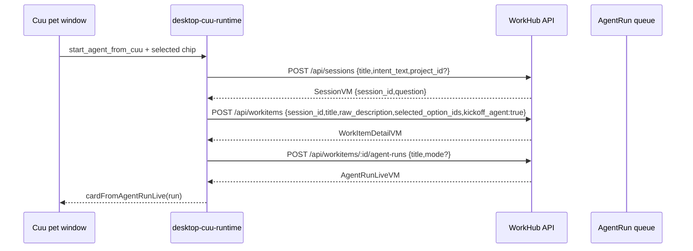

# Cuu R3 Agent 入口施工计划

## 1. 目标

R3 补 `FR-PET-002`：Cuu 不只是提醒和审批入口，也能从独立桌宠窗口发起真实 AI 工作。

当前原则：

- Cuu 仍只存在于独立透明 Tauri `pet` window。
- Web 与 desktop 主窗继续保持严肃工作界面，不显示 Cuu 本体。
- 不新增猫模型、不改色、不扩展外观动作矩阵。
- 用户优先点选，不默认打字。
- Cuu 出站必须复用 Web 同一套 typed API：`/api/sessions`、`/api/workitems`、`/api/workitems/:id/agent-runs`。
- Cuu 不拥有权限旁路；所有请求继续走 API client、auth、WorkItem/Proposal/Approval gate。

## 2. R3.1 已落切片：option-first 启动卡

本轮已完成第一刀：点击 Cuu body 时，如果当前没有业务卡片，pet surface 会展开一个 option-first 启动卡。

| 项 | 已落行为 |
|---|---|
| 卡片工厂 | `createDesktopCuuAgentLauncherCard()` |
| 卡片位置 | `apps/desktop-webview/src/desktop-cuu-runtime.ts` |
| 展开入口 | `apps/desktop-webview/src/pet-surface.ts`，点击 `[data-pet-drag-handle]` 且无当前 card 时显示 launcher |
| 选项 | `document-draft`、`structured-data`、`code-template` |
| 输入策略 | `input.mode="single_choice"`、`option_first=true`、`free_text_enabled=false` |
| 提交动作 | `start_agent_from_cuu` -> `/api/cuu/start-agent` |
| 中英双语 | `packages/cuu/src/i18n.ts` 新增 `cuuStart.*` 文案 |
| 公共导出 | `apps/desktop-webview/src/main.ts` 导出 launcher/action helpers |

R3.1 deliberately uses a local pseudo endpoint path (`/api/cuu/start-agent`) only inside the webview runtime resolver. It is not a backend route and does not bypass the daemon. The submit handler converts it into real API calls.

## 3. 字段级契约

### 3.1 Cuu launcher card

```ts
type CuuLauncherCard = CuuCard & {
  id: "cuu-agent-launcher";
  kind: "question";
  state: "asking_approval";
  input: {
    mode: "single_choice";
    option_first: true;
    free_text_enabled: false;
    free_text_collapsed_by_default: true;
  };
  actions: [{
    id: "start_agent_from_cuu";
    method: "POST";
    href: "/api/cuu/start-agent";
    payload: {
      title: string;
      intent_text: string;
    };
  }];
};
```

### 3.2 Runtime action

`resolveDesktopCuuAction()` maps the card action to:

```ts
type DesktopCuuStartAgentAction = {
  kind: "cuu-start-agent";
  title: string;
  intentText: string;
  selectedOptionIds?: string[];
  projectId?: string;
  runTitle?: string;
  mode?: "worker" | "pm";
};
```

`intentText` is composed from:

1. action payload `intent_text`;
2. selected chip label/description;
3. URL query fallback, only for future deep-link or test harness use.

If no chip is selected, submit fails with the existing `pet.optionRequired` message. This preserves the "先点选项" principle.

### 3.3 Real API chain

`submitDesktopCuuAction()` executes:



返回给 Cuu 的 card 必须是 `payload_ref.entity_type="agent_run"`，用于后续 replay、abort、open task。

## 4. Rust / Tauri 边界

R3.1 仍由 TS webview runtime 处理业务 action。Rust shell 不解析 intent、不创建 work item、不启动 AgentRun。

Rust 只负责：

- `pet` 透明窗口几何；
- body/card mode 切换；
- drag；
- cursor near sample；
- tray 恢复；
- SSE/system notification 转发。

下一步如果要把点击 Cuu body 的首卡展示做成更强的系统行为，Rust 也只能发 `tray-action` 或 `push-event` 给 webview，不直接调用业务 API。

## 5. 当前验证

已通过：

- `corepack pnpm --filter @workhub/desktop-webview test`
- `corepack pnpm --filter @workhub/desktop-webview typecheck`

新增测试覆盖：

| 测试 | 覆盖 |
|---|---|
| `desktop Cuu actions start a real agent run from an option-first launcher card` | selected chip -> `createSession` -> `createWorkItem` -> `startAgentRun` -> AgentRun Cuu card |
| `pet surface renders the Cuu outbound agent launcher as option-first without text input` | launcher card DOM、无 `textarea/input`、可点击 action |

## 6. 与概念图对齐

| 概念要求 | 当前状态 |
|---|---|
| Cuu 独立 pet window | 保持，未把 Cuu 放回主窗 |
| 选项优先澄清 | 已用 `single_choice` launcher 复用同一气泡交互 |
| 主力是 AI，不是看板 | Cuu 直接触发 AgentRun，不先把用户带到复杂看板 |
| 桌宠要像入口而不是装饰 | 点击 body 可展开真实启动卡，后续返回 run 进度卡 |
| 黑猫/白猫 Live2D 二选项 | 未改变模型白名单与外观 |

## 7. 尚未完成

R3.1 只是最小真实链路，不能宣称 R3 完成。

| 缺口 | 计划 |
|---|---|
| 真实 Tauri 点击截图 | 用 `pet` window 跑 launcher card，截 body-only -> card 展开前后两张图 |
| SSE 回流 | 订阅新 run 的 stream，把 `agent_run.started/running/succeeded/failed` 回到 Cuu card |
| 失败态 | API error、budget exhausted、403、offline 分别转成 Cuu 人话卡 |
| 继续澄清 | 如果后端返回需要澄清，不应直接 start run；应展示 SessionVM question card |
| option payload 更细 | 每个 chip 可带 `delivery_kind` / `risk_hint` / `default_acceptance`，进入 WorkItem spec |
| 真实端到端 smoke | 用 API dev server + desktop webview runtime 做一条 launcher-to-run smoke |
| 可恢复状态 | launcher 启动后记录 pending run id，刷新 pet window 后能恢复当前卡 |

## 8. 下一刀 R3.2

R3.2 建议顺序：

1. 新增 `startDesktopCuuAgentFromLauncher()` helper，封装当前三段 API 组合，供 runtime、main export、后续 browser smoke 共用。
2. 给 `pet-surface.ts` 增加 runtime test harness 或轻 DOM harness，覆盖真实 click body -> launcher card。
3. 接 `AgentRunLiveVM.stream_href`：启动后订阅 run stream，更新 Cuu 为 running/succeeded/failed。
4. 新增 `/api/pages/cuu-current` 或轻量 local state adapter，刷新 pet window 后恢复当前 run card。
5. 补 Tauri screenshot/motion capture：body-only idle、launcher card、queued/run card、failed/offline 四组。
6. 再运行 full `pnpm verify`、R2 release gate、reference path hygiene，并提交。

