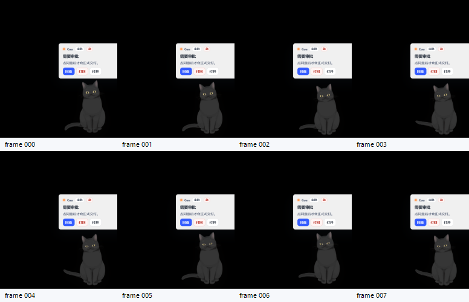
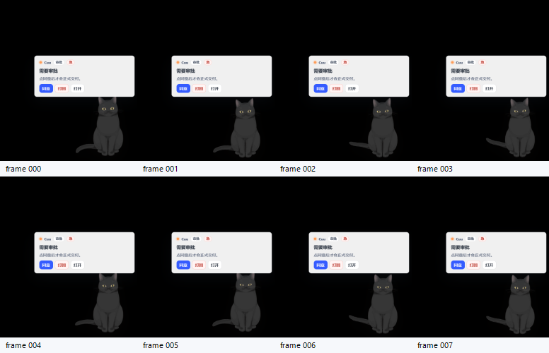

# Cuu Tauri Actual DOM + Bubble Anchor QA P1.8

> 本篇记录 P1.8：把 P1.7 的“期望行为合同”推进为真实 Tauri WebView DOM attrs 落盘，并修正审批 / 检索 / 澄清轻框的锚点。核心验收口径：气泡必须围绕 Cuu 出现，不能漂在窗口左上角；录屏首帧必须同时有 Cuu 与轻框，不能只出现框。
>
> **2026-06-08 anchor regression update**：用户复核指出 full card 气泡仍偏左。P1.8 当时源码回归门曾改为 full card `right:24px; bottom:348px; width:288px`，并拒绝旧 `right:112px; bottom:332px` 坐标。R3.21 已再次更新为 `520x720` card 与 `left:88px; bottom:392px; width:300px`，旧截图可作历史证据，不再作为最新合格截图。

## 1. PRD / Concept Alignment

| 要求 | P1.8 落点 |
|---|---|
| Cuu 是独立桌宠，不活在主窗里 | 仍只改 `pet` surface 与真实 Tauri capture；Web / desktop 主窗无 Cuu 本体 |
| 桌宠气泡像 QQ 宠物式“身边提醒” | card mode 气泡贴近 Cuu 上方，R3.21 当前锚点为 `left:88px; bottom:392px; width:300px` |
| 用户截图反馈：框不能在红色左上位置 | stable card 与 compact fallback 均改为 Cuu 邻近锚点；syncing 过渡阶段隐藏小框 |
| 不能只靠源码合同说通过 | capture report 同时写 `expected_behavior_contract` 与 `actual_dom_report` |
| “只有框没有猫”不能算通过 | business card 首帧 gate 提高为猫体可见阈值，scale=100 默认 `54000` foreground pixels |

## 2. Source Landing

| 文件 | 改动 |
|---|---|
| `apps/desktop-webview/src/pet-surface.ts` | card 气泡改为 `right/bottom` 锚点；syncing compact 阶段隐藏 transient bubble；failed compact fallback 仍保留可恢复轻框 |
| `apps/desktop-webview/src/pet-surface.test.ts` | 新增 full card / compact fallback 锚点回归测试，以及 syncing 阶段不显示 transient bubble 的测试 |
| `apps/desktop-webview/src/cuu-qa-dom-report.ts` | 新增真实 DOM 快照采集：surface / live2d / bubble / primary chip / primary action，并写入 `getBoundingClientRect()` |
| `apps/desktop-webview/src/cuu-qa-dom-report.test.ts` | 验证 data attrs 收集和 Tauri command 调用 |
| `client-tauri/src-tauri/src/main.rs` | 新增 env-gated `write_cuu_qa_dom_report(report_json)` command，只写 `WORKHUB_CUU_QA_DOM_REPORT_PATH` |
| `scripts/qa/cuu-tauri-motion-capture.ps1` | `OutDir` 规范成绝对路径；读取 `cuu-tauri-dom-report.json`；校验 actual DOM、expected 合同、bubble/live2d/surface rect；business card 首帧 gate 加严 |

## 3. Bubble Anchor Contract

Card mode 当前窗口为 `520x720`，用于容纳 Cuu、轻气泡与长失败/预算卡；气泡不占左上角，也不压住 Cuu 本体。

| Mode | Bubble anchor | Intent |
|---|---|---|
| `card/full` | R3.21 更新后为 `left: 88px; bottom: 392px; width: 300px` | 气泡贴近 Cuu 头顶 / 左侧安全区，不再铺到透明窗口左半区，长文本通过内部滚动承载 |
| `card/compact failed` | `right: 8px; bottom: 224px; width: 150px` | 只有扩展失败时显示小型救援卡 |
| `card/compact syncing` | 不渲染 bubble | 避免窗口扩展中先出现“只有框没有猫”的过渡画面 |

这条是视觉验收门：如果后续截图里审批框又回到窗口左上角，或源码/DOM 回到 `right:112px; bottom:332px` 这类偏左坐标，P1.8 视为回归失败。

## 4. Actual DOM Report Contract

`motion-diff-report.json` 现在包含：

```json
{
  "expected_behavior_contract": {
    "data_cuu_behavior_state": "asking_approval",
    "data_cuu_live2d_motion": "asking_approval_bounce",
    "data_cuu_live2d_renderer_state": "mtn/01.mtn",
    "data_pet_window_mode": "card"
  },
  "actual_dom_report_path": "D:\\WorkHub\\docs\\...\\cuu-tauri-dom-report.json",
  "actual_dom_matches_expected": true
}
```

`cuu-tauri-dom-report.json` 的关键节点：

| Node | Required attrs |
|---|---|
| `surface` | `data_wh_surface=pet`、`data_pet_window_mode=card`、`data_cuu_behavior_state`、`data_cuu_live2d_renderer_state` |
| `live2d` | `data_cuu_live2d_runtime=live2d_cubism2_cat`、`data_cuu_live2d_framing=transparent_full_body`、真实 `.mtn` |
| `bubble` | `data_pet_bubble=true`、`data_pet_bubble_kind`、`data_cuu_card_id` |
| `primary_chip/action` | option-first chip 或 approval action 的首个可交互证据 |

安全约束：JS 不传任意文件路径；Rust command 只读取 `WORKHUB_CUU_QA_DOM_REPORT_PATH`。正常用户路径不设置该 env，因此不会写本地 QA 文件。

## 5. First Evidence

黑猫 approval anchor smoke 已通过：

最新蓝色锚点回归截图：



历史 anchor smoke：



| Artifact | Path |
|---|---|
| latest contact sheet | `./assets/audit/2026-06-08-cuu-card-anchor-regression/hijiki/approval-rect-gated/cuu-motion-contact-sheet.png` |
| latest DOM report | `./assets/audit/2026-06-08-cuu-card-anchor-regression/hijiki/approval-rect-gated/cuu-tauri-dom-report.json` |
| latest diff report | `./assets/audit/2026-06-08-cuu-card-anchor-regression/hijiki/approval-rect-gated/motion-diff-report.json` |
| contact sheet | `./assets/audit/2026-06-08-cuu-live2d-cat-runtime/hijiki/approval-anchor-smoke/cuu-motion-contact-sheet.png` |
| DOM report | `./assets/audit/2026-06-08-cuu-live2d-cat-runtime/hijiki/approval-anchor-smoke/cuu-tauri-dom-report.json` |
| diff report | `./assets/audit/2026-06-08-cuu-live2d-cat-runtime/hijiki/approval-anchor-smoke/motion-diff-report.json` |
| GIF | `./assets/audit/2026-06-08-cuu-live2d-cat-runtime/hijiki/approval-anchor-smoke/cuu-motion-printwindow.gif` |
| MP4 | `./assets/audit/2026-06-08-cuu-live2d-cat-runtime/hijiki/approval-anchor-smoke/cuu-motion-printwindow.mp4` |

最新 rect 证据：

| Rect | x | y | width | height | right | bottom |
|---|---:|---:|---:|---:|---:|---:|
| surface | 0 | 0 | 520 | 640 | 520 | 640 |
| live2d | 213 | 248 | 230 | 320 | 443 | 568 |
| bubble | 208 | 160.5 | 288 | 131.5 | 496 | 292 |

报告结论：

| Gate | Result |
|---|---|
| `passed` | `true` |
| `motion_gate_passed` | `true` |
| `actual_dom_matches_expected` | `true` |
| first frame visual pixels | `83220` |

## 6. Reference Package Assessment

本轮同步盘点了 `D:\WorkHub\reference` 的新增压缩包，结论仍是“只学习方案，不提交 reference 内容”。

| Package | Useful idea | Not adopted |
|---|---|---|
| `VPet-main.zip` | 动作索引：`GraphName -> AnimatType(A_Start/B_Loop/C_End) -> mode fallback -> random pick`；透明桌宠窗口和缓存式 PNG 动画思路 | 不复用素材、不迁移 C# WPF runtime |
| `像素猫meme.zip` | stand / hide / touch / drag / work / sleep 等动作族覆盖度 | 不作为 Cuu 默认视觉；当前 Cuu 只保留 Hijiki / Tororo |
| `像素猫meme_扩充版.zip` | 扩展动作 manifest 和表情族可作为后续 Cuu 行为矩阵命名参考 | 不提交 PNG 资产、不替代 Live2D |

## 7. Next Construction Plan

1. 已推进到 P1.9：actual DOM gate 扩展到黑猫 `clarify` / `search` / `sync` / `done` / `offline`，并补白猫 Tororo approval smoke。
2. 已推进到 P1.9：`done` 改为透明 `card` canvas + `tip` bubble，避免 body-only 小窗口裁切气泡。
3. 已推进到 P1.9：actual DOM gate 加强到 live2d runtime / model pack / bubble / primary action。
4. 待推进：给 `motion-diff-report.json` 增加 bubble/card rect summary 和自动 bbox gate，而不仅是人工抽查。
5. 待推进：补 Linux/macOS capture 策略；Windows 当前继续用 `PrintWindow`。
6. 待推进：将“syncing 阶段不显示 transient bubble”纳入 DOM snapshot history，任何只有框、没有猫的首帧都不能算通过。

延伸文档：[`cuu-tauri-business-matrix-and-card-framing-p1-9.md`](./cuu-tauri-business-matrix-and-card-framing-p1-9.md)。
