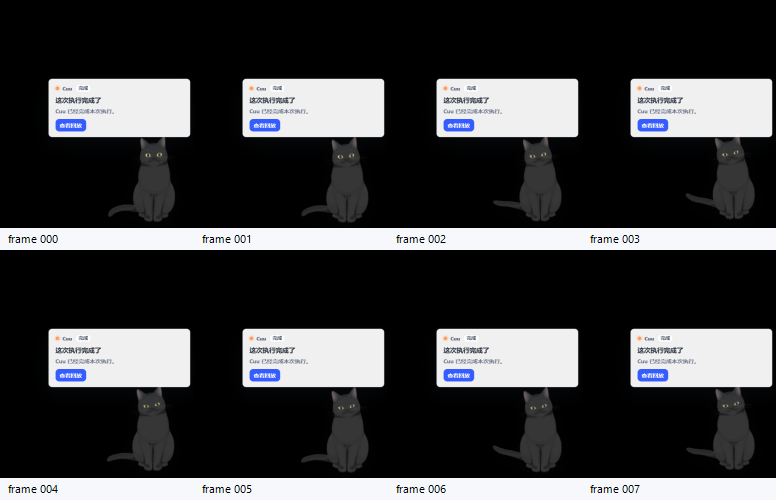
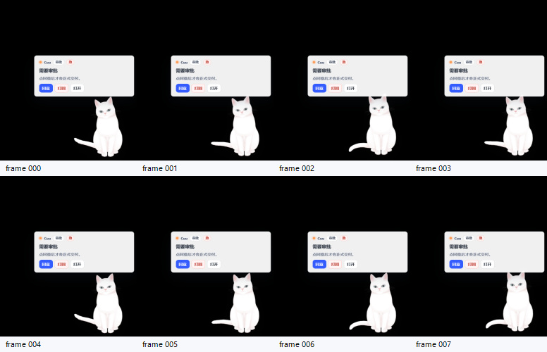

# Cuu Tauri Business Matrix + Card Framing QA P1.9

> 本篇记录 P1.9：把 P1.8 的单个 approval anchor smoke 扩展为业务动作 smoke matrix，并修复用户截图指出的“框在红色位置、理想应靠近 Cuu 蓝色位置”的真实问题。P1.9 仍是 smoke，不是最终 32 帧正式验收；但它已经能证明真实 Tauri pet window 中气泡围绕 Cuu、黑猫/白猫模型包不会混用、业务 DOM 合同能落到实际 WebView。
>
> **2026-06-08 纠偏更新**：P1.10 已补 motion liveness 硬门和两组 32 帧 evidence；但根据 `D:/workhub审查报告`，R1 真实纵切通过前冻结后续 Cuu 外观/动效/设置矩阵施工。本篇后续计划不再作为立即施工队列，只保留为回归门。

## 1. User-Facing Problem

用户反馈的问题可以拆成三条验收门：

| 问题 | P1.9 处理 |
|---|---|
| 气泡框漂在窗口左上或脱离 Cuu | `card` 模式气泡改为右下锚定，并重新校准到 `right:112px; bottom:332px` |
| Cuu 在 card 模式被裁切 | `card` 模式猫体改为 `right:72px; bottom:72px`，真实截图保留右侧与底部余量 |
| `done` 为了 body-only 被裁成一条文字边 | `celebrating` / `thinking` 等业务提示态使用透明 `card` canvas，`done` 仍保留 `bubble_mode=tip` |

结论：`body_only` 现在只用于真正没有业务气泡的 idle；带业务气泡的状态使用透明 `card` canvas 放置气泡与 Cuu，但主窗仍不渲染 Cuu 本体。

## 2. Source Landing

| 文件 | 改动 |
|---|---|
| `packages/cuu/src/motion.ts` | `window_mode` 规则改为 `idle=body_only`，其余业务状态为 `card`；`done` 仍为 `bubble_mode=tip` |
| `apps/desktop-webview/src/pet-window-bridge.ts` | `desktopPetWindowModeForCard` 改为读取 `CuuBehaviorManifest`，并按请求模型包校验 |
| `apps/desktop-webview/src/pet-surface.ts` | card 气泡和猫体向内校准，避免真实 Tauri 截图裁切 |
| `apps/desktop-webview/src/pet-surface.test.ts` | 新增 completion anchored tip 回归测试，更新 card 锚点 CSS 契约 |
| `scripts/qa/cuu-tauri-motion-capture.ps1` | actual DOM gate 加强：校验 Live2D runtime、framing、model pack、bubble、主操作；`done` 期望为 `card + tip` |

## 3. Framing Contract

当前 `card` window 仍是 `520x640` 透明画布；不是主窗里的卡片，也不是让 Cuu 活在 Web 页面中。它只是给桌宠气泡和 Cuu 留出可见区域。

| Element | Current anchor | Why |
|---|---|---|
| Cuu body in `card` | `right:72px; bottom:72px` | 真实截图中黑/白猫全身不贴边，不裁脚、不裁须 |
| Bubble in `card/full` | `right:112px; bottom:332px; width:304px` | 气泡在 Cuu 上方/身边，右圆角完整 |
| Bubble in `compact failed` | `right:8px; bottom:224px; width:150px` | 仅窗口扩展失败时保留救援小框 |
| Bubble in `compact syncing` | 不渲染 | 避免只出现框、没有猫的过渡首帧 |

Pixel sanity on `hijiki/approval-anchor-smoke/frame-000.png` after calibration:

| BBox | x1 | y1 | x2 | y2 | right margin | bottom margin |
|---|---:|---:|---:|---:|---:|---:|
| light card | 130 | 221 | 509 | 384 | 10 | 255 |
| visible nonblack content | 120 | 221 | 519 | 624 | 0* | 15 |

`*` nonblack right edge includes shadow/whisker pixels; card body and visible cat silhouette are not cropped in the inspected frame.

## 4. Actual DOM Gate

P1.9 的 `actual_dom_matches_expected=true` 不再只意味着 surface data attrs 对上。脚本现在同时要求：

| Node | Required |
|---|---|
| `surface` | `data_wh_surface=pet`、expected behavior attrs、`data_pet_window_mode` |
| `live2d` | present、`data_cuu_live2d_runtime=live2d_cubism2_cat`、`data_cuu_live2d_framing=transparent_full_body`、`data_cuu_model_pack=<requested>` |
| `live2d behavior` | `data_cuu_behavior_state/phase/window/bubble` 与 expected contract 一致 |
| `bubble` | 非 idle 场景必须 present，且有 `data_pet_bubble=true`、`data_pet_bubble_kind`、`data_cuu_card_id` |
| primary action | `approval=approve`、`clarify=submit_option`、`search=use_for_current_task`、`sync=open_sync`、`done=view_replay` |

这解决了 P1.8 的隐患：白猫 capture 不能再悄悄用黑猫模型包通过。

## 5. Evidence Matrix

所有场景均为真实 Tauri `pet` window capture，`FrameCount=8`、`IntervalMs=180`，因此只标记为 smoke。

| Scenario | Model | `passed` | DOM | Motion | Visual pixels | Window / bubble | Evidence |
|---|---|---:|---:|---:|---:|---|---|
| approval | Hijiki black | true | true | true | 83220 | card / card | `./assets/audit/2026-06-08-cuu-live2d-cat-runtime/hijiki/approval-anchor-smoke/` |
| clarify | Hijiki black | true | true | true | 83130 | card / card | `./assets/audit/2026-06-08-cuu-live2d-cat-runtime/hijiki/clarify-actual-dom-smoke/` |
| search | Hijiki black | true | true | true | 93032 | card / card | `./assets/audit/2026-06-08-cuu-live2d-cat-runtime/hijiki/search-actual-dom-smoke/` |
| sync | Hijiki black | true | true | true | 83109 | card / card | `./assets/audit/2026-06-08-cuu-live2d-cat-runtime/hijiki/sync-actual-dom-smoke/` |
| done | Hijiki black | true | true | true | 83169 | card / tip | `./assets/audit/2026-06-08-cuu-live2d-cat-runtime/hijiki/done-actual-dom-smoke/` |
| offline | Hijiki black | true | true | true | 91619 | card / card | `./assets/audit/2026-06-08-cuu-live2d-cat-runtime/hijiki/offline-actual-dom-smoke/` |
| approval | Tororo white | true | true | true | 83619 | card / card | `./assets/audit/2026-06-08-cuu-live2d-cat-runtime/tororo/approval-anchor-smoke/` |

Representative frames:

## 6. Remaining Gaps

P1.9 不关闭以下缺口：

| Gap | Why it remains | Next gate |
|---|---|---|
| 32 帧正式矩阵 | 当前 8 帧 smoke 足以证明锚点和 DOM，但不足以证明长动作流畅 | 每个业务场景 `FrameCount>=32`，记录 changed-pixel/liveness threshold |
| option-first chip DOM | `clarify` 当前通过 primary action；`primary_chip` 仍为空 | 使用 direct `QuestionCard` / session fixture，断言 `data_pet_option_first=true` |
| sync transient history | 当前 DOM report 只保留最后一次 snapshot，不能证明 syncing compact 阶段没有 bubble | DOM snapshot history 或 first/final DOM reports |
| 白猫全业务矩阵 | P1.9 只跑白猫 approval | Tororo clarify/search/sync/done/offline 全部跑一轮 |
| hover/drag/settings matrix | 本篇只处理业务 card framing | pass-through、hide-on-hover、drag、scale、opacity 独立矩阵 |
| 跨平台 | 当前是 Windows PrintWindow | Linux X11/Wayland 和 macOS 透明窗口 capture 策略 |

## 7. Next Construction Plan

| Item | Status after review | Notes |
|---|---|---|
| P1.10 motion liveness gate | landed before freeze | `scripts/qa/cuu-tauri-motion-capture.ps1` 新增 `motion_liveness`，区分 `smoke` / `formal_32`，业务和 look-only 场景要求 changed pixels 与 rect 稳定 |
| Hijiki approval 32-frame formal | passed | `./assets/audit/2026-06-08-cuu-live2d-cat-runtime/hijiki/approval-formal-liveness-p1-10/` |
| Hijiki look-only 32-frame formal | passed | `./assets/audit/2026-06-08-cuu-live2d-cat-runtime/hijiki/look-only-formal-anchor-p1-10/` |
| P1.11 DOM snapshot history | deferred | R1 前不继续 Cuu QA 扩面；仅真实回归时修 |
| P1.12 option-first direct capture | deferred to R3 | Cuu 恢复施工时优先做出站指令/option-first 功能，而不是纯录屏 |
| P1.13 Tororo full matrix | deferred | R1 通过前冻结 |
| P1.14 settings matrix | deferred | R1 通过前冻结 |
| P1.15 Linux/macOS pet capture | deferred unless release smoke requires it | R2/R4 跨平台 smoke 时再纳入 |

下一施工入口已切换为 [`../06-roadmap/recovery-r0-r4-roadmap-2026-06-08.md`](../06-roadmap/recovery-r0-r4-roadmap-2026-06-08.md) 的 R0/R1，而非继续扩 Cuu 外观矩阵。
