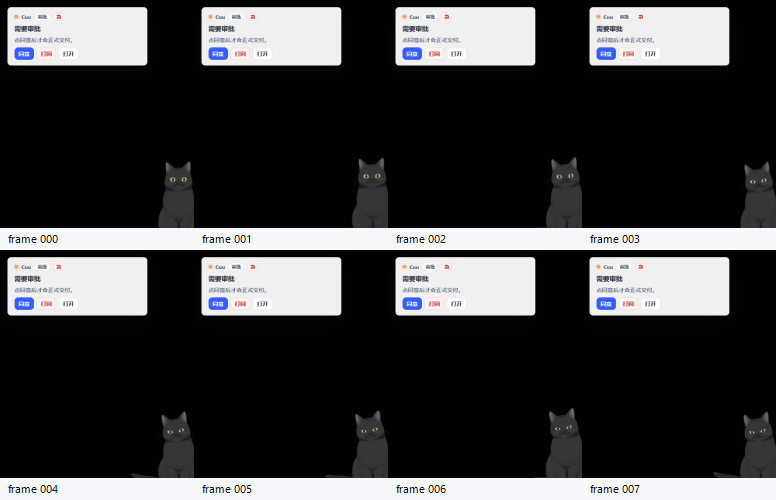

# Cuu Tauri Business Motion Capture P1.7

> 本篇记录 P1.7 “真实 Tauri 业务动作录屏入口”。它不是新的 Cuu 视觉，也不是浏览器 preview，而是让 `scripts/qa/cuu-tauri-motion-capture.ps1` 能把业务态注入真实 `pet` 窗口，然后用 Win32 `PrintWindow` 抓 contact sheet / GIF / MP4 / diff report。

## 1. PRD / Concept Alignment

| 概念要求 | P1.7 落点 |
|---|---|
| Cuu 只在独立桌宠窗口出现 | 只启动 Tauri `pet` window；主窗不渲染 Cuu 本体 |
| 审批 / 检索 / 澄清由 Cuu 气泡承接 | QA 场景新增 `approval` / `search` / `clarify` |
| 桌宠任务态要能动 | 每个业务场景进入真实 Live2D runtime + card/tip/body mode，再抓多帧 |
| 黑猫 / 白猫二选项 | capture 参数继续用 `-ModelPackId`，只允许 Hijiki / Tororo |
| 不能只靠源码合同说通过 | 生成真实窗口 `frames/`、`cuu-motion-contact-sheet.png`、GIF/MP4、`motion-diff-report.json` |

## 2. Source Landing

| 文件 | 改动 |
|---|---|
| `apps/desktop-webview/src/cuu-qa-scenarios.ts` | 新增 env-gated QA scripted events，覆盖 `clarify` / `approval` / `search` / `sync` / `done` / `offline` |
| `apps/desktop-webview/src/cuu-qa-scenarios.test.ts` | 验证 push-event / sse-status payload、Cuu state、action 和 evidence refs |
| `apps/desktop-webview/src/pet-surface.ts` | 在 QA 场景存在时使用 scripted listener；正常路径仍走 Tauri `__TAURI__.event.listen` |
| `client-tauri/src-tauri/src/main.rs` | 新增 `WORKHUB_CUU_QA_SCENARIO` 白名单注入 `window.__WORKHUB_CUU_QA_SCENARIO__` |
| `scripts/qa/cuu-tauri-motion-capture.ps1` | `-Scenario` 扩展业务态，并在报告写入 `expected_behavior_contract`；P1.8 继续补 `actual_dom_report` |

## 3. Scenario Matrix

| Scenario | Event path | Expected Cuu state | Motion | Renderer | Window |
|---|---|---|---|---|---|
| `clarify` | scripted `push-event` / `permission.ask` | `asking_approval` | `asking_approval_bounce` | `mtn/01.mtn` | `card` |
| `approval` | scripted `push-event` / `permission.ask` | `asking_approval` | `asking_approval_bounce` | `mtn/01.mtn` | `card` |
| `search` | scripted `push-event` / `knowledge.evidence.ready` | `searching_evidence` | `searching_evidence_peek` | `mtn/04.mtn` | `card` |
| `sync` | scripted `push-event` / `sync.progress` | `syncing_files` | `syncing_files_spin` | `mtn/04.mtn` | `card` |
| `done` | scripted `push-event` / `agent_run.step` | `celebrating` | `celebrating_jump` | `mtn/06.mtn` | `card` + `tip` bubble |
| `offline` | scripted `sse-status` / `retrying` | `offline` | `worried_ears` | `mtn/08.mtn` | `card` |

说明：`offline` 在 card mode 中故意使用 `worried_ears`，避免 `offline_sleep` 把全身压低导致裁切误判。P1.9 后，`done` 也使用透明 `card` canvas 承载轻提示；语义仍是 `bubble_mode=tip`，不是重型看板卡。

## 4. Report Contract

`motion-diff-report.json` 现在会包含：

```json
{
  "scenario": "approval",
  "business_scenario": true,
  "expected_behavior_contract": {
    "data_cuu_behavior_state": "asking_approval",
    "data_cuu_behavior_phase": "loop",
    "data_cuu_live2d_motion": "asking_approval_bounce",
    "data_cuu_live2d_renderer_state": "mtn/01.mtn",
    "data_cuu_behavior_expected_window_mode": "card",
    "data_cuu_behavior_expected_bubble_mode": "card",
    "data_pet_window_mode": "card"
  }
}
```

P1.8 更新：当前 Tauri `PrintWindow` 证据已补真实 WebView DOM attrs 落盘，不再只靠 `expected_behavior_contract`。详见 [`cuu-tauri-actual-dom-and-anchor-qa-p1-8.md`](./cuu-tauri-actual-dom-and-anchor-qa-p1-8.md)。P1.7 本身仍只定义业务场景注入和录屏入口。

澄清限制：当前 `clarify` 通过轻量 `AttentionItem(kind=clarification)` 进入 Cuu question card；完整 `QuestionCard` 的 option-first chips / progress / collapsed free text 仍需专用 fixture 或 direct QA card injection。

## 5. First Evidence

黑猫 approval scripted smoke 已生成：



| Artifact | Path |
|---|---|
| contact sheet | `./assets/audit/2026-06-08-cuu-live2d-cat-runtime/hijiki/approval-scripted-smoke/cuu-motion-contact-sheet.png` |
| GIF | `./assets/audit/2026-06-08-cuu-live2d-cat-runtime/hijiki/approval-scripted-smoke/cuu-motion-printwindow.gif` |
| MP4 | `./assets/audit/2026-06-08-cuu-live2d-cat-runtime/hijiki/approval-scripted-smoke/cuu-motion-printwindow.mp4` |
| report | `./assets/audit/2026-06-08-cuu-live2d-cat-runtime/hijiki/approval-scripted-smoke/motion-diff-report.json` |

本证据只说明：业务审批卡可以进入真实 Tauri `pet` window，窗口扩到 card mode，Cuu 与轻卡同时可见，并且报告携带 P1.6 expected behavior contract。它不替代黑/白全场景长录屏。

P1.8 已补一组更严格的 approval anchor smoke：


该证据新增：气泡锚点贴近 Cuu、首帧必须有 Cuu 与轻框、`actual_dom_matches_expected=true`。

## 6. Command Examples

```powershell
powershell -NoProfile -ExecutionPolicy Bypass -File scripts\qa\cuu-tauri-motion-capture.ps1 `
  -SkipBuild `
  -Scenario approval `
  -FrameCount 32 `
  -IntervalMs 180 `
  -OutDir docs\workhub\05-clients\assets\audit\2026-06-08-cuu-live2d-cat-runtime\hijiki\approval
```

白猫同场景：

```powershell
powershell -NoProfile -ExecutionPolicy Bypass -File scripts\qa\cuu-tauri-motion-capture.ps1 `
  -SkipBuild `
  -Scenario approval `
  -ModelPackId cuu-tororo-live2d-cubism2 `
  -FrameCount 32 `
  -IntervalMs 180 `
  -OutDir docs\workhub\05-clients\assets\audit\2026-06-08-cuu-live2d-cat-runtime\tororo\approval
```

## 7. Next Construction Plan

1. P1.9 已跑黑猫 8 帧 smoke 矩阵：`clarify`、`approval`、`search`、`sync`、`done`、`offline`；下一步升级为每场至少 32 帧。
2. P1.9 已跑白猫 approval smoke；下一步跑白猫同等矩阵，证明二选项都真实可用。
3. 为 `motion-diff-report.json` 增加 card-mode rect / bbox gate summary：业务 card 场景必须稳定在 `520x640` 级别，不能停留 compact fallback，也不能裁猫或裁气泡。
4. P1.9 已加强 actual DOM attrs gate；下一步补 DOM snapshot history，证明 syncing 过渡没有“只有框没有猫”。
5. 将 settings matrix 与业务场景合并：scale 75/150、opacity 60、pass-through、hide-on-hover 均要能恢复。
6. 完成 Linux/macOS 策略：Windows 继续用 Win32 `PrintWindow`；Linux 测试环境需要补对应截图方案。
