# WorkHub 页面概念图索引

> 本页收纳前期生成的页面概念图，便于后续开发从文档树直接理解产品方向。概念图用于表达信息架构、视觉密度和交互倾向，不等同于最终 UI 截图。

## 阅读原则

- **最终方向**：AI 负责过滤复杂度，用户默认只处理当前需要判断的一件事。
- **看板降级**：看板是高级管理视图，不是默认首页。
- **桌宠优先**：项目检索、轻审批、澄清提醒优先由 Cuu 桌宠承接。
- **选项优先**：澄清流程默认点选项，打字只是「其他 / 补充」兜底。
- **Cuu 为准**：早期非小猫桌宠图只保留交互探索价值；桌宠形象以 [`cuu-desktop-pet-concept.md`](./cuu-desktop-pet-concept.md) 为准。
- **落地契约**：页面里的注意力卡、选项澄清、证据气泡、交付物变更包、Cuu 状态映射，统一落到 P0 横切契约 [`_experience-deliverable-contracts.md`](../../plans/p0-foundation/_experience-deliverable-contracts.md)，后续开发不得各端各造一套 payload。
- **纵切优先**：概念图的第一条可施工路径以 [`_gold-path-p0-5-vertical-slice.md`](../../plans/p0-foundation/_gold-path-p0-5-vertical-slice.md) 为准；P1+ 交互增强见 [`_interaction-extension-backlog.md`](../../plans/p0-foundation/_interaction-extension-backlog.md)。

---

## 1. Web 端概念图

对应文档：[`web-app.md`](./web-app.md)

### 1.1 AI-first 首页

默认首页不应是重型看板，而是 AI 整理后的「需要你决定什么 / AI 正在做什么 / 哪里可能出事」。

### 1.1.1 项目工作台细化

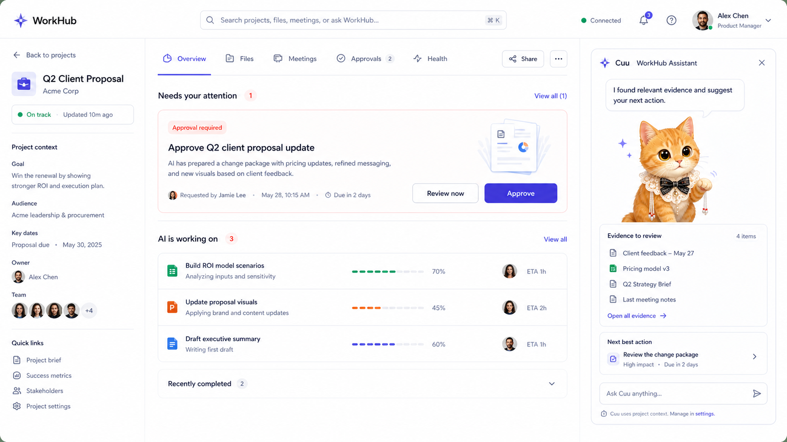

项目页默认不是全量任务管理，而是「本项目现在需要注意什么」。左侧保留项目上下文，中间展示需要判断的一件事与 AI 正在做的背景任务，右侧由 Cuu 提供证据和下一步建议。

### 1.2 P0-P5 核心页面图谱

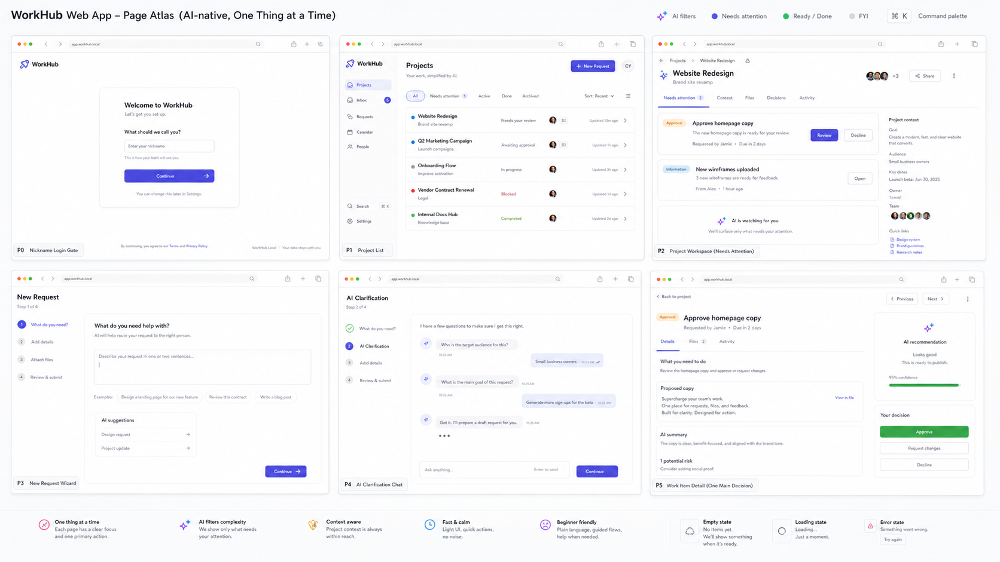

覆盖登录门、项目列表、项目工作台、提需求、AI 澄清、工作项详情。后续实现时，澄清页应继续收敛为选项优先，而不是聊天墙。

### 1.2.1 选项优先提需求

提需求阶段不应先要求长篇输入。默认由 Cuu 把意图拆成可点选项，用户只补附件、DDL、负责人和验收项；大文本域只作为「其他 / 补充」折叠项。

### 1.3 P6-P11 运营页面图谱

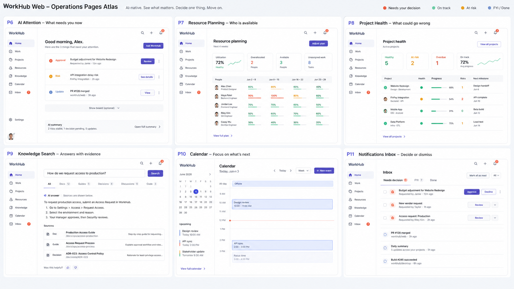

覆盖 AI 注意力首页、资源排期、项目健康、知识搜索、日程、通知。注意：知识搜索后续更推荐作为 Cuu 桌宠气泡能力，Web 页面可作为完整检索/管理兜底。

### 1.4 P12-P15 + W1/W2 页面图谱

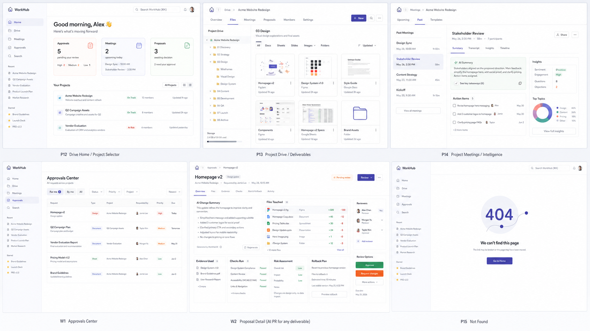

覆盖网盘项目选择、项目网盘、项目会议、审批中心、提议详情、404。提议详情沿用 GitHub PR 的「说明/文件/证据/评论/通过或打回」结构，但对象是任意交付物，不限代码。

### 1.5 工作项详情

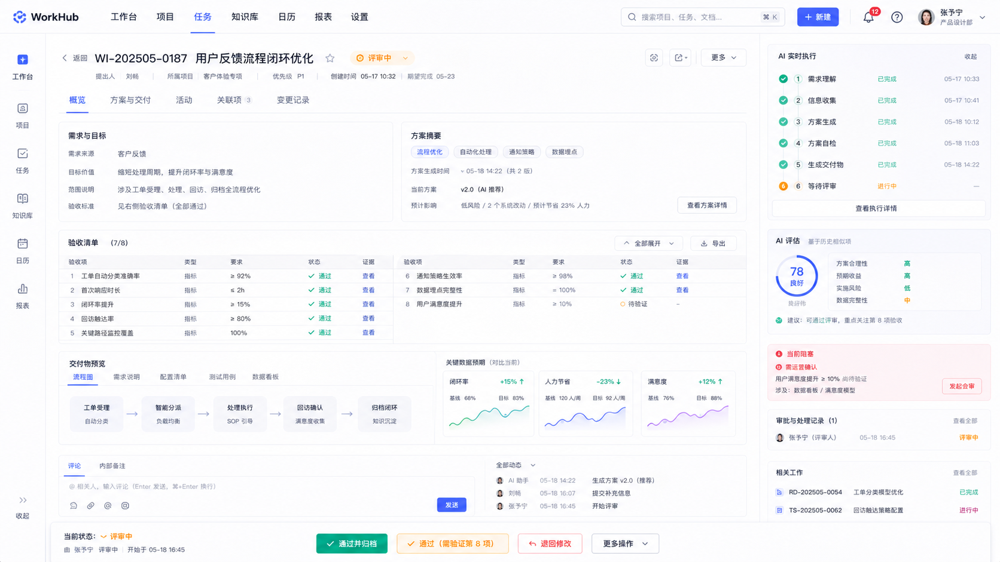

工作项详情需要呈现：当前状态、验收项、AI 执行轨迹、置信语气、升级简报、交付物预览和提议时间线。

### 1.6 审批中心

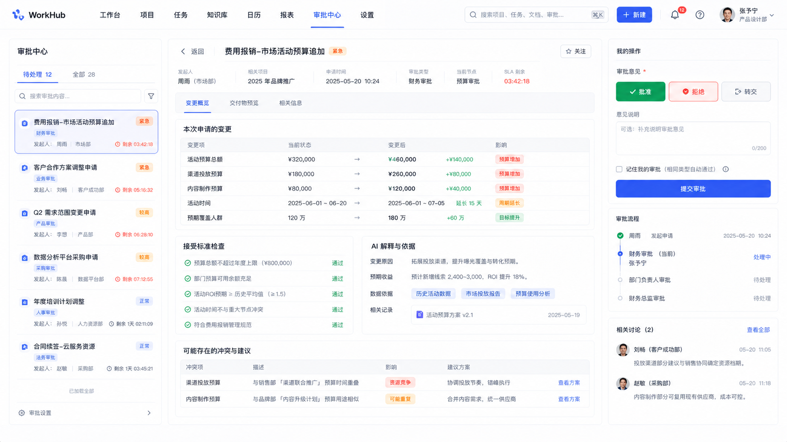

审批中心是负责人视角的阻塞收件箱。核心动作是通过、打回、委派和记住规则。

### 1.7 交付物变更申请

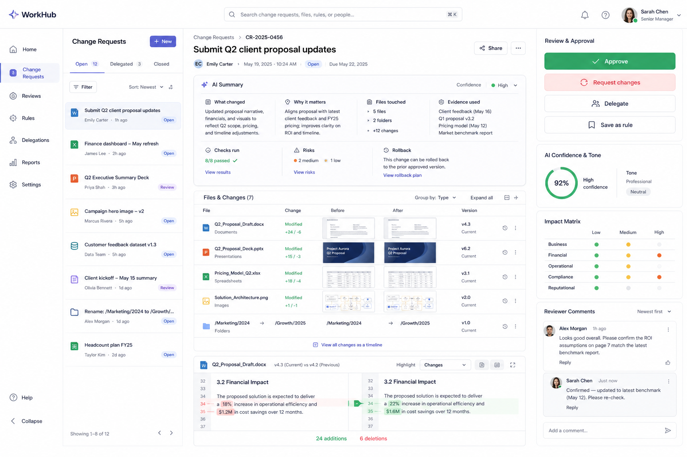

变更申请像 PR，但不是代码 diff。它要能描述文档、表格、PPT、图片、文件夹和版本变化。

### 1.8 项目资料 / 会议 / 知识

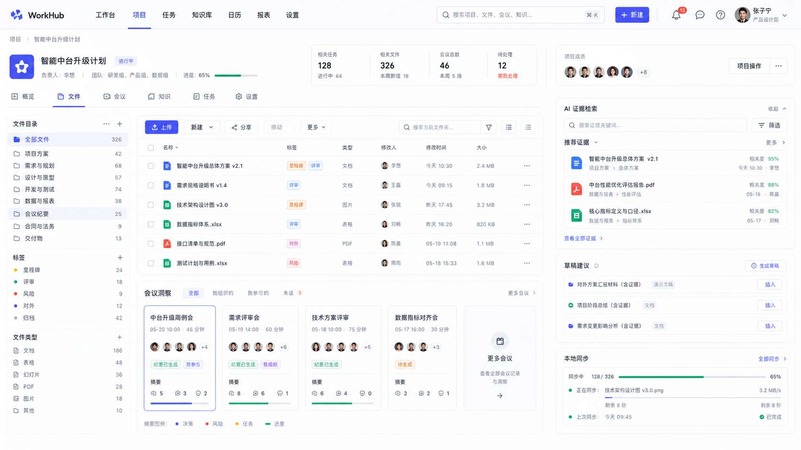

项目资料页聚合网盘、会议和知识证据。后续可把「主动查询」下沉给 Cuu，把完整资料管理留在 Web。

### 1.8.1 会议洞察转需求草稿

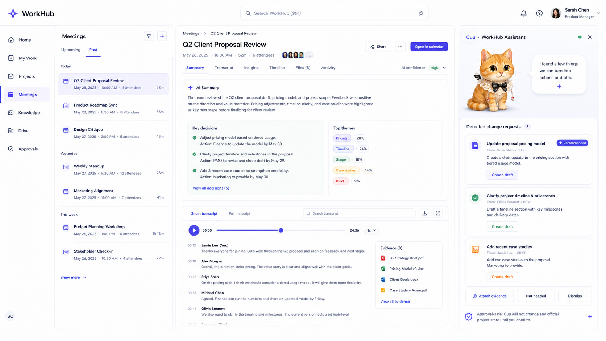

会议页要把 ASR、纪要、洞察、证据和需求草稿串起来。原则是：AI 可以发现变化，但绝不直接改正式状态；必须先变成草稿或审批项。

### 1.8.2 网盘预览与变更草稿

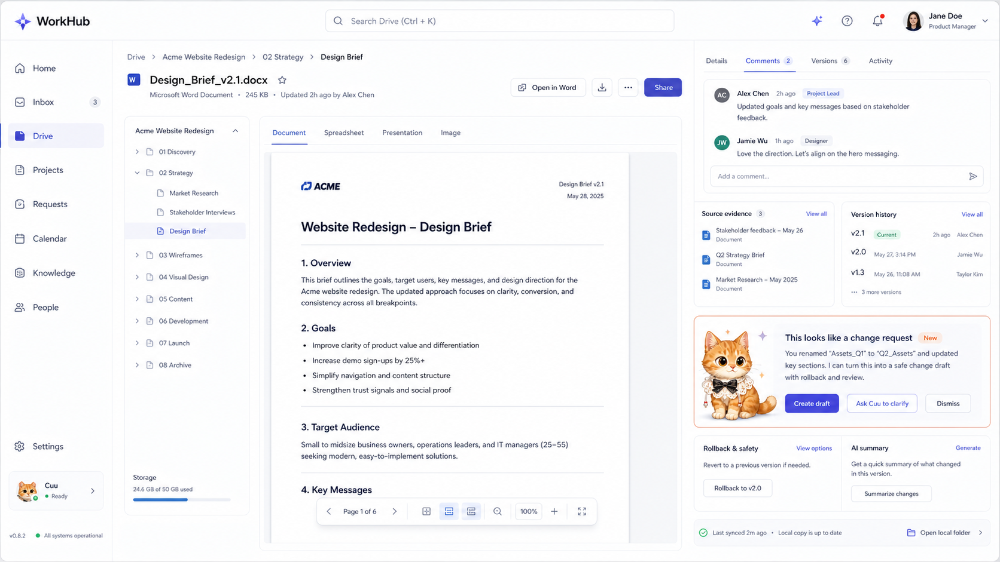

网盘页不仅是文件管理器。文件评论、版本变化、文件夹重命名都可能触发 Cuu 的「这像是变更申请」提示，用户确认后才进入澄清或提议。

### 1.9 早期工作台探索

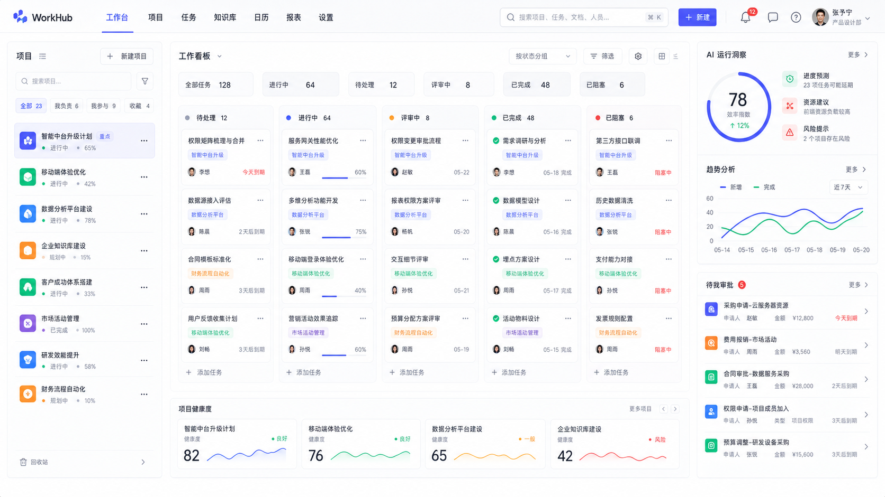

这张图保留为反例/探索记录：它偏重看板和信息密度，后续不作为默认首页目标。

---

## 2. Rust/Tauri 客户端概念图

对应文档：[`desktop-pet-tauri.md`](./desktop-pet-tauri.md)

### 2.1 单件事干活桌

Rust 客户端的默认主窗不应是 dashboard，而是被唤起时处理一个决定、一个任务或一个本地动作。

### 2.2 客户端主窗概念

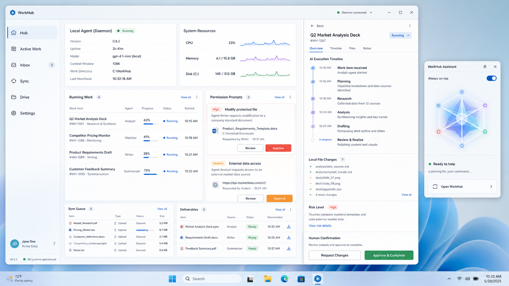

表达 Tauri 主窗、连接灯、本地执行、权限确认、同步队列和桌宠小窗之间的关系。

### 2.3 客户端核心页面图谱

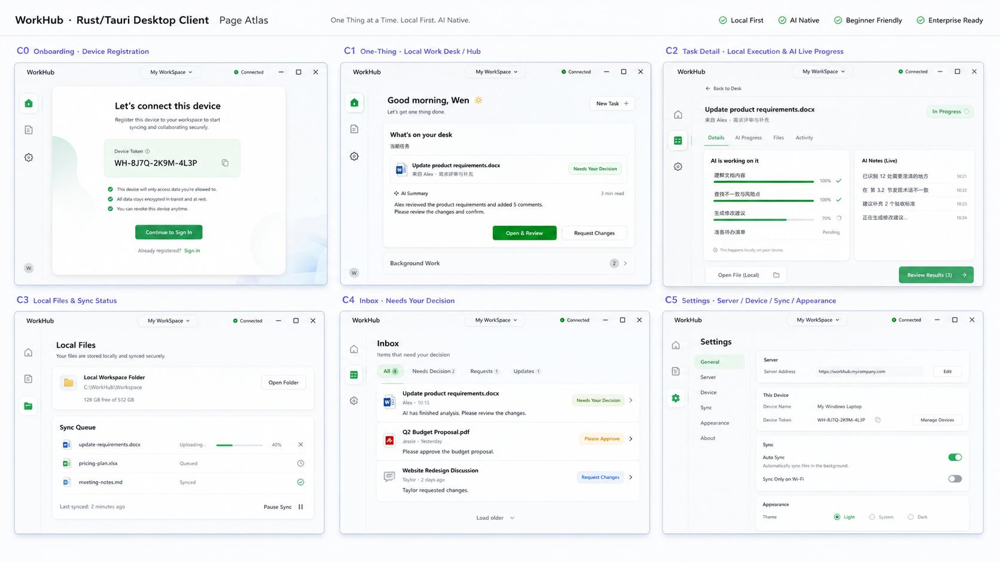

覆盖 onboarding、单件事 Hub、任务详情、本地文件同步、收件箱、设置。

### 2.4 本地执行页面图谱

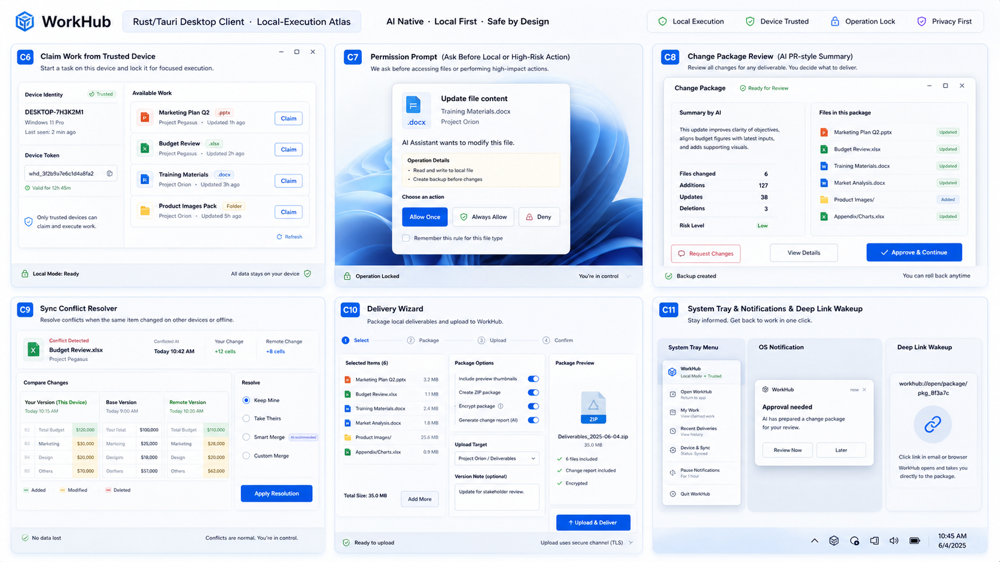

覆盖接活、权限询问、交付物变更包、冲突解决、交付向导、托盘/通知/deep-link。

### 2.4.1 本地同步与冲突解决

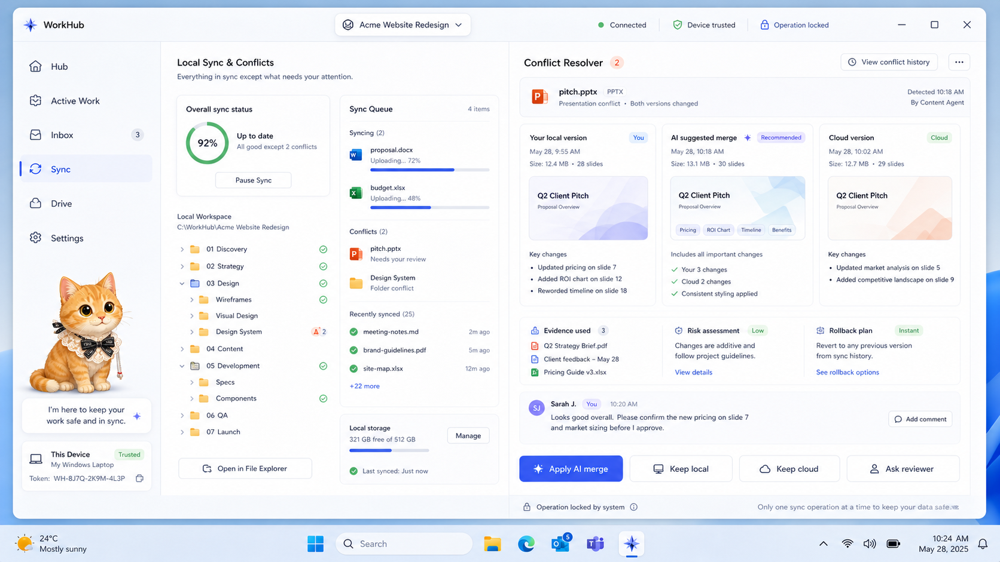

Rust 客户端是本地文件与云端事实之间的安全阀。冲突页必须给出本地版本、云端版本、AI 合并建议、证据、风险和回滚方案。

### 2.4.2 设备设置与部署入口

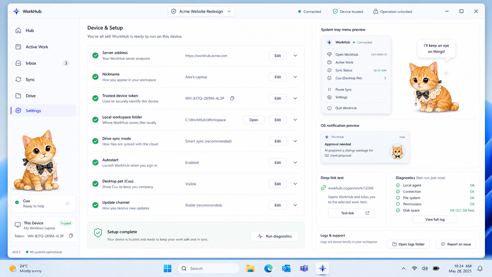

设置页承接 LAN-first 部署、设备令牌、本地目录、同步模式、自启动、桌宠显隐、更新通道、托盘和诊断日志。

### 2.5 辅助上下文页面图谱

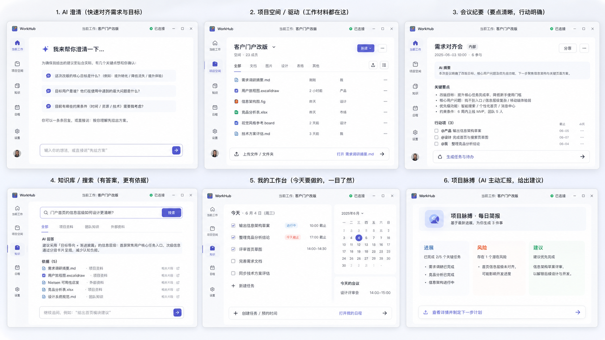

覆盖澄清、项目网盘、项目会议、知识证据、我的负载/日程、项目快报。它们是当前工作的辅助页，不应抢走主入口。

---

## 3. 桌宠 / 澄清 / 检索概念图

对应文档：[`cuu-desktop-pet-concept.md`](./cuu-desktop-pet-concept.md)、[`desktop-pet-tauri.md`](./desktop-pet-tauri.md)

### 3.1 Cuu 桌宠最终概念

Cuu 是当前桌宠形象基线：橘色卡通小猫、会动、可爱、醒目，展开后承接审批卡、证据卡和澄清选项。

### 3.1.1 Cuu 资产生产流水线

这张图定义美术资产从 AI 生图到透明 PNG、精修、sprite / Rive / Live2D / Lottie 运行时的可选路线。

### 3.1.2 Cuu 动画架构选型

桌宠动画不宜一开始锁死 Live2D。推荐路径是：MVP 用 PNG sprite atlas，P2 用 Rive state machine，Live2D 作为后续高表现力路线。

### 3.1.3 WorkHub 实现路线图

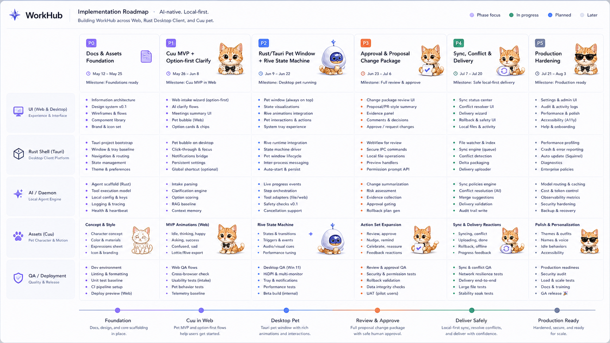

这张图把 Web、Rust/Tauri、daemon、Cuu 资产、QA/部署放到同一个阶段视图里，便于后续从概念进入施工。

### 3.2 早期桌宠交互探索

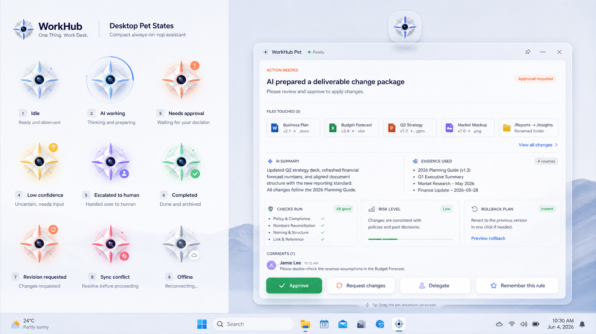

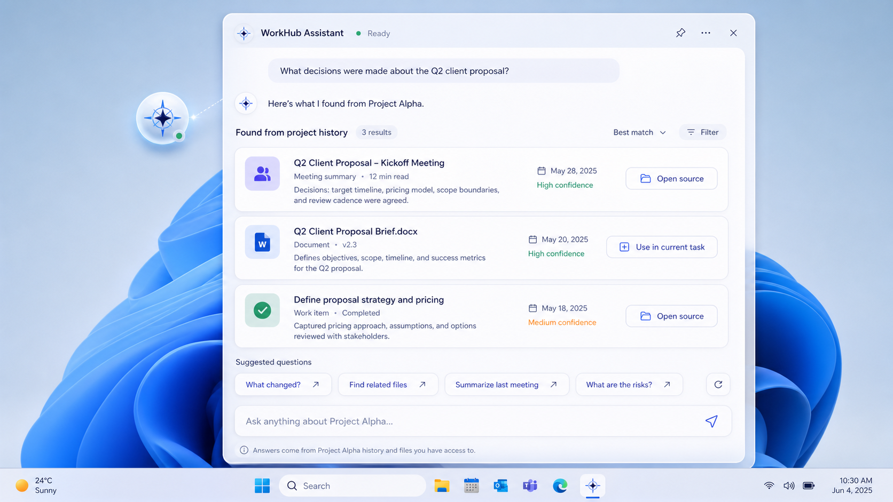

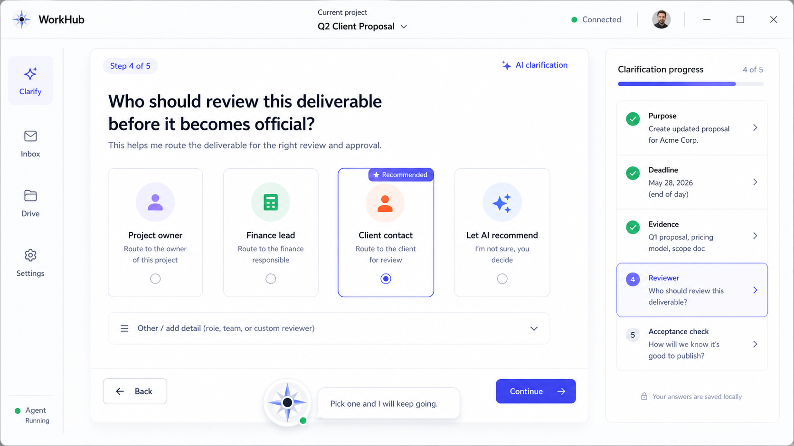

这三张保留为交互结构参考：项目检索属于桌宠气泡，澄清应选项优先。形象层面以后以 Cuu 为准。

---

## 4. 模块 / 端口 / 页面返回概念图

对应文档：[`_ts-first-module-port-page-alignment.md`](../../plans/p0-foundation/_ts-first-module-port-page-alignment.md)

### 4.1 TS-first Runtime

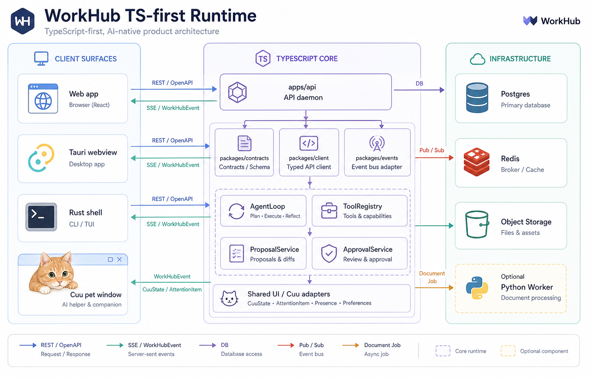

这张图定义后续施工的语言边界和运行时边界：TypeScript Core 承载 API、Agent、事件、契约和共享 UI；Rust shell 承接本地能力；Python 只作为可选文档处理 worker。

### 4.2 Endpoint → Page → Cuu Alignment

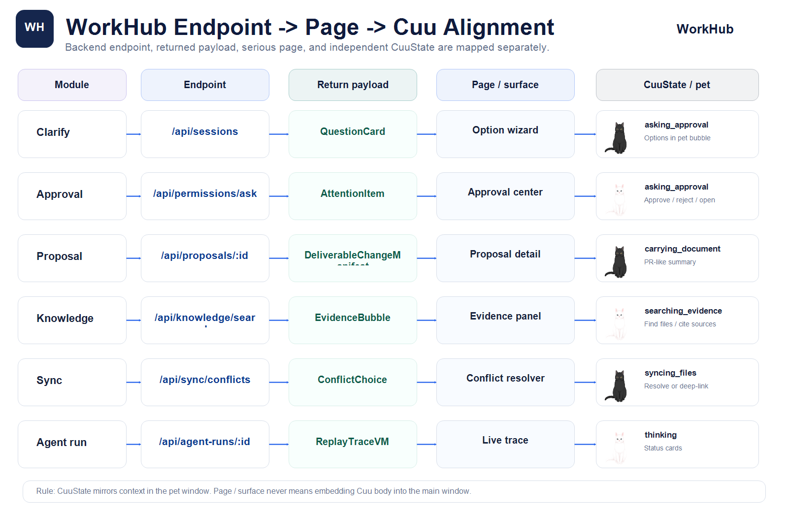

这张图定义模块、端口、返回 payload、页面和 Cuu 状态之间的对齐关系。后续新增页面时，必须先补齐对应的 endpoint、Page VM、事件和 Cuu 承接方式。

### 4.3 PRD / 概念复现差距地图

对应文档：[`prd-concept-reproduction-gap-audit.md`](./prd-concept-reproduction-gap-audit.md)

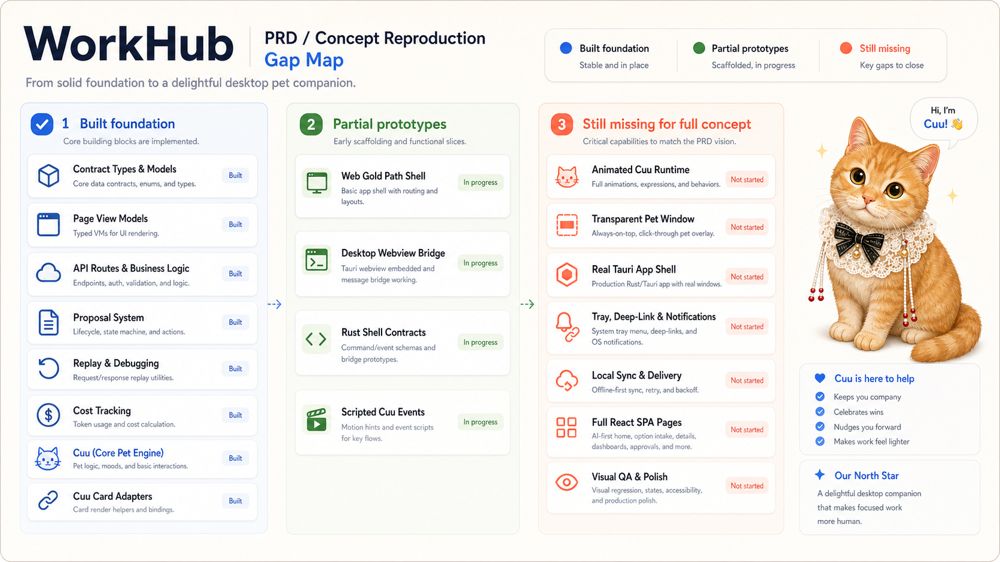

这张图把当前「已落地的契约和 P0.5 纵切」「仍处于原型的 Web / desktop-webview / Rust shell contract」「距离完整概念还缺的 Cuu 动画、透明桌宠窗、真实 Tauri 壳、本地同步、真实 SPA 页面和视觉 QA」放到同一张图里。它用于识别缺口，不作为精确完成率。

Cuu 当前已经有卡片适配和 motion hints，但还缺真实 sprite/Rive/Live2D runtime、动画资产、独立 pet window、拖拽/静音/勿扰和气泡动作提交。

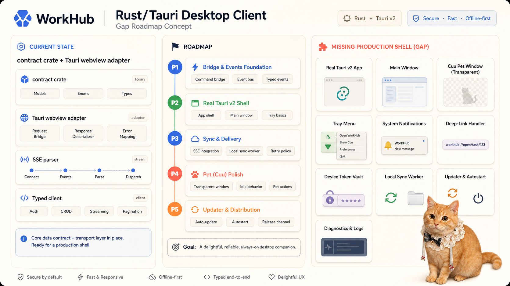

Rust 客户端当前是 shell contract crate + desktop webview bridge；要复现概念图，还需要 Tauri v2 runtime、主窗、透明桌宠窗、托盘、通知、deep-link、设备令牌 vault、本地同步、updater 和诊断。

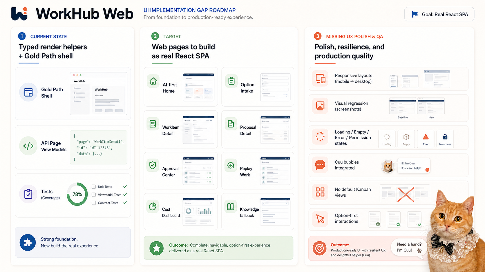

Web 当前更接近 typed render helpers + Gold Path shell。后续要补真实 React SPA routes、四态、响应式、Cuu bubble、视觉回归和 option-first 主路径。

---

## 5. 资产目录

- `assets/web/`：Web 页面与审批/交付物概念图。
- `assets/desktop/`：Rust/Tauri 客户端主窗、本地执行、同步与托盘概念图。
- `assets/pet/`：早期桌宠交互探索图。
- `assets/cuu/`：Cuu 最终桌宠形象与交互概念图。
- `assets/shared/`：跨端组件与交互元件图谱。

## 6. 共享组件图谱

对应文档：[`shared-ui-kit.md`](./shared-ui-kit.md)

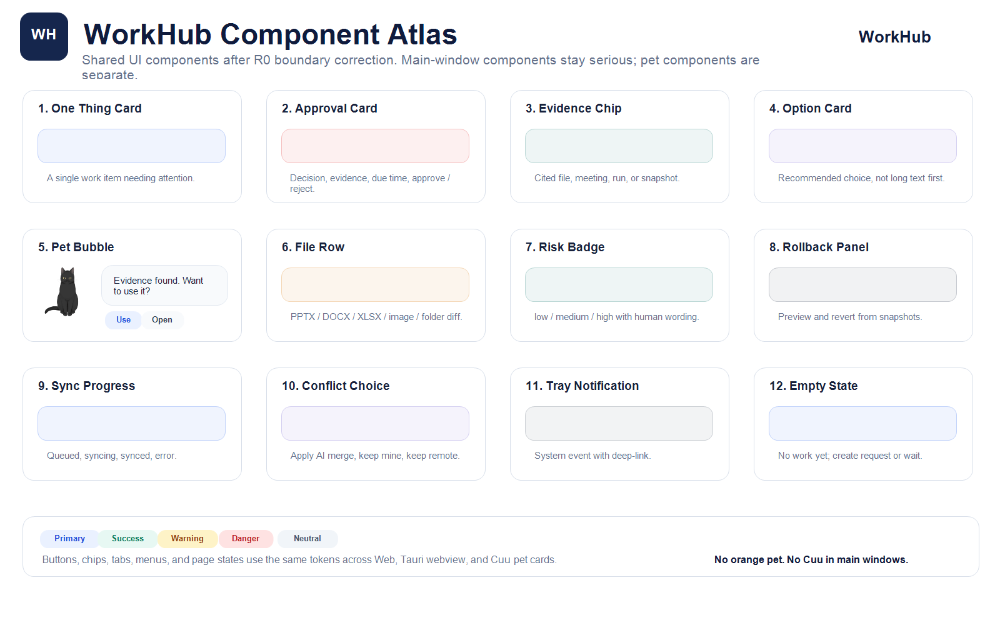

共享组件图谱把「单件事卡」「审批卡」「证据 chip」「选项卡」「Cuu 气泡」「文件行」「风险徽标」「回滚面板」「同步进度」「冲突选择」「托盘通知」「空态」收成一套跨端 UI 语言。后续实现优先落 C-UIKIT，Web 与 Rust 客户端只组合，不各自复制。

后续新增概念图时，优先放在对应端的资产目录，并在本页补一段说明，避免概念散落在生成目录里。
