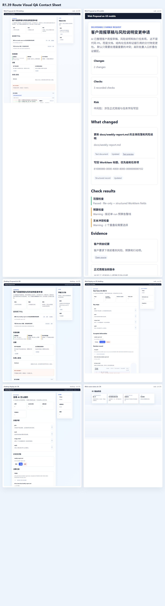

# WorkHub 页面概念图索引

> 本页收纳仍有效的概念图。概念图表达产品方向、信息密度和交互原则，不等同于最终 UI 截图。Cuu 当前只保留独立 `pet` window 中的黑猫 / 白猫 Live2D 二选项；Web 与 desktop 主窗保持严肃工作界面。

## 1. 阅读原则

| 原则 | 说明 |
|---|---|
| AI 默认过滤复杂度 | 默认只递给用户一件最需要判断的事 |
| 看板降级 | 看板是高级/兜底视图，不是默认首页 |
| 澄清点选项 | 打字只是折叠兜底 |
| Cuu 独立 | Cuu 不进入 Web / desktop 主窗，只在桌面右下角独立存在 |
| 交付物多样 | 变更申请像 GitHub PR，但对象可以是文档、表格、PPT、图片、文件夹 |
| 三端同源 | Web、desktop 主窗、Cuu 气泡都消费同一 Page VM / payload contract |
| 中英双语 | 概念落地时必须同步 zh-CN / en-US 固定文案 |

落地契约：

- 体验 payload：[`../../plans/p0-foundation/_experience-deliverable-contracts.md`](../../plans/p0-foundation/_experience-deliverable-contracts.md)
- Gold Path：[`../../plans/p0-foundation/_gold-path-p0-5-vertical-slice.md`](../../plans/p0-foundation/_gold-path-p0-5-vertical-slice.md)
- R0-R4 纠偏路线：[`../06-roadmap/recovery-r0-r4-roadmap-2026-06-08.md`](../06-roadmap/recovery-r0-r4-roadmap-2026-06-08.md)
- 审查后详细施工计划：[`../06-roadmap/review-driven-r0-r4-detailed-construction-plan-2026-06-08.md`](../06-roadmap/review-driven-r0-r4-detailed-construction-plan-2026-06-08.md)
- Cuu 概念：[`cuu-desktop-pet-concept.md`](./cuu-desktop-pet-concept.md)
- Cuu 二选项：[`cuu-live2d-cat-options-current-plan.md`](./cuu-live2d-cat-options-current-plan.md)
- Rust 客户端：[`desktop-pet-tauri.md`](./desktop-pet-tauri.md)

## 2. R0-R4 纠偏概念图

这张图是 2026-06-08 后的施工优先级概念图：先冻结 Cuu 外观与旧橘猫方向，补 R0 文档/截图/策略对账；再用 R1 真实纵切证明 AgentRun -> Proposal -> Replay；R2 才做多 worker；R3 才恢复 Cuu 作为 Agent 入口；R4 再做 Web 产品化。

### 2.1 R0 主窗 / Cuu 边界

这张图是 Claude 审查后新增的概念治理基准：Web / desktop 主窗只承载严肃工作界面和证据，不显示 Cuu 本体、角色卡或旧橘猫；Cuu 只存在于独立透明 Tauri pet window，并通过 `CuuState` / SSE / Page VM 与主窗共享数据，而不是共享视觉位置。

### 2.2 R0 shared 概念图原位替换

> 2026-06-08 修订：以下 4 张 shared PNG 已按 `D:/workhub审查报告` 的结论重绘，不再含橘猫，也不再把 Cuu 作为 Web / desktop 主窗元素。它们现在是后续模块开工前可直接阅读的当前概念图。

这张图定义当前工程边界：Web、desktop 主窗、Rust shell、Cuu pet window 都是客户端表面；TS daemon / contracts / AgentLoop / Proposal / Approval / Cost 是核心；PostgreSQL / Redis / object storage 是共享基础设施。Cuu 只在独立 pet window 中消费事件，不进入主窗。

这张图定义 endpoint -> payload -> page -> CuuState 的落点。页面列是严肃页面，CuuState 列是独立桌宠气泡和动作，不得把“映射到 Cuu”理解为“把猫嵌进页面”。

这张图把当前 `main` 的真实状态分为三类：已建地基、部分真实切片、仍缺模块。它同步了 2026-06-08 后已完成的 R1 PG smoke、DB-backed Proposal review/merge，同时保留 sessions / workitems / knowledge / page workitem、CostLedger、R2 多 worker、Cuu 出站 Agent 入口等缺口。

这张图定义共享 UI 组件语气。主窗口组件保持严肃；Pet Bubble 属于独立 Cuu surface，不是主窗右栏装饰。

## 3. Web 端概念图

### 3.1 AI-first 首页

默认首页不做重型项目看板，而是展示：

- 需要你决定什么。
- AI 正在做什么。
- 哪些事项可能出事。
- 成本、风险、证据的轻量摘要。

### 3.2 项目工作台

项目页默认是 attention workspace。左侧是项目上下文，中间是一件要处理的事，右侧是证据、风险、下一步建议。

### 3.3 选项优先提需求

提需求阶段不应要求用户先写长文本。AI 把意图拆成可点击选项，用户补附件、DDL、负责人、验收项即可。

### 3.4 核心页面图谱

覆盖登录门、项目列表、项目工作台、提需求、AI 澄清、工作项详情。后续实现要优先复现真实业务流，而不是堆展示卡片。

### 3.5 运营页面图谱

资源排期、项目健康、知识搜索、日程、通知都属于完整工作台能力。知识搜索的默认入口应优先下沉到 Cuu 气泡，Web 页面做兜底和管理。

### 3.6 文件会议审批图谱

网盘、会议、审批、提议详情、404 都需要同一套证据语言：发生了什么、依据是什么、需要人做什么。

### 3.7 工作项详情

工作项详情要呈现状态、验收项、AI 执行轨迹、置信语气、升级简报、交付物预览和提议时间线。

### 3.8 审批中心

审批中心是负责人视角的阻塞收件箱。核心动作是通过、打回、委派和记住规则。

### 3.9 交付物变更申请

变更申请要像 GitHub PR 一样清楚，但不是代码专用。页面必须支持文档、表格、PPT、图片、文件夹和版本变化。

### 3.10 项目资料 / 会议 / 知识

项目资料页聚合网盘、会议和知识证据。文件评论、会议洞察、资料变更都可以触发需求草稿或 Cuu 提醒。

### 3.11 会议洞察转需求草稿

AI 可以发现变化，但不能直接改正式状态；必须先生成草稿、澄清或审批项。

### 3.12 网盘预览与变更草稿

网盘页不是单纯文件管理器。文件评论、版本变化、文件夹重命名都可能变成“是否创建变更申请”的选项提示。

### 3.13 早期工作台探索

这张图保留为反例/探索记录：它偏重看板和信息密度，不作为默认首页目标。

## 4. Rust/Tauri 客户端概念图

### 4.1 单件事干活桌

客户端主窗被唤起时，应该让用户处理一个决定、一个任务或一个本地动作，而不是进入复杂管理面板。

### 4.2 客户端主窗

桌面主窗保留严肃工作风格：左侧导航、中间任务、右侧证据/状态。本地能力由 Rust shell 提供，业务 UI 由 TS webview 渲染。

### 4.3 设备设置与更新

设备令牌、连接状态、更新、系统权限都属于桌面客户端设置；这里不展示 Cuu 本体。

### 4.4 同步冲突处理

本地同步必须可解释、可回滚。冲突页要用普通语言说明“哪个文件、谁改了、建议怎么处理”。

### 4.5 支持页面图谱

支持收件箱、离线状态、诊断、同步、设置等桌面特有页面。

## 5. Cuu 桌宠概念图

> 2026-06-08 同步：以下三张 Cuu 核心概念图已原位替换为黑猫 Hijiki / 白猫 Tororo Live2D 版，且使用真实浏览器模型帧作为视觉基准。旧橘猫、手绘几何猫、改色实验图和主窗角色栏不再属于当前概念集。

### 5.1 Cuu 动效状态

这张图定义动作语义：idle、thinking、approval、carrying、search、sync、worried、revision、celebrating、offline。当前黑猫/白猫都要承接这些状态，后续原创替换模型也必须保持同一 motion contract。

### 5.2 Cuu 审批与项目检索

Cuu 的核心价值是桌面右下角独立存在，用气泡承接轻审批、项目检索、交付物变更摘要和澄清提醒。图中的主窗只做严肃页面示意，不代表 Cuu 本体进入主窗。

### 5.3 Cuu 选项优先澄清

Cuu 气泡和 Web 澄清页都默认点选项。输入框只作为“其他 / 补充”兜底。

### 5.4 Pet 交付物变更

桌宠只展示摘要和关键动作；完整说明 deep-link 到 proposal 页面。

### 5.5 Pet 项目检索气泡

项目检索不默认打开复杂搜索页。Cuu 先给 chips：找文件、总结会议、解释改动、列证据。

## 6. 当前真实审计图

> **R0 判定**：`2026-06-07-current-state` 中包含旧橘猫、Cuu 进入主窗或早期窗口裁切的截图，只能作为失败样例/历史审计，不能再作为“当前概念通过证据”。R1 前新增 Cuu 录屏/设置矩阵冻结，除非用于证明“主窗无 Cuu 本体、独立 pet window 不裁切、不漂移”等治理门。

### 6.1 页面总览

该图证明页面骨架存在，但不代表最终体验已完成。

### 6.2 Cuu 早期窗口回归门

这些图只作为回归门：不能只看单帧，不能只露耳朵，card mode 不能裁切。当前 Cuu 通过标准以黑猫/白猫 Live2D 真实录屏为准。

### 6.3 黑/白 Live2D 概念源帧

源帧目录：

- `./assets/audit/2026-06-08-cuu-live2d-model-preview/hijiki/`
- `./assets/audit/2026-06-08-cuu-live2d-model-preview/tororo/`

这组源帧证明概念图使用的是当前真实模型外观；它不能替代 Tauri `pet` window motion capture。后续验收仍要补黑猫/白猫独立窗口多场景录屏和 settings matrix。

### 6.4 R1.39 Route visual QA

R1.39 已把 Proposal / Replay 的富 patch viewer、重叠 hunk review、子记录逐项 diff 与多冲突折叠工作台放进 Web / desktop webview route wrapper 截图验收。证据目录：`./assets/audit/2026-06-10-r1-route-visual-qa/`；详细说明见 [`r1-route-visual-qa.md`](./r1-route-visual-qa.md)。当前 gates 包含 zh-CN/en-US、desktop/mobile-narrow、四态示意、`no_horizontal_overflow`、主窗无 Cuu 与无重看板默认词。

### 6.5 R1.43 Replay hunk / bulk audit

R1.43 已把 `proposal.merged.detail_json.text_hunk_decisions[]` 与 `proposal.bulk_action` 渲染成 Replay 严肃页中的用户可读审计区。该能力不新增概念图，不改变 R1.39 截图基准；它的当前边界是“解释当时每段/每批选了什么”，不是重型编辑器，也不是 Cuu 主窗卡片。详细说明见 [`r1-replay-hunk-bulk-audit.md`](./r1-replay-hunk-bulk-audit.md)。

### 6.6 R1.44 Proposal route line editor

R1.44 已把 Proposal 文本冲突的逐段选择产品化为严肃主窗中的 route line editor：文件 tab、长 patch 搜索、逐段 current / incoming / AI fusion 点选、完整 `text_hunk_overrides` payload 和键盘焦点。它继承 `web-deliverable-change-request.png` 的 GitHub-like 变更申请方向，但不变成代码编辑器，不让用户手打正文，也不进入 Cuu 气泡。详细说明见 [`r1-route-line-editor.md`](./r1-route-line-editor.md)。

## 7. 后续补图计划

| 编号 | 概念图 / 截图 | 目的 |
|---|---|---|
| IMG-CUU-01 | 黑猫真实 Tauri idle contact sheet | R1 后恢复；证明默认模型有持续动作 |
| IMG-CUU-02 | 白猫真实 Tauri idle contact sheet | R1 后恢复；证明可选模型真实可用 |
| IMG-CUU-03 | 黑/白 approval/search/card mode 录屏 | R3 后恢复；证明任务状态能触发真实 Agent 状态 |
| IMG-CUU-04 | settings matrix 截图 | R1 前冻结；后续证明 scale/opacity/pass-through/hide-on-hover，以及 `/settings` / 托盘恢复门 |
| IMG-WEB-01 | Web 主窗无 Cuu 本体截图 | 验证主窗边界 |
| IMG-DESK-01 | desktop 主窗无 Cuu 本体截图 | 验证桌面主窗边界 |
| IMG-I18N-01 | zh-CN/en-US 页面组图 | R1.39 已覆盖 Proposal / Replay route；R4 扩到全页面 |

## 7. 施工对齐

每个模块开工前先读对应文档和概念图：

| 模块 | 必读 |
|---|---|
| Web 页面 | `web-app.md` + 本文第 2 节 |
| Rust 客户端 | `desktop-pet-tauri.md` + 本文第 3 节 |
| Cuu 桌宠 | `cuu-desktop-pet-concept.md` + `cuu-live2d-cat-options-current-plan.md` + 本文第 4/5 节 |
| Proposal | `requirements-workitem.md` + `_experience-deliverable-contracts.md` |
| Knowledge / Search | `knowledge-base.md` + Cuu 检索气泡概念图 |
| i18n | `i18n-locale-contract-p1-1.md` + `i18n-nongoldpath-render-helpers-p1-2.md` |
