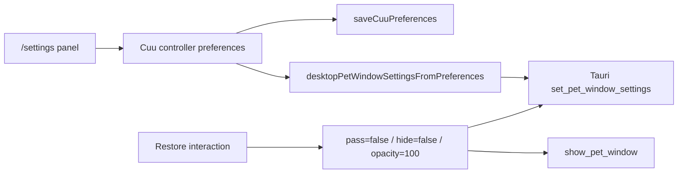
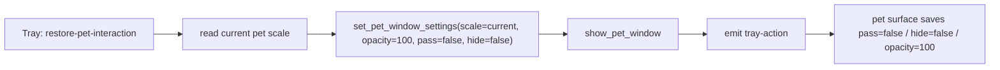

# P1.5 Pet Settings Recovery Gate

> 当前口径：`/settings` 是严肃主窗设置页，不显示 Cuu 形象，不提供模型图预览，不承载旧实验模型。它只负责独立 `pet` window 的可恢复设置，尤其是点击穿透恢复门。

## 1. 本轮已落

| 能力 | 落点 | 说明 |
|---|---|---|
| 主窗 settings 恢复面板 | `apps/desktop-webview/src/cuu-preferences.ts` | 新增 `renderDesktopPetSettingsPanel` / `bindDesktopPetSettingsPanel`，嵌入 `/settings`，不再用浮动 Cuu 按钮承载恢复 |
| 严肃主窗边界 | `apps/desktop-webview/src/browser.ts` | desktop main shell 注入 `desktopPetSettingsCss`，只挂设置控件，不渲染猫图、Live2D iframe 或模型预览 |
| 设置同步 Rust | `desktopPetWindowSettingsFromPreferences` + `set_pet_window_settings` | 修改尺寸、透明度、点击穿透、悬停避让后保存 localStorage，并同步到 Tauri `pet` window |
| 显示 pet window bridge | `apps/desktop-webview/src/pet-window-bridge.ts` | 新增 `showPetWindow()`，调用 Rust `show_pet_window` |
| 主窗恢复动作 | `data-cuu-pet-restore-interaction` | 恢复时设 `pet_pass_through=false`、`pet_hide_on_hover=false`、`pet_opacity_percent=100`，再显示 pet window |
| 托盘恢复动作 | `client-tauri/src-tauri/src/tray.rs` / `main.rs` | 新增 `restore-pet-interaction` 菜单项，先重置交互设置，再显示 pet window |
| Pet surface 偏好回写 | `apps/desktop-webview/src/pet-surface.ts` | 监听 `tray-action`，收到 `restore-pet-interaction` 后同步写回 localStorage，避免下一次 render 又把 pass-through 打开 |
| 显式 settings route | `apps/web/src/main.ts` / `apps/desktop-webview/src/main.ts` | `/settings` 写入 surface pages 清单 |

## 2. 用户体验合同

| 场景 | 行为 |
|---|---|
| 默认 | Cuu 可交互、常驻，右键轻菜单可打开 |
| 开启点击穿透 | 鼠标事件穿过独立 pet window；用户不能再依赖右键菜单恢复 |
| 主窗恢复 | 打开 `/settings`，点击“恢复可交互”，恢复 `pass_through=false`、`hide_on_hover=false`、`opacity=100` |
| 托盘恢复 | 系统托盘点击 `Restore Cuu interaction`，不需要主窗先可用 |
| 显示 / 隐藏 | settings 面板可调用 `show_pet_window` / `hide_pet_window`，托盘仍保留 show/hide toggle |

## 3. 明确不做

- 不把点击穿透放进 pet 右键菜单。右键菜单会被 pass-through 自己禁用，入口不可恢复。
- 不在 Web 或 desktop 主窗显示 Cuu 本体、Live2D iframe、猫图、模型预览或角色卡。
- 不在主窗 settings 提供黑猫 / 白猫选择；形象选择留在独立 pet window 右键菜单。
- 不把 settings 面板做成看板、角色养成页或装饰页。

## 4. Runtime Contract

设置来源仍是本地偏好：

```txt
localStorage["workhub_cuu_preferences"]
```

主窗 settings 绑定流程：



托盘恢复流程：



## 5. Tests

已验证：

```powershell
pnpm --filter @workhub/desktop-webview test
pnpm --filter @workhub/desktop-webview build
pnpm --filter @workhub/web test
cargo test --manifest-path client-tauri\src-tauri\Cargo.toml
```

覆盖点：

- desktop settings 面板包含 scale / opacity / pass-through / hide-on-hover / restore / show / hide。
- desktop settings 面板不包含 `data-cuu-model-pack-id`、旧模型 ID、黑猫/白猫模型选择文案。
- Web surface 保持无 Cuu adapter，`/settings` 只是普通严肃页面。
- Desktop bridge 可调用 `show_pet_window` / `hide_pet_window` / `focus_main_route`。
- Rust tray 有稳定 `restore-pet-interaction` ID，动作是 show pet，不偷焦点。
- Rust 单元测试确认 tray item 数量和恢复动作合同。
- Pet surface 监听 `tray-action`，恢复后写回偏好，避免本地偏好反向覆盖 Rust 恢复。

## 6. R3.17 视觉验收进展

R3.17 已补 settings matrix，但仍没有把 pass-through 端到端恢复宣称为完成。

| 项 | 证据 / 结论 |
|---|---|
| settings matrix | `docs/workhub/05-clients/assets/audit/2026-06-10-cuu-r3-settings-matrix/hijiki/` |
| 覆盖组合 | `default`、`white-cat`、`scale-75`、`scale-150`、`opacity-60`、`pass-through`、`hide-on-hover`、`combo-125-80-pass-hide` |
| 自动门 | 八组均 `first_frame_bounds_gate.passed=true`，保留 contact sheet/GIF/MP4/DOM report/motion diff report；MP4 奇数尺寸用 pad gate 避免零字节输出 |
| 视觉复核 | scale 75/150/125、opacity 60、pass-through 与 hide-on-hover 下 Cuu 全身在窗口内，没有只露耳朵或贴边裁切 |
| pass-through 口径 | `pass-through` case 证明偏好可进入真实 `pet` window；它不是“用户开启后再通过托盘/主窗恢复”的端到端证据 |

仍未通过的视觉验收：

| 缺口 | 下一步 |
|---|---|
| settings panel 真实截图 | 生成 desktop 主窗 `/settings` zh-CN / en-US 截图，确认没有 Cuu 本体、没有模型预览、文本不溢出 |
| pass-through 真机恢复 | 开启 pass-through 后，用主窗 `/settings` 或托盘 `restore-pet-interaction` 恢复并录屏 / 多帧截图 |
| menu 与 settings 联动 | 右键菜单开启 hover 后，主窗 settings 状态同步；主窗恢复后 pet 右键重新可用 |
| Linux/macOS | 透明窗口 + tray 恢复 smoke；Wayland/X11 需要单独记录 |

## 7. 后续施工

1. 给 `restore-pet-interaction` 增加端到端截图证据：开启 pass-through、主窗或托盘恢复、右键菜单重新可用。
2. 补 desktop 主窗 `/settings` 的 zh-CN/en-US 截图，并把“无 Cuu 本体 / 无模型预览 / 文本不出框”写入 gate。
3. 继续业务动作 motion driver：approval / search / sync / done / offline 不只停留在 CSS/data attr。
4. 再做主窗视觉审查：Web / desktop 主窗都不能出现 Cuu 本体。
