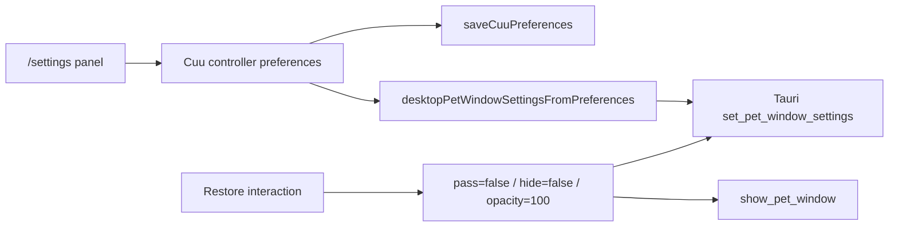
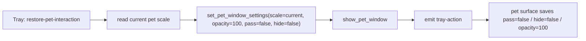

# P1.5 Pet Settings Recovery Gate

> 当前口径：`/settings` 是严肃主窗设置页，不显示 Cuu 形象，不提供模型图预览，不承载旧实验模型。它只负责独立 `pet` window 的可恢复设置，尤其是点击穿透恢复门。

## 1. 本轮已落

| 能力 | 落点 | 说明 |
|---|---|---|
| 主窗 settings 恢复面板 | `apps/desktop-webview/src/cuu-preferences.ts` | 新增 `renderDesktopPetSettingsPanel` / `bindDesktopPetSettingsPanel`，嵌入 `/settings`，不再用浮动 Cuu 按钮承载恢复 |
| 严肃主窗边界 | `apps/desktop-webview/src/browser.ts` | desktop main shell 注入 `desktopPetSettingsCss`，只挂设置控件，不渲染猫图、Live2D iframe 或模型预览 |
| 设置同步 Rust | `desktopPetWindowSettingsFromPreferences` + `set_pet_window_settings` | 修改尺寸、透明度、点击穿透、悬停避让后保存 localStorage，并同步到 Tauri `pet` window |
| 显示 pet window bridge | `apps/desktop-webview/src/pet-window-bridge.ts` | 新增 `showPetWindow()`，调用 Rust `show_pet_window` |
| 主窗恢复动作 | `data-cuu-pet-restore-interaction` | 恢复时设 `pet_pass_through=false`、`pet_hide_on_hover=false`、`pet_opacity_percent=100`，再显示 pet window |
| 托盘恢复动作 | `client-tauri/src-tauri/src/tray.rs` / `main.rs` | 新增 `restore-pet-interaction` 菜单项，先重置交互设置，再显示 pet window |
| Pet surface 偏好回写 | `apps/desktop-webview/src/pet-surface.ts` | 监听 `tray-action`，收到 `restore-pet-interaction` 后同步写回 localStorage，避免下一次 render 又把 pass-through 打开 |
| 显式 settings route | `apps/web/src/main.ts` / `apps/desktop-webview/src/main.ts` | `/settings` 写入 surface pages 清单 |

## 2. 用户体验合同

| 场景 | 行为 |
|---|---|
| 默认 | Cuu 可交互、常驻，右键轻菜单可打开 |
| 开启点击穿透 | 鼠标事件穿过独立 pet window；用户不能再依赖右键菜单恢复 |
| 主窗恢复 | 打开 `/settings`，点击“恢复可交互”，恢复 `pass_through=false`、`hide_on_hover=false`、`opacity=100` |
| 托盘恢复 | 系统托盘点击 `Restore Cuu interaction`，不需要主窗先可用 |
| 显示 / 隐藏 | settings 面板可调用 `show_pet_window` / `hide_pet_window`，托盘仍保留 show/hide toggle |

## 3. 明确不做

- 不把点击穿透放进 pet 右键菜单。右键菜单会被 pass-through 自己禁用，入口不可恢复。
- 不在 Web 或 desktop 主窗显示 Cuu 本体、Live2D iframe、猫图、模型预览或角色卡。
- 不在主窗 settings 提供黑猫 / 白猫选择；形象选择留在独立 pet window 右键菜单。
- 不把 settings 面板做成看板、角色养成页或装饰页。

## 4. Runtime Contract

设置来源仍是本地偏好：

```txt
localStorage["workhub_cuu_preferences"]
```

主窗 settings 绑定流程：



托盘恢复流程：



## 5. Tests

已验证：

```powershell
pnpm --filter @workhub/desktop-webview test
pnpm --filter @workhub/desktop-webview build
pnpm --filter @workhub/web test
cargo test --manifest-path client-tauri\src-tauri\Cargo.toml
pnpm --filter @workhub/api test
pnpm --filter @workhub/ui test
powershell -ExecutionPolicy Bypass -File scripts\qa\cuu-tauri-motion-capture.ps1 -SkipBuild -Scenario pass-through-recovery-settings -Locale zh-CN -ModelPackId cuu-hijiki-live2d-cubism2 -FrameCount 16 -IntervalMs 500 -WaitSeconds 16 -OutDir docs\workhub\05-clients\assets\audit\2026-06-10-cuu-r3-pass-through-recovery\hijiki\settings-restore-zh
powershell -ExecutionPolicy Bypass -File scripts\qa\cuu-tauri-motion-capture.ps1 -SkipBuild -Scenario pass-through-recovery-settings -Locale en-US -ModelPackId cuu-hijiki-live2d-cubism2 -FrameCount 16 -IntervalMs 500 -WaitSeconds 16 -OutDir docs\workhub\05-clients\assets\audit\2026-06-10-cuu-r3-pass-through-recovery\hijiki\settings-restore-en
```

覆盖点：

- desktop settings 面板包含 scale / opacity / pass-through / hide-on-hover / restore / show / hide。
- desktop settings 面板不包含 `data-cuu-model-pack-id`、旧模型 ID、黑猫/白猫模型选择文案。
- Web surface 保持无 Cuu adapter，`/settings` 只是普通严肃页面。
- Desktop bridge 可调用 `show_pet_window` / `hide_pet_window` / `focus_main_route`。
- Rust tray 有稳定 `restore-pet-interaction` ID，动作是 show pet，不偷焦点。
- Rust 单元测试确认 tray item 数量和恢复动作合同。
- Pet surface 监听 `tray-action`，恢复后写回偏好，避免本地偏好反向覆盖 Rust 恢复。

## 6. R3.18 视觉验收进展

R3.18 已补主窗 settings 恢复截图和 pass-through 端到端恢复证据。R3.17 的 settings matrix 仍作为偏好组合回归证据；R3.18 新增的是“开启 pass-through 后从主窗恢复，再确认 pet 右键菜单可用”的真实 Tauri 场景。

| 项 | 证据 / 结论 |
|---|---|
| settings matrix | `docs/workhub/05-clients/assets/audit/2026-06-10-cuu-r3-settings-matrix/hijiki/` |
| 覆盖组合 | `default`、`white-cat`、`scale-75`、`scale-150`、`opacity-60`、`pass-through`、`hide-on-hover`、`combo-125-80-pass-hide` |
| 自动门 | 八组均 `first_frame_bounds_gate.passed=true`，保留 contact sheet/GIF/MP4/DOM report/motion diff report；MP4 奇数尺寸用 pad gate 避免零字节输出 |
| 视觉复核 | scale 75/150/125、opacity 60、pass-through 与 hide-on-hover 下 Cuu 全身在窗口内，没有只露耳朵或贴边裁切 |
| 主窗 settings zh-CN | `docs/workhub/05-clients/assets/audit/2026-06-10-cuu-r3-pass-through-recovery/hijiki/settings-restore-zh/`，`main_settings_before_restore` 与 `main_settings_after_restore` 均 `layout_gate.passed=true`、`overflow.offenders=[]` |
| 主窗 settings en-US | `docs/workhub/05-clients/assets/audit/2026-06-10-cuu-r3-pass-through-recovery/hijiki/settings-restore-en/`，同上 |
| pass-through 主窗恢复 | 两个 locale 均 `pass_through_recovery_gate.passed=true`：初始 `pass_through=true`，点击恢复后 `pass=false/hide=false/opacity=100`，最终右键菜单可用 |
| 严肃主窗边界 | 两组主窗截图和 gate 均确认没有 Cuu 本体、Live2D iframe、模型预览或旧模型文案 |
| 文本边界 | 主窗 settings 状态徽标和长文案无横向 overflow；额外复跑 `run-failure-card-en/`，人工复核失败运行卡片 `Run progress/Budget` 未超框 |

## 7. R3.19 tray handler recovery 视觉验收进展

R3.19 补上 `restore-pet-interaction` 同一 Rust tray handler 的真实恢复证据。该轮验收通过的是 command-backed handler 触发，不是物理 OS 托盘图标点击；物理点击证据已由 R3.20b 补齐。

| 项 | 证据 / 结论 |
|---|---|
| tray handler recovery en-US | `docs/workhub/05-clients/assets/audit/2026-06-10-cuu-r3-tray-recovery/hijiki/tray-restore-en-official/`，`pass_through_recovery_gate.passed=true` |
| tray handler recovery zh-CN | `docs/workhub/05-clients/assets/audit/2026-06-10-cuu-r3-tray-recovery/hijiki/tray-restore-zh-official/`，同上 |
| 恢复状态 | 两个 locale 均从 `pass_checked=true` 恢复为 `pass_checked=false`，`hide_checked=false`，`selected_opacity=100` |
| pet/main 同步 | `tray-action` 进入 pet 后写回 preferences/localStorage，再通过 `pet-settings source="tray"` 刷新 main `/settings` 面板 |
| 右键菜单 | 恢复后 WebView2 CDP 右键菜单可用，`settings_menu_layout_gate.passed=true`，菜单 rect 留在 260px surface 内 |
| 文本边界 | 恢复提示缩短为 `Interaction restored.` / `已恢复交互。`；菜单打开前清掉 transient 提示，official DOM report `bubble=null`，避免文字被菜单遮挡 |

## 8. R3.20a menu -> settings hover sync 视觉验收进展

R3.20a 补上 R3.19 留下的“右键菜单切 hover 后，主窗 `/settings` 是否真实同步”的可见截图证据。该切片仍然不把 Cuu 本体放回主窗，也不在右键菜单里加入 pass-through；它只验证 `hide_on_hover` 从 pet menu 发起后，主窗严肃设置面板同步为已勾选，并且中英双语文本不超框。

| 项 | 证据 / 结论 |
|---|---|
| hover sync en-US | `docs/workhub/05-clients/assets/audit/2026-06-10-cuu-r3-settings-hover-sync/hijiki/hover-sync-en-official/`，`settings_menu_hover_sync_gate.passed=true` |
| hover sync zh-CN | `docs/workhub/05-clients/assets/audit/2026-06-10-cuu-r3-settings-hover-sync/hijiki/hover-sync-zh-official/`，同上 |
| 主窗状态同步 | before 截图为 `pass_checked=false`、`hide_checked=false`；after 截图为 `pass_checked=false`、`hide_checked=true` |
| pet/menu 同步 | 最终 pet DOM 为 `data_pet_pass_through=false`、`data_pet_hide_on_hover=true`；右键菜单重新打开后仍可用且 hover 项保持选中 |
| 文本边界 | 两个 locale 的 `main_settings_before_hover_sync.layout_gate.overflow.offenders=[]` 与 `main_settings_after_hover_sync.layout_gate.overflow.offenders=[]`；菜单按钮、短提示和主窗状态徽标均未超出容器 |

## 9. R3.20b physical OS tray recovery 视觉验收进展

R3.20b 补上真实 Windows OS 托盘图标/菜单项点击证据：从 `pass_through=true` 初始状态开始，通过 Windows UI Automation 定位系统托盘 `WorkHub - Cuu is ready` 图标，右键打开原生菜单，再左键点击 `Restore Cuu interaction`。该场景不调用 `restore_pet_window_interaction` command fallback，恢复后仍要求 main `/settings` 和 pet 右键菜单同步为可交互。

| 项 | 证据 / 结论 |
|---|---|
| physical tray recovery en-US | `docs/workhub/05-clients/assets/audit/2026-06-10-cuu-r3-physical-tray-recovery/hijiki/physical-tray-restore-en-official/`，`physical_tray_recovery_gate.passed=true`、`command_fallback_used=false` |
| physical tray recovery zh-CN | `docs/workhub/05-clients/assets/audit/2026-06-10-cuu-r3-physical-tray-recovery/hijiki/physical-tray-restore-zh-official/`，同上 |
| 恢复状态 | 两个 locale 均从 `pass_checked=true` 恢复为 `pass_checked=false`，`hide_checked=false`，`selected_opacity=100` |
| 系统菜单截图 | `windows-tray-menu-before-restore.png` 显示真实 tray overflow panel 与原生 WorkHub menu，包含 `Restore Cuu interaction` |
| 文本边界 | 主窗 settings 恢复前/后 `overflow.offenders=[]`；状态徽标可换行但不出框 |

仍未通过的视觉验收：

| 缺口 | 下一步 |
|---|---|
| Linux/macOS | 透明窗口 + tray/menu bar 恢复 smoke；Wayland/X11、macOS 截图权限需要单独记录 |
| 更广文本门 | R3.20b 已覆盖 run-failure/run-stream；下一步把 permission/offline 的最新证据也纳入 `pet_card_text_overflow_gate` |

## 10. 后续施工

1. 建立 Linux/macOS 透明窗口、tray/menu bar 与截图权限策略。
2. 保留右键菜单和主窗 settings 双向状态同步回归：R3.20a 已证明菜单改 hover 后主窗可见；主窗/物理托盘恢复后 pet 已由 R3.18/R3.19/R3.20b 证明。
3. 继续业务动作 motion driver：approval / search / sync / done / offline 不只停留在 CSS/data attr。
4. R4 继续做主窗视觉审查：Web / desktop 主工作台、审批、Replay、Proposal、Cost 都不能出现 Cuu 本体，且必须保留文本不出框 gate。
