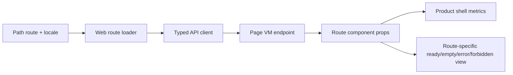

# R4.10 Web Route Componentization Plan

> 2026-06-11 竣工：第一刀已把 Home / Approvals / Replay ready route 从“全量 Gold Path shared renderer panels”推进到显式 Web route components，并让产品壳在 route component 模式下只渲染 active panel。R4.11 继续拆 WorkItem / Proposal / Cost / Settings。

## 1. 开工前阅读

R4.10 每个子模块开工前必须复读：

- [`r4-09-web-locale-page-vm-shell-metrics-2026-06-11.md`](./r4-09-web-locale-page-vm-shell-metrics-2026-06-11.md)
- [`web-app.md`](../05-clients/web-app.md)
- [`page-concepts.md`](../05-clients/page-concepts.md)
- 概念图：`web-ai-first-home.png`、`web-approval-center.png`、`web-workitem-detail.png`、`web-deliverable-change-request.png`
- 相关 route/test 文件当前实现，不用记忆里的 R4.9 状态替代真实代码审查

## 2. 目标

把 R4.9 仍依赖 shared HTML renderer 的高频 ready route，推进到真实 route component 或更细粒度 shared component。第一刀优先 Home / Approvals / Replay，不改变 Page VM 合同、不绕开 REST-as-truth、不引入主窗 Cuu。

## 3. 范围

| Route | R4.10 第一刀目标 | 必守边界 |
|---|---|---|
| Home | 拆出 Home ready component，保留 Page VM summary/metrics/data source | 不回到 marketing hero，不出现 Cuu、Kanban、weekly fixture |
| Approvals | 拆出审批列表/空态/forbidden/error component，动作文案继续走 locale contract | 不提交真实审批动作，QA 只验证 UI/dataflow |
| Replay | 拆出 replay timeline/merge decision/cost scope component，metrics 仍来自 Page VM | 不硬翻译 raw manifest、用户正文、evidence excerpt |

## 4. 数据流

## 5. QA Gate

R4.10 完成时必须通过：

- Typecheck：`apps/web`、`packages/ui`、`packages/api-client`、受影响 API 包。
- Unit tests：route loader、component render、locale/action labels、Page VM props。
- Browser QA：复用远端 Linux PG + Redis + Chrome 或本机等价 smoke。
- Visual gates：desktop/mobile、zh-CN/en-US、ready/empty/forbidden/error。
- Regression gates：`no_main_window_cuu`、`no_default_kanban`、`no_weekly_fixture_copy`、`no_hash_navigation`、`no_horizontal_overflow`、`no_text_box_overflow`。
- Data gates：route component 不直接构造业务假数据；ready view 的关键数值仍来自 Page VM。

## 6. 施工顺序

1. 审查 `apps/web/src/routes*`、`packages/ui/src/gold-path/*`、R4.9 QA report，找出 shared renderer 的真实耦合点。
2. 先拆 Home route ready component，补 unit + browser screenshot gate。
3. 再拆 Approvals route component，覆盖 list/empty/forbidden/error 与中英动作文案。
4. 最后拆 Replay route component，确保 timeline/merge/cost metrics 与 Page VM 一致。
5. 更新 QA report、截图归档、PRD/概念图一致性审查、bug/dataflow 审查。

## 7. 验收后的下一步

R4.10 通过后进入 R4.11：Proposal / WorkItem / Cost / Settings route componentization，继续扩大真实产品主窗视觉矩阵与动态双语范围。

## 8. 施工结果

- 新增 `packages/ui/src/gold-path/route-components.ts`：提供 `renderWebRouteComponents()`，首批输出 `home`、`approvals`、`replay` 三个 route component，统一带 `data-r4-route-component="..."`、`data-r4-route-component-source="page-vm"` 与 locale marker。
- `Home` 直接消费 `AttentionHomeVM`：展示当前最阻塞判断、后台运行、队列入口和证据摘要，不回到 marketing hero / Kanban / Cuu 主窗。
- `Approvals` 直接消费 `ApprovalCenterVM`：展示审批队列、动作、SLA、规则和审批事实；可见路由状态只显示“已路由/Routed”，避免长 UUID 在窄 pill 中竖排破坏视觉。
- `Replay` 复用专用 `renderAgentRunReplay()`，外层补 route component marker 与 step count，保留 timeline / merge / deliverable / structured audit 能力。
- `packages/ui/src/gold-path/product-shell.ts` 新增 `routeComponents` 与 `renderActivePanelOnly`：Web ready route 仍保留 topbar/path nav/masthead/metrics/right rail，但 current route 之外的 Gold Path HTML 不再进入主窗口 panel。
- `apps/web/src/routes.ts` 在 typed Page VM + gold-path template 合成后，注入 R4.10 route component registry；empty/error/forbidden 仍走 route-state helper。
- 统一修复多个 renderer 的标题行高：`gold-path/render.ts`、`product-shell.ts`、`intake/render.ts`、`workitem/render.ts`、`proposal/render.ts`、`replay/render.ts`，解决真实 Chrome text overflow gate 抓到的中文标题竖向裁切。
- `apps/web/qa/r4-web-live-route-interaction.ts` 增加 R4.10 marker audit、active-only panel gate、Replay ready 截图，并允许本轮通过 env 写入 R4.10 专属证据目录。

## 9. 验收证据

证据目录：

`docs/workhub/05-clients/assets/audit/2026-06-11-r4-10-web-route-componentization-browser-smoke/`

关键文件：

- `live-route-interaction-report.json`
- `smoke-summary.md`
- `contact-sheet.html`
- `contact-sheet.png`
- `01-home-zh-desktop.png`
- `02-approvals-click-zh-desktop.png`
- `07-replay-en-desktop-route-component.png`
- `08-empty-approvals-mobile.png`
- `09-forbidden-workitem-desktop.png`
- `10-unknown-route-error.png`
- `11-proposal-mobile-scrolled.png`

Browser gates 全部为 true：

- `dev_server_started`
- `screenshots_captured`
- `path_nav_clicks`
- `history_back_forward`
- `locale_toggle_reload`
- `ready_empty_forbidden_error_routes`
- `ready_routes_use_page_vm_endpoints`
- `r4_10_home_approvals_replay_route_components`
- `r4_10_active_only_product_panels`
- `product_shell_stays_path_mode`
- `no_duplicate_route_loader_calls`
- `mobile_scroll_no_topbar_nav_overlap`
- `no_main_window_cuu`
- `no_default_kanban`
- `no_old_preview_shell`
- `no_weekly_fixture_copy`
- `no_hash_navigation`
- `no_horizontal_overflow`
- `no_text_box_overflow`

Request proof：

- `/api/pages/attention`：1 次，Home route component 数据真相源。
- `/api/pages/approvals`：3 次，含 ready、history back、empty probe。
- `/api/agent-runs/r4-live-run/replay`：1 次，Replay route component 数据真相源。
- `/api/pages/workitems/r4-live-workitem`：3 次，验证旧 active-only panel 仍能正常 route reload。
- `/api/pages/proposals/r4-live-proposal`：1 次。
- `/api/pages/gold-path`：8 次，只作为 shell/template 与 nav/route metadata 来源，不作为三页 ready component 业务数据真相源。
- `PATCH /api/auth/preferences`：1 次，locale reload 仍贯通。

## 10. 测试通过

- `pnpm --filter @workhub/ui test`：40/40。
- `pnpm --filter @workhub/web test`：12/12。
- `pnpm typecheck`：15 个 workspace project typecheck 通过。
- `pnpm qa:r4-web-live-route-interaction`，带：
  - `WORKHUB_R4_WEB_ROUTE_SMOKE_OUTPUT_DIR=docs/workhub/05-clients/assets/audit/2026-06-11-r4-10-web-route-componentization-browser-smoke`
  - `WORKHUB_R4_WEB_ROUTE_SMOKE_TITLE="R4.10 Web Route Componentization Browser Smoke"`
- `git diff --check`：通过。

## 11. PRD / 概念图审视

- `web-ai-first-home.png`：已符合“一个最重要判断优先”的方向；Home 不再展示重看板，背景运行和队列降级为次级信息。
- `web-approval-center.png`：已形成审批队列 + 规则/SLA/事实右侧 panel；长 ID 可见文本已收口，避免概念图里没有的技术噪声压过审批动作。
- `web-workitem-detail.png`：R4.10 未拆 WorkItem，但 active-only panel 已保证 WorkItem ready route 不再携带其它 hidden panels；R4.11 继续拆。
- `web-deliverable-change-request.png`：R4.10 未拆 Proposal，但移动 proposal scrolled 截图继续作为回归门；R4.11 继续拆。
- Cuu 边界：主 Web ready/empty/forbidden/error 截图均 gate `no_main_window_cuu=true`；Cuu 继续只在独立桌宠窗口。
- 双语边界：固定 chrome 与 route component marker 覆盖 zh-CN/en-US；用户输入、证据摘录、manifest、LLM 正文仍保持 VM 原文，不在客户端硬翻译。

## 12. Bug / 数据流审查

- 发现并修复两个真实视觉 bug：产品壳 masthead H1、旧 WorkItem/renderer H1 行高过紧导致 Chrome `scrollHeight > clientHeight`。
- 发现并修复审批事实 raw UUID 在窄 pill 中竖排的问题，改为固定 “已路由/Routed” 状态标签。
- 数据流仍是 path route -> typed API Page VM -> route component props -> product shell metrics/active panel。R4.10 没有在客户端构造业务假数据。
- `renderActivePanelOnly` 后，current route 之外的 shared renderer HTML 不再进入 Web 主窗口，降低 hidden fixture / old panel 泄漏风险。
- SSE refresh、locale reload、path navigation、history back/forward 仍由 `apps/web/src/browser.ts` route reload 统一处理，没有新增并行状态源。

## 13. 下一步计划

进入 [`r4-11-web-route-componentization-second-slice-plan-2026-06-11.md`](./r4-11-web-route-componentization-second-slice-plan-2026-06-11.md)：

1. 拆 WorkItem route component：验收、trace、证据、交付物、AI 状态 rail。
2. 拆 Proposal route component：PR-like diff/change/check/evidence/action layout，继续保留 conflict/field editor 能力。
3. 拆 Cost route component：预算、风险、团队/个人用量与 mobile readable layout。
4. 拆 Settings route component：只保留运行时/设备/语言/桌宠边界控制，不引入 Cuu 主窗形象配置。
5. 继续保留 R4.10 active-only panel、R4.8/R4.9 Redis/SSE/locale、no Cuu/no Kanban/no weekly/no hash/no overflow gates。
