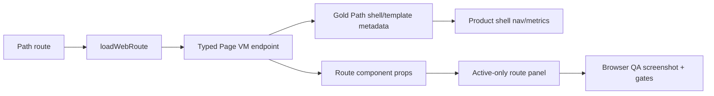

# R4.11 Web Route Componentization Second Slice Plan

> 2026-06-11 竣工：WorkItem / Proposal / Cost / Settings 已接入显式 route components；Settings 新增 typed Page VM endpoint；Web ready route 继续保持 active-only product panel、REST/Page VM as truth、path navigation、zh-CN/en-US fixed copy、主窗无 Cuu、无 Kanban/hash/weekly 回归词和文本盒无溢出 gate。

## 1. 开工前必读

- [`r4-10-web-route-componentization-plan-2026-06-11.md`](./r4-10-web-route-componentization-plan-2026-06-11.md)
- [`r4-09-web-locale-page-vm-shell-metrics-2026-06-11.md`](./r4-09-web-locale-page-vm-shell-metrics-2026-06-11.md)
- [`web-app.md`](../05-clients/web-app.md)
- [`page-concepts.md`](../05-clients/page-concepts.md)
- 概念图：`web-workitem-detail.png`、`web-deliverable-change-request.png`、`web-ai-first-home.png`、`web-approval-center.png`
- 代码入口：`apps/web/src/routes.ts`、`apps/web/src/browser.ts`、`packages/ui/src/gold-path/route-components.ts`、`packages/ui/src/gold-path/product-shell.ts`、`packages/ui/src/workitem/render.ts`、`packages/ui/src/proposal/render.ts`、`packages/ui/src/replay/render.ts`

## 2. 目标

在 R4.10 Home / Approvals / Replay 第一刀基础上，继续把 Web ready routes 从 shared HTML renderer 收敛到显式 route components。R4.11 优先 WorkItem / Proposal / Cost / Settings，保留 REST-as-truth、Page VM metrics、path navigation、locale reload、SSE refresh 与 active-only panel。

## 3. 范围

| Route | R4.11 目标 | 必守边界 |
|---|---|---|
| WorkItem | 拆出任务详情 route component：context header、status/acceptance/evidence、AI trace preview、交付物入口、right rail | 不变成聊天墙，不引入 Cuu 主窗，不翻译用户/证据/LLM 正文 |
| Proposal | 拆出 PR-like change request route component：summary、risk、rollback、changes、checks、evidence、actions、comments；保留 conflict/field editor 能力 | 不用 Git 黑话压过用户语言，不丢 `data-action-id` / `data-method` / reason gate |
| Cost | 拆出成本 route component：tokens/cost/budget/risk、个人/团队/趋势概览、mobile readable layout | 不造假成本数据，不让长金额/模型名越框 |
| Settings | 拆出严肃设置 route component：运行时、设备、语言、桌宠边界和恢复入口 | 不把 Cuu 形象/模型选择塞回 Web 主窗，不做营销页 |

## 4. 数据流

## 5. 实施步骤

1. 复读本计划、R4.10 竣工记录、Web PRD 与概念图，确认 WorkItem/Proposal/Cost/Settings 的视觉目标。
2. 审查当前专用 render helpers 与 GoldPath shared renderer 的重复点，优先复用已验证的 diff/structured-field/conflict render 子组件。
3. 在 `packages/ui/src/gold-path/route-components.ts` 扩展 `renderWebRouteComponents()`，新增 WorkItem / Proposal / Cost / Settings route component。
4. 为每个新 component 加稳定 marker：
   - `data-r4-route-component="workitem|proposal|cost|settings"`
   - `data-r4-route-component-source="page-vm"`
   - route-specific count / action / evidence marker
5. 扩展 `product-shell.test.ts` 与 route component tests：证明 active-only panel、Page VM sentinel、双语 fixed copy、无 Cuu/Kanban/hash/weekly。
6. 扩展 `apps/web/src/routes.test.ts`：WorkItem / Proposal / Cost / Settings ready route 输出 component marker，endpoint-first 调用顺序不变。
7. 扩展浏览器 smoke：desktop/mobile 覆盖 WorkItem、Proposal mobile scrolled、Cost mobile、Settings desktop；继续生成 contact sheet。
8. 跑 `@workhub/ui test`、`@workhub/web test`、`pnpm typecheck`、browser smoke、`git diff --check`。
9. 更新 `web-app.md`、本路线图、详细施工计划与 README，记录 PRD/概念图审视、bug/dataflow 审查和后续 R4.12 计划。

## 6. QA Gate

必须全部通过：

- Unit：`pnpm --filter @workhub/ui test`、`pnpm --filter @workhub/web test`
- Typecheck：`pnpm typecheck`
- Browser：R4.11 专属 smoke 输出 report/contact sheet
- Product gates：
  - `r4_11_workitem_proposal_cost_settings_route_components=true`
  - `active_only_product_panels=true`
  - `ready_routes_use_page_vm_endpoints=true`
  - `product_shell_stays_path_mode=true`
  - `locale_toggle_reload=true`
  - `ready_empty_forbidden_error_routes=true`
- Regression gates：
  - `no_main_window_cuu=true`
  - `no_default_kanban=true`
  - `no_old_preview_shell=true`
  - `no_weekly_fixture_copy=true`
  - `no_hash_navigation=true`
  - `no_horizontal_overflow=true`
  - `no_text_box_overflow=true`
  - `mobile_scroll_no_topbar_nav_overlap=true`

## 7. 验收证据目录

`docs/workhub/05-clients/assets/audit/2026-06-11-r4-11-web-route-componentization-second-slice-browser-smoke/`

已落证据：

- `route-componentization-second-slice-report.json`
- `smoke-summary.md`
- `contact-sheet.html`
- `contact-sheet.png`
- `01-home-zh-desktop.png`
- `02-approvals-click-zh-desktop.png`
- `03-workitem-click-zh-desktop-route-component.png`
- `04-history-back-approvals.png`
- `05-history-forward-workitem.png`
- `06-locale-toggle-en-workitem-route-component.png`
- `07-proposal-en-mobile-scrolled-route-component.png`
- `08-cost-en-mobile-route-component.png`
- `09-settings-en-desktop-route-component.png`
- `10-replay-en-desktop-route-component.png`
- `11-empty-approvals-mobile.png`
- `12-forbidden-workitem-desktop.png`
- `13-unknown-route-error.png`

## 8. PRD / 概念图验收口径

- WorkItem 必须像 `web-workitem-detail.png`：任务上下文、验收/证据/AI trace 与行动入口同屏，不变成聊天或看板。
- Proposal 必须像 `web-deliverable-change-request.png`：像 PR 一样清楚，但面向文档/表格/文件/版本，不暴露 Git 黑话作为主语言。
- Cost 必须是管理面板，不做装饰性 dashboard；核心是预算风险、成本归因和可扫描指标。
- Settings 必须是运行时控制面，不承载角色形象；Cuu 外观仍只在独立 pet window 设置与验收。
- 所有 route 都必须使用中英固定 copy；用户/证据/manifest/raw LLM 正文保持源文本可审计。

竣工审视：

- WorkItem component 使用 `WorkItemDetailVM` 直接渲染任务上下文、状态动作、交付物入口、验收项、trace 与 evidence，并写入 `data-r4-workitem-*` 计数 marker；没有引入 chat wall、默认 Kanban 或 Cuu 主窗元素。
- Proposal component 使用 `ProposalDetailVM` 渲染 summary/risk/rollback、review/checks、changes、evidence、comments 与 actions；`approve/request_changes/merge` 保留 `data-method="POST"` 与 reason gate，不把 Git 术语作为主语言。
- Cost component 使用 `CostPageVM` 渲染 token/cost/budget/risk/model/trend，浏览器 smoke 对总 token、预算、模型与趋势 DOM marker 做 VM/DOM 一致性检查。
- Settings component 新增 `SettingsPageVM`，只暴露 runtime、broker、worker、LLM provider/model 配置状态、budget、language 与 desktop local-execution boundary；不泄露 API key/base URL，不显示 Cuu model pack 或 Web 主窗 Cuu 设置。
- 浏览器 contact sheet 逐图复核：Proposal mobile scrolled、Cost mobile、Settings desktop 均无文本盒越框；Settings 长 model 名已改为 label/value 行布局，避免 compact chip 挤压。

## 9. 数据流与 bug 审查

| 项 | 结论 |
|---|---|
| Page VM truth | WorkItem/Proposal/Cost 继续从专用 typed Page VM endpoint 读取；Settings 新增 `/api/pages/settings`，Web loader 先读 settings Page VM，再读 `gold-path` shell metadata |
| Active-only | `renderReadyRoute()` 继续传 `renderActivePanelOnly: true`；browser smoke gate `active_only_product_panels=true` |
| Locale | route component fixed copy 支持 `zh-CN/en-US`；用户输入、证据摘录、manifest、LLM 正文仍保留源文本 |
| Security | Settings Page VM 只返回 `api_key_configured` / `base_url_configured` 布尔值，不返回原始密钥或 base URL |
| Browser regression | 13 步 Vite + Chrome smoke 通过，覆盖 path nav、history、locale reload、empty/forbidden/error、route-specific markers、VM/DOM match、no overflow |
| Known continuation | Proposal route component 当前展示 summary/change/action 主体；R1 的高级 conflict workbench、field editor 与 line editor 仍由 R4.12+ 继续纳入 route action UX 与 notice locale contract |

已通过命令：

- `pnpm --filter @workhub/web test`
- `pnpm --filter @workhub/api-client test`
- `pnpm --filter @workhub/ui test`
- `pnpm --filter @workhub/api test -- pages-i18n`
- `pnpm typecheck`
- `pnpm qa:r4-web-live-route-interaction` with R4.11 output env
- `git diff --check`

## 10. R4.12 后续计划

R4.12 进入 Action/notice locale continuation + route action UX。优先把 proposal opened/merged、approval response、budget warning、retry/request access、SSE refresh notice 纳入统一 locale/action feedback contract，并补真实浏览器 action smoke。详细计划见 [`r4-12-web-action-notice-locale-route-ux-plan-2026-06-11.md`](./r4-12-web-action-notice-locale-route-ux-plan-2026-06-11.md)。
