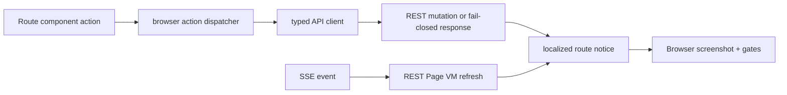
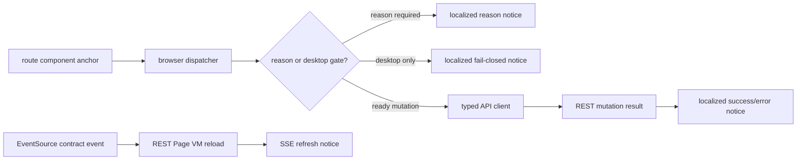

# R4.12 Web Action / Notice Locale Route UX Plan

## 1. 开工前必读

- [`r4-11-web-route-componentization-second-slice-plan-2026-06-11.md`](./r4-11-web-route-componentization-second-slice-plan-2026-06-11.md)
- [`r4-10-web-route-componentization-plan-2026-06-11.md`](./r4-10-web-route-componentization-plan-2026-06-11.md)
- [`r4-09-web-locale-page-vm-shell-metrics-2026-06-11.md`](./r4-09-web-locale-page-vm-shell-metrics-2026-06-11.md)
- [`web-app.md`](../05-clients/web-app.md)
- [`page-concepts.md`](../05-clients/page-concepts.md)
- 概念图：`web-workitem-detail.png`、`web-deliverable-change-request.png`、`web-approval-center.png`、`web-ai-first-home.png`
- 代码入口：`apps/web/src/browser.ts`、`apps/web/src/routes.ts`、`apps/web/qa/r4-web-live-route-interaction.ts`、`packages/ui/src/gold-path/route-components.ts`、`packages/ui/src/gold-path/i18n.ts`、`packages/api-client/src/client.ts`

## 2. 背景

R4.10/R4.11 已把主要 ready route 接为显式 route components，Web 主窗不再依赖全量 hidden panels。下一风险点是动作反馈仍散在 browser glue：proposal opened/merged、approval approve/reject、budget warning、retry/request access、SSE refresh、action error 等提示需要进入统一中英 locale contract，并在真实浏览器 action smoke 中证明不会丢理由、不会重复绑定、不会越框。

## 3. 目标

把 Web route action 和 notice 从临时 alert/inline 文案升级为 typed、localized、可 QA 的 route UX 层：

| Area | R4.12 目标 | 必守边界 |
|---|---|---|
| Action feedback | approval/proposal/workitem/cost/settings 关键动作都有中英成功、失败、需要理由、需要桌面客户端、重试反馈 | 不假执行未接线动作；fail-closed 并显示普通用户语言 |
| Notice contract | SSE refresh、proposal opened/merged、budget warning、permission denied、retry/request access 共用 notice model | 不把用户正文或 LLM 产物硬翻译；动态事实仍来自服务端 |
| Route action UX | route component actions 保留 `data-action-id`、`data-method`、reason gate、desktop gate，并给 browser action handler 一个稳定入口 | 不引入多套事件委托；不重复 listener |
| Browser QA | 新增 action smoke：点击 approve/request changes/merge/retry/request access/locale toggle/SSE refresh，截图和 report 证明 feedback 双语、无越框 | 不用 fixture 页面冒充真实 route dataflow |

## 4. 数据流

## 5. 实施步骤

1. 复读本计划、R4.11 竣工记录、Web PRD 与 4 张概念图，确认动作反馈仍是严肃工作界面，不进入 Cuu 主窗。
2. 梳理 `apps/web/src/browser.ts` 里现有 action/notice 文案：proposal action、option selection、locale reload、SSE refresh、error fallback、forbidden/request access。
3. 在 `packages/ui/src/gold-path/i18n.ts` 或专用 route notice copy 中增加 action feedback keys，覆盖 zh-CN/en-US。
4. 定义轻量 `RouteNoticeVM` 或等价 typed helper，字段至少包含 `kind`、`tone`、`title`、`body`、`action_id`、`source`、`locale`。
5. 统一 browser action dispatcher：读取 `data-action-id`、`data-method`、`data-requires-reason`、`data-requires-desktop`，对未接线动作输出 localized fail-closed notice。
6. Proposal/Approval action 必须保留 reason gate；request changes 没有 reason 时不能发 mutation，并显示本地化提示。
7. SSE refresh 后写入 non-blocking localized notice，但页面数据仍通过 REST Page VM 重拉，保持 REST as truth。
8. 扩展 unit tests：i18n key 覆盖、action dispatcher DOM 更新、reason gate、desktop gate、重复 listener guard。
9. 扩展 browser smoke：R4.12 专属 report/contact sheet 覆盖 zh-CN/en-US、desktop/mobile、action success/error、SSE refresh、no overflow。
10. 更新 `web-app.md`、`page-concepts.md`、roadmap、详细计划和 README，并记录后续 R4.13 计划。

## 6. QA Gate

必须全部通过：

- Unit：`pnpm --filter @workhub/web test`
- Unit：`pnpm --filter @workhub/ui test`
- Unit：`pnpm --filter @workhub/api-client test`
- Typecheck：`pnpm typecheck`
- Browser：R4.12 action/notice smoke 输出 report/contact sheet
- Product gates：
  - `r4_12_approval_response_notice=true`
  - `r4_12_reason_gate_blocks_without_reason=true`
  - `r4_12_desktop_gate_fail_closed=true`
  - `r4_12_sse_refresh_notice=true`
  - `r4_12_budget_warning_notice=true`
  - `r4_12_request_changes_success_notice=true`
  - `r4_12_merge_success_notice=true`
  - `active_only_product_panels=true`
  - `ready_routes_use_page_vm_endpoints=true`
- Regression gates：
  - `no_duplicate_route_loader_calls=true`
  - `no_main_window_cuu=true`
  - `no_default_kanban=true`
  - `no_old_preview_shell=true`
  - `no_weekly_fixture_copy=true`
  - `no_hash_navigation=true`
  - `no_horizontal_overflow=true`
  - `no_text_box_overflow=true`
  - `mobile_scroll_no_topbar_nav_overlap=true`

## 7. 验收证据目录

建议目录：

`docs/workhub/05-clients/assets/audit/2026-06-11-r4-12-web-action-notice-locale-route-ux-browser-smoke/`

至少包含：

- `action-notice-locale-route-ux-report.json`
- `smoke-summary.md`
- `contact-sheet.html`
- `contact-sheet.png`
- approval action zh-CN desktop screenshot
- proposal request-changes reason gate screenshot
- proposal merge success en-US screenshot
- SSE refresh notice screenshot
- retry/request access fail-closed screenshot
- mobile no-overflow screenshot

## 8. PRD / 概念图验收口径

- `web-approval-center.png`：动作反馈必须服务“阻塞收件箱”，用户点击后知道通过、打回、失败或需要补理由。
- `web-deliverable-change-request.png`：Proposal action 仍像变更申请，不变成技术日志；merge/request changes 必须保留证据和理由。
- `web-workitem-detail.png`：WorkItem 动作反馈围绕执行、验收、交付物和 trace，不变成聊天。
- `web-ai-first-home.png`：首页 notice 应只提示最需要处理的事件，不堆通知流。
- Web 主窗仍然严肃无 Cuu；Cuu 只在独立 pet window 消费轻提醒。

## 9. 竣工范围

R4.12 已完成 Web route action / notice 的第一层统一合同：

- `apps/web/src/browser.ts` 新增轻量 `RouteNoticeVM`，统一输出 `kind`、`tone`、`source`、`locale`、`actionId`、`eventType`、`stream` 等 DOM 可审计字段。
- Proposal review / merge、approval allow / deny、option selection、desktop-only action、unknown API action、merge conflict、SSE refresh 均走同一 notice 渲染路径。
- Approval deny 与 Proposal request changes 均先弹 reason gate；没有 reason 时不发 mutation。
- Settings 桌面恢复入口新增 `data-requires-desktop="true"`，Web 主窗 fail-closed，显示本地化 desktop notice，不跳转也不假执行。
- SSE 收到 contract event 后仍按 REST Page VM 重拉页面；notice 在新 DOM 渲染后重新写入，避免被 refresh 清掉。
- Product shell notice 样式支持 title/body 与 success/warning/danger/info tone，并纳入移动端无文本溢出 gate。

## 10. 数据流审查

审查结论：

- REST 仍是真相源；SSE 只触发 refresh 和提示。
- action handler 仍通过 `readyRouteBindings` 生命周期绑定，没有新增第二套全局 listener。
- Notice 不承载 raw API key/base URL，也不翻译用户输入、证据摘录、manifest 或 LLM 正文。
- Approval / Proposal reason gate 的请求数由 browser smoke 证明：approval respond 正好 2 次，proposal review 正好 1 次，点击 reason gate 本身不发 mutation。

## 11. PRD / 概念图复核

- `web-approval-center.png`：审批页仍是阻塞收件箱；approve / deny 后用户立刻看到中文普通语言反馈，deny 必须先给原因。
- `web-deliverable-change-request.png`：Proposal 仍像变更申请，merge/request changes 不变成技术日志；notice 只说明提交结果。
- `web-workitem-detail.png`：WorkItem detail 没有新增聊天或 Cuu 表现，action feedback 仍围绕任务/交付物上下文。
- `web-ai-first-home.png`：notice 是短暂上下文反馈，不形成通知流。
- Web 主窗继续无 Cuu 本体、无 Kanban 默认页、无 weekly fixture copy、无 hash navigation。

## 12. 验收证据

证据目录：

`docs/workhub/05-clients/assets/audit/2026-06-11-r4-12-web-action-notice-locale-route-ux-browser-smoke/`

关键文件：

- `action-notice-locale-route-ux-report.json`
- `smoke-summary.md`
- `contact-sheet.html`
- `contact-sheet.png`
- `02a-approval-deny-reason-gate-zh-desktop.png`
- `02b-approval-deny-success-zh-desktop.png`
- `02c-approval-approve-success-zh-desktop.png`
- `07-proposal-reason-gate-en-desktop.png`
- `08-proposal-request-changes-success-en-desktop.png`
- `09-proposal-merge-success-en-desktop.png`
- `10-proposal-sse-refresh-notice-en-desktop.png`
- `11-proposal-en-mobile-scrolled-notice-route-component.png`
- `12a-cost-budget-warning-notice-en-mobile.png`
- `14-settings-desktop-gate-en-desktop.png`

Browser smoke 22 步通过，核心 gates 全部为 true：

- `r4_12_approval_response_notice`
- `r4_12_reason_gate_blocks_without_reason`
- `r4_12_request_changes_success_notice`
- `r4_12_merge_success_notice`
- `r4_12_sse_refresh_notice`
- `r4_12_budget_warning_notice`
- `r4_12_desktop_gate_fail_closed`
- `r4_12_retry_access_route_states`
- `r4_12_mobile_notice_no_overflow`
- `no_duplicate_route_loader_calls`
- `no_text_box_overflow`

## 13. 验证命令

已通过：

- `pnpm --filter @workhub/web test`
- `pnpm --filter @workhub/ui test`
- `pnpm --filter @workhub/api-client test`
- `pnpm typecheck`
- `pnpm qa:r4-web-live-route-interaction` with R4.12 env
- `pnpm test`

提交前继续执行 `git diff --check`、reference 目录扫描与 secret scan。

## 14. R4.13 后续计划

R4.12 通过后进入 R4.13：Proposal advanced route UX convergence。详细计划见 [`r4-13-proposal-advanced-route-ux-convergence-plan-2026-06-11.md`](./r4-13-proposal-advanced-route-ux-convergence-plan-2026-06-11.md)。优先把 R1 已有 conflict workbench、field editor、line editor、subrecord editor 的严肃交互能力从 shared rich helper 收敛到 route component 下的 active-only proposal detail，并保留 R4.12 action feedback、mobile overflow 与 REST truth gates。
