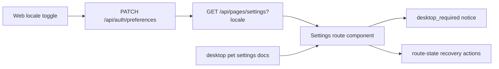

# R4.15 Settings / Locale / Device Boundary Hardening Plan

## 1. 开工前必读

- [`r4-14-option-intake-knowledge-route-componentization-plan-2026-06-11.md`](./r4-14-option-intake-knowledge-route-componentization-plan-2026-06-11.md)
- [`web-app.md`](../05-clients/web-app.md)
- [`desktop-pet-tauri.md`](../05-clients/desktop-pet-tauri.md)
- [`i18n-locale-contract-p1-1.md`](../05-clients/i18n-locale-contract-p1-1.md)
- [`i18n-user-locale-preference-p1-3.md`](../05-clients/i18n-user-locale-preference-p1-3.md)
- [`pet-settings-recovery-p1-5.md`](../05-clients/pet-settings-recovery-p1-5.md)
- 概念图：`web-operations-pages-atlas.png`、`desktop-support-pages-atlas.png`、`desktop-device-setup-update.png`

## 2. 背景

R4.10-R4.14 已把 Web ready routes、action notice、Proposal advanced、Option Intake 与 Knowledge fallback 收敛进 active-only product shell。Settings 现在已有 typed Page VM 和桌面恢复入口，但语言偏好、运行时配置状态、桌面能力门、route-state recovery 和 Web/C-PET 边界还散在多个面。R4.15 要把这些边界硬化成可审计、可截图、双语一致的 Settings / Device control slice。

## 3. 目标

| Area | R4.15 目标 | 必守边界 |
|---|---|---|
| Locale persistence | `workhub.locale`、`PATCH /api/auth/preferences`、Page VM `meta.locale` 与 Web active locale 一致 | 不把用户/证据/LLM 原文硬翻译 |
| Settings route | Settings route component 展示 runtime、LLM configured status、language、device boundary、recovery action 的真实状态 | 不泄露 API key、base URL、token 或本地路径 |
| Device boundary | Web 中所有 desktop-only actions 都走 `desktop_required` / recovery notice，明确“浏览器不能执行本地能力” | 不在 Web 主窗执行接活、同步、托盘、通知恢复等本地动作 |
| Route recovery | forbidden/error/desktop-required/retry/request-access 文案和 action href 统一 | 不假装权限恢复成功 |
| QA | Browser smoke 覆盖 settings zh/en、locale reload、desktop gate、route-state recovery、mobile no-overflow、secret scan | 不降低 R4.10-R4.14 regression gates |

## 4. 数据流

## 5. 实施步骤

1. 复读本计划、R4.14 竣工记录、Web/desktop/i18n/settings 文档与三张概念图。
2. 审查 `SettingsPageVM` 是否覆盖 locale preference、supported locales、runtime health、LLM configured status、device boundary 与 recovery href。
3. 扩展 Settings route component 的 marker：locale source、preference sync state、desktop capability gate、secret-safe config status。
4. 扩展 browser dispatcher：desktop-only action、locale persistence failure、settings restore/retry 均走统一 notice；失败不发本地动作。
5. 扩展 API/client tests：Settings Page VM 不能返回 secret-like fields；locale preference patch 后 Page VM locale 一致。
6. 扩展 `qa:r4-web-live-route-interaction`：Settings zh/en、locale toggle after settings reload、desktop gate mobile/desktop、forbidden/request access、unknown retry、no overflow。
7. 更新 `web-app.md`、`page-concepts.md`、roadmap、详细计划、README，并制定 R4.16 后续计划。

## 6. QA Gate

必须全部通过：

- `pnpm --filter @workhub/ui test`
- `pnpm --filter @workhub/web test`
- `pnpm --filter @workhub/api-client test`
- `pnpm typecheck`
- `pnpm qa:r4-web-live-route-interaction` with R4.15 env
- `pnpm test`
- `git diff --check`
- no `reference` or `references` directories, and no secret scan matches

建议新增 browser gates：

- `r4_15_settings_locale_persistence=true`
- `r4_15_settings_secret_safe=true`
- `r4_15_desktop_boundary_gate=true`
- `r4_15_route_recovery_actions=true`
- `r4_15_settings_mobile_no_overflow=true`
- `r4_14_intake_knowledge_regression=true`

## 7. PRD / 概念图验收口径

- `web-operations-pages-atlas.png`：Settings 是严肃管理页的一部分，不做营销页、不做装饰页。
- `desktop-support-pages-atlas.png`：桌面支持能力属于 C-PET / Rust shell，Web 只显示状态和恢复入口。
- `desktop-device-setup-update.png`：Web 主窗不能承载 Cuu 外观配置；桌宠形象和本地能力继续留在独立桌宠/桌面客户端边界内。

## 8. 完成记录

### 8.1 实现清单

| Area | 已落实现 | 验收点 |
|---|---|---|
| Settings Page VM | `SettingsPageVM` 扩展 `runtime.runtime_status`、`llm_runtime.secret_safe`、`language.preference_*`、`device.restore_requires_desktop`、`web_local_actions_enabled=false` | Settings route 可审计 runtime、locale preference sync、secret-safe 与桌面能力边界 |
| API dataflow | `/api/pages/settings` 从当前用户偏好注入 server preference，`buildSettingsPage()` 区分 request/server/fallback source | Page VM active locale、server preference 与 sync state 可对齐 |
| Route component | Settings component 增加 runtime、locale、preference source、sync、secret-safe、desktop gate、restore boundary markers | Browser smoke 可直接读取 `data-r4-settings-*` markers |
| Locale persistence | Web locale toggle 对 `PATCH /api/auth/preferences` 失败执行 fail-closed：恢复旧 locale/localStorage/html lang 并显示双语 notice | 不假装保存成功，失败后页面保持旧语言 |
| Surface catalog | Web / desktop webview surface catalog 显式包含 auth preference 与 settings page API，仍不暴露 desktop-local 能力给 Web | R4.15 boundary gate 防止 Web 执行本地能力 |

### 8.2 QA / 验证

- `pnpm --filter @workhub/ui test`：48/48 通过。
- `pnpm --filter @workhub/web test`：17/17 通过。
- `pnpm --filter @workhub/api test -- gold-path pages-i18n`：105/105 通过。
- `pnpm --filter @workhub/desktop-webview test`：84/84 通过。
- `pnpm typecheck` 通过。
- `pnpm qa:r4-web-live-route-interaction` with R4.15 env 通过，生成 `../05-clients/assets/audit/2026-06-11-r4-15-settings-locale-device-boundary-browser-smoke/`，38 步截图与 report 均通过。

R4.15 gates 全部为 true：`r4_15_settings_locale_persistence`、`r4_15_settings_secret_safe`、`r4_15_desktop_boundary_gate`、`r4_15_route_recovery_actions`、`r4_15_settings_mobile_no_overflow`、`r4_14_intake_knowledge_regression`。

### 8.3 Bug / 数据流审查

- 初版 locale toggle 会吞掉 `PATCH /api/auth/preferences` 失败并继续切语言；已改为 fail-closed notice，恢复旧 locale 与 DOM lang。
- Settings route 初版缺少可机器审计 marker；已补 `data-r4-settings-*`，QA 不再靠肉眼猜状态。
- Surface catalog 初版遗漏 settings/auth preference endpoints；已补 Web 与 desktop-webview 目录测试，后续仍需在 R4.16 检查 Tauri allowlist 漂移风险。
- Secret scan 口径升级为长 key / DeepSeek host 可见文本扫描；Settings Page VM 只返回 configured/secret-safe，不返回 base URL、API key、token 或本地路径。

### 8.4 PRD / 概念图复核

- `web-operations-pages-atlas.png`：Settings 作为严肃管理页呈现 runtime、language、device boundary 和 recovery action，没有营销页化。
- `desktop-support-pages-atlas.png`：Web 只显示桌面客户端能力状态与恢复入口；本地接活、同步、托盘、通知恢复仍属于 C-PET / Rust shell。
- `desktop-device-setup-update.png`：该图中的旧橘猫仅保留为设备/setup 信息架构参考，不作为当前视觉真相；R4.15 Web/desktop 主窗仍无 Cuu 本体、无模型预览。
- 双语：locale persistence failure notice、Settings fixed copy 与 mobile/desktop screenshots 均覆盖 en-US；zh-CN 词表同步补齐。用户输入、证据和 LLM 正文继续保持来源原文。

## 9. 后续候选

R4.15 已通过，且 R4.16 已完成 [`r4-16-react-route-tree-hydration-boundary-plan-2026-06-11.md`](./r4-16-react-route-tree-hydration-boundary-plan-2026-06-11.md)：React route tree / route component hydration boundary 已落到 active-only shell 与 browser QA gates。后续进入 [`r4-17-react-route-component-first-migration-plan-2026-06-11.md`](./r4-17-react-route-component-first-migration-plan-2026-06-11.md)：在保持 typed Page VM、REST-as-truth、path navigation、locale reload 与 no-overflow gates 的前提下，迁移首个真实 React-compatible route component。
