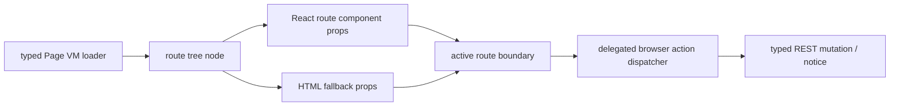

# R4.17 React Route Component First Migration Plan

## 1. 开工前必读

- [`r4-16-react-route-tree-hydration-boundary-plan-2026-06-11.md`](./r4-16-react-route-tree-hydration-boundary-plan-2026-06-11.md)
- [`r4-15-settings-locale-device-boundary-hardening-plan-2026-06-11.md`](./r4-15-settings-locale-device-boundary-hardening-plan-2026-06-11.md)
- [`web-app.md`](../05-clients/web-app.md)
- [`page-concepts.md`](../05-clients/page-concepts.md)
- 代码入口：`packages/ui/src/gold-path/route-components.ts`、`packages/ui/src/gold-path/product-shell.ts`、`apps/web/src/routes.ts`、`apps/web/src/browser.ts`
- 概念/证据：`web-operations-pages-atlas.png`、R4.16 route adapter hydration boundary contact sheet

## 2. 背景

R4.16 已建立 route tree / hydration boundary marker：每个 active route component 都有稳定 `data-r4-hydration-*` 元数据，Web ready root 暴露 route-tree Page VM truth，browser smoke 证明 active-only、action dispatcher parity、Settings locale/device regression 均未退。R4.17 才开始把低风险 route 的 HTML helper 迁移为真实 React-compatible component source，但仍必须保留 HTML fallback 和同一 Page VM truth。

## 3. 目标

| Area | R4.17 目标 | 必守边界 |
|---|---|---|
| First migration | 选择 Home / Approvals / Settings 中 1-2 个低风险 route 做真实 React component 或 React-compatible component module | 不一次性迁移 Proposal advanced / Intake / Knowledge 等高交互复杂 route |
| Fallback | HTML fallback 仍可用，hydration/React 失败不能出现 blank page | 不删除 R4.16 `data-r4-hydration-*` markers |
| Actions | 继续使用现有 delegated action dispatcher 与 `data-action-id/method/requires-reason/requires-desktop/request-json` contract | 不新增第二套按钮事件系统 |
| Locale | React component props 从 typed Page VM 与 normalized locale 取得，不从 DOM 猜测 | 不硬翻译用户/证据/LLM 原文 |
| QA | Browser smoke 对比 React route component 与 HTML fallback markers、Page VM values、mobile no-overflow | 不降低 R4.10-R4.16 regression gates |

## 4. 数据流

## 5. 实施步骤

1. 复读本计划、R4.16 竣工记录、Web PRD、page concepts 和 hydration boundary 代码。
2. 选择首批迁移 route：优先 Home / Settings；避开 Proposal advanced、Intake、Knowledge，避免高交互与 payload materializer 牵连。
3. 定义 component props：必须以 typed Page VM、locale、route key、primary action hrefs 为输入，不从 DOM 文本反推。
4. 建立 React-compatible render module 或 component adapter，并保留 HTML fallback 与现有 `data-r4-route-component` markers。
5. 确认 browser delegated action dispatcher 仍只绑定一次；React component 不自行发 mutation。
6. 扩展 unit tests：React props parity、HTML fallback parity、action contract parity、Settings secret/device boundary。
7. 扩展 browser smoke：React route active marker、fallback marker、locale toggle、Settings device gate、mobile no-overflow、no duplicate listener。
8. 更新 `web-app.md`、`page-concepts.md`、roadmap、详细计划、README，并制定 R4.18 后续计划。

## 6. QA Gate

必须全部通过：

- `pnpm --filter @workhub/ui test`
- `pnpm --filter @workhub/web test`
- `pnpm --filter @workhub/api-client test`
- `pnpm typecheck`
- `pnpm qa:r4-web-live-route-interaction` with R4.17 env
- `pnpm test`
- `git diff --check`
- no `reference` or `references` directories, and no secret scan matches

建议新增 browser gates：

- `r4_17_react_component_marker=true`
- `r4_17_html_fallback_parity=true`
- `r4_17_action_dispatcher_single_path=true`
- `r4_17_settings_boundary_regression=true`
- `r4_16_hydration_boundary_regression=true`

## 7. PRD / 概念图验收口径

- 迁移后的页面仍对齐 `web-operations-pages-atlas.png` 的严肃工作台，不改变视觉方向。
- R4.16 contact sheet 中的 active-only、Settings boundary 和 mobile no-overflow 是回归基线。
- React migration 只是实现层推进；PRD 的 REST truth、审批/派活边界、Cuu 独立窗口边界不变。

## 8. 完成记录

### 8.1 实现清单

| Area | 已落实现 | 验收点 |
|---|---|---|
| First migration | 新增 `route-react-components.ts`，Home / Settings 进入 React-compatible component adapter | adapter props 只来自 typed Page VM、locale、route key 和 action href，不从 DOM 文案反推 |
| HTML fallback | Home / Settings 继续走现有 HTML fallback，但 section/root 均暴露 `data-r4-react-component-*` 与 `data-r4-hydration-react-component-*` | 不引入 React runtime，不调用 `hydrateRoot()`，失败时不会 blank page |
| Route tree | `webReactRouteTree` 为 Home / Settings 标出 component name、adapter、typed-page-vm source 与 fallback state | ready root、hydration root、route section 三层 marker 一致 |
| QA gates | Browser smoke 新增 R4.17 component marker、HTML fallback parity、single action path、Settings boundary、R4.16 hydration regression gates | 38 步 R4 live browser smoke 全部通过，未降低 R4.10-R4.16 regression |

### 8.2 QA / 验证

- `pnpm --filter @workhub/ui test`：50/50 通过。
- `pnpm --filter @workhub/web test`：19/19 通过。
- `pnpm typecheck` 通过。
- `pnpm qa:r4-web-live-route-interaction` with R4.17 env 通过，生成 `../05-clients/assets/audit/2026-06-11-r4-17-react-route-component-first-migration-browser-smoke/`，38 步截图与 report 均通过。

R4.17 gates 全部为 true：`r4_17_react_component_marker`、`r4_17_html_fallback_parity`、`r4_17_action_dispatcher_single_path`、`r4_17_settings_boundary_regression`、`r4_16_hydration_boundary_regression`。

### 8.3 Bug / 数据流审查

- 本轮没有新增 React runtime dependency，也没有新增第二套 mutation/event handler；动作仍走 existing delegated browser dispatcher。
- Home / Settings adapter props 由 typed Page VM 生成；`primaryHrefs` 与 hydration action count、route section action count 在 unit 和 browser gates 中保持一致。
- Settings 继续只显示 secret-safe/configured boolean、desktop boundary 和 recovery entry；不泄露 API key、base URL、token、本地路径或 Cuu 外观设置。
- Active-only 继续成立：browser report 证明每个 ready route 只有一个 product panel 和一个 hydration panel。

### 8.4 PRD / 概念图复核

- `web-operations-pages-atlas.png`：R4.17 不改变视觉方向，Home 仍是 AI-first 工作台，Settings 仍是严肃管理页。
- R4.16 contact sheet：active-only、Settings boundary、mobile no-overflow 均作为 R4.17 regression 继续通过。
- `page-concepts.md`：Cuu 仍只在独立 pet window；Web 主窗无 Cuu、无默认 Kanban、无 hash route、无 weekly demo、无 secret-like 文本。

## 9. 后续候选

R4.17 已通过，后续进入 [`r4-18-react-route-migration-expansion-plan-2026-06-11.md`](./r4-18-react-route-migration-expansion-plan-2026-06-11.md)：扩大 React-compatible route component 迁移范围，优先把 Cost / Replay 等中等复杂度 route 接入同一 component adapter，再评估 Proposal advanced 的拆分迁移。
