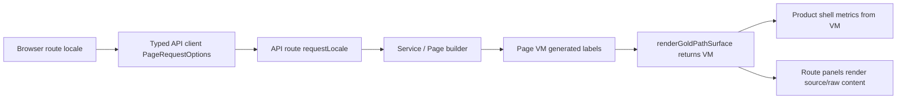

# R4.9 Web Locale Page VM + Shell Metrics Consistency

## 1. 开工阅读

本轮开工前已复读：

- [`review-driven-r0-r4-detailed-construction-plan-2026-06-08.md`](./review-driven-r0-r4-detailed-construction-plan-2026-06-08.md) 的 R4 段落与提交纪律。
- [`../05-clients/web-app.md`](../05-clients/web-app.md)。
- [`../05-clients/page-concepts.md`](../05-clients/page-concepts.md)。
- [`r4-08-redis-sse-production-browser-smoke-2026-06-11.md`](./r4-08-redis-sse-production-browser-smoke-2026-06-11.md)。
- 概念图：`web-ai-first-home.png`、`web-approval-center.png`、`web-workitem-detail.png`、`web-deliverable-change-request.png`。

只读子 agent 结论：

- i18n/dataflow 审查指出 Home/Approvals/WorkItem 原本只回显 `meta.locale`，但 builder/service 未真正按 locale 输出系统生成标签；Cost 的自定义 `scopeLabel` 也有被默认标签覆盖的风险。
- UI/PRD 审查指出 product shell 仍存在 hash fallback 路径，且顶部 metrics 依赖 DOM 文本探针，容易与 Page VM 正文真实数据脱节。

## 2. 本轮范围

R4.9 是 Page VM 动态双语与 shell 指标一致性，不是完整 React component route tree，也不把用户输入、证据摘录、LLM 正文或 daemon 原文做客户端硬翻译。

已落范围：

1. **Page VM 系统生成标签按 locale 输出**
   - `apps/api/src/pages/i18n.ts` 新增 Page VM 服务端词表。
   - `attention`、`cost`、`proposals`、`replay`、`gold-path` builder 只本地化系统生成的固定标签、动作、fallback 摘要、预算提示与 handoff 前缀。
   - raw title、proposal manifest、evidence excerpt、user text、LLM content 保持源文本。
2. **Approvals / WorkItems / Sessions / Knowledge locale 贯穿**
   - `approval-routing` 支持 `locale`，审批动作变为 `Approve` / `Request changes` / `Delegate`。
   - sessions、workitems、knowledge routes 读取 `?locale=` / `Accept-Language` 并回 `meta.locale`。
   - work item 问题、默认选项、acceptance checklist、knowledge fallback actions 的系统生成文本按 locale 输出。
3. **Replay / Cost / Proposal API client 补齐 locale**
   - `packages/api-client` 的 `replayAgentRun()` 接 `PageRequestOptions`。
   - Web replay loader 会带当前 locale 请求真实 API。
4. **Product shell metrics 以 VM 为真相源**
   - `renderGoldPathSurface()` 返回 `vm`，product shell 的 route metrics 从 `rendered.vm.page_vms` 取数。
   - Replay metric 使用 `steps` / `merge_timeline` / `snapshots`，Cost metric 使用 token 与 CNY total，避免顶部指标与正文不一致。
   - `.wh-metric strong/span` 增加换行约束，继续阻塞用户截图中的文本越框风险。
5. **Path route 收口**
   - product shell / app shell 默认只输出 path href，不再回退 `#/`。
   - Web route helper 能把旧 `/#/...` 迁移为 path route，但保留普通锚点如 `#top`。

## 3. 当前验收状态

本机已通过：

```powershell
node node_modules\typescript\bin\tsc -p apps\api\tsconfig.json --noEmit
node node_modules\typescript\bin\tsc -p apps\web\tsconfig.json --noEmit
node node_modules\typescript\bin\tsc -p packages\ui\tsconfig.json --noEmit
node node_modules\typescript\bin\tsc -p packages\api-client\tsconfig.json --noEmit
node node_modules\typescript\bin\tsc -p packages\permissions\tsconfig.json --noEmit
node node_modules\typescript\bin\tsc --noEmit --module NodeNext --moduleResolution NodeNext --target ES2022 --types node --skipLibCheck apps\web\qa\r4-web-locale-metrics-browser-smoke.ts
node --import tsx --test apps\api\src\pages-i18n.test.ts apps\api\src\gold-path.test.ts apps\api\src\agent-runs.test.ts
node --import tsx --test packages\ui\src\gold-path\product-shell.test.ts packages\ui\src\gold-path\render.test.ts packages\api-client\src\api-client.test.ts apps\web\src\routes.test.ts apps\web\src\main.test.ts
```

远端 Linux 验收：

- 测试机：Ubuntu 26.04，Node 22.22.1，pnpm 11.0.9，PostgreSQL 18.4，Redis 8.0.5，Chrome `/usr/bin/google-chrome`。
- 远端通过：typecheck、unit tests、`pnpm qa:r4-web-locale-metrics-browser-smoke`。
- report 输出：

```json
{
  "ok": true,
  "steps": 4,
  "broker_backend": "redis",
  "replay_locale_request": true,
  "replay_metric_matches_vm": true,
  "cost_metric_matches_vm": true,
  "no_text_box_overflow": true
}
```

R4.9 report gates 全部为 true：

- `pg_seed_applied`
- `proposal_locale_meta_en`
- `proposal_actions_english`
- `replay_locale_meta_en`
- `replay_handoff_english`
- `replay_cost_scope_english`
- `cost_locale_meta_en`
- `cost_scope_labels_english`
- `browser_replay_requested_locale`
- `replay_metric_matches_vm`
- `cost_metric_matches_vm`
- `all_screenshots_captured`
- `no_horizontal_overflow`
- `no_text_box_overflow`
- `no_main_window_cuu`
- `no_default_kanban`
- `no_hash_navigation`

证据目录：

- `../05-clients/assets/audit/2026-06-11-r4-web-locale-metrics-browser-smoke/01-workitem-zh-desktop-locale-metrics.png`
- `../05-clients/assets/audit/2026-06-11-r4-web-locale-metrics-browser-smoke/02-proposal-en-desktop-locale-actions.png`
- `../05-clients/assets/audit/2026-06-11-r4-web-locale-metrics-browser-smoke/03-replay-en-desktop-vm-metrics.png`
- `../05-clients/assets/audit/2026-06-11-r4-web-locale-metrics-browser-smoke/04-cost-en-mobile-vm-metrics.png`
- `../05-clients/assets/audit/2026-06-11-r4-web-locale-metrics-browser-smoke/contact-sheet.png`
- `../05-clients/assets/audit/2026-06-11-r4-web-locale-metrics-browser-smoke/locale-metrics-browser-report.json`

## 4. PRD / 概念图一致性审查

符合：

- Web 主窗仍是严肃工作台，不出现 Cuu 本体、默认 Kanban 或旧周报/Cuu fixture。
- Locale 从浏览器 route -> typed API client -> API route -> service/builder -> Page VM -> product shell 贯穿；API envelope 继续回 `meta.locale`。
- 英文模式下 proposal action、replay handoff、cost scope labels、Page VM generated labels 不再只靠 chrome 本地化。
- Product shell 顶部 metrics 由 Page VM 结构字段驱动，Replay/Cost 指标与正文内容一致。
- 移动端 cost 截图、desktop workitem/proposal/replay 截图均通过横向溢出与文本盒溢出 gate。

不能宣称：

- 不能宣称完整 React component route tree 已完成；ready route 仍复用 shared renderer。
- 不能宣称所有动态业务内容都已双语；用户文本、证据摘录、proposal manifest、LLM 产物正文仍按源文本显示。
- 不能宣称所有生产动作/notification toast 都已接 locale；本轮聚焦 Page VM ready surface 与 shell metrics。

## 5. Bug / Dataflow 审查

- 修复 i18n 漏传：gold path、approval、workitem/session/knowledge、proposal、replay、cost builder 均接收 locale，不再只回 `meta.locale`。
- 修复 Cost 数据流：只替换系统默认 user/team day scope label，保留真实自定义 `scopeLabel`，避免把 "Marketing Team" 之类源数据覆盖掉。
- 修复 Replay 英文 handoff 拼接：英文使用 `; `，中文使用 `；`，只本地化前缀，不改 handoff item 原文。
- 修复 shell metrics 真相源：从 DOM needle count 改为 Page VM 结构取数，避免正文变化后顶部仍显示旧数。
- 修复导航边界：product shell 不再生成 `href="#/..."`；旧 hash route 只作为迁移输入，不作为新输出。

当前数据流：



## 6. 后续详细计划

R4.10 施工顺序建议：

1. **Web route componentization first slice**
   - 优先 Home / Approvals / Replay，从 shared HTML renderer 拆成真实 route component 或更细粒度 shared component。
   - 保留 Page VM 合同、REST-as-truth、SSE refresh、path navigation、locale reload。
2. **Action / notice locale continuation**
   - 将 proposal opened/merged、budget warning、approval response toast、retry/request-access action 的固定文案纳入同一 locale contract。
   - 仍保持 raw error code、resource id、proposal manifest 与用户正文原样可审计。
3. **R4.10 browser QA gate**
   - 继续复用远端 Linux PG + Redis + Chrome。
   - 必须保留：no Cuu、no Kanban、no weekly、no hash、no horizontal overflow、no text box overflow、ready/empty/forbidden/error、locale reload、topic auth、Redis/SSE reconcile。
   - 新增 component route DOM gate：确认 Home/Approvals/Replay 不再只依赖完整 gold-path HTML template。
