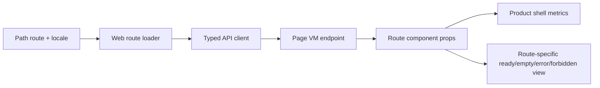

# R4.10 Web Route Componentization Plan

## 1. 开工前阅读

R4.10 每个子模块开工前必须复读：

- [`r4-09-web-locale-page-vm-shell-metrics-2026-06-11.md`](./r4-09-web-locale-page-vm-shell-metrics-2026-06-11.md)
- [`web-app.md`](../05-clients/web-app.md)
- [`page-concepts.md`](../05-clients/page-concepts.md)
- 概念图：`web-ai-first-home.png`、`web-approval-center.png`、`web-workitem-detail.png`、`web-deliverable-change-request.png`
- 相关 route/test 文件当前实现，不用记忆里的 R4.9 状态替代真实代码审查

## 2. 目标

把 R4.9 仍依赖 shared HTML renderer 的高频 ready route，推进到真实 route component 或更细粒度 shared component。第一刀优先 Home / Approvals / Replay，不改变 Page VM 合同、不绕开 REST-as-truth、不引入主窗 Cuu。

## 3. 范围

| Route | R4.10 第一刀目标 | 必守边界 |
|---|---|---|
| Home | 拆出 Home ready component，保留 Page VM summary/metrics/data source | 不回到 marketing hero，不出现 Cuu、Kanban、weekly fixture |
| Approvals | 拆出审批列表/空态/forbidden/error component，动作文案继续走 locale contract | 不提交真实审批动作，QA 只验证 UI/dataflow |
| Replay | 拆出 replay timeline/merge decision/cost scope component，metrics 仍来自 Page VM | 不硬翻译 raw manifest、用户正文、evidence excerpt |

## 4. 数据流

## 5. QA Gate

R4.10 完成时必须通过：

- Typecheck：`apps/web`、`packages/ui`、`packages/api-client`、受影响 API 包。
- Unit tests：route loader、component render、locale/action labels、Page VM props。
- Browser QA：复用远端 Linux PG + Redis + Chrome 或本机等价 smoke。
- Visual gates：desktop/mobile、zh-CN/en-US、ready/empty/forbidden/error。
- Regression gates：`no_main_window_cuu`、`no_default_kanban`、`no_weekly_fixture_copy`、`no_hash_navigation`、`no_horizontal_overflow`、`no_text_box_overflow`。
- Data gates：route component 不直接构造业务假数据；ready view 的关键数值仍来自 Page VM。

## 6. 施工顺序

1. 审查 `apps/web/src/routes*`、`packages/ui/src/gold-path/*`、R4.9 QA report，找出 shared renderer 的真实耦合点。
2. 先拆 Home route ready component，补 unit + browser screenshot gate。
3. 再拆 Approvals route component，覆盖 list/empty/forbidden/error 与中英动作文案。
4. 最后拆 Replay route component，确保 timeline/merge/cost metrics 与 Page VM 一致。
5. 更新 QA report、截图归档、PRD/概念图一致性审查、bug/dataflow 审查。

## 7. 验收后的下一步

R4.10 通过后进入 R4.11：Proposal / WorkItem / Cost / Settings route componentization，继续扩大真实产品主窗视觉矩阵与动态双语范围。
