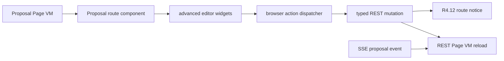

# R4.13 Proposal Advanced Route UX Convergence Plan

## 1. 开工前必读

- [`r4-12-web-action-notice-locale-route-ux-plan-2026-06-11.md`](./r4-12-web-action-notice-locale-route-ux-plan-2026-06-11.md)
- [`r4-11-web-route-componentization-second-slice-plan-2026-06-11.md`](./r4-11-web-route-componentization-second-slice-plan-2026-06-11.md)
- [`web-app.md`](../05-clients/web-app.md)
- [`page-concepts.md`](../05-clients/page-concepts.md)
- 概念图：`web-deliverable-change-request.png`、`web-workitem-detail.png`、`web-approval-center.png`
- 代码入口：`packages/ui/src/gold-path/route-components.ts`、`packages/ui/src/proposal/render.ts`、`packages/ui/src/route-line-editor.ts`、`packages/ui/src/overlap-hunk-review.ts`、`packages/ui/src/subrecord-item-diff.ts`、`apps/web/src/browser.ts`、`apps/web/qa/r4-web-live-route-interaction.ts`

## 2. 背景

R4.10/R4.11 已把 Proposal 接为显式 route component，R4.12 已把 action / notice / reason gate / desktop gate 统一到本地化反馈合同。下一风险点是 Proposal 详情里的高级交互仍主要来自 shared rich helpers：conflict workbench、field editor、line editor、subrecord editor、candidate apply 等能力还没有完全收敛到 active-only Proposal route UX，也没有在 live browser smoke 中按真实 action path 做完整截图验收。

## 3. 目标

| Area | R4.13 目标 | 必守边界 |
|---|---|---|
| Conflict workbench | Proposal route component 能展示并操作冲突候选、逐项选择、批量折叠审查 | 不把页面变成 IDE，不暴露 Git 黑话给普通用户 |
| Structured editors | Field editor / line editor / subrecord diff 在 Proposal route 下保持可发现、可折叠、可审计 | 不创建隐藏全页 panels；仍为 active-only route component |
| Action feedback | Candidate apply、line/field/subrecord apply 复用 R4.12 notice contract | 未接线动作 fail-closed，不假成功 |
| Mobile QA | Proposal advanced route 在 mobile scroll 下不横向溢出，notice 不遮挡关键按钮 | 不靠缩小字号硬塞内容 |
| Data truth | 所有高级操作仍以 REST mutation + Page VM refresh 为真相 | SSE 只提示 refresh，不作为唯一数据源 |

## 4. 数据流

## 5. 实施步骤

1. 复读本计划、R4.12 竣工记录、Web PRD 与 Proposal / WorkItem / Approval 概念图。
2. 审查 `packages/ui/src/proposal/render.ts` 已有高级 helper，列出现已支持的 conflict cards、bulk review、field editor、line editor、subrecord editor 与 action href。
3. 审查 `packages/ui/src/gold-path/route-components.ts` Proposal route component 与 shared proposal renderer 的差异，确定哪些高级块应直接迁入 route component，哪些继续复用 helper。
4. 给 Proposal route component 增加高级交互 section marker：`data-r4-proposal-conflicts`、`data-r4-proposal-field-editor`、`data-r4-proposal-line-editor`、`data-r4-proposal-subrecord-editor`。
5. 扩展 browser dispatcher 覆盖 button-style `data-action-href` / `data-request-json` 的安全分支，复用 R4.12 notice。
6. 对已接线 API 的 candidate apply / merge proposal apply 使用 typed API client；未接线 editor apply fail-closed，并保留请求 payload 在 DOM 中可审计。
7. 扩展 unit tests：route component marker、editor folded state、request JSON、action attrs、no Cuu/no Kanban/no secret。
8. 扩展 R4 live browser smoke：Proposal advanced desktop/mobile、candidate apply success、editor fail-closed、SSE refresh、no overflow、no duplicate route loader calls。
9. 更新 `web-app.md`、`page-concepts.md`、roadmap、详细计划、README，并制定 R4.14 后续计划。

## 6. QA Gate

必须全部通过：

- `pnpm --filter @workhub/ui test`
- `pnpm --filter @workhub/web test`
- `pnpm typecheck`
- `pnpm qa:r4-web-live-route-interaction` with R4.13 env
- `pnpm test`
- `git diff --check`
- no `reference` or `references` directories, and no secret scan matches

Browser gates 建议新增：

- `r4_13_proposal_advanced_route_sections=true`
- `r4_13_conflict_candidate_apply_notice=true`
- `r4_13_editor_fail_closed_notice=true`
- `r4_13_advanced_mobile_no_overflow=true`
- `r4_12_action_notice_regression=true`
- `r4_11_route_component_source_truth=true`
- `active_only_product_panels=true`
- `no_duplicate_route_loader_calls=true`

## 7. PRD / 概念图验收口径

- `web-deliverable-change-request.png`：Proposal 仍是变更申请，展示对象变化、证据、回滚和可选解决路径；高级编辑器必须折叠、有边界。
- `web-workitem-detail.png`：高级 Proposal 操作不能把 WorkItem 详情挤成工作台；WorkItem 只保留执行、验收、交付物、trace 的入口。
- `web-approval-center.png`：Approval 仍是阻塞收件箱；高级 Proposal 操作的结果通过 notice 回到用户，而不是制造第二个审批流。

## 8. 竣工记录（2026-06-11）

本轮已完成 R4.13 Proposal advanced route UX convergence：

1. 已复读 R4.12 竣工记录、本文、`web-app.md`、`page-concepts.md` 与 `web-deliverable-change-request.png` / `web-workitem-detail.png` / `web-approval-center.png`。结论是高级编辑必须服务“变更申请审核”，不能变成 IDE、WorkItem 工作台或第二套审批中心。
2. 已审查并复用 `packages/ui/src/proposal/render.ts`、`route-line-editor.ts`、`overlap-hunk-review.ts`、`subrecord-item-diff.ts` 现有 helper，不重造高级冲突 UI。
3. 已改 `packages/ui/src/gold-path/route-components.ts`：Proposal route component 从 route surface 读取 `proposal_conflicts` / `conflicts`，渲染 conflict workbench、line editor、field editor、subrecord editor，并暴露 `data-r4-proposal-conflicts`、`data-r4-proposal-line-editor`、`data-r4-proposal-field-editor`、`data-r4-proposal-subrecord-editor`。
4. 已改 `apps/web/src/routes.ts`：`/proposals/:id` 先读 Proposal Page VM，再读 `/api/workitems/:id/conflicts`，按 `proposal_id` 过滤后注入 active-only route surface；`ProposalDetailVM` 合同不被冲突缓存污染。
5. 已改 `apps/web/src/browser.ts`：action dispatcher 从仅支持 anchor 扩到 `a[href]`、`[data-action-href]`、`[data-href]`；`data-request-json-template` 可材料化为 typed API payload；自定义字段空值 fail-closed，显示本地化 `field_value_required` notice，不发 mutation。
6. 已改 `packages/ui/src/gold-path/i18n.ts`：新增自定义字段空值中英 notice；动态 proposal 正文仍保持 Page VM 原文。
7. 已改 `apps/web/qa/r4-web-live-route-interaction.ts`：R4.13 mock surface 带两个高级冲突，浏览器 smoke 覆盖 line editor apply、task plan apply、subrecord apply、custom field 空值 fail-closed、custom field 成功、SSE refresh、mobile no-overflow 与 no duplicate loader。

验收证据：

- Browser smoke 目录：`../05-clients/assets/audit/2026-06-11-r4-13-proposal-advanced-route-ux-browser-smoke/`
- Contact sheet：`../05-clients/assets/audit/2026-06-11-r4-13-proposal-advanced-route-ux-browser-smoke/contact-sheet.png`
- Report：`../05-clients/assets/audit/2026-06-11-r4-13-proposal-advanced-route-ux-browser-smoke/proposal-advanced-route-ux-report.json`
- 关键截图：`06a-proposal-advanced-review-en-desktop.png`、`06e-proposal-custom-field-empty-fail-closed-en-desktop.png`、`06f-proposal-custom-field-apply-success-en-desktop.png`、`06g-proposal-structured-field-editor-visual-en-desktop.png`、`11-proposal-en-mobile-scrolled-notice-route-component.png`

本轮 browser gates 全部为 true：

- `r4_13_proposal_advanced_route_dom`
- `r4_13_proposal_advanced_route_sections`
- `r4_13_advanced_apply_payloads`
- `r4_13_custom_field_fail_closed`
- `r4_13_conflict_api_source_truth`
- `r4_13_structured_editor_visual_no_overflow`
- R4.10/R4.11/R4.12 regression gates、`active_only_product_panels`、`no_duplicate_route_loader_calls`、`no_horizontal_overflow`、`no_text_box_overflow`

请求计数审查：

- `proposal=2`、`proposalConflicts=2`，对应初始 route load 与 SSE refresh 后 REST reconcile。
- `mergeApply=4`，分别对应 `text_hunk_overrides`、`task_plan_scope`、`structured_item_overrides`、`structured_field_overrides`。
- 空自定义字段只产生 `field_value_required` client notice，未增加 `mergeApply`。

## 9. PRD / 概念图回看

- `web-deliverable-change-request.png`：通过。Proposal 首屏仍是摘要、风险、回滚、文件变化和 review action；高级冲突区在下方有边界、可折叠，可见但不抢主叙事。
- `web-workitem-detail.png`：通过。高级 editor 没有进入 WorkItem route；WorkItem 仍聚焦状态、验收、trace、交付物入口。
- `web-approval-center.png`：通过。Approval 仍是阻塞收件箱；Proposal 高级操作结果只通过 notice 回到用户，没有创造第二套审批流。
- 双语：通过。固定 action/notice/editor 文案为 zh-CN/en-US；用户/AI 生成的动态内容保持 VM 原文。
- 数据流：通过。REST mutation + Page VM refresh 为真相；SSE 只触发 refresh notice 和 REST reconcile。

边界：

- R4.13 不等于完整 React SPA route tree。
- R4.13 不改真实 API 合并语义；它把现有 candidate apply / merge payload 以 Web route UX 产品化并验收。
- R4.13 不把未接线动作显示为成功；空值与桌面能力仍 fail-closed。

## 10. 后续候选

R4.13 通过后进入 R4.14：Option Intake / Knowledge fallback route componentization。目标是把 option-first intake、knowledge search fallback 和 workitem creation 串成真实 route dataflow，同时保留 R4.12/R4.13 的 action feedback 与 no-overflow gates。详细计划见 [`r4-14-option-intake-knowledge-route-componentization-plan-2026-06-11.md`](./r4-14-option-intake-knowledge-route-componentization-plan-2026-06-11.md)。
