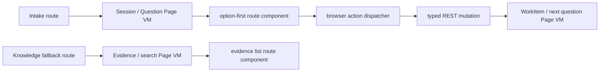

# R4.14 Option Intake / Knowledge Route Componentization Plan

## 1. 开工前必读

- [`r4-13-proposal-advanced-route-ux-convergence-plan-2026-06-11.md`](./r4-13-proposal-advanced-route-ux-convergence-plan-2026-06-11.md)
- [`r4-12-web-action-notice-locale-route-ux-plan-2026-06-11.md`](./r4-12-web-action-notice-locale-route-ux-plan-2026-06-11.md)
- [`web-app.md`](../05-clients/web-app.md)
- [`page-concepts.md`](../05-clients/page-concepts.md)
- [`knowledge-base.md`](../04-modules/knowledge-base.md)
- [`requirements-workitem.md`](../04-modules/requirements-workitem.md)
- 概念图：`web-option-first-intake-wizard.png`、`web-project-drive-meetings-knowledge.png`、`web-project-attention-workspace.png`
- 代码入口：`packages/ui/src/gold-path/route-components.ts`、`packages/ui/src/intake/`、`apps/web/src/routes.ts`、`apps/web/src/browser.ts`、`apps/web/qa/r4-web-live-route-interaction.ts`

## 2. 背景

R4.10-R4.13 已把主要 ready routes 和 action notice dataflow 收敛到 active-only Web product shell。下一块缺口是 Intake / Knowledge fallback：用户从 option-first intake 进入 work item creation，或从知识检索兜底找到证据时，仍需要更明确的 route component、path navigation、双语固定文案和 browser smoke 证据。

## 3. 目标

| Area | R4.14 目标 | 必守边界 |
|---|---|---|
| Option Intake | `/intake/:sessionId` 渲染显式 route component，保留 option-first、collapsed free text、progress stack | 不变成聊天墙，不默认要求用户打字 |
| WorkItem creation | Intake 选择提交后进入 typed API dataflow，并用 R4.12 notice / route state 表示成功、失败、需澄清 | 不在浏览器端模拟 AI 推理 |
| Knowledge fallback | 知识/证据检索 fallback 作为 Web route component 或显式 section，展示来源、日期、可打开链接 | 不替代 Cuu 轻 chips，不把搜索页变默认首页 |
| Locale | 固定文案 zh-CN/en-US；动态证据和用户输入保持 VM 原文 | 不把用户原文机器翻译成伪双语 |
| QA | Browser smoke 覆盖 intake desktop/mobile、knowledge fallback、submit/fail-closed、route-state 和 no-overflow | 不降低 R4.10-R4.13 regression gates |

## 4. 数据流

## 5. 实施步骤

1. 复读本计划、R4.13 竣工记录、Web PRD、Knowledge / WorkItem 文档与三张概念图。
2. 审查现有 `renderIntakeSession()`、`QuestionCard` / option helpers 与 Web route loader 对 `/intake/:sessionId` 的支持程度。
3. 给 Intake route 增加显式 route component marker：`data-r4-route-component="intake"`、`data-r4-intake-option-count`、`data-r4-intake-free-text-collapsed`、`data-r4-intake-progress-count`。
4. 审查知识检索 / evidence fallback Page VM 和当前 routes；若已有 typed Page VM，接为显式 route component；若尚未成形，先以 no-fake-data route-state + planned section 记录阻塞，不制造假搜索结果。
5. 扩展 browser dispatcher：Intake continue / option submit 复用 R4.12 notice；缺必要选项时 fail-closed，不发 mutation。
6. 扩展 unit tests：route component marker、双语固定文案、free text collapsed、payload attrs、no Cuu/no Kanban/no secret。
7. 扩展 `qa:r4-web-live-route-interaction`：Intake desktop/mobile、knowledge fallback、submit success/fail-closed、history/path navigation、locale reload、no duplicate loader calls。
8. 更新 `web-app.md`、`page-concepts.md`、roadmap、详细计划、README，并制定 R4.15 后续计划。

## 6. QA Gate

必须全部通过：

- `pnpm --filter @workhub/ui test`
- `pnpm --filter @workhub/web test`
- `pnpm typecheck`
- `pnpm qa:r4-web-live-route-interaction` with R4.14 env
- `pnpm test`
- `git diff --check`
- no `reference` or `references` directories, and no secret scan matches

Browser gates 建议新增：

- `r4_14_intake_route_component=true`
- `r4_14_option_first_no_chat_wall=true`
- `r4_14_intake_submit_notice=true`
- `r4_14_intake_fail_closed=true`
- `r4_14_knowledge_fallback_route=true`
- `r4_14_mobile_no_overflow=true`
- `r4_13_proposal_advanced_regression=true`
- `no_duplicate_route_loader_calls=true`

## 7. PRD / 概念图验收口径

- `web-option-first-intake-wizard.png`：Intake 首屏必须是选项优先；文本输入只作为折叠兜底。
- `web-project-drive-meetings-knowledge.png`：Knowledge fallback 展示来源和可打开链接，不做无来源回答。
- `web-project-attention-workspace.png`：Intake / Knowledge 不能把默认首页带回多列 Kanban；Home 仍是一件最需要判断的事。

## 8. 竣工记录（2026-06-11）

本轮已完成 Option Intake / Knowledge fallback 的 Web route componentization，并把两条数据流接到真实 typed client / browser action dispatcher：

| Area | 已落内容 | 证据 |
|---|---|---|
| Intake route dataflow | `GET /api/sessions/:id`、`client.getSession()`、`/intake/:sessionId` loader 接入 `SessionVM`，route surface 注入 `intake_session` | `apps/api/src/routes/sessions.ts`、`apps/web/src/routes.ts`、`packages/api-client/src/client.ts` |
| Option-first component | `data-r4-route-component="intake"`，`source=session-vm`，option count、progress count、collapsed free text、confirm/create action marker 完整可审计 | `packages/ui/src/gold-path/route-components.ts`、`route-components.test.ts` |
| Intake actions | 空选项 fail-closed，显示 `intake_option_required` notice；选择后 `nextQuestion()` 刷新 confirm；confirm 后 `createWorkItem()` 导航到 WorkItem | `apps/web/src/browser.ts`、R4.14 browser smoke |
| Knowledge route dataflow | 新增 `/knowledge/search` route 和 gold path page key；loader 调 `client.searchKnowledge({ q, project_id, work_item_id, limit: 6 }, { locale })` | `apps/web/src/routes.ts`、`packages/ui/src/route-state.ts`、`packages/contracts/src/pages.ts` |
| Knowledge component | `data-r4-route-component="knowledge"`，`source=evidence-bubble`，展示 cited evidence refs、open links、missing evidence note 与 `use_for_current_task` payload | `packages/ui/src/gold-path/route-components.ts` |
| Browser QA | 本机 Chrome/Vite 36 步 smoke，覆盖 intake desktop/mobile、empty fail-closed、submit/create、knowledge fallback/bind、R4.13 regression、no overflow | `../05-clients/assets/audit/2026-06-11-r4-14-intake-knowledge-route-ux-browser-smoke/` |

### 8.1 验证通过

- `pnpm --filter @workhub/ui test`：48/48。
- `pnpm --filter @workhub/web test`：15/15。
- `pnpm --filter @workhub/api-client test`：9/9。
- `pnpm typecheck`：15 个 workspace project 通过。
- `pnpm qa:r4-web-live-route-interaction` with R4.14 env：36 steps，所有 gates 为 true。

R4.14 browser smoke 关键 gates：

- `r4_14_ready_routes_use_session_knowledge_endpoints=true`
- `r4_14_route_component_source_truth=true`
- `r4_14_intake_route_component=true`
- `r4_14_option_first_no_chat_wall=true`
- `r4_14_intake_fail_closed=true`
- `r4_14_intake_submit_success=true`
- `r4_14_intake_create_workitem_success=true`
- `r4_14_knowledge_fallback_route=true`
- `r4_14_knowledge_bind_success=true`
- `r4_14_mobile_no_overflow=true`
- `r4_13_proposal_advanced_regression=true`

### 8.2 Bug / 数据流审查

- 数据流符合 REST truth：Intake route 先读 `SessionVM`，submit/create mutation 后重拉 route 或进入 WorkItem；Knowledge route 先走 typed search，evidence binding mutation 只显示 success notice，不伪造新结果。
- Fail-closed 符合 R4.12：空选项不会发 `next-question`，custom evidence 绑定 payload 来自 DOM `data-request-json`，invalid/empty payload 走 warning notice。
- 视觉修复：浏览器 smoke 抓到 closed `
` 内 free-text 段落仍被文本盒 gate 计入容器外，已在 route component CSS 中让 closed details 只显示 summary。
- 边界无泄漏：R4.14 smoke 继续通过 `no_main_window_cuu`、`no_default_kanban`、`no_hash_navigation`、`no_weekly_fixture_copy`、`no_horizontal_overflow`、`no_text_box_overflow`。

### 8.3 PRD / 概念图复核

- `web-option-first-intake-wizard.png`：首屏是 option cards + progress + collapsed free text；空提交 fail-closed，不退回聊天墙。
- `web-project-drive-meetings-knowledge.png`：Knowledge fallback 展示 evidence refs、source type、open evidence link 和 missing evidence note；没有无来源回答。
- `web-project-attention-workspace.png`：Home 仍是单一优先事项，Intake / Knowledge 作为 route components 进入 active-only product shell；没有把默认首页变回多列 Kanban。
- 双语：route chrome、固定 helper、notice、QA mock Page VM 已覆盖 zh-CN/en-US；动态用户/证据正文仍按 API VM 原文呈现。

## 9. R4.15 后续计划

下一步进入 [`r4-15-settings-locale-device-boundary-hardening-plan-2026-06-11.md`](./r4-15-settings-locale-device-boundary-hardening-plan-2026-06-11.md)：Web settings / locale persistence / device boundary hardening。目标是把语言偏好、桌面能力门、运行时状态和错误恢复统一到 typed settings surface，并继续保留主窗无 Cuu、本地能力不在 Web 执行的边界。
