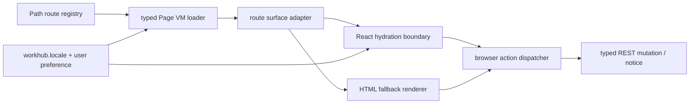

# R4.16 React Route Tree / Hydration Boundary Plan

## 1. 开工前必读

- [`r4-15-settings-locale-device-boundary-hardening-plan-2026-06-11.md`](./r4-15-settings-locale-device-boundary-hardening-plan-2026-06-11.md)
- [`r4-14-option-intake-knowledge-route-componentization-plan-2026-06-11.md`](./r4-14-option-intake-knowledge-route-componentization-plan-2026-06-11.md)
- [`web-app.md`](../05-clients/web-app.md)
- [`page-concepts.md`](../05-clients/page-concepts.md)
- [`i18n-locale-contract-p1-1.md`](../05-clients/i18n-locale-contract-p1-1.md)
- 代码入口：`packages/ui/src/gold-path/route-components.ts`、`packages/ui/src/gold-path/product-shell.ts`、`apps/web/src/routes.ts`、`apps/web/src/browser.ts`、`apps/web/qa/r4-web-live-route-interaction.ts`
- 概念/证据：`web-operations-pages-atlas.png`、R4.15 settings/browser smoke contact sheet

## 2. 背景

R4.10-R4.15 已把高频 Web ready routes 收敛到 active-only route components，并用 Page VM、typed REST loader、notice contract、Settings/device boundary 和 38 步 browser smoke 证明主窗严肃化、双语和 no-overflow 门禁。当前组件仍主要由共享 HTML render helper 输出，浏览器 glue 再绑定动作。R4.16 的目标不是重写产品外观，而是建立可渐进迁移的 React route tree / hydration boundary，让后续真实 React component 化有稳定入口，同时不削弱 typed Page VM 和 active-only 数据真相。

## 3. 目标

| Area | R4.16 目标 | 必守边界 |
|---|---|---|
| Route registry | 建立 React route registry / adapter，保持现有 path routes、loader 状态机和 Page VM contracts | 不回退 hash route，不把 `/api/pages/gold-path` 当内容真相源 |
| Hydration boundary | 为 active route panel 增加可测试 hydration root 或 adapter 层，支持逐页迁移 | 不一次性大改所有 UI，不破坏当前 HTML fallback |
| Action dispatcher | 保留 R4.12-R4.15 notice、fail-closed、locale persistence 与 desktop gate 行为 | 不把未接线动作显示为成功，不执行 Web 本地能力 |
| Locale / i18n | React adapter 继续从 `workhub.locale`、Page VM `meta.locale` 和 Settings preference state 取 truth | 不硬翻译用户原文、证据、LLM 正文 |
| QA | Browser smoke 对比 React adapter 与现有 route component marker、active-only、no-overflow、settings boundary | 不降低 R4.10-R4.15 regression gates |

## 4. 数据流

## 5. 实施步骤

1. 复读本计划、R4.15 竣工记录、Web PRD、page concepts、i18n contract 与 route component 源码。
2. 审查 `apps/web/src/routes.ts` 和 `packages/ui/src/gold-path/route-components.ts` 的 route surface shape，定义 React adapter 最小输入合同。
3. 增加 route registry / hydration boundary 的 feature flag 或 test-only hook，先对 1-2 个低风险 route 建立 React-compatible wrapper。
4. 保持现有 HTML fallback 与 `data-r4-route-component` markers，确保浏览器 smoke 能证明迁移前后同一 Page VM truth。
5. 把 action dispatcher 的绑定目标从纯 HTML selector 梳理成稳定 action contract，覆盖 button/link/form-like controls。
6. 扩展 unit tests：adapter props、marker parity、locale propagation、notice fail-closed、settings device boundary 不回退。
7. 扩展 `qa:r4-web-live-route-interaction`：新增 hydration boundary marker、active route count、no duplicate listener、settings/locale/device regression。
8. 更新 `web-app.md`、`page-concepts.md`、roadmap、详细计划、README，并制定 R4.17 后续计划。

## 6. QA Gate

必须全部通过：

- `pnpm --filter @workhub/ui test`
- `pnpm --filter @workhub/web test`
- `pnpm --filter @workhub/api-client test`
- `pnpm typecheck`
- `pnpm qa:r4-web-live-route-interaction` with R4.16 env
- `pnpm test`
- `git diff --check`
- no `reference` or `references` directories, and no secret scan matches

建议新增 browser gates：

- `r4_16_hydration_boundary_marker=true`
- `r4_16_route_adapter_page_vm_truth=true`
- `r4_16_action_dispatcher_parity=true`
- `r4_16_locale_settings_regression=true`
- `r4_16_active_only_regression=true`
- `r4_15_settings_boundary_regression=true`

## 7. PRD / 概念图验收口径

- `web-operations-pages-atlas.png`：React route tree 只是实现形态迁移，页面仍是严肃管理工具，不新增营销式 hero、装饰卡片或 Cuu 本体。
- R4.15 contact sheet：Settings 的 locale fail-closed、secret-safe、desktop boundary 与 mobile no-overflow 必须在迁移后保留。
- `page-concepts.md`：active-only product shell 继续是 R4 Web 产品化基线，React 迁移不得把非当前 route hidden panels 重新塞回主窗口。

## 8. 后续候选

R4.16 通过后进入 R4.17：按风险从 Home / Approvals / Settings 这类低副作用 route 开始，把 HTML route components 逐步迁移为真实 React components，并补 CI/browser screenshots 的稳定回归矩阵。
