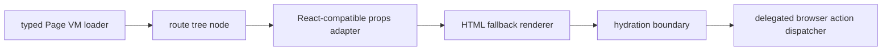

# R4.18 React Route Migration Expansion Plan

## 1. 开工前必读

- [`r4-17-react-route-component-first-migration-plan-2026-06-11.md`](./r4-17-react-route-component-first-migration-plan-2026-06-11.md)
- [`r4-16-react-route-tree-hydration-boundary-plan-2026-06-11.md`](./r4-16-react-route-tree-hydration-boundary-plan-2026-06-11.md)
- [`web-app.md`](../05-clients/web-app.md)
- [`page-concepts.md`](../05-clients/page-concepts.md)
- 代码入口：`packages/ui/src/gold-path/route-react-components.ts`、`packages/ui/src/gold-path/route-components.ts`、`apps/web/src/routes.ts`、`apps/web/qa/r4-web-live-route-interaction.ts`
- 概念/证据：`web-operations-pages-atlas.png`、R4.17 React route component first migration contact sheet

## 2. 背景

R4.17 已把 Home / Settings 迁入 React-compatible component adapter，并证明 typed Page VM props、HTML fallback、route tree marker、hydration marker、action count 和 Settings boundary 可以在同一 browser smoke 中保持一致。R4.18 扩大迁移范围，但仍不碰最高风险的 Proposal advanced editors，先选择 Cost / Replay 这类中等复杂度、低 mutation 风险 route。

## 3. 目标

| Area | R4.18 目标 | 必守边界 |
|---|---|---|
| Expansion | 将 Cost / Replay 接入同一 React-compatible component adapter | 不一次性迁移 Proposal advanced / Intake / Knowledge |
| Props parity | Cost / Replay adapter props 来自 typed Page VM 与 existing renderer output，不从 DOM 反推 | 不复制旧 fixture 文案、不硬翻译动态正文 |
| Actions | Replay accepted deliverable href、Cost budget notice action count 与 HTML fallback 一致 | 不新增第二套 dispatcher，不让同一点击双发 |
| QA | Browser smoke 继续覆盖 R4.17 gates，并新增 Cost / Replay component parity | 不降低 R4.10-R4.17 regression gates |

## 4. 数据流

## 5. 实施步骤

1. 复读本计划、R4.17 竣工记录、Web PRD、page concepts 和 R4.17 browser report。
2. 选择 Cost / Replay 作为扩展迁移 route，先不碰 Proposal advanced、Intake、Knowledge。
3. 为 Cost / Replay 定义 props adapter：Page VM、locale、route key、primary action hrefs、route-specific count markers 必须可审计。
4. 在 `webReactRouteTree` 标出新 component adapter，并保持 Home / Settings R4.17 markers。
5. 扩展 unit tests：Cost / Replay props parity、action count parity、hydration marker parity、no secret/no Cuu regression。
6. 扩展 browser smoke：新增 R4.18 component marker、Cost / Replay fallback parity、action dispatcher single path、R4.17 regression。
7. 更新 `web-app.md`、`page-concepts.md`、roadmap、详细计划、README，并制定 R4.19 后续计划。

## 6. QA Gate

必须全部通过：

- `pnpm --filter @workhub/ui test`
- `pnpm --filter @workhub/web test`
- `pnpm --filter @workhub/api-client test`
- `pnpm typecheck`
- `pnpm qa:r4-web-live-route-interaction` with R4.18 env
- `pnpm test`
- `git diff --check`
- no `reference` or `references` directories, and no secret scan matches

建议新增 browser gates：

- `r4_18_cost_react_component_marker=true`
- `r4_18_replay_react_component_marker=true`
- `r4_18_cost_replay_html_fallback_parity=true`
- `r4_18_action_dispatcher_single_path=true`
- `r4_17_first_migration_regression=true`

## 7. PRD / 概念图验收口径

- Cost 仍是成本治理页，不变成营销 dashboard，也不泄露 provider secret/base URL。
- Replay 仍是审计和恢复工作台，不变成代码 IDE，也不把 Cuu 气泡塞回主窗。
- Web 主窗继续无 Cuu、无默认 Kanban、无 hash route、无 weekly demo、无横向/文本溢出。

## 8. 后续候选

R4.18 通过后进入 R4.19：评估 Proposal advanced 的拆分迁移，先把 conflict summary / readonly review sections 与 mutation-heavy editors 分层，再决定是否逐段迁移。
