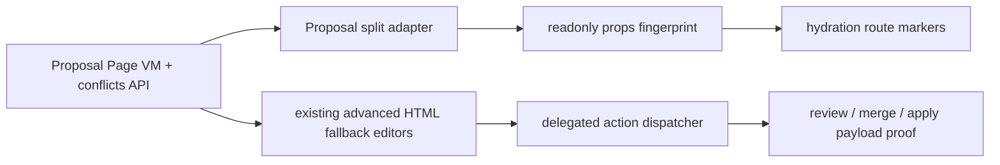

# R4.19 Proposal Advanced Split Migration Plan

## 1. 开工前必读

- [`r4-mid-review-upgrade-audit-2026-06-11.md`](./r4-mid-review-upgrade-audit-2026-06-11.md) —— **前置硬门**：先完成 R4.19-pre 真 React mount spike（P0-1），并把 spike 结论回写本计划 §3；本计划新增编辑态 dirty guard 与 fixture-chrome 冻结两个 gate（见 §6）
- [`r4-18-react-route-migration-expansion-plan-2026-06-11.md`](./r4-18-react-route-migration-expansion-plan-2026-06-11.md)
- [`r4-13-proposal-advanced-route-ux-convergence-plan-2026-06-11.md`](./r4-13-proposal-advanced-route-ux-convergence-plan-2026-06-11.md)
- [`r4-16-react-route-tree-hydration-boundary-plan-2026-06-11.md`](./r4-16-react-route-tree-hydration-boundary-plan-2026-06-11.md)
- [`web-app.md`](../05-clients/web-app.md)
- [`page-concepts.md`](../05-clients/page-concepts.md)
- 代码入口：`packages/ui/src/gold-path/route-react-components.ts`、`packages/ui/src/gold-path/route-components.ts`、`packages/ui/src/proposal/`、`apps/web/src/browser.ts`、`apps/web/qa/r4-web-live-route-interaction.ts`
- 概念/证据：`web-operations-pages-atlas.png`、R4.18 React route migration expansion contact sheet

## 2. 背景

R4.18 已把 Cost / Replay 迁入 React-compatible component adapter，并补齐 Replay accepted deliverable restore 的 single dispatcher proof。下一步不能直接把 Proposal advanced 全量迁移成一个“大组件”：Proposal advanced 包含 line editor、structured field editor、subrecord editor、bulk conflict actions 与 custom field fail-closed，mutation 面比 Home/Settings/Cost/Replay 高很多。R4.19 先做 split migration：把 readonly summary / review metadata / conflict count adapter 化，把 mutation-heavy editors 留在现有 HTML fallback renderer。

## 3. 目标

| Area | R4.19 目标 | 必守边界 |
|---|---|---|
| Split adapter | 为 Proposal route 增加 React-compatible split adapter，只承接 readonly summary、checks、change/conflict counts、primary action hrefs | 不迁移 line editor、structured field editor、subrecord editor 的 mutation UI |
| Advanced boundary | 明确 `ProposalRouteComponent` 与 `ProposalAdvancedEditorsFallback` 的边界 marker | 不让 editors 自行 fetch、不从 DOM 文案反推 props |
| Actions | approve/request changes/merge、advanced apply、line editor、field editor、subrecord editor 仍走现有 delegated dispatcher | 不新增第二套 click handler，不改变 R4.13 fail-closed payload |
| QA | 保留 R4.13 advanced gates 与 R4.18 component gates，并新增 split boundary gates | 不降低 no overflow、active-only、Settings boundary、Replay restore gates |

## 4. 数据流

## 5. 实施步骤

1. 复读本计划、R4.18 竣工记录、R4.13 advanced plan、Web PRD 与 page concepts。
2. 审查 `renderProposalRouteComponent()`、`renderProposalConflictCards()`、line editor、structured field editor、subrecord editor 的 props/data flow，列出 readonly 与 mutation-heavy 边界。
3. 在 `route-react-components.ts` 增加 Proposal split adapter props：proposal id、work item id、status、change/check/evidence/comment/conflict counts、review action hrefs、advanced editor fallback flag。
4. 在 Proposal route section 增加 `data-r4-react-component-*` 与 `data-r4-proposal-advanced-fallback-*` marker；`webReactRouteTree` 标记 Proposal 进入 split migration。
5. 单测覆盖 Proposal split adapter props parity、advanced editor fallback 存在、R4.13 payload/fail-closed regression、R4.18 Cost/Replay/Home/Settings regression。
6. Browser smoke 新增 R4.19 gates：Proposal split component marker、advanced fallback boundary、readonly props parity、mutation dispatcher regression、R4.18 replay restore regression。
7. 完成后更新 `web-app.md`、`page-concepts.md`、roadmap、详细计划、README，并制定 R4.20 后续计划。

## 6. QA Gate

必须全部通过：

- `pnpm --filter @workhub/ui test`
- `pnpm --filter @workhub/web test`
- `pnpm --filter @workhub/api-client test`
- `pnpm typecheck`
- `pnpm qa:r4-web-live-route-interaction` with R4.19 env
- `pnpm test`
- `git diff --check`
- no `reference` or `references` directories, and no secret scan matches

建议新增 browser gates：

- `r4_19_proposal_split_component_marker=true`
- `r4_19_proposal_advanced_fallback_boundary=true`
- `r4_19_proposal_readonly_props_parity=true`
- `r4_19_mutation_dispatcher_regression=true`
- `r4_18_replay_restore_regression=true`
- `r4_19_dirty_edit_sse_guard=true`（中期审查 P0-2：line editor/intake/custom field 有未提交编辑时，SSE 事件不得触发整页重渲清空编辑态，降级为 notice + 手动刷新）
- `r4_19_no_new_fixture_chrome=true`（中期审查 P0-3 冻结线：本步不得新增对 `/api/pages/gold-path` fixture surface 的依赖或 gate）

## 7. PRD / 概念图验收口径

- Proposal 仍是“AI 产物审阅与合并”页面，不变成代码 IDE，也不把用户推回 git 黑话。
- Readonly summary 可以 adapter 化；所有 mutation-heavy editors 必须先作为 fallback boundary 保留，直到后续逐段拆迁。
- 固定 chrome 继续双语；动态 proposal manifest、冲突正文、LLM rationale 保留服务端原文。
- Web 主窗继续无 Cuu、无默认 Kanban、无 hash route、无 weekly demo、无 secret-like 文本、无 horizontal/text overflow。

## 8. 后续候选

R4.19 通过后不直接进入 mutation editor 迁移。按中期审查建议，R4.20 先集中修数据流地基：app 级 SSE 长连接、Page VM 局部 refetch、Last-Event-ID/断连续传与 fixture chrome 退役；R4.21 再抽共享 web runtime，收敛 Web/desktop 分叉 dispatcher；R4.22 才选择 Proposal mutation editor 中风险最低的一段做真实迁移。
