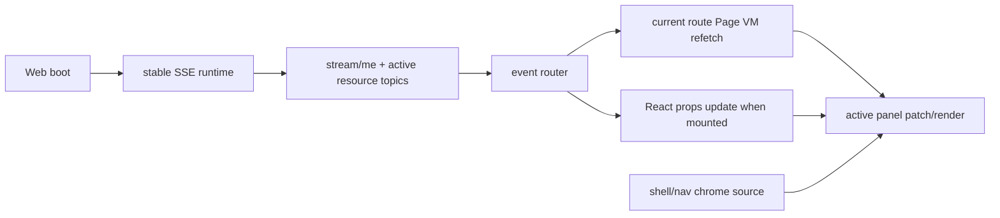

# R4.20 Dataflow Foundation Plan

## 1. 开工前必读

- [`r4-mid-review-upgrade-audit-2026-06-11.md`](./r4-mid-review-upgrade-audit-2026-06-11.md) P0-3/P0-4 与 P1-3/P1-5
- [`r4-19-proposal-advanced-split-migration-plan-2026-06-11.md`](./r4-19-proposal-advanced-split-migration-plan-2026-06-11.md) R4.19 dirty guard 竣工记录
- [`r4-19-pre-true-react-mount-spike-plan-2026-06-11.md`](./r4-19-pre-true-react-mount-spike-plan-2026-06-11.md) true React mount 与 `react-props` update proof
- [`r4-08-redis-sse-production-browser-smoke-2026-06-11.md`](./r4-08-redis-sse-production-browser-smoke-2026-06-11.md) Redis broker、topic auth 与 REST reconcile 证据
- [`web-app.md`](../05-clients/web-app.md)
- [`page-concepts.md`](../05-clients/page-concepts.md)
- 概念/证据：`web-operations-pages-atlas.png`、R4.19 Proposal split migration contact sheet、R4.8 Redis/SSE contact sheet

## 2. 背景

R4.19 已完成 Proposal readonly split adapter，并用 dirty guard 阻断“编辑中收到 SSE 后整页重渲导致 DOM 编辑态丢失”的 P0 风险。但这只是止血：当前 Web 仍在每次 route render 后重建 1-3 条 EventSource，收到事件后全量重拉 `/api/pages/gold-path` + 当前 Page VM，再整页 `innerHTML` 替换。R4.20 要把数据流地基改成 app 级长连接与局部 Page VM refresh，并开始退役 fixture chrome。

## 3. 目标

| Area | R4.20 目标 | 必守边界 |
|---|---|---|
| App-level SSE | Web boot 建立稳定 SSE runtime，route 切换只更新 topic set / listener mapping | 不降低 R4.8 topic auth、Redis broker、多 worker reconcile gates |
| Local Page VM refetch | 收到事件只重拉当前 route 所需 Page VM 或 React props，shell/nav/chrome 不跟随重拉 | 不让 SSE payload 成为唯一真相源，REST/Page VM 仍为 truth |
| Last-Event-ID / cursor | 客户端记录最近 event id；断线重连携带 cursor；服务端 event stream 明确可续传/不可续传边界 | 不伪造“绝不丢事件”的承诺；缺 cursor 时必须 fail-safe reconcile |
| Fixture chrome retirement | Shell/nav/routes 从 `/api/pages/gold-path` fixture 剥离为真实 chrome source（前端常量或轻量 shell endpoint） | 不破坏双语 fixed chrome、path navigation、active-only panel、no weekly fixture gates |
| QA shape | 把 R4.19 dirty guard、R4.19-pre `react-props`、R4.8 Redis/SSE regression 放到同一 browser smoke | 不把 42 步单体 smoke 继续无界线性扩张；开始为 R4.21 拆分 CI Playwright 做准备 |

## 4. 数据流目标图

## 5. 实施步骤

1. 复读本计划、R4.19 竣工记录、R4 中期审查、R4.8 Redis/SSE plan、Web PRD 与 page concepts。
2. 审查 `apps/web/src/browser.ts` 的 EventSource 生命周期、`refreshCurrentRouteFromLiveEvent()`、`renderCurrentRoute()` 和 dirty metrics，列出可移动到 app runtime 的状态。
3. 新建或抽出 Web live runtime helper，管理 stable EventSource、topic set、last event metadata、route dirty guard、notice scheduling。
4. 改造 route refresh：Home 优先保留 R4.19-pre `react-props` path；其他 route 先做 current Page VM refetch + active route render，避免重新拉 gold-path chrome。
5. 退役生产 chrome 对 `/api/pages/gold-path` fixture 的依赖：抽真实 shell/nav/chrome source，保留 `/api/pages/gold-path` 作为 fixture/test surface。
6. 服务端 SSE 如已有 event id/cursor 能力则接入 `Last-Event-ID`；若缺失，先补明确的 cursor 字段和 reconnect reconcile 策略，并写入开放问题回收记录。
7. QA 拆门：保留 R4.19 smoke 的核心路径，同时新增 R4.20 gates；评估把 route family 拆到后续 Playwright CI spec 的最小边界。
8. 完成后更新 `web-app.md`、`page-concepts.md`、roadmap、详细计划、README，并制定 R4.21 shared runtime 后续计划。

## 6. QA Gate

必须通过：

- `pnpm --filter @workhub/web test`
- `pnpm --filter @workhub/ui test`
- `pnpm --filter @workhub/api test`（如服务端 SSE/cursor 有改动）
- `pnpm --filter @workhub/api-client test`（如 Page VM/client 合同有改动）
- `pnpm typecheck`
- `pnpm test`
- `pnpm qa:r4-web-live-route-interaction` with R4.20 env
- `git diff --check`
- no secret / no reference-folder diff scans

建议新增 browser gates：

- `r4_20_app_level_sse_runtime=true`
- `r4_20_route_switch_does_not_rebuild_all_event_sources=true`
- `r4_20_page_vm_local_refetch=true`
- `r4_20_shell_chrome_no_gold_path_fixture_dependency=true`
- `r4_20_last_event_id_or_cursor_contract=true`
- `r4_20_dirty_guard_regression=true`
- `r4_20_home_react_props_update_regression=true`
- `r4_20_redis_sse_reconcile_regression=true`
- `r4_20_no_new_fixture_chrome=true`

## 7. PRD / 概念图验收口径

- Web 仍是瘦客户端：REST/Page VM 为真相源，SSE 只负责提示和触发 reconcile。
- 主窗保持严肃工作界面，不引入 Cuu、营销 hero、默认 Kanban 或装饰性 dashboard。
- 双语 fixed chrome 必须来自 locale contract 或真实 shell source，不能继续依赖中文 fixture 正则替换成英文。
- 动态 proposal manifest、证据摘录、用户输入、LLM rationale 保留源文本，不在客户端硬翻译。
- 任何刷新模型改动都必须证明 Proposal dirty edit 不丢状态，且不破坏 path navigation、active-only panel、no horizontal/text overflow。

## 8. 后续候选

R4.20 完成后已进入并完成 R4.21 shared web runtime、R4.22 Proposal mutation editor 第一段迁移与 R4.23 Proposal line editor 第二段迁移：Web 与 desktop-webview 的 dispatcher、notice、locale、dirty guard、SSE refresh 运行时已收敛到 `@workhub/web-runtime`，Proposal structured field scalar editor 与 line editor 已完成 visible React controlled-state 验证。下一步进入 R4.24 Web runtime finalization。

## 9. 竣工记录（2026-06-11）

1. 已复读本计划、R4.19 竣工记录、R4.19-pre true React mount spike、R4 中期审查、R4.8 Redis/SSE plan、`web-app.md`、`page-concepts.md`，并审视 `web-operations-pages-atlas.png`、R4.19 contact sheet 与 R4.8 Redis/SSE contact sheet。
2. 已改 `apps/web/src/routes.ts`：ready route 不再调用 `client.pages.goldPath()`；Web loader 只读取当前 route 所需 typed Page VM（Proposal 额外读 conflicts），再用前端真实 shell source 组装 product chrome、nav、metrics 与 active-only route component。
3. 已改 `packages/ui/src/gold-path/product-shell.ts`：`renderWebProductShell()` 支持不带完整 `GoldPathSurfaceVM` 的 shell surface，并允许 active page 直接提供 metrics；既保留旧 fixture renderer 兼容，也让生产 Web route 可脱离 P0.5 fixture。
4. 已改 `packages/ui/src/gold-path/route-components.ts`：新增 `renderWebRouteComponent()` active-only API；Replay component 改为直接消费 `ReplayTraceVM`，避免为了单路由渲染而携带完整 demo surface。
5. 已改 `apps/web/src/browser.ts`：新增 app-level SSE runtime，按 URL 复用 EventSource，route 切换只同步 target set；`stream/me` 不再随 ready render 整建整拆，resource topic 只在进入/离开对应 route 时开闭。
6. 已保留 R4.19 dirty guard：dirty route 收到 SSE 仍走 `dirty-deferred`，未提交 line decision/search/custom field 不丢；Home true React mount 仍走 `react-props` 更新。
7. 已改 `packages/events/src/sse.ts` 与 `apps/api/src/sse/stream.ts`：SSE frame 支持 `id:`，API stream 从 payload `event_id` 提取 cursor；服务端读取 `Last-Event-ID` 或 `last_event_id` query，并在 connected frame 回显 `resume_mode`，明确当前是 reconcile 语义，不伪造历史 replay。
8. 已改 Web cursor：浏览器从 `MessageEvent.lastEventId` 或 payload `event_id` 记录最近 cursor，写入 `sessionStorage`；硬导航/locale reload 后新 EventSource 会追加 `last_event_id` query。
9. 已扩展 `apps/web/qa/r4-web-live-route-interaction.ts`：新增 live runtime/cursor audit 字段和 R4.20 gates，mock SSE event 写入 `id:` 与 `event_id`。

## 10. QA 结果

- `pnpm --filter @workhub/events test`：13/13 pass。
- `pnpm --filter @workhub/ui typecheck`：pass。
- `pnpm --filter @workhub/web typecheck`：pass。
- `pnpm --filter @workhub/web test`：20/20 pass。
- `pnpm --filter @workhub/api typecheck`：pass。
- `pnpm --filter @workhub/api test`：105/105 pass。
- `pnpm typecheck`：pass。
- `pnpm qa:r4-web-live-route-interaction`：42 步 Chrome smoke pass，证据目录 `../05-clients/assets/audit/2026-06-11-r4-web-live-route-interaction/`。

关键 browser gates：

- `r4_20_app_level_sse_runtime=true`
- `r4_20_route_switch_does_not_rebuild_all_event_sources=true`
- `r4_20_page_vm_local_refetch=true`
- `r4_20_shell_chrome_no_gold_path_fixture_dependency=true`
- `r4_20_last_event_id_or_cursor_contract=true`
- `r4_20_dirty_guard_regression=true`
- `r4_20_home_react_props_update_regression=true`
- `r4_20_no_new_fixture_chrome=true`

关键请求计数：

- `/api/pages/gold-path = 0`
- `/api/pages/proposals/r4-live-proposal = 2`
- `/api/workitems/:id/conflicts = 2`
- `/api/push/stream/proposal/r4-live-proposal = 1`
- `/api/__qa/emit = 4`

## 11. Bug / 数据流 / PRD / 概念图审查

- P0-3 已收口第一段：Web ready route chrome 不再依赖 `/api/pages/gold-path`，双语 fixed chrome 来自 `product-shell` locale copy 与 route registry shell source；P0.5 endpoint 保留为 fixture/test surface。
- P0-4 已收口第一段：EventSource 生命周期从 ready route AbortController 分离，route render 不再关闭所有 SSE；SPA route switch 证明 `me` stream 被复用，Proposal stream 只打开 1 次。
- Page VM truth 仍成立：SSE payload 只负责事件提示和 cursor，事件后仍重拉当前 route REST Page VM；Home React probe 仅更新 typed props。
- Cursor 语义是 reconcile，不是历史 replay：服务端回显 `resume_mode=reconcile`，客户端断线/硬导航后携带 `last_event_id`，但缺 cursor 或 broker 无历史时仍通过 REST Page VM fail-safe。
- 主窗视觉仍对齐 `web-operations-pages-atlas.png`：产品壳、active-only panel、Proposal advanced fallback、Cost/Replay/Settings/Intake/Knowledge 均未新增 Cuu、营销 hero、默认 Kanban、装饰 dashboard 或横向滚动。
- 双语边界仍成立：fixed chrome 和 notices 中英可切；proposal manifest、证据摘录、用户输入、LLM rationale 继续保留源文本。

## 12. 后续详细计划

R4.21 进入 shared web runtime：把 Web 与 desktop-webview 已分叉的 dispatcher、notice、locale、dirty guard、route editor 与 SSE refresh contract 抽到共享 runtime 包，先做只读/无行为改变的收敛，再让 desktop-webview 复用同一套 runtime。R4.22 再回到 Proposal mutation editor 的真实 React 迁移。
