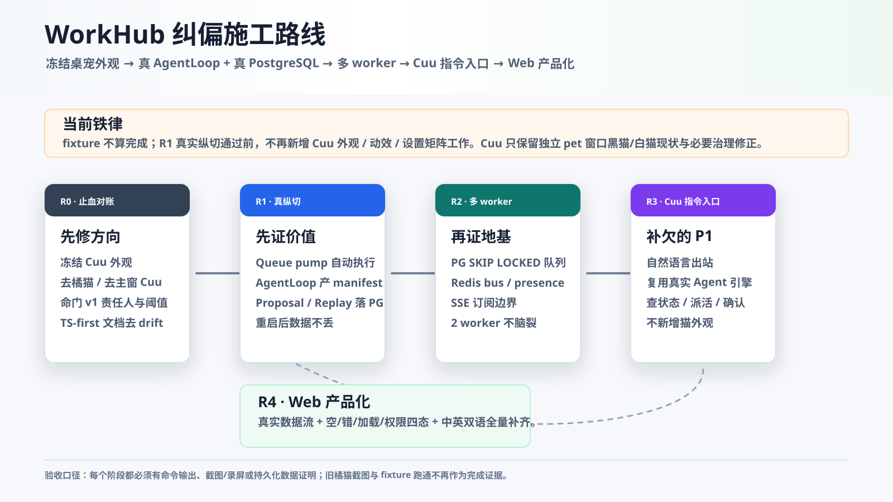
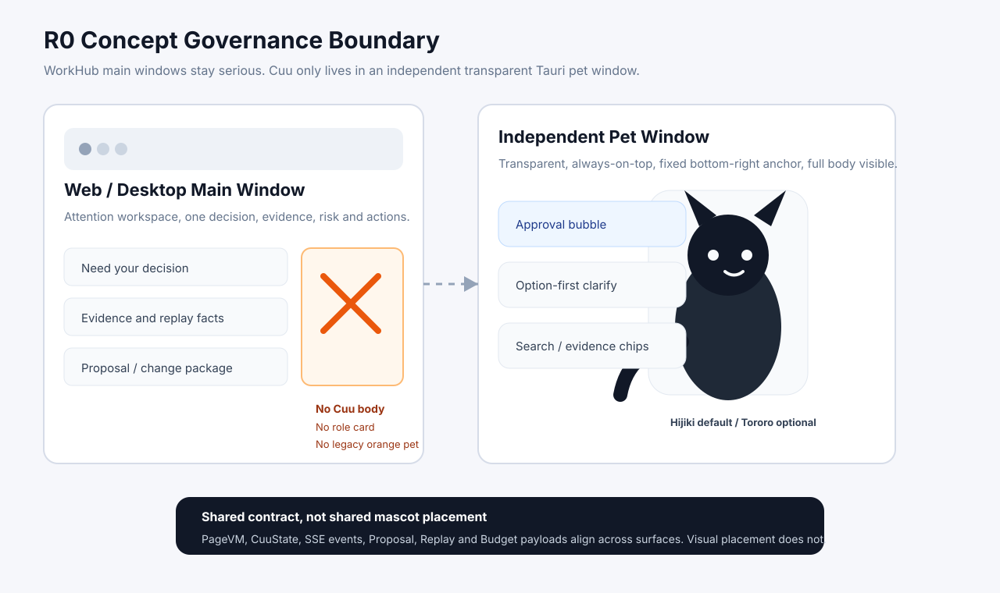

# R0-R4 纠偏施工路线

> 本篇把 `D:/workhub审查报告` 的 Claude 审查结论收进仓库文档树，作为 2026-06-08 之后的施工优先级。它不替代 PRD，而是修正当前执行顺序：先止血对账，再证明真实纵切，最后再回到 Cuu 与 Web 产品化。逐项领取与验收细节见 [`review-driven-r0-r4-detailed-construction-plan-2026-06-08.md`](./review-driven-r0-r4-detailed-construction-plan-2026-06-08.md)。

## 0. 新铁律

| 铁律 | 说明 | 验收 |
|---|---|---|
| 冻结 Cuu 外观 | R1 真实纵切通过前，不再新增桌宠形象、动效、设置矩阵、截图矩阵、模型改色。仅允许 R0 治理修正：去橘猫、主窗无 Cuu、透明 pet smoke、文档对账。 | Cuu 相关新任务必须标 `deferred-until-R1`，除非直接修治理违规 |
| fixture 不算完成 | Gold Path、Replay、Proposal、Cost、Approval 只有走真实 AgentLoop、真实服务、真实持久化，才可宣称跑通。 | 生产路由不得用 `isP05*` / hardcoded manifest 作为完成证据 |
| 先证一条真实需求 | 下一个产品价值目标只有 R1：一条需求从 intake 到 AgentRun、manifest、Proposal、approve/merge、Replay 全链路落 PostgreSQL，重启不丢。 | R1 验收必须有运行命令、DB 证据、重启后查询证据 |
| TS-first 是当前现实 | 旧 Python/FastAPI 路径只能作为行为锚点；实现计划以 TS/Hono/Drizzle/contracts 为主。 | F01-F11 与 README 需标注 TS-first 权威路径 |

## 1. R0 止血与对账

目标：让计划、代码、概念图、截图证据重新对齐，避免继续在错误优先级上投入。

| 项 | 施工内容 | 当前落点 |
|---|---|---|
| R0-1 范围冻结 | README、Cuu 文档、roadmap 明确“R1 前冻结 Cuu 外观”。 | 本篇、README、`cuu-desktop-pet-concept.md` |
| R0-2 概念治理 | 旧 `2026-06-07-current-state` 橘猫截图判为 stale/fail；4 张 shared PNG 已原位替换为黑/白 Live2D 与“主窗无 Cuu”口径；主窗口无 Cuu 本体仍作为截图验收门。 | `prd-concept-reproduction-gap-audit.md`、`current-state-visual-audit-*`、`page-concepts.md` |
| R0-3 命门拍板 | `confidence-risk-escalation.md` 锁定 v1 owner、policy_version、阈值、风险维度默认值；`07-open-questions.md` 更新 OQ-2/OQ-3。 | `02-ai-engine/confidence-risk-escalation.md`、`07-open-questions.md` |
| R0-4 文档去 drift | D-1 正名为“参考 Python 行为的 TS-first 重写”；F03 迁移路线收敛到 Drizzle Kit；实体数、`medium` 枚举口径收敛。 | README、`phasing-p0-p5.md`、后续 plans 清理 |

R0 退出门：

- 主窗口截图和概念图入口不再把 Cuu 身体当作严肃工作界面元素。
- 旧橘猫截图只作为“失败样例/历史审计”，不再作为当前通过证据；shared 概念图当前版本已不含橘猫。
- OQ-2/OQ-3 有 v1 owner 和可执行默认值。
- 文档树明确后续施工顺序为 R0 -> R1 -> R2 -> R3 -> R4。

2026-06-11 复核口径：R0 文档治理和概念资产基本完成，但不能宣称完全完成。R3.18 已补 desktop 主窗 `/settings` zh-CN/en-US 无 Cuu 本体、无模型预览、文本不超框截图证据；R3.20a 已补右键 hover 同步主窗 settings 的中英截图与 `overflow.offenders=[]`；R3.20b 已补 Windows 物理 OS 托盘恢复与 run card 文本 overflow 自动门；R3.21 已补 Linux Xvfb/openbox/devUrl 首轮 smoke、Linux `icon.png` 编译缺口和 `520x720` card frame safety；R3.22 已补 failed AgentRun / generic runtime error 文本与 frame hardgate、Linux mock API 精确截图和 DOM `spatial_safety`；R3.23 已补真实 Linux GNOME StatusNotifier/AppIndicator DBusMenu action 与 macOS menu bar status item 中英 smoke；R4.1 已补 Web 高频页四态/双语/无溢出 QA foundation；R4.2 已补 URL route registry、真实 path loader 与 `/`、`/approvals`、`/dashboard/cost` typed Page VM endpoint proof；R4.3 已补多记录 Page VM ready/detail route 视觉 QA，并 gate 无 `客户周报/weekly` 单 fixture 文案；R4.4 已补 Web product shell baseline、四屏 contact sheet、导航内部溢出与文本盒溢出硬门；R4.5 已补 Vite live browser route interaction smoke、重复 listener guard、locale reload 与移动端滚动遮挡门；R4.6 已补 Rust system-string i18n，tray/menu/tooltip、notification fallback、deep-link/single-instance diagnostics 都进入 `zh-CN/en-US` contract；R4.7/R4.8/R4.9 已通过真实 PG、Redis/SSE 与 locale metrics 浏览器 smoke；R4.10 已补 Home/Approvals/Replay route componentization first slice；R4.11 已补 WorkItem/Proposal/Cost/Settings route componentization second slice 和 Settings typed Page VM；R4.12 已补 action/notice locale route UX；R4.13 已补 Proposal advanced route UX convergence；R4.14 已补 Option Intake / Knowledge route componentization；R4.15 已补 Settings / locale / device boundary hardening；R4.16 已补 React route tree / hydration boundary；R4.17 已补 Home / Settings React-compatible route component first migration。后续进入 R4.18 Cost / Replay 扩展迁移。

## 2. R1 真实纵切

目标：把“AI 干、人把关”的反转第一次用真实数据证明。

| 步骤 | 必须做什么 | 验收证据 |
|---|---|---|
| R1-0 Queue pump | `POST /workitems/:id/agent-runs` 后 daemon 自动 drain queue，不靠测试手动 `runNext()`。 | **2026-06-08 已落代码切片；2026-06-10 R2.2 已升级**：默认 route 现在触发 `runNext()` drain，由 PG claim 分配执行权；测试覆盖 POST 后无需手动 `runNext()` 也能 `queued -> succeeded`。 |
| R1-1 接缝 | `AgentLoopResult.manifest` 传给 `ProposalService.createFromManifest`，真实 run 成功后自动 opened proposal。 | **2026-06-08 已落代码切片**：`apps/api/src/workers/agent-runner.ts` 成功 run 会打开 proposal 并发布 `proposal.opened`；`apps/api/src/agent-runs.test.ts` 覆盖真实 AgentLoop manifest。下一步仍需用真实 route/DB 端到端验收。 |
| R1-2 PG 持久化 | AgentRun、AgentStep、Proposal、CostLedger、BudgetPolicy 从内存 Map 切到 PostgreSQL repo。 | **2026-06-09 已落最小真实切片**：`packages/db/src/repositories/proposals.ts` + DB-backed `ProposalService` 已接 `branches/proposals/reviews`；`packages/db/src/repositories/agent-runs.ts` + `apps/api/src/services/agent-run-persistence.ts` 已支持 AgentRun/AgentStep write-through 与 DB fallback；`packages/db/src/repositories/cost-ledger.ts` + `usage_records/cost_ledger_entries` 已支持默认 DB-backed CostLedger；`packages/db/src/repositories/budget-policies.ts` + `budget_policies` 已支持 BudgetPolicy override 持久化与 `budget_policy.updated` 审计；真实 PG restart/replay/cost smoke 已覆盖。 |
| R1-3 删除 fixture 生产分支 | `isP05*` 不出现在生产路由判断；没有真实 service 的 route 失败关闭。 | **2026-06-08 已落代码切片**：生产 routes grep 清零，仅 `/api/pages/gold-path` 保留 demo bundle。 |
| R1-4 审批人路由 | 自审批 stub 改为 WorkItem owner / 项目负责人 / permission routing。 | **2026-06-08 已落最小真实切片**：AgentRun 通知新增 DB WorkItem context resolver，默认读取 submitter/project owner/assignee 并交给 lifecycle approver fallback；`packages/events` 覆盖 project owner fallback。完整 permission policy routing 仍属 R2/R3 审批中心。 |
| R1-5 Intake/WorkItem/Knowledge/Page VM | `sessions/workitems/knowledge/pages/workitems` 从 501 失败关闭升级为真实最小服务。 | **2026-06-08 已落代码切片**：`apps/api/src/services/work-items.ts` + `packages/db/src/repositories/work-items.ts` 接入 option-first intake、work item 创建/固化、knowledge evidence bubble、evidence binding、WorkItemDetailVM；API test 与 Linux PG smoke 已覆盖。 |

R1 退出门：

- 一条真实 file-only work_item 端到端跑通：intake -> AgentRun -> manifest -> Proposal -> approve/reject -> merge -> Replay。
- 数据落 PostgreSQL，daemon 重启后不丢。
- ReplayTraceVM 来自真实 run/step/snapshot/audit，不是 fixture。
- 快照红线、provider 单出口、预算计量不回退。

### 2.1 R1 当前代码状态（2026-06-10）

已完成的真实切片：

- `AgentLoopResult.manifest -> ProposalService.createFromManifest` 已由 queue 注入的 proposal sink 承接；成功 run 后发布 `workitem:{id}` 上的 `proposal.opened`，Cuu 状态为 `carrying_document`。
- 默认 `ProposalService` 已从内存实现切到 DB-backed lazy service，写入 `branches`、`proposals`、`reviews`；内存 service 只保留为测试/显式注入隔离用。
- `POST /workitems/:id/agent-runs` 默认自动 pump：route enqueue 后后台触发 `runNext()` drain；测试用 `autoRun:false` 保留手动 queue 单元边界。
- AgentRun persistence 已落代码切片：`agent_runs` 补 `title/actor_user_id/budget_decision_json/workdir_ref/handoff_json` 等恢复字段，`agent_steps` 补 `seq` 并取消错误唯一约束；默认 queue 写穿透 DB，内存 miss 时可从 DB 读回 run/trace/workdir/listActive。
- AgentRun replay fixture fallback 已完全移出生产 route：`/api/agent-runs/:id/replay` 只读真实 queue/persistence/audit/snapshot，不再接受 `allowP05ReplayFixture`。
- P0.5 route set 已从生产业务 route 迁出：`sessions/workitems/knowledge/pages/workitems` 已改为 R1 最小真实 service；`pages/proposals` 与 `proposals/*` 只读真实 `ProposalService`；仅 `/api/pages/gold-path` 保留 demo bundle。
- CostLedger 默认 store 已从内存切到 DB-backed：`usage_records` 保存 provider 原始调用事实，`cost_ledger_entries` 按 workitem/user/team/eval scope 幂等归集；`/api/cost/usage` 与 `/api/pages/cost` 会从 DB 读取 ledger。
- BudgetPolicy 默认 store 已从内存切到 DB-backed：`budget_policies` 保存 v0 policy overrides；`PUT /api/cost/policies/:scope/:id` 写 `budget_policy.updated` 审计；内存 policy store 只保留为单元测试/显式注入隔离用。
- R1 PG smoke 入口已新增并在 Linux/CI PostgreSQL 上通过：`pnpm qa:r1-pg-smoke` 会跑 migrations、最小 seed、真实 intake/work item/knowledge/page route、DB-backed CostLedger/AgentRun/Proposal/Snapshot/Audit，并用新 queue 模拟 daemon restart 后读取 run/replay。2026-06-09 后 smoke 已覆盖正式交付物 v1 采纳、v2 同路径采纳、restore 回 v1、页面/预览/下载/replay 仍读 v1；R1.17 追加覆盖同 target conflict、`merge_proposal_id`、直接 apply `ai_fusion`、原 `merge_proposals.chosen_*`、accepted ledger、ProjectDriveVersion、audit 与 replay timeline；R1.18 追加覆盖 `budget_policies` override、`budget_policy.updated` audit、`/api/cost/usage` 与 `/api/pages/cost` 读取 DB policy；R1.19 追加覆盖 `text_doc` AI fusion 正文直写，正式 Drive version 不再带旧 Markdown/JSON 包装；R1.20 追加要求 one-click AI fusion 前必须读到 current/incoming 文本 context；R1.21 追加要求原始 `ai_fusion` candidate 持久化 `quality_gate.text_patch_preview`；R1.23 的 API test 已覆盖 409 与 `/conflicts` 把该 preview 透到 `ai_fusion` option；R1.24 的 API test 已覆盖无重叠文本 hunk 生成 `source="diff3"` candidate，且重叠 hunk 回退 LLM 且携带 R1.25 metadata；R1.29 追加覆盖 ready + executable `structured_record` 写回 WorkItem `title/summary_md/priority/due_at`、无 accepted deliverable ledger、`field_merge` audit 与 `structured_field_changes[]`；R1.30 追加覆盖 proposal 创建时捕获 base、人工并发改标题后 apply 返回 `structured_field_patch_conflict`、proposal 未 merged、chosen option 回滚、WorkItem 保持人工标题。GitHub Actions 已新增 `r1-pg-smoke` job 用 Postgres 16 service 持续执行。
- Proposal merge accepted ledger 已落：采纳时写 `accepted_deliverable_changes`、merge snapshot、persistent `proposal.merged` audit，并用 sha/version gate 阻断同 target 静默覆盖。
- AgentRun-backed delivery 正式文件落盘已落：merge 前从 `Branch.agent_run_id -> AgentRun.workdir_ref` 找源文件，校验 sha 后复制到正式 storage root，merge transaction 内写 `ProjectDriveItem/Version` 并把 `drive_item_id/drive_version_id` 写回 accepted row。
- 正式交付物读取面已落最小切片：`GET /api/pages/workitems/:id` 返回 `accepted_deliverables[]`，并提供正式文件 download 与文本 preview API；R1 PG smoke 已覆盖页面字段、预览与下载内容。
- 正式交付物还原入口已落最小切片：`AcceptedDeliverableVM.restore_href` 仅在有上一版时出现；`POST .../restore` 会恢复 `ProjectDriveItem.current_version_id`，切换 current accepted row，并写 Drive operation + audit。
- Proposal / Replay 字段级落点与审计渲染已落最小切片：`StructuredFieldPatchDryRun.patch.operations[]` 会在 Proposal 冲突卡显示 base/current/after；`proposal.merged.detail_json.structured_field_changes[]` 会在 Replay 严肃页显示 field_merge 写回审计，覆盖标量字段、`acceptance_items` 与 `task_items`。
- Proposal / Replay 真实 route 视觉 QA 已落最小切片：`pnpm qa:r1-route-visual` 会通过 Web 与 desktop webview surface 函数渲染 Proposal / Replay，生成 zh-CN/en-US、desktop/mobile-narrow、loading/empty/error/forbidden 四态截图，并 gate 富 patch viewer、长 patch 折叠、重叠 hunk review、子记录逐项 diff、多冲突折叠工作台、主窗无 Cuu、默认无重看板词与 `no_horizontal_overflow`。
- 任务子记录多计划/目标 plan 选择已落最小切片：`POST /api/merge-proposals/:id/apply` 支持 `task_plan_scope.target_plan_id`；Proposal 子记录编辑区可显示目标 plan 按钮；DB repository 在多 plan 无 scope 时返回 `task_plan_scope_required`，有 scope 时只重写目标 plan。
- 重叠文本 hunk 后端逐段 materialize 已落最小切片：`POST /api/merge-proposals/:id/apply` 支持 `text_hunk_overrides.hunks[]`；service 读取 full base/current/incoming/AI fusion 文本，按 `quality_gate.text_diff3.conflict_ranges[]` fail-closed 校验，逐段生成最终文本；DB repository 复用 accepted deliverable / Drive version / snapshot / merge attempt 链路，并在 `proposal.merged.detail_json` 写入 `text_hunk_overrides`、`text_hunk_decisions`、conflict ranges 与 base/current/incoming/output sha。
- 多冲突批量执行审计已落最小切片：`POST /api/proposals/:id/merge` 支持 `conflict_resolution.bulk_action`；批量 keep/accept 的 conflict 与 merged 两条路径都会写 `proposal.bulk_action`，成功 merge 的 `proposal.merged.detail_json` 也会带 `bulk_action` 摘要。
- 验证：`pnpm --filter @workhub/api typecheck`、`pnpm --filter @workhub/api test`、生产 route grep 审计已通过；API test 当前 86/86 通过。

仍不能宣称 R1 完成：

- R1 真实纵切和最小 PG-backed Proposal/Replay 链路已经很厚，但完整 approval policy routing、完整 Drive 产品化、完整权限化审批中心仍未完成。
- Windows 本机 `pnpm qa:r1-pg-smoke` 因无本地 PostgreSQL (`ECONNREFUSED 127.0.0.1:5432`) 且无 Docker/psql 暂未跑通；这不再阻塞 R1 最小链路，因为 GitHub Actions `r1-pg-smoke` job 和 Linux/CI PostgreSQL 给出真实 PG 通过证据。
- proposal merge/main 已落最小真实切片：DB repository 在 approve/reject/merge 时更新 `reviews/proposals/branches/work_items`；reject 解锁 branch，merge 写 `work_items.status=merged`、`main_branch_id`、`accepted_at` 与 branch head/version；accepted deliverable ledger、ProjectDriveVersion 最小采纳、WorkItem page / AgentRun replay accepted deliverables、download/text-preview、restore、merge snapshot、persistent audit、同 target 冲突 gate、AI fusion candidate、one-click apply、text/spec 正文直写、真实 current/incoming/base prompt context、text patch preview、Replay patch preview 渲染、Proposal 采用前最小 patch preview、无重叠文本 hunk deterministic diff3、重叠 hunk metadata/prompt/quality gate、replay 选择记录、WorkItem 标量字段写回、字段冲突检测、`acceptance_items` 子记录写回、最新 dispatch plan `task_items` 子记录写回、字段级 Proposal/Replay 落点与写回审计、Proposal 高级字段编辑器与 `structured_field_overrides`、Proposal / Replay 共享逐行富 patch viewer 基础、Proposal / Replay 重叠 hunk review 与逐段点选意图模板、子记录逐项 diff/editor 与 `structured_item_overrides`、Proposal 折叠多冲突批量检查 foundation、Web/Desktop route 视觉 QA、任务子记录多计划/目标 plan 选择 UI、重叠文本 hunk 后端逐段 materialize、批量 keep/accept `bulk_action` 审计、Replay hunk/bulk decision 用户可读回放、Proposal route line editor 已落。完整 Drive 产品化仍待后续 R2/R4。

下一施工顺序：

1. R2.1 已补：AgentRun PG claim/lease，包含 `FOR UPDATE SKIP LOCKED` claim、lease 字段、step heartbeat 与 stuck run requeue primitive；详见 [`../02-ai-engine/r2-agent-run-claim-lease.md`](../02-ai-engine/r2-agent-run-claim-lease.md)。
2. R2.2 已补：同 work item active run partial unique index、DB 原子 enqueue、route `runNext()` drain 与 PG smoke hook；详见 [`../02-ai-engine/r2-multi-worker-pump.md`](../02-ai-engine/r2-multi-worker-pump.md)。
3. R2.3 已补 Redis broker/presence 跨实例后端与 unsubscribe 竞态门；R2.4 已补订阅权限边界；R2.5 已补长 provider call heartbeat、默认 resource resolver 与 PG/Redis smoke；R2.6 已补 stuck-job 后台调度与 Proposal/审批 REST 权限收口；R2.7 已补 release gate report，并接入 `pnpm verify`。
4. R3.1 已补 Cuu option-first Agent launcher：点击独立 pet window 的 Cuu body 可展开启动卡；R3.2 已补 TS run stream 回流、终态关闭和错误卡；R3.3/R3.4 已补 `SessionVM` 澄清回退与确认后启动 AgentRun；R3.5 已补 API route-stack launcher-to-run smoke，并把 `nextQuestion()` 合约统一为 `SessionVM`；R3.6 已补 Cuu 双语边界与 session 选择历史合并；R3.7 已补 pet runtime flow harness；R3.8 已补 `bootDesktopPetSurface()` client 注入点；R3.9 已补真实 boot click harness；R3.10 已补真实 Tauri `pet` window launcher/en-US capture；R3.11 已补真实本机 HTTP dev-server launcher-to-run smoke；R3.12 已补真实 Tauri run-stream zh-CN/en-US completion capture 与 SSE/fallback 回流证据；R3.13.1 已补真实 Tauri run-failure zh-CN/en-US terminal capture 与 failed fallback 证据；R3.13.2 已补真实 Tauri 401/403/offline zh-CN/en-US capture 与 error fault smoke；R3.13.3 已补 pet webview boot session/run 恢复；R3.14 已补 launcher chip metadata 进入 WorkItem spec 与文本超框样式门；R3.15 已补真实 Tauri reload session/active/terminal capture 与 reload restore smoke；R3.16 已补真实 Tauri `clarify/search/sync/done/offline/approval` 业务状态矩阵与文本边界回归；R3.17 已补 settings matrix、右键菜单双语 capture、模型切换 capture 与 `settings_menu_layout_gate`；R3.18 已补 pass-through 主窗恢复、主窗 settings zh/en 截图 gate 与失败运行卡片文本边界回归；R3.19 已补同 Rust tray handler recovery、settings event bridge 与菜单遮挡回归；R3.20a 已补右键 hover -> main settings 同步截图与中英文本边界 gate；R3.20b 已补 Windows 物理 OS 托盘点击恢复与 run card 文本 overflow 自动门；R3.21 已补 Linux Xvfb/openbox/devUrl smoke、Linux icon 编译缺口和 `520x720` card frame safety；R3.22 已补 failed AgentRun / generic runtime error 的文本与 frame hardgate、Linux mock API 精确截图、主窗 notice clamp 和 DOM `spatial_safety`；R3.23 已补真实 Linux GNOME StatusNotifier/AppIndicator DBusMenu action、窗口效果验证与 macOS menu bar status item 中英真机 smoke。详见 [`../05-clients/cuu-r3-agent-entry.md`](../05-clients/cuu-r3-agent-entry.md)。R4.17 已完成 Home / Settings React-compatible first migration，下一步进入 R4.18 Cost / Replay 扩展迁移。

## 3. R2 真正解除单 worker

目标：兑现 P0 地基存在的理由：多 worker / 多实例下不脑裂、不丢 SSE、不泄漏事件。

| 步骤 | 必须做什么 | 验收证据 |
|---|---|---|
| R2-1 PG 队列 claim | **已落 R2.1**：`claimQueued()` / `claimNextQueued()` 使用 `FOR UPDATE SKIP LOCKED`，`queue.run(id)` 与 `runNext()` 都先 claim；进程内 Map/Set 降为本地缓存与测试 fallback。 | `@workhub/api` claim tests、`@workhub/db` schema test |
| R2-2 多实例 pump / active enqueue | **已落 R2.2**：`agent_runs_work_item_active_uq` 保证同 work item 只有一个 queued/running run；route auto-run 改为 `runNext()` drain，靠 PG claim 协同。 | `@workhub/api` duplicate enqueue + route pump tests；`qa:r1-pg-smoke` R2 hook |
| R2-3 Redis bus/presence | **已落 R2.3**：Redis PushBus / Presence v0 跨 worker，修 unsubscribe 竞态；memory 仅单进程，`pg_listen` 预留。 | `@workhub/api` fake Redis adapter tests：A 实例发布，B 实例订阅者收到；presence 跨实例可见 |
| R2-4 订阅边界 | **已落 R2.4**：`/api/push/stream` 的 `all` admin-only；资源 topic 默认 fail-closed，显式 resolver 才放行。 | `@workhub/api` push tests：普通用户订 all 得 403，admin 可订；run/workitem/session/proposal 默认边界覆盖 |
| R2-5 集成测试/CI | **已落首版**：真实 PG + Redis smoke 覆盖 Redis SSE/presence、WorkItem owner 200 / stranger 403、长 provider heartbeat。 | `qa:r2-pg-redis-smoke` 与 CI job |
| R2-6 Recovery / REST auth | **已落 R2.6**：stuck-job 后台 requeue 调度、Proposal/审批 REST/Page read/list/review/merge 权限全面收口。 | `@workhub/api` 后台调度测试 + REST 403 矩阵；[`r2-recovery-rest-auth.md`](../02-ai-engine/r2-recovery-rest-auth.md) |
| R2-7 Release gate | **已落 R2.7**：R0/R1/R2 静态门、CI smoke、文档口径、reference discipline 与 secret-like diff count 汇总为可复跑 report。 | `pnpm qa:r2-release-gate`；[`r2-release-gate.md`](../02-ai-engine/r2-release-gate.md) |

2026-06-10 复核口径：R2 可以按“多 worker / PG claim / Redis bus / release gate 地基首版”宣称完成，并作为 R3 继续施工前置；不能把它扩大成所有后端、权限、部署和 dedicated worker daemon 都已经终局完成。

## 4. R3 Cuu Agent 入口

目标：补 Cuu 真正属于 P1/P4 价值的能力：自然语言驱动 Agent，而不是继续做外观。

| 步骤 | 必须做什么 | 验收证据 |
|---|---|---|
| R3-1 出站输入 | **已落 R3.1**：点 Cuu body 且无当前 card 时出现 `cuu-agent-launcher` option-first 气泡；无 `textarea/input`。 | `@workhub/desktop-webview` DOM test；[`../05-clients/cuu-r3-agent-entry.md`](../05-clients/cuu-r3-agent-entry.md) |
| R3-2 指令到 Agent | **已落 R3.1/R3.2 TS 链路**：`start_agent_from_cuu` action 复用真实 `createSession -> createWorkItem -> startAgentRun`，并由 `startDesktopCuuAgentFromLauncher()` 返回 run/card。 | `desktop Cuu actions start...` 与 `desktop Cuu launcher helper returns...` 单测 |
| R3-3 回流闭环 | **已落 R3.2 TS 合同**：订阅 `AgentRunLiveVM.stream_href`，匹配 run event 后重新拉 `GET /api/agent-runs/:id` 并刷新 Cuu；终态关闭订阅；budget/permission/offline/generic 变成 Cuu 错误卡。 | `desktop Cuu run stream refreshes...` 与 `desktop Cuu runtime maps API and stream failures...` 单测；仍需真实 daemon/Tauri capture |
| R3-4 澄清确认 | **已落 R3.3/R3.4**：`SessionVM.question.options[]` 阻断直接启动；`create-workitem` 确认后调用 `nextQuestion -> createWorkItem -> startAgentRun`。 | `desktop Cuu launcher stops...`、`desktop Cuu actions advance...`、`desktop Cuu actions finalize...` |
| R3-5 route-stack smoke | **已落 R3.5**：`qa:cuu-r3-launcher-smoke` 通过真实 Hono route stack、typed API client 与 desktop runtime 跑通 launcher -> clarification -> confirmation -> AgentRun；root `pnpm lint` 已接入该 smoke。 | `corepack pnpm qa:cuu-r3-launcher-smoke`、`corepack pnpm lint` |
| R3-6 双语与选择历史 | **已落 R3.6**：en-US 未知事件、runtime error、Replay cost、budget exhausted run card 均走本地化；`createWorkItem({session_id})` 合并前一轮交付方向与确认选择，smoke 回读 planning note。 | `@workhub/cuu` 33/33、`@workhub/desktop-webview` 66/66、`qa:cuu-r3-launcher-smoke` 返回 `selected_options: document-draft,create-workitem` |
| R3-7 pet runtime harness | **已落 R3.7**：用 pet render + option selection + typed action chain 跑通 launcher -> clarification -> confirmation -> AgentRun，并断言每步 pet bubble DOM 属性和 API payload 顺序。 | `@workhub/desktop-webview` 67/67；`pet runtime harness advances launcher selections through clarification into a run card` |
| R3-8 boot client seam | **已落 R3.8**：`bootDesktopPetSurface()` 支持注入 typed client，默认 `createApiClient()` 行为不变；`main.ts` 导出 `DesktopPetSurfaceClient`。 | `@workhub/desktop-webview` typecheck、67/67 tests |
| R3-9 boot click harness | **已落 R3.9**：从 `bootDesktopPetSurface(root, { client })` 真实启动，经过 production click event delegation 跑通 body click -> launcher -> option -> clarification -> confirmation -> AgentRun。 | `@workhub/desktop-webview` typecheck、68/68 tests；`corepack pnpm verify` PASS；`pet surface boot flow opens launcher, resolves clarification, confirms, and renders a run card` |
| R3-10 true Tauri launcher capture | **已落 R3.10**：真实 Tauri `pet` window 加载 `pet.html`，用 WebView2 CDP mouse event 驱动 body tap，PrintWindow 32 帧、DOM report、contact sheet/GIF/MP4 验证 en-US launcher card。 | `motion-diff-report.json passed=true`；`actual_dom_matches_expected=true`；`webview2_cdp_enabled=true`；`../05-clients/assets/audit/2026-06-10-cuu-r3-10-sidecar/hijiki/launcher-en-US/` |
| R3-11 dev-server launcher-to-run smoke | **已落 R3.11**：抽出 Cuu launcher smoke harness，新增真实 `127.0.0.1:0` Hono HTTP server smoke；desktop Cuu runtime 通过 typed API client + client-token 走真实 fetch 完成 launcher -> clarification -> confirmation -> WorkItem -> AgentRun。 | `corepack pnpm --filter @workhub/api qa:cuu-r3-dev-server-smoke`；`transport="http-dev-server"`；`launcher_input.option_first=true`；`planning_note` 包含 `selected_options: document-draft,create-workitem` |
| R3-12 true Tauri run-stream capture | **已落 R3.12**：真实 Tauri `pet` window 启动本机 run-stream QA server，走 launcher -> clarification -> confirmation -> WorkItem -> AgentRun -> SSE/fallback refresh -> completion card；Git 跟踪证据保留 zh-CN 与 en-US contact sheet/GIF/MP4、DOM report 与 motion diff report。 | `corepack pnpm --filter @workhub/api qa:cuu-r3-run-stream-smoke`；`../05-clients/assets/audit/2026-06-10-cuu-r3-run-stream/hijiki/run-stream-zh-pass/`；`../05-clients/assets/audit/2026-06-10-cuu-r3-run-stream/hijiki/run-stream-en-pass2/` |
| R3-13.1 true Tauri run-failure capture | **已落 R3.13.1**：同一真实 Tauri `pet` window 与本机 QA server 走 launcher -> clarification -> confirmation -> WorkItem -> AgentRun forced failure -> SSE connected + fallback refresh -> `worried` trace card；Git 跟踪证据保留 zh-CN 与 en-US contact sheet/GIF/MP4、DOM report 与 motion diff report。 | `corepack pnpm --filter @workhub/api qa:cuu-r3-run-failure-smoke`；`../05-clients/assets/audit/2026-06-10-cuu-r3-run-failure/hijiki/run-failure-zh-pass/`；`../05-clients/assets/audit/2026-06-10-cuu-r3-run-failure/hijiki/run-failure-en-pass/` |
| R3-13.2 true Tauri error-state capture | **已落 R3.13.2**：同一真实 Tauri `pet` window 与本机 QA server 走 launcher -> clarification -> confirmation -> WorkItem -> AgentRun 后强制 401/403/offline API fault；401/403 映射 `permission/worried` 轻卡，offline 映射 `offline` card；Git 跟踪证据保留 zh-CN 与 en-US contact sheet/GIF/MP4、DOM report 与 motion diff report，并新增 `right_edge_clip_gate`。 | `corepack pnpm qa:cuu-r3-error-fault-smoke`；`../05-clients/assets/audit/2026-06-10-cuu-r3-error-states/hijiki/permission-401-zh-pass/`；`permission-401-en-pass/`；`permission-403-zh-pass/`；`permission-403-en-pass/`；`stream-offline-zh-pass/`；`stream-offline-en-pass/` |
| R3-13.3 pet boot restore | **已落 R3.13.3**：`bootDesktopPetSurface()` 会恢复 current session question card、active AgentRun card 或 terminal AgentRun card；session 用本地 card snapshot，AgentRun 用 typed API `GET /api/agent-runs/:id` 重建并在 active 时重新订阅 stream；QA scenario 会跳过本地恢复，避免污染 Tauri capture。 | `corepack pnpm --filter @workhub/desktop-webview test` 75/75；`corepack pnpm --filter @workhub/desktop-webview typecheck`；`corepack pnpm --filter @workhub/cuu test` 33/33 |
| R3-14 launcher spec metadata | **已落 R3.14**：launcher chip metadata 写入 `cuu_launcher_spec`，API service 在真实 confirmation 链路中从 selected id 推导 spec，WorkItem `planning_note` 追加 JSON，并生成默认 acceptance items；同轮补 pet bubble / main notice 长文本不超框 CSS contract。 | `corepack pnpm qa:cuu-r3-launcher-smoke` 与 `corepack pnpm qa:cuu-r3-dev-server-smoke` 返回 `launcher_spec_delivery_kind="document_draft"`、`launcher_acceptance_count=2`；contracts/cuu/desktop/api tests 与 typecheck 通过 |
| R3-15 true Tauri reload restore capture | **已落 R3.15**：真实 Tauri `pet` window 启动前注入 `WORKHUB_CUU_QA_RESTORE_STATE`，再由 `bootDesktopPetSurface()` 生产恢复路径重建 session question、active AgentRun、terminal AgentRun；active run 继续通过 typed API readback 与 stream/fallback 刷新，三组最终帧均确认文本不超框。 | `corepack pnpm --filter @workhub/api qa:cuu-r3-reload-restore-smoke`；`../05-clients/assets/audit/2026-06-10-cuu-r3-reload-restore/hijiki/reload-session-zh-pass/`；`reload-active-run-en-pass/`；`reload-terminal-run-zh-pass/` |
| R3-16 true Tauri business matrix capture | **已落 R3.16**：真实 Tauri `pet` window 重录 `clarify/search/sync/done/offline/approval` 六类 scripted 业务状态，验证 DOM attrs、motion mapping、contact sheet/GIF/MP4 与文本边界；该矩阵不替代真实审批/检索/同步后端端到端链路。 | `../05-clients/assets/audit/2026-06-10-cuu-r3-business-matrix/hijiki/clarify-zh-pass/`、`approval-en-pass/`、`search-zh-pass/`、`sync-en-pass/`、`done-zh-pass/`、`offline-en-pass/`；六组 `right_edge_clip_gate.passed=true` |
| R3-17 true Tauri settings/menu matrix | **已落 R3.17**：真实 Tauri `pet` window 重录 settings 八组合、zh-CN/en-US 右键菜单与黑猫切白猫模型切换；新增 `settings_menu_layout_gate`，修复模型切换短提示竖向残片，继续把用户截图里的文本超框风险作为硬门。 | `../05-clients/assets/audit/2026-06-10-cuu-r3-settings-matrix/hijiki/`；`../05-clients/assets/audit/2026-06-10-cuu-r3-settings-menu-recovery/hijiki/`；settings 八组合 `first_frame_bounds_gate.passed=true`，三组菜单/切换 `settings_menu_layout_gate.passed=true` |
| R3-18 pass-through recovery settings capture | **已落 R3.18**：真实 Tauri 同时连接 main/pet WebView2 CDP，开启 pass-through 初始偏好，从 desktop 主窗 `/settings` 点击恢复，再确认 `pass=false/hide=false/opacity=100`、pet 右键菜单重新可用；同轮补主窗 settings 文本 overflow gate 与失败运行卡片回归。 | `../05-clients/assets/audit/2026-06-10-cuu-r3-pass-through-recovery/hijiki/settings-restore-zh/`、`settings-restore-en/`、`run-failure-card-en/`；两组 settings `pass_through_recovery_gate.passed=true` 且 `overflow.offenders=[]` |
| R3-19 tray handler recovery capture | **已落 R3.19**：真实 Tauri 同时连接 main/pet WebView2 CDP，从 pass-through 初始偏好调用同一 Rust tray handler `restore-pet-interaction`，再确认 `pass=false/hide=false/opacity=100`、pet 右键菜单可用、main settings 同步为可交互；同轮修复空脚本 QA listener 抢占真实 Tauri listener 与 transient 恢复提示遮挡/截断。 | `../05-clients/assets/audit/2026-06-10-cuu-r3-tray-recovery/hijiki/tray-restore-en-official/`、`tray-restore-zh-official/`；两组 `pass_through_recovery_gate.passed=true`、`settings_menu_layout_gate.passed=true`、`overflow.offenders=[]` |
| R3-20a settings menu hover sync capture | **已落 R3.20a**：真实 Tauri 同时连接 main/pet WebView2 CDP，右键 pet 打开设置菜单、点击 `hide-on-hover`，再滚动主窗 `/settings` 到桌面客户端设置区并截图确认 `hide_checked=true`；中英双语均确认菜单、短提示和主窗状态徽标不超框。 | `../05-clients/assets/audit/2026-06-10-cuu-r3-settings-hover-sync/hijiki/hover-sync-en-official/`、`hover-sync-zh-official/`；两组 `settings_menu_hover_sync_gate.passed=true`、`settings_menu_layout_gate.passed=true`、`overflow.offenders=[]` |
| R3-20b physical tray recovery + card overflow gate | **已落 R3.20b**：Windows UI Automation 定位系统 tray `WorkHub - Cuu is ready`，右键打开原生菜单并左键点击 `Restore Cuu interaction`，恢复 `pass=false/hide=false/opacity=100`；同轮 DOM report 新增 bubble/action layout 与 overflow offenders，run-failure/run-stream 卡片纳入自动文本门。 | `../05-clients/assets/audit/2026-06-10-cuu-r3-physical-tray-recovery/hijiki/physical-tray-restore-en-official/`、`physical-tray-restore-zh-official/`；两组 `physical_tray_recovery_gate.passed=true`、`command_fallback_used=false`；run-failure/run-stream 中英 `pet_card_text_overflow_gate.passed=true` |
| R3-21/R3-23 cross-platform tray/menu smoke | **已落跨平台主路径**：Linux 首轮在 Xvfb+openbox+devUrl 下证明 `WorkHub` 主窗、独立 `Cuu 520x720` pet window 与 tray icon X window；R3.23 进一步补真实 GNOME StatusNotifier/AppIndicator DBusMenu action 与 macOS menu bar status item zh-CN/en-US smoke。 | `r3-21-cross-platform-tray-smoke-plan-2026-06-10.md`、`r3-23-real-linux-tray-macos-menu-plan-2026-06-11.md`；证据 `../05-clients/assets/audit/2026-06-11-r3-23-appindicator-statusnotifier-busctl/` 与 `../05-clients/assets/audit/2026-06-11-r3-23-macos-menu/` |

R3 禁止项：不新增模型、改色、动效；settings matrix 只验证现有右键菜单、语言、scale、opacity、pass-through、hide-on-hover 与恢复能力，不新增外观路线。黑猫/白猫 Live2D 仅作为现有运行时。

## 5. R4 Web 产品化与双语

目标：把 Web 从单场景预览壳变成真实产品界面。

| 步骤 | 必须做什么 | 验收证据 |
|---|---|---|
| R4-1 四态 | **已落 R4.1 QA foundation**：home/intake/workitem/proposal/replay/cost/approvals/settings 都有中英 loading/empty/error/forbidden 状态卡与 desktop/mobile Chrome 截图 gate。 | `pnpm qa:r4-web-route-state-matrix`；[`r4-01-web-route-state-matrix-plan-2026-06-11.md`](./r4-01-web-route-state-matrix-plan-2026-06-11.md) |
| R4-2 route registry / loader | **已落 R4.2**：`apps/web/src/routes.ts` 注册真实 URL route，browser boot 用 pathname loader，`/`、`/approvals`、`/dashboard/cost` 先读 typed Page VM endpoint，ready 导航使用真实 path 而非 hash。 | `pnpm qa:r4-web-route-registry-loader`；[`r4-02-web-route-registry-loader-plan-2026-06-11.md`](./r4-02-web-route-registry-loader-plan-2026-06-11.md) |
| R4-3 多记录 Page VM visual QA | **已落 R4.3**：多记录 ready 截图覆盖 home/approvals/cost/workitem/proposal/replay，detail route endpoint-first proof，empty/forbidden fallback，ready 页无 `客户周报/weekly` 单 fixture 文案。 | `pnpm qa:r4-web-multi-record-page-vm`；[`r4-03-web-multi-record-page-vm-visual-qa-plan-2026-06-11.md`](./r4-03-web-multi-record-page-vm-visual-qa-plan-2026-06-11.md) |
| R4-4 product shell baseline | **已落 R4.4**：新增 `renderWebProductShell()`，ready routes 切到产品壳；Home/Approvals/WorkItem/Proposal 截图覆盖 desktop/mobile/zh/en；继续 gate endpoint-first、path navigation、无旧 preview shell、无 Cuu、无 Kanban、无整页横向溢出、无导航内部溢出、无文本盒溢出。 | `pnpm qa:r4-web-product-shell-baseline`；[`r4-04-web-product-shell-baseline-plan-2026-06-11.md`](./r4-04-web-product-shell-baseline-plan-2026-06-11.md) |
| R4-5 live browser / route interaction | **已落 R4.5**：Vite dev server + mock API + Chrome CDP 覆盖 path nav click、back/forward、locale toggle reload、ready/empty/forbidden/error、mobile proposal scroll；修复 ready route 重复 listener，并以 endpoint count gate 防回归。 | `pnpm qa:r4-web-live-route-interaction`；[`r4-05-web-live-route-interaction-smoke-plan-2026-06-11.md`](./r4-05-web-live-route-interaction-smoke-plan-2026-06-11.md) |
| R4-6 Rust 系统串 i18n | **已落 R4.6**：新增 Rust `WorkHubLocale`/`WORKHUB_LOCALE`，Tauri tray/menu/tooltip、system notification fallback、deep-link/single-instance diagnostics 进入 locale contract；动态 payload 和 raw URL/ID 保持原文。 | `pnpm qa:r4-rust-system-i18n`；[`r4-06-rust-system-string-i18n-plan-2026-06-11.md`](./r4-06-rust-system-string-i18n-plan-2026-06-11.md) |
| R4-7 Web live API/PG seed smoke | **已落 R4.7**：真实 API daemon + deterministic PG seed + Chrome 覆盖 Home/Approvals/WorkItem/Proposal/Replay/Cost/Settings，远端 Linux PostgreSQL 验收通过。 | `pnpm qa:r4-web-live-api-pg-seed`；[`r4-07-web-live-api-pg-seed-smoke-2026-06-11.md`](./r4-07-web-live-api-pg-seed-smoke-2026-06-11.md) |
| R4-8 Redis/SSE production browser smoke | **已落 R4.8**：双 API worker + Redis broker + EventSource topic auth，验证 permission event 后 Approvals REST reconcile、agent_run step 后 Replay refresh 与多 worker stale cache 修复。 | `pnpm qa:r4-web-redis-sse-browser-smoke`；[`r4-08-redis-sse-production-browser-smoke-2026-06-11.md`](./r4-08-redis-sse-production-browser-smoke-2026-06-11.md) |
| R4-9 locale Page VM + shell metrics | **已落 R4.9**：Page VM 系统生成标签双语，Replay/Cost shell metrics 从 VM 取数；远端 Linux PG + Redis + Chrome locale metrics smoke 通过。 | `pnpm qa:r4-web-locale-metrics-browser-smoke`；[`r4-09-web-locale-page-vm-shell-metrics-2026-06-11.md`](./r4-09-web-locale-page-vm-shell-metrics-2026-06-11.md) |
| R4-10 route componentization first slice | **已落 R4.10**：Home / Approvals / Replay 接为显式 route components，product shell active-only panel，typed Page VM 仍是真相源；本机 Chrome 11 步 smoke 通过。 | `pnpm qa:r4-web-live-route-interaction` with R4.10 env；[`r4-10-web-route-componentization-plan-2026-06-11.md`](./r4-10-web-route-componentization-plan-2026-06-11.md) |
| R4-11 route componentization second slice | **已落 R4.11**：WorkItem / Proposal / Cost / Settings 接为显式 route components，Settings typed Page VM，active-only panel 与 no-overflow gates 通过。 | `pnpm qa:r4-web-live-route-interaction` with R4.11 env；[`r4-11-web-route-componentization-second-slice-plan-2026-06-11.md`](./r4-11-web-route-componentization-second-slice-plan-2026-06-11.md) |
| R4-12 action/notice locale route UX | **已落 R4.12**：approval/proposal action、reason gate、desktop gate、SSE refresh、budget warning 与 route-state request access/retry 进入统一中英 notice contract；本机 Chrome 22 步 smoke 通过。 | `pnpm qa:r4-web-live-route-interaction` with R4.12 env；[`r4-12-web-action-notice-locale-route-ux-plan-2026-06-11.md`](./r4-12-web-action-notice-locale-route-ux-plan-2026-06-11.md) |
| R4-13 Proposal advanced route UX convergence | **已落 R4.13**：conflict workbench、line editor、field editor、subrecord editor 收敛到 Proposal active-only route component；candidate apply、空值 fail-closed 与 no-overflow gates 通过。 | `pnpm qa:r4-web-live-route-interaction` with R4.13 env；[`r4-13-proposal-advanced-route-ux-convergence-plan-2026-06-11.md`](./r4-13-proposal-advanced-route-ux-convergence-plan-2026-06-11.md) |
| R4-14 Option Intake / Knowledge route componentization | **已落 R4.14**：option-first intake、knowledge fallback 和 workitem creation 串成真实 route dataflow；empty fail-closed、submit/create、evidence bind、mobile no-overflow gates 通过。 | `pnpm qa:r4-web-live-route-interaction` with R4.14 env；[`r4-14-option-intake-knowledge-route-componentization-plan-2026-06-11.md`](./r4-14-option-intake-knowledge-route-componentization-plan-2026-06-11.md) |
| R4-15 Settings / locale / device boundary hardening | **已落 R4.15**：Settings typed Page VM、locale preference fail-closed、secret-safe runtime status、desktop capability boundary 和 recovery notices 均进入 browser smoke。 | `pnpm qa:r4-web-live-route-interaction` with R4.15 env；[`r4-15-settings-locale-device-boundary-hardening-plan-2026-06-11.md`](./r4-15-settings-locale-device-boundary-hardening-plan-2026-06-11.md) |
| R4-16 React route tree / hydration boundary | **已落 R4.16**：所有 active route components 建立 `data-r4-hydration-*` boundary、`webReactRouteTree` Page VM truth registry、active-only 与 Settings regression gates。 | `pnpm qa:r4-web-live-route-interaction` with R4.16 env；[`r4-16-react-route-tree-hydration-boundary-plan-2026-06-11.md`](./r4-16-react-route-tree-hydration-boundary-plan-2026-06-11.md) |
| R4-17 React route component first migration | **已落 R4.17**：Home / Settings 接入 React-compatible component adapter，HTML fallback parity、single action path 与 Settings boundary gates 通过。 | `pnpm qa:r4-web-live-route-interaction` with R4.17 env；[`r4-17-react-route-component-first-migration-plan-2026-06-11.md`](./r4-17-react-route-component-first-migration-plan-2026-06-11.md) |
| R4-18 React route migration expansion | **下一步**：把 Cost / Replay 接入同一 component adapter，再评估 Proposal advanced 拆分迁移。 | [`r4-18-react-route-migration-expansion-plan-2026-06-11.md`](./r4-18-react-route-migration-expansion-plan-2026-06-11.md) |

## 6. 已完成但降级为“冻结前证据”的 Cuu QA

本次审查前已经补了 P1.10 动效硬门：`scripts/qa/cuu-tauri-motion-capture.ps1` 新增 `motion_liveness`，并生成两组 32 帧证据：

| 场景 | 路径 | 结论 |
|---|---|---|
| Hijiki approval formal | `../05-clients/assets/audit/2026-06-08-cuu-live2d-cat-runtime/hijiki/approval-formal-liveness-p1-10/` | `motion_gate_passed=true`，DOM 合同匹配 |
| Hijiki look-only formal | `../05-clients/assets/audit/2026-06-08-cuu-live2d-cat-runtime/hijiki/look-only-formal-anchor-p1-10/` | `motion_gate_passed=true`，窗口 rect 稳定 |

这些证据只证明“现有黑猫运行时没有退回静态/漂移”；它们不改变冻结原则，不开启新的 Cuu 外观施工。

## 7. 后续提交纪律

- 每个模块开工前读本篇和对应模块文档。
- 每个模块完成后更新文档和验收证据。
- 不提交 `reference/` / `references/`。
- 若发现计划与真实代码冲突，以真实代码和本篇纠偏路线为准，先修计划再施工。
